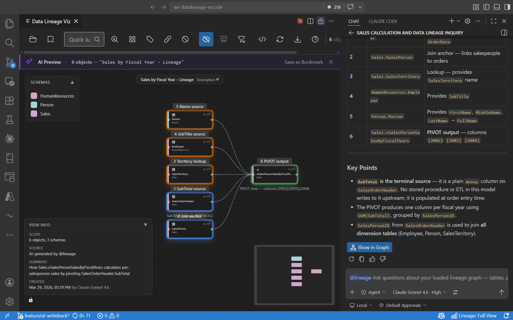

# Data Lineage Viz

[](LICENSE)
[](https://marketplace.visualstudio.com/items?itemName=datahelper-chwagner.data-lineage-viz)


Visualise SQL dependencies right inside VS Code. Ask `@lineage` in Copilot Chat to explore your lineage graph in natural language — or browse interactively with search, trace, and schema overview.

Import from `.dacpac` files or connect directly to SQL Server, Azure SQL, Fabric Data Warehouse, or Synapse Dedicated SQL Pool.


## Get started

1. Run **Data Lineage: Open Wizard** (`Ctrl+Shift+P`).
2. Pick a `.dacpac` file — or **Connect to Database** via the [MSSQL extension](https://marketplace.visualstudio.com/items?itemName=ms-mssql.mssql).
3. Select schemas and click **Visualize**.

No data? Click **Try with demo data** to explore the AdventureWorks sample.

## AI lineage with `@lineage`

Use `@lineage` in GitHub Copilot Chat to explore dependencies in natural language. The assistant answers from your loaded data model — never from general knowledge.

```text
@lineage trace from Sales.SalesOrderDetail upstream to the source tables
@lineage how is sales calculated — show me the lineage in the app
@lineage which objects are hubs with the most connections?
```

The assistant can trace dependencies, build bookmarked graph views, and analyse column mappings and SQL logic from the available metadata.



`@lineage` adapts to the size of the question:

- **Small scopes run inline** — the AI sees all relevant DDL at once and answers directly. If a relevant dependency falls outside your filter schemas, it pauses and asks you to approve extending the scope for this session.
- **Large scopes run hop-by-hop** — before the first hop the assistant shows you the planned scope (nodes, schemas, depth, budget) and asks for confirmation. Once approved the contract is locked.

Requires [GitHub Copilot](https://marketplace.visualstudio.com/items?itemName=GitHub.copilot). Tools activate automatically when a graph is loaded.

## Features

- **`@lineage` AI** — trace lineage, analyse column mappings, explain SQL logic, and build bookmarked graph views from the loaded model.
- **Search & trace** — autocomplete object lookup, upstream / downstream tracing, shortest-path between nodes.
- **Graph analysis** — islands, hubs, orphans, circular dependencies, longest chains.
- **Schema overview** — large graphs auto-summarise at schema level; double-click to drill in.
- **SQL preview** — click any node to view DDL with syntax highlighting; full-text search across procedure / view bodies.
- **Multiple sources** — SSDT and SDK-style `.dacpac`, live database connections, external tables, virtual external refs (OPENROWSET, cross-DB, CETAS).
- **Projects & views** — save connections, schema selections, and named filter states for one-click reopen.
- **Table profiling** — on-demand column statistics for live databases (null %, distinct, min / max, AVG, STDEV).
- **Export** — Draw.io diagram generation.

For the full feature catalogue, settings, and customisation paths see [`docs/FEATURES.md`](docs/FEATURES.md).

## Limitations

The extension covers **intra-database DDL only**. The following are out of scope:

- **External ingestion pipelines** — ADF, SSIS, Spark, Fabric Dataflow, or any ETL/ELT process that writes *into* the database from an external source. Target tables appear as leaves; the upstream pipeline does not.
- **Cross-database / cross-server flow** — surfaced only when the SQL body uses a fully qualified three- or four-part name; the remote side appears as an external-reference node, not a fully traced sub-graph.
- **Dynamic SQL** — `EXEC(@sql)` and `sp_executesql` cannot be analysed statically.
- **Unqualified references** — references without a schema prefix are excluded.

## FAQ

**Do I need a `.dacpac` file?**
No — connect directly to a database. If you prefer a `.dacpac`, extract one from Visual Studio, SSMS, Azure Data Studio, or the Fabric portal. See [Microsoft's documentation](https://learn.microsoft.com/sql/relational-databases/data-tier-applications/data-tier-applications).

**Why are some dependencies missing?**
Dynamic SQL cannot be analysed statically. Only compile-time dependencies are detected.

**Why are unqualified references excluded?**
Unqualified names depend on the caller's default schema, which the catalog does not record reliably. Schema-qualified names are the only way to be sure.

## Documentation

- [`docs/FEATURES.md`](docs/FEATURES.md) — full feature catalogue, settings, customisation paths.
- [`docs/ARCHITECTURE.md`](docs/ARCHITECTURE.md) — Map & Router engine, bipartite analysis, memory model.
- [`docs/DEVELOPER_GUIDE.md`](docs/DEVELOPER_GUIDE.md) — fork starting point, repo layout, build / test, prompt-builder hierarchy.
- [`docs/DMV_QUERIES.md`](docs/DMV_QUERIES.md) — DBA contract for live-database ingestion (no black box).
- [`docs/PROFILING_PATTERNS.md`](docs/PROFILING_PATTERNS.md) — generated SQL for table profiling.
- [`docs/PARSE_RULES.md`](docs/PARSE_RULES.md) — YAML reference for the SQL parser.
- [`docs/AI_PROMPTS.md`](docs/AI_PROMPTS.md) — YAML reference for `@lineage` capture / render templates.
- [`docs/TROUBLESHOOTING.md`](docs/TROUBLESHOOTING.md) — common issues.
- [`CONTRIBUTING.md`](CONTRIBUTING.md) — coding standards, testing protocol, PR hygiene.

## Contributing

Bug reports welcome. For custom features, fork and extend under the MIT license. See [`CONTRIBUTING.md`](CONTRIBUTING.md).

---

MIT License · [Christian Wagner](https://www.linkedin.com/in/christian-wagner-11aa8614b) · [GitHub](https://github.com/ChrisDevRepo/vscode_data_lineage) · Developed with [Claude Code](https://claude.ai/code)
