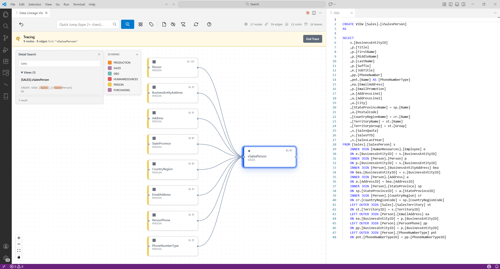

# Data Lineage Viz

> **Preview** — This extension is functional but under active development.

Visualize object-level dependencies from `.dacpac` files or by importing directly from SQL Server, Azure SQL, Fabric DW, or Synapse. See how tables, views, stored procedures, and functions connect through an interactive graph.

## Quick Start

**From a .dacpac file:**
1. Run **Data Lineage: Open Wizard** (`Ctrl+Shift+P`)
2. Select a `.dacpac` file, pick schemas, and click **Visualize**

**From a database:**
1. Install the [MSSQL extension](https://marketplace.visualstudio.com/items?itemName=ms-mssql.mssql)
2. Run **Data Lineage: Open Wizard** and click **Connect to Database**
3. Pick a connection, select schemas, and click **Visualize**

No database? Click **Load Demo** to explore the AdventureWorks sample.

## Features

**Data Sources**
- Import from SSDT and SDK-style `.dacpac` files
- Connect to SQL Server, Azure SQL, Fabric DW, or Synapse databases
- External tables surfaced as ⬡ nodes
- Virtual external references: OPENROWSET file paths, cross-database 3-part names, and CETAS targets
- Quick reconnect to your last data source

**Visualization**
- Search and navigate objects with autocomplete
- Trace upstream and downstream dependencies with sibling filtering
- Find the shortest path between any two nodes
- Schema-based color coding with interactive minimap

**Graph Analysis**
- Detect islands, hubs, orphans, and circular dependencies
- Find the longest dependency chains in your project
- Filter by schema, object type, or regex patterns

**SQL Preview & Export**
- Click any node to view its DDL with full syntax highlighting
- Full-text search across all SQL bodies
- Export the lineage graph to Draw.io for documentation

## Limitations

- **Object-level only** — no column-level lineage
- **Static analysis** — dynamic SQL (`EXEC(@sql)`) not detected
- **Fully-qualified names only** — only `[schema].[object]` references are detected; unqualified names (aliases, CTEs, built-ins) are excluded

## How It Works

1. **Extract** — Reads `model.xml` from a .dacpac archive, or imports metadata via DMV queries from a database
2. **Parse** — Extracts dependencies from XML metadata + configurable regex patterns
3. **Graph** — Builds a directed graph with dagre layout
4. **Render** — Interactive visualization with React Flow

## Configuration

Search `dataLineageViz` in VS Code Settings (`Ctrl+,`). Settings are grouped into **Import**, **Database Connection**, **Table Statistics**, **Layout**, **Trace**, and **Analysis**.

Most settings apply instantly. Import settings (`parseRulesFile`, `excludePatterns`) require reloading the data source.

**Key settings:**

| Setting | Default | Description |
|---------|---------|-------------|
| `maxNodes` | `750` | Maximum nodes to display (10-1000) |
| `excludePatterns` | `[]` | Regex patterns to exclude objects by name |
| `layout.direction` | `"LR"` | Graph flow: `LR` (left-to-right) or `TB` (top-to-bottom) |
| `tableStatistics.enabled` | `true` | Column statistics and row counts (DB import only) |

**Power user customization:**

| Guide | What you can customize |
|-------|------------------------|
| [Custom Parse Rules](docs/PARSE_RULES.md) | Regex rules for SP dependency extraction |
| [Custom DMV Queries](docs/DMV_QUERIES.md) | SQL queries for database import |
| [Profiling Patterns](docs/PROFILING_PATTERNS.md) | Table statistics SQL reference |

Use **Data Lineage: Create Parse Rules** or **Data Lineage: Create DMV Queries** from the Command Palette to scaffold a customization YAML in your workspace.

## Commands

| Command | Description |
|---------|-------------|
| **Data Lineage: Open Wizard** | Open the visualization panel |
| **Data Lineage: Open Demo** | Load the AdventureWorks demo |
| **Data Lineage: Settings** | Open extension settings |
| **Data Lineage: Create Parse Rules** | Scaffold custom parsing configuration |
| **Data Lineage: Create DMV Queries** | Scaffold custom DMV query configuration |

## FAQ

**Do I need a .dacpac file?**
No — you can also import directly from a database using the MSSQL extension. If you prefer a .dacpac, it can be extracted or built from Visual Studio, VS Code, SSMS, Azure Data Studio, or the Fabric portal. See [Microsoft's documentation](https://learn.microsoft.com/sql/relational-databases/data-tier-applications/data-tier-applications) for details.

**Why are some dependencies missing?**
Dynamic SQL (`EXEC(@sql)`, `sp_executesql`) cannot be analyzed statically. Only compile-time dependencies are detected.

**Why do unresolved references not show objects like CTEs or table aliases?**
The parser only tracks **fully-qualified two-part names** (`[schema].[object]`). Unqualified references — CTE names, table aliases, built-in rowset functions like `FREETEXTTABLE` — are intentionally excluded before catalog lookup and never shown as unresolved. This is by design: the default SQL Server schema is a per-connection setting, so the extension cannot reliably infer which schema an unqualified name belongs to.

## Contributing

Bug reports are welcome. This is a personal project — for custom features, fork and extend it under the MIT license. See [CONTRIBUTING.md](CONTRIBUTING.md).

---

MIT License · [Christian Wagner](https://www.linkedin.com/in/christian-wagner-11aa8614b) · [GitHub](https://github.com/ChrisDevRepo/vscode_data_lineage) · Developed with [Claude Code](https://claude.ai/code)
