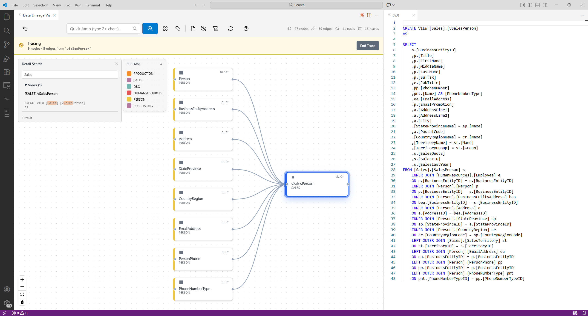
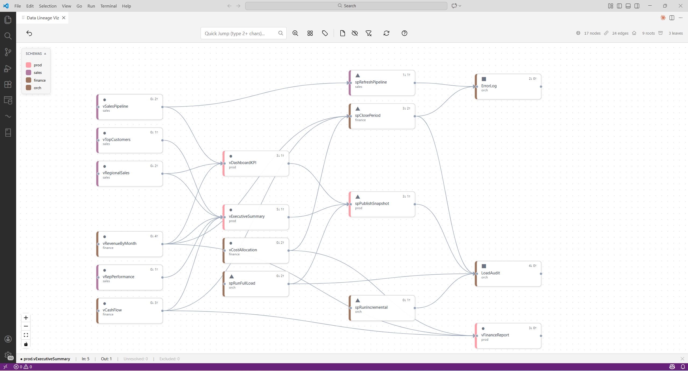
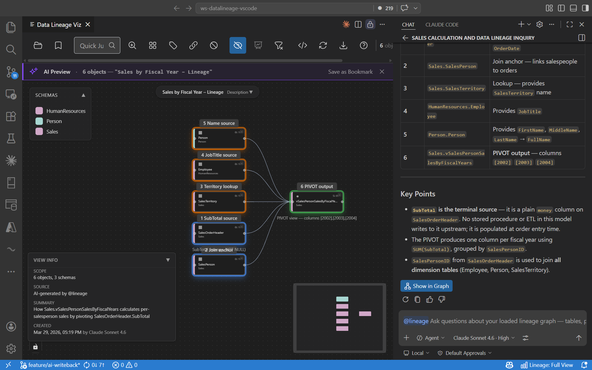

# Data Lineage Viz

[](LICENSE)
[](https://marketplace.visualstudio.com/items?itemName=datahelper-chwagner.data-lineage-viz)


Visualise SQL dependencies right inside VS Code. Browse your lineage graph with
search, trace, and Schema View — and, with a VS Code Language Model Chat
provider such as GitHub Copilot, ask `@lineage` to explore the loaded model in
natural language.

Import from `.dacpac` files or connect directly to SQL Server, Azure SQL, Fabric Data Warehouse, or Synapse Dedicated SQL Pool.

[](https://www.youtube.com/watch?v=2Ybg2daCrB0)

▶ **[Watch the demo](https://www.youtube.com/watch?v=2Ybg2daCrB0)**

## Get started

1. Run **Data Lineage: Open Wizard** (`Ctrl+Shift+P`).
2. Pick a `.dacpac` file — or **Connect to Database** via the [MSSQL extension](https://marketplace.visualstudio.com/items?itemName=ms-mssql.mssql).
3. Select schemas and click **Visualize**.

No data? Click **Try with demo data** or run **Data Lineage: Open Demo** to explore the AdventureWorks sample.

## Explore your lineage

Once your model loads, the visual graph is ready to use — no Copilot required:

- **Data Lineage: Search Objects** finds any table, view, procedure, or function instantly.
- **Trace dependencies** — follow sources upstream or consumers downstream from any node.
- **See the blast radius** — spot hubs, islands, orphans, and circular dependencies before you change anything.
- **Read the SQL** — right-click an object to open its DDL or table details; full-text search across procedure and view bodies.



## Optional AI lineage with `@lineage`

With a VS Code Language Model Chat provider, `@lineage` adds natural-language
exploration on top of the visual graph. The extension passes exactly the model
selected for the chat request and constrains the assistant to the loaded data
model.

```text
@lineage trace from Sales.SalesOrderDetail upstream to the source tables
@lineage how is sales calculated — show me the lineage in the app
@lineage which objects are hubs with the most connections?
```

Use it to ask dependency questions, preview graph scopes, save useful previews as
bookmarks, ask about what is on screen (*"explain this trace"*, or `#lineageView`),
recall what an earlier analysis found from its saved AI bookmark, and — where the
metadata allows — follow column mappings or explain SQL logic.



`@lineage` has three user-visible paths:

- **Discovery (chat)** — the default. Catalog lookups, DDL search, graph-pattern questions, bounded upstream/downstream scope questions, and explicit source-to-target path questions are answered directly in chat from deterministic tools. `/search` pins this path.
- **Graph preview** — the **Show graph preview** follow-up opens a bounded transient preview in the side panel. Save it explicitly if you want a bookmark.
- **Structured walkthrough** — an explicit graph/render request, `/trace`, a named-column trace, a discovery scope that exceeds the configured budget, or the **Start deeper hop-by-hop analysis** follow-up first shows the planned scope and asks for confirmation. Once approved, the assistant walks the graph hop-by-hop and colours source / transform / target nodes in the result.

Only the `@lineage` chat experience requires a VS Code Language Model Chat
provider, such as
[GitHub Copilot](https://marketplace.visualstudio.com/items?itemName=GitHub.copilot)
or a compatible BYOK provider. The visual graph, search, trace, SQL preview,
demo data, profiling, and export features work without one.

## Features

- **Interactive graph** — search objects, trace upstream or downstream, and find shortest paths between nodes.
- **Graph analysis** — identify islands, hubs, orphans, circular dependencies, and long dependency chains.
- **Schema View** — large graphs auto-summarise at schema level; double-click to drill in.
- **SQL preview** — inspect DDL with syntax highlighting and search across procedure / view bodies.
- **Optional `@lineage` AI** — use VS Code Chat to ask lineage questions, preview graph scopes, save previews as bookmarks, and follow column mappings where the metadata allows. The assistant can read what is currently on screen, and a bookmark saved from an AI-authored view keeps that run's findings so a later question can recall them.
- **Multiple sources** — SSDT and SDK-style `.dacpac` files, live database connections, external tables, and virtual external refs (OPENROWSET, cross-DB, CETAS).
- **Projects & views** — save connections, schema selections, and named filter states for one-click reopen.
- **Table profiling** — on-demand column statistics for live databases (null %, distinct, min / max, AVG, STDEV).
- **Export** — Draw.io diagram generation.

For the full feature catalogue, settings, and customisation paths see [`docs/FEATURES.md`](docs/FEATURES.md).

## Limitations

The lineage graph is built from database DDL/catalog metadata only. The following are out of scope:

- **External ingestion pipelines** — ADF, SSIS, Spark, Fabric Dataflow, or any ETL/ELT process that writes *into* the database from an external source. Target tables appear as leaves; the upstream pipeline does not.
- **Cross-database / cross-server flow** — fully qualified three- or four-part references can surface as virtual external nodes, but the remote database internals are not introspected.
- **Dynamic SQL** — `EXEC(@sql)` and `sp_executesql` cannot be analysed statically.
- **Unqualified references** — references without a schema prefix are ambiguous; metadata may resolve some known dependencies, but dynamic/default-schema cases are not guaranteed.
- **Triggers and synonyms** — not ingested from either source. They do not appear as nodes, and references made through them do not become edges.

## FAQ

**Do I need a `.dacpac` file?**
No — connect directly to a database. If you prefer a `.dacpac`, extract one from Visual Studio, SSMS, Azure Data Studio, or the Fabric portal. See [Microsoft's documentation](https://learn.microsoft.com/sql/relational-databases/data-tier-applications/data-tier-applications).

**Why are some dependencies missing?**
Dynamic SQL cannot be analysed statically. Only dependencies visible in compiled metadata or parseable SQL bodies are detected.

**Why are unqualified references unreliable?**
Unqualified names depend on caller default schema and context. Schema-qualified names are the only reliable source for static lineage.

## Documentation

- [`docs/FEATURES.md`](docs/FEATURES.md) — full feature catalogue, settings, customisation paths.
- [`docs/ARCHITECTURE.md`](docs/ARCHITECTURE.md) — Map & Router engine, bipartite analysis, memory model.
- [`docs/DEVELOPER_GUIDE.md`](docs/DEVELOPER_GUIDE.md) — fork starting point, repo layout, build / test, prompt-builder hierarchy.
- [`docs/DMV_QUERIES.md`](docs/DMV_QUERIES.md) — DBA contract for live-database ingestion (no black box).
- [`docs/PROFILING_PATTERNS.md`](docs/PROFILING_PATTERNS.md) — generated SQL for table profiling.
- [`docs/PARSE_RULES.md`](docs/PARSE_RULES.md) — YAML reference for the SQL parser.
- [`docs/AI_PROMPTS.md`](docs/AI_PROMPTS.md) — prompt architecture + YAML reference for `@lineage` capture / render templates.
- [`docs/TROUBLESHOOTING.md`](docs/TROUBLESHOOTING.md) — common issues.
- [`CONTRIBUTING.md`](CONTRIBUTING.md) — coding standards, testing protocol, PR hygiene.

## Contributing

Bug reports welcome. For custom features, fork and extend under the MIT license. See [`CONTRIBUTING.md`](CONTRIBUTING.md).

---

MIT License · [Christian Wagner](https://www.linkedin.com/in/christian-wagner-11aa8614b) · [GitHub](https://github.com/ChrisDevRepo/vscode_data_lineage)
