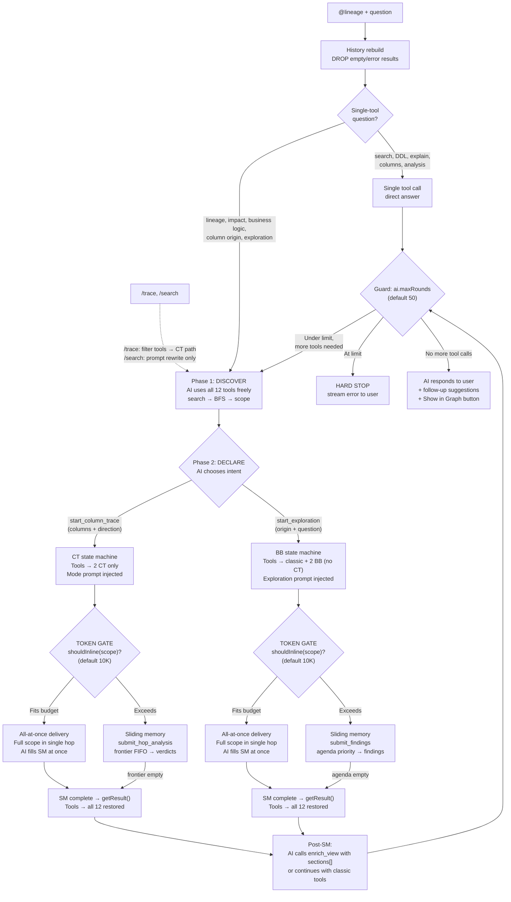

# AI Data Flow — Explore-First Architecture

**Status:** Implemented — updated 2026-04-11: progress_line in base class (stream.progress() UX), proportional section depth guidance, bridge dispatcher sync.
**Branch:** main

---

## Principle

The extension is a **data provider + state machine**. The AI (VS Code Copilot Chat) explores freely, discovers scope, declares what it needs. The extension delivers data and manages traversal state.

**Session-level guards:**
1. `ai.maxRounds` (VS Code setting, default 50) — hard stop on tool rounds
2. `shouldInline()` (token estimation vs `ai.inlineTokenBudget` setting, default 10K) — delivery granularity: all-at-once or sliding memory hop-by-hop. SM is always used (correct type per question); budget controls data volume per hop.

**BB SM guards (blackboardState.ts):**
3. `complete:true` acceptance condition — SM rejects early complete if any direct neighbor of origin is unvisited; reinjected as priority=3 (mandatory). `complete_rejected.nodes` tells AI exactly what to visit next.
4. Direct-neighbor dim guard — AI cannot cascade-prune direct neighbors of origin; converted to `dimmedNodes` (kept in graph at reduced opacity). Shown in result as `dimmed_nodes[]`.
5. `getUnresolvedMandatoryNodes()` — checks unvisited/unremoved/undimmed direct neighbors; used by both the acceptance condition and `getResult()` warning.

**Working memory (MemGPT invariant):**
- `remaining_agenda` included in every hop's working memory (capped at 30, priority-sorted). Survives history compaction — AI always knows what it has left to visit, preventing blind early-complete decisions.

**No other mechanism truncates, caps, or limits data. Ever.**

---

## Flow



### Slash commands

| Command | What user types | Behavior |
|---|---|---|
| `/trace X` | `@lineage /trace FactSalesReport` | **Tool filtering**: only search + CT + enrich_view. BFS removed → AI must use `start_column_trace`. Prompt: "Trace the data lineage for: FactSalesReport." |
| `/search X` | `@lineage /search Revenue` | **Prompt rewrite only**: all 12 tools available. Prompt: "Search for database objects matching: Revenue." |
| (none) | `@lineage where does Revenue come from?` | **Free-form**: all 12 tools. AI discovers intent via Rule 3 (system prompt). |

Removed commands: `/explain` (2026-04-06) — overlaps with `/trace`; `/document` (commit `9af9f6d`) — BB-forced documentation mode removed.

---

## Dynamic Tool Filtering

| Phase | Filter | Tools visible | Count | Why |
|---|---|---|---|---|
| `discover` | `tags.includes('lineage')` | All 12 (8 classic + 2 CT + 2 BB) | 12 | AI explores freely |
| `ct_active` | `tags.includes('lineage-ct')` | `start_column_trace`, `submit_hop_analysis` | 2 | Focused hop-by-hop, prevents wrong tool calls |
| `ct_done` | `tags.includes('lineage')` | All 12 restored | 12 | AI can enrich_view; CT tools return `no_active_trace` |
| `bb_active` | `tags.includes('lineage') && !tags.includes('lineage-ct')` | Classic 8 + BB 2 (CT excluded) | 10 | BB needs classic tools for context; CT mutual exclusion |
| `bb_done` | `tags.includes('lineage')` | All 12 restored | 12 | AI can enrich_view; BB tools return `no_active_exploration` |

Phase transitions happen automatically in the tool loop based on state machine status.

---

## 3 State Machine Types

```
NO SM (simple) ──→ Type 1: BLACKBOARD ──→ Type 2: DEPENDENCY ──→ Type 3: COLUMN
━━━━━━━━━━━━━━━━━━━━━━━━━━━━━━━━━━━━━━━━━━━━━━━━━━━━━━━━━━━━━━━━━━━━━━━━━━━━━
Direct tool call    Passive SM           Active SM             Active SM + validation
AI full control     AI explores,         SM drives graph,      SM drives + validates
Single response     SM stores findings   AI verdicts           column names + renames
                    EXISTS               EXISTS                EXISTS
```

| Type | Trigger | SM manages | AI does |
|---|---|---|---|
| **None** | Simple questions | Nothing | Direct tool call → answer |
| **1. Blackboard** | `start_exploration(origin, question)` + exceeds budget | Agenda (BFS + question priority), two-tier memory, question queue, **autoSkipTypes** (auto-note tables from metadata) | Analyze DDL, record findings + summary, generate sub-questions |
| **2. Dependency** | `start_column_trace(columns=[])` + exceeds budget | Frontier, verdicts, boundary | Read DDL, verdict neighbors |
| **3. Column** | `start_column_trace(columns=["X"])` + exceeds budget | Same as 2 + column validation + renames | Same as 2 + provide column names |

Type determined by AI's tool call:
- `start_column_trace(columns=[...])` → Type 3 (column)
- `start_column_trace(columns=[])` → Type 2 (dependency)
- `start_exploration(origin, question)` → Type 1 (blackboard)
- All types: if scope fits `INLINE_TOKEN_BUDGET` → inline delivery (no SM)

---

## JSON Contract

### start_column_trace — input

| Field | Required | Type | Values | Purpose |
|---|---|---|---|---|
| `columns` | No (but validated) | string[] | Column names | Required for Type 3. Empty = Type 2. |
| `direction` | No (default: up) | enum | `up`, `down`, `both` | Trace direction |
| `origin` | No (auto-discover) | string | Schema-qualified ID | Starting node |

### start_column_trace — response (inline)

```json
{
  "status": "inline",
  "action_required": "analyze_and_respond",
  "reason": "scope_fits_inline",
  "scope_size": 28,
  "scope_ddl_chars": 12500,
  "origin": { "id": "[ai].[FactSalesReport]" },
  "bfs_result": { "nodes": [...], "edges": [...], "delivery": "inline" },
  "hint": "All DDL provided inline. Analyze this data and present your findings to the user. Do NOT call any more tools — the trace is complete."
}
```

### start_column_trace — response (state machine)

```json
{
  "trace_status": "in_progress",
  "action_required": "submit_hop_analysis",
  "verdicts_expected": 5,
  "ct_mode": "hop_and_distill",
  "hop": 1,
  "frontier_remaining": 12,
  "goal": { "columns": ["TotalRevenue"], "direction": "up", "origin": "[ai].[FactSalesReport]" },
  "focus_node": {
    "id": "[ai].[spBuildSalesReport]",
    "ct_ddl": "CREATE PROCEDURE...",
    "cols": ["Qty int, not null, PK", "Amount decimal(18,2)"],
    "fks": ["CustomerKey → dbo.DimCustomer"],
    "unresolved_refs": ["dbo.AuditLog"]
  },
  "neighbors": [
    { "id": "[ai].[vwConsolidatedSales]", "boundary": "none", "hasDdl": true },
    { "id": "[ai].[SAPOrders]", "boundary": "source", "boundary_reason": "No upstream SP writes to this object" }
  ],
  "active_columns": ["TotalRevenue"],
  "path_so_far": [],
  "out_of_scope_so_far": []
}
```

### submit_hop_analysis — input

| Field | Required | Type | Purpose |
|---|---|---|---|
| `focus_node_id` | YES | string | Must match hop context |
| `notes` | Optional | string | AI's findings — stored as persistent memory per node |
| `verdicts` | YES | array | One per neighbor |
| `verdicts[].neighbor_id` | YES | string | Must match neighbor |
| `verdicts[].verdict` | YES | enum: trace/prune/pass/revisit | Action (revisit = re-expand previously pruned node, max 3/trace) |
| `verdicts[].columns_to_trace` | Conditional | string[] | Required for Type 3 (column mode). Must be INPUT columns. |
| `verdicts[].summary` | Optional | string | One-line description |
| `verdicts[].question` | Optional | string | Self-ask: what to investigate at this node |

### submit_hop_analysis — response (next hop)

Same structure as start_column_trace state machine response, with updated `hop`, `path_so_far`, `frontier_remaining`.

### submit_hop_analysis — response (complete)

```json
{
  "status": "complete",
  "targetColumns": ["TotalRevenue"],
  "originNodeId": "[ai].[FactSalesReport]",
  "direction": "up",
  "chain": [{ "nodeId": "...", "schema": "...", "name": "...", "type": "...", "columnsIn": [...], "columnsOut": [...], "summary": "...", "notes": "...", "index": "1/N", "boundaryFlag": "none" }],
  "fullNodes": [{ "id": "...", "s": "...", "n": "...", "t": "...", "ddl": "...", "cols": [...] }],
  "edges": [["source", "target", "type"]],
  "outOfScope": [{ "nodeId": "...", "reason": "..." }],
  "suggested_labels": [{ "node_id": "...", "text": "spBuildSalesReport" }],
  "suggested_notes":  [{ "node_id": "...", "text": "Merges SAP and Oracle orders into consolidated sales" }],
  "stats": { "hops": 8, "examined": 15, "relevant": 8, "removed": 5, "passthrough": 2 }
}
```

### start_exploration — input

| Field | Required | Type | Values | Purpose |
|---|---|---|---|---|
| `question` | YES | string | User's exploration question | Stored as context; shown in working memory |
| `origin` | YES | string | Schema-qualified ID | Starting node for BFS scope |

### start_exploration — response (inline)

```json
{
  "status": "inline",
  "action_required": "analyze_and_respond",
  "reason": "scope_fits_inline",
  "scope_size": 28,
  "origin": { "id": "[ai].[FactSalesReport]" },
  "bfs_result": { "nodes": [...], "edges": [...], "delivery": "inline" },
  "hint": "All DDL provided inline. Analyze this data and present your findings. Do NOT call more tools."
}
```

### start_exploration — response (state machine)

```json
{
  "ok": true,
  "scopeSize": 42,
  "originNode": { "id": "[ai].[spBuildSalesReport]", "s": "ai", "n": "spBuildSalesReport", "t": "Procedure" },
  "map": { "nodes": [...], "edges": [...] },
  "bb_mode": "exploring",
  "hop": 1,
  "focus_node": {
    "id": "[ai].[spBuildSalesReport]",
    "bb_ddl": "CREATE PROCEDURE...",
    "cols": ["Qty int, not null, PK", "Amount decimal(18,2)"],
    "fks": ["CustomerKey → dbo.DimCustomer"],
    "unresolved_refs": ["dbo.AuditLog"]
  },
  "neighbors": [
    { "id": "[ai].[vwConsolidatedSales]", "edge_direction": "upstream", "edge_type": "read", "boundary": "none", "hasDdl": true },
    { "id": "[ai].[SAPOrders]", "edge_direction": "upstream", "edge_type": "read", "boundary": "source", "boundary_reason": "No upstream SP writes to this object" }
  ],
  "current_task": "Analyze [ai].[spBuildSalesReport] — what is its role, business logic, and key data flows?",
  "working_memory": {
    "user_question": "What business rules govern the revenue calculation pipeline?",
    "all_summaries": [],
    "pending_questions": [],
    "checklist": { "noted": 0, "total": 42, "open": 41, "coveragePct": 0 }
  },
  "agenda_remaining": 41
}
```

### submit_findings — input

| Field | Required | Type | Purpose |
|---|---|---|---|
| `focus_node_id` | YES | string | Must match current hop context |
| `findings` | YES | string | Question-adapted evidence from DDL (200-4000 chars scaled to complexity, hard limit 5000). Structured by aspect: COLUMNS, TRANSFORMS, JOINS, FILTERS, DATA FLOW, QUESTION RELEVANCE. Depth prioritized by question type (business meaning vs execution patterns). Self-contained — usable at synthesis without re-reading DDL. |
| `summary` | YES | string | Short memory entry (~100-200 chars, hard limit 500). What this node does + what's still open. Visible in working memory for ALL future hops. |
| `verdict` | YES | enum | `relevant` — node has business logic/transforms (full findings + badge_label); `pass` — in the path but no transforms (summary stored, no badge); `irrelevant` — triggers BFS cascade prune. Runtime coerces legacy `noted` → `pass`. |
| `tags` | No | string[] | Categorization: `business-rule`, `transform`, `source`, etc. |
| `questions` | No | array | Self-Ask: `[{ node_id, question }]` — boosts target node's agenda priority to 2 |
| `prune_ids` | No | string[] | Remove specific neighbor node IDs from agenda. Each triggers `cascadePrune()`. |
| `add_ids` | No | string[] | Add node IDs to agenda (must exist in model, not already visited/pruned). For scope expansion. |
| `badge_label` | No | string | Semantic label for this node in the SM result (2–4 words, e.g. "ETL Transform"). Used by `enrich_view` auto-populate. |
| `note_caption` | No | string | Per-node annotation for `enrich_view` suggested_notes. First line visible, rest on hover. |
| `complete` | No | boolean | Signal early completion. Subject to SM acceptance guard (must visit all direct origin neighbors first). |

### submit_findings — response (next hop)

Same structure as start_exploration state machine response, with updated `hop`, `working_memory`, `agenda_remaining`.

### submit_findings — response (complete)

```json
{
  "status": "complete",
  "question": "original user question",
  "originNodeId": "[ai].[spBuildSalesReport]",
  "notes": [{ "nodeId": "...", "schema": "...", "name": "...", "type": "...", "findings": "...", "summary": "...", "tags": [...] }],
  "fullNodes": [{ "id": "...", "s": "...", "n": "...", "t": "...", "role": "origin|noted|bridge" }],
  "edges": [["source", "target", "type"]],
  "suggested_labels": [{ "node_id": "...", "text": "Source" }],
  "suggested_notes":  [{ "node_id": "...", "text": "Entry point — reads from staging" }],
  "stats": { "hops": 8, "noted": 6, "scopeSize": 42, "coveragePct": 14, "questionsAsked": 3, "questionsAnswered": 2 }
}
```

### Detail Memory Architecture

SM uses two-tier memory (MemGPT-inspired). SM is a **data provider** — stores and delivers, never filters or ranks.

| Memory | Purpose | Budget | Delivered |
|--------|---------|--------|-----------|
| **Short memory** (`narrative[]`) | Incremental index — tracks what was loaded/found per hop | ~100-200 chars/entry, grows per hop | Always in `working_memory.all_summaries` at each hop |
| **Detail memory** (`detailSlots` Map) | Grounded evidence — per-node comprehensive documentation | 300-6000 chars scaled to complexity, 8000 hard limit | ALL slots at full fidelity in `getResult()` — no eviction |

**Synthesis grounding contract:** Detail memory slots are the AI's ONLY evidence for writing `enrich_view`. Raw DDL is not re-delivered at synthesis. Every claim must cite a detail slot. If evidence is insufficient, AI can call `get_object_detail` in `bb_done`/`ct_done` phase to re-read DDL (Self-RAG retrieval-on-demand pattern).

**Design references:** MemGPT/Letta (archival memory with no eviction), Chain-of-Note (self-contained notes), Self-RAG (retrieval on demand).

`suggested_labels` and `suggested_notes` are pre-built by the SM at result time:
- **BB**: from per-hop `badge_label`/`note_caption` fields (submitted via `submit_findings`), sorted by BFS depth
- **CT**: chain entry names used as label text; `notes`/`summary` used as caption (CT does not yet generate badge_label — see `bugs.md` S2)

Auto-completed into `enrich_view` for un-badged/un-captioned nodes: if `sections[].node_ids` is empty for a section whose label matches a `suggested_labels[].text`, the SM-suggested node IDs are filled in automatically.

### enrich_view — label-section data contract

Called after SM completes (`ct_done` or `bb_done`). Rendering always comes from SM result — BFS is discovery only.

**Input (key fields):**

| Field | Required | Type | Purpose |
|---|---|---|---|
| `name` | YES | string (max 60) | Display name for the view |
| `summary` | YES | string (max 300) | One-line purpose (~120 chars) |
| `title` | No | string (max 80) | Optional pipeline/computation title |
| `intro` | No | string | 2–4 sentence context paragraph rendered before sections |
| `sections` | No | array | **Primary model.** One entry per logical group — `{ label, node_ids[], text }`. Mutual-exclusive with `description`. |
| `closing` | No | string | Cross-cutting risks/notes rendered after all sections |
| `notes` | No | array | Per-node captions — `{ node_id, text }`. First line visible, rest on hover via `\n`. Min 20 chars. |
| `highlight_groups` | No | array | Color glow on 2–3 nodes — `{ label, color, node_ids }`. |
| `description` | No | string | **Fallback only** — used when `sections[]` absent. Mutual-exclusive with `sections`. |
| `prune_node_ids` | No | string[] | Remove nodes from stored result graph. |

**sections[] contract:**
```
sections[i].label    — join key AND badge chip text (e.g. "Source", "ETL", "Target")
sections[i].node_ids — 1..N node IDs that receive this badge chip
sections[i].text     — markdown body (>120 chars required)

Validation: sections[] XOR description (not both)
```

**Ordering guarantee (via `orderAndAssemble()`):**
```
Input: sections[] in AI-written order
System: bfsDepthMap(edges, originNodeId) → sort by (depth, ai_array_index)
        → strip any leading numbers from labels ("3 Source" → "Source")
        → assign step number N per unique label
        → derive badge chips with "N Label" from sections[].node_ids
        → assemble "## N Label" headings in description

Result: badge "1 Source" on graph ↔ "## 1 Source" in description — guaranteed in sync
Orphaned sections (label has no node_ids matched) are auto-dropped.
```

**Same-label grouping:** Multiple `sections[]` entries with the same `label` → one section, same step number on all those nodes.

### run_bfs_trace — two modes

**Level mode** (default): `id` + `upstream_hops` + `downstream_hops` → explore by depth
**Path mode**: `id` + `target` → all nodes on paths between start and end

Response includes `delivery: 'inline'` (full DDL) or `delivery: 'on_demand'` (DDL omitted, use follow-up tools).

---

## What Data Is Sent Per Mode

### Per-hop context (state machine active)

| Field | Column mode (Type 3) | Dependency mode (Type 2) | Exploration mode (Type 1) | When |
|---|---|---|---|---|
| `ct_ddl` / `bb_ddl` | YES — full DDL, never truncated | YES — full DDL | YES — full DDL (`bb_ddl`) | Focus node is scriptable (SP/view/function) |
| `cols` | YES — compact: `"Amount decimal(18,2), not null"` | YES | YES | Focus node is table (no DDL) |
| `fks` | YES — compact: `"CustomerKey → dbo.DimCustomer"` | YES | YES | Focus node has foreign keys |
| `goal` | YES — `{columns, direction, origin}` | YES | N/A — uses `working_memory.user_question` | Goal anchor — prevents drift on long traces |
| `active_columns` | YES — columns being traced | NO (empty) | NO | Column mode only |
| `unresolved_refs` | YES | YES | YES | Focus node DDL references unloaded objects |
| `neighbors[].boundary` | YES | YES | YES | Always — source/sink/external/cycle/none |
| `neighbors[].cols` | YES | YES | YES | Neighbor is table with columns |
| `neighbors[].fks` | YES | YES | YES | Neighbor has foreign keys |
| `path_so_far[].notes` | YES — AI's findings per node | YES | N/A — uses `working_memory` | CT only — accumulated from all prior hops |
| `path_so_far[].summary` | YES — one-line compact | YES | N/A | CT only — accumulated |
| `sub_question` | YES — AI's own question for this node | YES | N/A — uses `current_task` | CT only — from previous hop's verdict |
| `working_memory.user_question` | N/A | N/A | YES — original investigation question | BB only — goal anchor, prevents drift on long explorations |
| `working_memory.all_summaries` | N/A | N/A | YES — every noted node's one-liner | BB only — full history visible every hop |
| `working_memory.pending_questions` | N/A | N/A | YES — unanswered Self-Ask questions | BB only — drives agenda priority |
| `working_memory.checklist` | N/A | N/A | YES — `{noted, total, open, coveragePct}` | BB only — progress tracking |
| `current_task` | N/A | N/A | YES — the question for this node | BB only — from prior hop's Self-Ask or BFS default |
| `agenda_remaining` | N/A | N/A | YES — priority queue size | BB only — replaces `frontier_remaining` |

### DDL vs metadata: when is what sent?

| Object type | DDL? | Columns? | FKs? | Why |
|---|---|---|---|---|
| **Procedure** | YES (full, normalized) | No | No | DDL contains the logic — AI reads it |
| **View** | YES (full, normalized) | No | No | DDL contains SELECT — AI reads it |
| **Function** | YES (full, normalized) | No | No | DDL contains logic |
| **Table** | No DDL | YES (compact column list) | YES (compact FK list) | Tables have no DDL body — columns + FKs are the structure |
| **External** | No DDL | No | No | Outside database — boundary flag explains |

### Inline one-shot vs state machine

| Delivery | When | What AI receives |
|---|---|---|
| **Inline** | `shouldInline(scope) = true` | Full BFS result with ALL DDL + ALL columns + ALL edges in one response |
| **State machine** | `shouldInline(scope) = false` | One focus node per hop with full DDL + neighbors + path memory |
| **On-demand** | BFS DDL exceeds budget but no CT | Nodes + edges WITHOUT DDL + hint: "use get_ddl_batch or start_column_trace" |

### Classic tools (no state machine)

| Tool | Returns DDL? | Returns columns? | Returns FKs? |
|---|---|---|---|
| `get_context` | YES (if inline) | YES | YES |
| `get_object_detail` | YES (full, never truncated) | YES | YES |
| `run_bfs_trace` | Depends on shouldInline | When inline (tables only) | No |
| `get_ddl_batch` | YES (full, never truncated) | No | No |
| `search_objects` | No | No | No |
| `search_ddl` | Snippets (matching lines) | No | No |
| `run_analysis` | No | No | No |

---

## Boundary Detection

Each neighbor in the hop context includes `boundary` + `boundary_reason`:

| Flag | Meaning | SM action |
|---|---|---|
| `none` | Normal node | Adds to frontier if traced |
| `source` | No upstream writers | NOT added — data origin |
| `sink` | No downstream readers | NOT added — end of flow |
| `external` | Outside database | NOT added — no DDL |
| `cycle` | Already visited | NOT added — loop |

### Unresolved refs (separate from boundary)

Objects referenced in DDL but NOT loaded in the project:
```json
{ "focus_node": { "unresolved_refs": ["dbo.AuditLog", "dbo.ConfigTable"] } }
```
AI should inform user: "This SP references dbo.AuditLog but it's not loaded. Further tracing not possible."

---

## Prompts

| Surface | Location | Configurable? | Why |
|---|---|---|---|
| System prompt (rules 1-4) | Hardcoded in extension.ts | No | Grounding constraints: no fabrication, validation stops, routing. Override = hallucination risk. |
| Mode-specific prompt | Injected once when CT or BB activates | No | SM protocol: verdict format, column tracking, findings structure. Wrong instructions = broken state machine. |
| Tool modelDescriptions | package.json | No | Tool selection routing. VS Code requires these there. Wrong descriptions = wrong tool called. |
| Goal anchors | columnTraceState.ts, blackboardState.ts | No | Anti-drift: `goal` (CT) and `user_question` (BB) repeated every hop. Removing = goal drift on long traces. |
| Output format | `aiOutputTemplates.yaml` | **Yes** — power user | Presentation layer only: how `enrich_view` formats results (summary, badges, sections, notes). Style preference, cannot break correctness. |

**Boundary principle:** YAML controls the **final mile** (presentation to user). Code controls everything upstream (discovery, routing, ingestion, state machine protocol, anti-hallucination guards). See `docs/AI_PROMPTS.md` for power-user customization guide.

### Mode-specific prompt (injected once at ct_active or bb_active transition)

**Column mode** (columns provided, injected at ct_active):
> COLUMN TRACE MODE: For each hop, read the focus node DDL. Verdict each neighbor: trace (provide INPUT column names — track renames), prune, or pass. Write notes about what you found. Prefer trace over prune when uncertain. The sub_question field contains your own question from the previous hop — answer it.

**Dependency mode** (no columns, injected at ct_active):
> DEPENDENCY TRACE MODE: For each hop, read the focus node DDL. Verdict each neighbor: trace (follow this path), prune (cut), or pass (skip detail). Write notes about dependencies, business logic, or impact you observe. The sub_question field contains your own question from the previous hop — answer it.

**Exploration mode** (start_exploration triggered, injected at bb_active):
> EXPLORATION MODE: The state machine presents nodes one at a time with full DDL and metadata.
> For each node:
> 1. Read the DDL/columns carefully
> 2. Record detailed findings (what you discovered — transforms, patterns, issues) (~500 chars)
> 3. Write a one-line summary (~100 chars) — shown in your working memory for ALL future hops
> 4. badge_label (2-4 words, no leading number) — semantic label for the enriched view, e.g. "Source", "ETL", "Staging"
> 5. note_caption (1 line) — what this node does in this flow
> 6. Generate sub-questions for neighbors you want to investigate (boosts their priority)
> 7. prune_ids: remove from agenda (scope=in_scope only). add_ids: add to agenda (scope=available).
>
> Your working memory shows ALL summaries and ALL pending questions — use them to stay on track.
> The current_task field contains your own question from a previous hop — answer it.

---

## Settings

| Setting | Default | Purpose |
|---|---|---|
| `ai.maxRounds` | 25 | Guard 1 — hard stop on rounds |
| `ai.outputTemplateFile` | (empty) | YAML path for output format customization |
| `ai.enabled` | true | Toggle AI features |

All per-tool cap settings removed (searchMaxResults, bfsMaxNodes, bfsMaxEdges, analysisMaxGroups, maxDdlChars).

---

## Request-Level Optimizations

### Dedup cache

Identical tool calls within a single request are cached. On repeat: returns `{ _dedup: true, message: "Identical call already returned — use the previous result." }`. Cache key: `tool_name::JSON(sorted_input)`. Input normalization strips `undefined`, `null`, and `false` values.

**Location**: extension.ts — `toolCallCache` Map, per-request lifetime.

### History management (multi-turn)

Two strategies compact prior conversation turns before injecting into context:

| Strategy | Trigger | Action |
|----------|---------|--------|
| **DROP** | Tool result is error or empty (`total: 0`, `error:`, etc.) | Replace full result with 1-line compact summary (`{ summary: "tool → error: ..." }`) |
| **EVICT** | Total input tokens > 75% of `maxInputTokens` | Drop oldest history messages until under budget. Insert `{ _evicted: true }` stub. |

Applied when rebuilding `historyMessages` from `context.history`. EVICT runs after DROP, before constructing the messages array. Only affects prior turns — current request results are never compacted.

**EVICT design:** Drop+log, NOT summarize-and-evict. The extension is a data store, not an agent — it does not generate text. Minimum 6 messages preserved (~2 turns). Uses `countTokens()` string overload (accurate). Falls through silently if `countTokens` unavailable.

**Removed (commit `30631e9`):** In-place per-hop SM result compaction (`_ct_compacted`, `_bb_compacted`) — context growth during SM hops is controlled by the SM's own per-hop data scoping (path summaries replace full DDL) rather than message mutation. MERGE (overlapping search dedup) — also removed in same commit.

### Token estimation

Per-round best-effort token tracking via `request.model.countTokens()`:
- Input tokens: serialized full context (current round)
- Output tokens: accumulated across rounds
- Tool result chars: accumulated, estimated at 1 token ≈ 4 chars

Logged per round and in final summary. Budget % = `lastInputTokenEstimate / maxInputTokens`.

### Follow-up provider

After a request completes, context-aware follow-up suggestions are offered based on which tools were called (BFS trace → "Show in Graph", search → "trace lineage for X", etc.).

### "Show in Graph" button

After any request that included a `run_bfs_trace` call, a "Show in Graph" button appears. Clicking it triggers the AI to create an annotated `enrich_view` bookmark from the trace results.

---

## Architectural Grounding — Pattern Provenance

_Reviewed 2026-04-03. Maps each design decision to its source pattern._

### State Machine Design

| Pattern | Source | Where applied |
|---------|--------|---------------|
| **ReAct** (Reason-Act loop) | Yao et al., 2022 | `getHopContext() → submitVerdicts()` cycle: observe DDL/neighbors, reason, act with verdicts |
| **Self-Ask decomposition** | Press et al., 2022 | `question` field on FrontierEntry/AgendaEntry — AI decomposes overall trace into per-hop sub-questions |
| **Classical Blackboard Architecture** | Erman & Hayes-Roth, 1980 | Type 1 SM: board=`notes`, knowledge sources=LLM per-hop analysis, control=priority agenda |
| **MemGPT two-tier memory** | Packer et al., 2023 | BB long-term=full findings, working memory=all summaries+pending questions, rebuilt per hop |
| **BFS frontier with dedup** | Standard graph algorithms | `frontierIds` Set prevents duplicate queue entries on diamond convergence |
| **Transactional validation** | Original | `submitVerdicts()` validates ALL verdicts before any mutation — stronger than LangGraph rollback model |
| **Column rejection cap** | Original | `MAX_REJECTIONS_PER_HOP = 2` — prevents infinite loops, accepts on trust after cap |
| **Shallow undo buffer (revisit)** | Inspired by LATS (Zhou 2023) | `revisit` verdict restores pruned nodes to frontier. `prunedEntries` Map stores restore data. `MAX_REVISITS = 3` cap. |

### JSON & Tool Design

| Pattern | Source | Where applied |
|---------|--------|---------------|
| **Token-optimized compact shapes** | Anthropic tool-use docs | `s`/`n`/`t`/`deg`/`nl`/`pk` abbreviations in tool results |
| **GraphQL absent-field behavior** | GraphQL spec | `strip()` removes null/undefined/false/empty values before serialization |
| **Directive error messages** | Anthropic tool-use best practices | `action_required` + `hint` fields guide LLM's next action, not just report failure |
| **Progressive-detail tool set** | AutoGen, CrewAI plan-then-execute | `getContext → search → detail/BFS → startTrace → createAiView` |
| **Few-shot in `modelDescription`** | Anthropic tool-use docs | BAD/GOOD examples inside tool descriptions |
| **Tag-based tool filtering** | OpenAI multi-tool guidance | 5 phases control which tools are visible, prevents hallucinated tool calls |
| **Auto-fix before validation** | Original | `enrich_view` fixes what it can automatically, rejects only what it cannot |
| **Runtime input validation** | Defensive programming | `validateToolInput()` guards on all 11 tool handlers (get_context excluded — no required inputs) — structured error instead of TypeError |

### Message Communication

| Pattern | Source | Where applied |
|---------|--------|---------------|
| **Progressive disclosure** | Anthropic just-in-time context recommendation | Mode-specific prompts injected only at phase transition |
| **Virtual context management** | MemGPT (Packer et al., 2023) | DROP history compaction (error/empty results replaced with 1-line stub) |
| **Dynamic tool visibility** | OpenAI tool-use best practices | 5 phases hide/show tools to prevent irrelevant calls |
| **Context-pressure eviction** | Sliding-window pattern | Oldest history turns dropped when input > 75% of `maxInputTokens`. Stub inserted. Drop+log, not summarize (extension is data store, not agent). |

### Storage & Data Flow

| Pattern | Source | Where applied |
|---------|--------|---------------|
| **CQRS read model** | CQRS pattern | DatabaseModel built once, consumed read-only by all tools |
| **Inverted index** | Information retrieval | ColumnStore `nameIdx`: column name → set of node IDs |
| **Binary delivery-mode gate** | Simplified MemGPT virtual context | `shouldInline()` — data fits → inline; exceeds → state machine |
| **Zero-truncation guarantee** | Original | Data always complete. Only delivery mode changes. Never truncated. |

---

## Known Gaps & Planned Improvements

_Identified 2026-04-03. Updated 2026-04-06._

### Resolved

| # | Was | Resolution |
|---|-----|------------|
| C1/F2 | No context-pressure history eviction | **Implemented.** Oldest turns evicted when input > 75% of `maxInputTokens`. Drop+log pattern (not summarize — extension is data store). `CONTEXT_PRESSURE_THRESHOLD` in tokenBudget.ts, eviction in extension.ts. |
| A3 | No backtracking after prune | **Implemented.** `revisit` verdict restores pruned nodes to frontier. `prunedEntries` Map stores restore data. `MAX_REVISITS = 3`. Hop context includes `revisitable` field. |
| B2 | No runtime input validation | **Implemented.** `validateToolInput()` in tools.ts. Guards on all 11 tool handlers with required inputs (get_context excluded — no required fields). VS Code `inputSchema` guides LLM but does not runtime-validate — `validateToolInput()` is the extension's own defense layer. |
| E1 | getDdlBatch "max 20" arbitrary cap | **Removed.** Only guard is `ai.maxRounds`. Removed arbitrary limit from modelDescription. Added `logWarn` at 100+ IDs (diagnostic, not a limit). |
| A4 | Recursive getHopContext in BlackboardState | **Fixed.** Converted to iterative while loop (matches ColumnTraceState pattern). |
| F1 | 4 chars/token heuristic only | **Partial.** `shouldInline()` accepts optional `precomputedTokens`. Handler sites don't use it yet (DDL payload not assembled as single string at scope-check time). Heuristic adequate for pre-check. |
| S1 | No structured description ordering | **Implemented 2026-04-06.** Label-section mechanism: AI provides semantic `badges[]` + `sections[]`. `bfsDepthMap()` orders by data-flow depth, `orderAndAssemble()` assigns step numbers and assembles `## N Label` headings. Guarantees badge numbers on graph = heading numbers in description. |

### Remaining (low priority)

| # | Gap | Impact | Fix |
|---|-----|--------|-----|
| C2 | **Mode prompts injected as User messages**, not tool results. | Potential model confusion | Wrap as synthetic tool result |
| C4 | **No compaction for non-SM tool results.** Multiple BFS traces with different origins remain in history. | Context waste | Extend MERGE to compact superseded BFS results |
| A1 | **No formal statechart.** States are string unions with ad-hoc guards. | Defensive programming gap | Add transition table `Record<Status, Set<Status>>` |
| A2 | **Sort-on-pop priority queue.** O(n log n) per pop with 3 priority levels. | Negligible at n=200 | Replace with 3-bucket array |
| D3 | **No atomic model swap.** `_columnStore.clear()` then repopulate. | Data inconsistency on reload failure | Build new store locally, swap atomically |
| B1 | **No schema versioning.** Compact field names have no version marker. | Migration risk | Add `_v: 1` to top-level responses |
| S2 | **CT has no `suggested_labels` auto-populate.** BB generates them from per-hop `badge_label`; CT does not (chain entries lack `badge_label`). | CT enrich_view has no pre-built suggestions | Derive labels from `ChainEntry.name`; generate suggested_sections from chain `summary`/`notes` |

### Design Decisions — Intentional Trade-offs

| Decision | Why kept | Reviewed |
|----------|----------|----------|
| Abbreviated field names (`s`, `n`, `t`) | Token savings significant at 750-node scale. Models (Sonnet 4, GPT-4o) reliably interpret. A/B test before changing. | 2026-04-03 |
| Edges as positional tuples `[src, tgt, type]` | Saves ~30% tokens vs named objects. Format stable (3 fields since v0.1). No plans to extend. | 2026-04-03 |
| No session persistence | State machines are request-scoped. AI views persist (projectStore). Trace chains do not — low demand. Revisit if users request cross-session traces. | 2026-04-03 |
| Module-level mutable state | VS Code Chat API serializes requests per participant. Safe in practice. `RequestContext` class deferred until multi-panel support needed. | 2026-04-03 |
| No parallel hop processing | VS Code Chat API supports multiple tool calls per round, but hop analysis is inherently sequential (each verdict informs the next frontier). BB could theoretically parallelize independent subtrees — deferred. | 2026-04-03 |

---

## Prompt Architecture (`smPrompts.ts`)

Mode-specific prompts are built from composable BLOCK constants in `src/ai/smPrompts.ts`. A block is a named string constant (~1–4 sentences) covering a single behavioral concern.

**Three exported builders:**

| Function | Injects at | Used for |
|---|---|---|
| `buildBbPrompt()` | `bb_active` phase | BB exploration — findings, summary, self-ask, badge/note, scope tiers |
| `buildCtPrompt()` | `ct_active` phase (columns provided) | CT column trace — column lineage rules, rename tracking, trace/prune/pass verdicts |
| `buildCtDepPrompt()` | `ct_active` phase (empty columns) | CT dependency trace — same as CT but without column tracking |

**Shared BLOCKs (representative):**
- `readDdl` — read focus node DDL/columns carefully
- `writeFindings` — record detailed findings (~500 chars)
- `writeSummary` — write one-line summary (~100 chars)
- `badgeAndNote` — semantic badge_label (2–4 words) + note_caption
- `selfAsk` — current_task/sub_question contains your own question from prior hop
- `columnLineageRule` — trace SELECT expression references; prune only in row-selection clauses
- `tableNodes` — tables store data, not transform; trace upstream SPs that write to them
- `scopeTiers` — evaluate ALL neighbors by in_scope/available/pruned/external tier
- `earlyComplete` — set `complete:true` only after direct origin neighbors are visited
- `workingMemory` / `detailMemory` — memory tier semantics

Prompts are injected once per SM session — **appended** to the message stream, never replacing the system prompt.

---

## Guard Algorithms (`smGuards.ts`)

Pure graph algorithms with zero VS Code and zero SM state dependencies. All accept a graphology `Graph` instance and return deterministic results.

| Function | Signature | Purpose |
|---|---|---|
| `bfsReachable` | `(graph, startId, removedSet, candidateId?, scope?)` | Undirected BFS from startId. Returns whether candidateId is reachable, or full reachable set. |
| `wouldOrphanNotedNode` | `(graph, originId, removedSet, notedIds, candidateId)` | Returns true if removing candidateId would disconnect any noted/chain node from origin. Used to reject BB prune requests. |
| `countCascadeIfPruned` | `(graph, originId, removedSet, scopeNodeIds, agendaNodeIds, candidateId)` | Count how many agenda nodes become unreachable if candidateId is pruned. Used for `CASCADE_REJECT_THRESHOLD` (50%) check. |
| `validateNodeIds` | `(nodeMap, entries)` | Filter entries to those whose IDs exist in the model. Returns `{ valid, invalid }`. Used to reject hallucinated node IDs in `submit_findings.questions`. |
| `findBridgeNodes` | `(graph, notedIds, resultEdges, edgeTypeMap)` | Find intermediate nodes that connect orphan noted nodes back to the main result graph. Returns bridge nodes + edges. Used in `buildSharedResult()` to ensure all noted nodes appear connected. |
| `bfsDepthMap` | `(edges, originNodeId)` | Directed BFS from origin over result edges. Returns `Map<nodeId, depth>`. Used by `orderAndAssemble()` to sort sections by data-flow depth. |

**Invariants:**
- All BFS is undirected for reachability (graph topology, not data flow direction)
- `bfsDepthMap` is directed (data flow for ordering)
- `wouldOrphanNotedNode` + `countCascadeIfPruned` run before every BB prune to enforce Guard 1 + Guard 2

---

## enrich_view Pipeline

Called after SM completes (`ct_done` or `bb_done`). Three-stage pipeline in `tools.ts`:

```
AI input JSON
  → autoFixEnrichView()    — tolerant: fix what can be fixed automatically
  → validateEnrichView()   — strict: reject what violates the contract
  → orderAndAssemble()     — deterministic: assign step numbers + assemble markdown
  → stored in _resultGraph + posted to webview
```

### Stage 1: `autoFixEnrichView()`

Tolerant fixes applied before validation:
- **Escaped newlines**: `\\n` → `\n` in all string fields
- **Orphaned notes**: Drop notes where `node_id` is not in the resolved node set
- **Orphaned highlight_groups**: Drop groups where all `node_ids` are outside the resolved set
- Does NOT fix: wrong field types, missing required fields, length violations

### Stage 2: `validateEnrichView()`

Strict validation — returns `{ success: false, errors[], hint }` on any violation:
- `name` max 60 chars, required
- `summary` max 300 chars, required, min ~120 chars
- `title` max 80 chars (optional)
- `sections[]` XOR `description` — both present is an error
- `sections[i].text` must be >120 chars (rejects one-liners)
- `notes[i].text` must be >20 chars (rejects placeholder captions)
- Walkthrough check: rejects descriptions/sections that "explain what you found: formulas, column mappings, issues, or patterns" rather than using the sections model
- `validateMarkdownFormat()`: rejects `\begin{}`, unbalanced `$$`, unclosed fences

Optional parameter `assembledBadges` enables cross-checking `sections[].label` against pre-assembled badge set.

### Stage 3: `orderAndAssemble()`

Deterministic assembly:
1. Run `bfsDepthMap(edges, originNodeId)` on result edges
2. For each `sections[i]`: compute min depth across `sections[i].node_ids`
3. Sort by `(minDepth, ai_array_index)` — stable sort preserves AI order within same depth
4. Strip leading numbers from labels (`"3 Source"` → `"Source"`)
5. Assign step number N per unique label (same label on multiple nodes = same N)
6. Derive badge chips: for each `sections[i].node_ids[j]` → badge `{ node_id, text: "N Label" }`
7. Assemble markdown: `"## N Label\n\ntext"`
8. Orphaned sections (label matched no node_ids after resolution) are auto-dropped with a debug log
