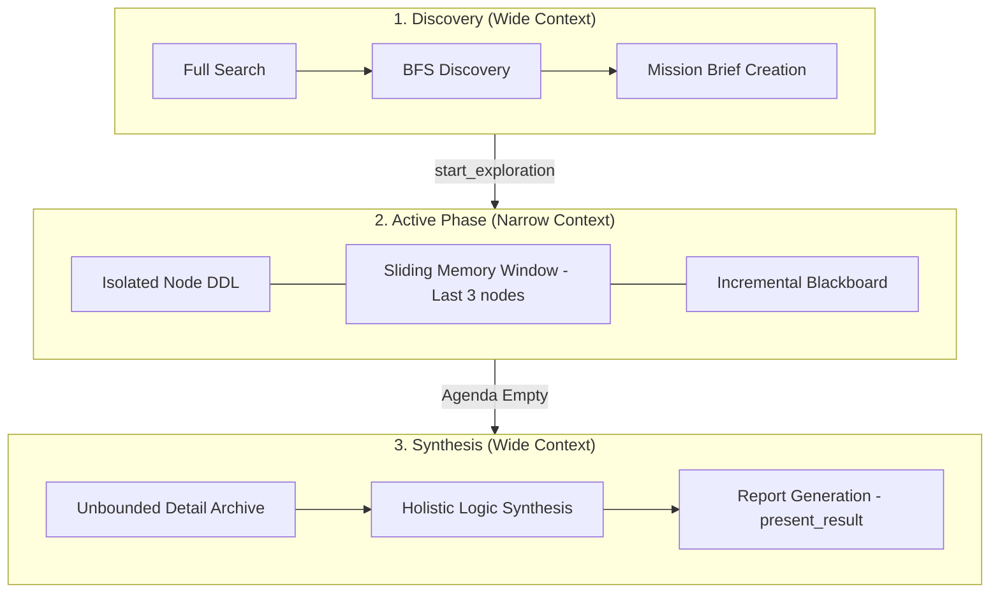

# AI Navigation: The Hourglass Context Model

## Overview
The "Hourglass" model is our architectural pattern for managing LLM context efficiency and reasoning quality during long-running data lineage investigations. It prevents "Context Poisoning" (hallucinations caused by over-exposure to global state) while maintaining full-fidelity reporting.

---

## The Three Phases

### 1. Discovery (The Filter)
- **Goal**: Identify the origin node and define the boundary.
- **Context**: Wide. The AI has access to the full model stats and search tools.
- **Output**: A `mission_brief` that anchors all subsequent reasoning.

### 2. Active (The Blinders)
- **Goal**: Surgical node-by-node analysis.
- **Context**: Narrow (Sliding Memory).
  - The engine physically strips global arrays (`agenda`, `visited_nodes`, `pending_questions`) from the payload.
  - The AI only sees the **Focus Node DDL** and `short_term_memory` (last 3 summaries).
- **Enforcement**: `LanguageModelChatToolMode.Required` prevents the AI from escaping the loop via chat prose.

### 3. Synthesis (The Aggregator)
- **Goal**: High-fidelity report generation.
- **Context**: Wide (Asymmetric Tiering).
  - The engine "opens the vault" and delivers the `Detail Archive` (unbounded characters authored by the AI during the Active phase).
- **Output**: A structured `present_result` payload.

---

## Memory Tiering: Working Set vs. Archive

| Tier | Scale | Delivery | Purpose |
| :--- | :--- | :--- | :--- |
| **Short-Term Memory** | Capped (3 nodes) | Every Hop | Local continuity & rename tracking. |
| **Working Memory** | Tiny | Every Hop | Progress signals (checklist, tally). |
| **Detail Archive** | Unbounded | Synthesis Only | Full technical documentation per node. |

## Best Practice Alignment

1. **Anthropic / Google**: Follows "System Prompt Siloing" by using phase-specific system prompts.
2. **s1 / Budget Forcing**: Uses monotonic `rounds_used` counters instead of countdowns to prevent reasoning shortcuts.
3. **Reflexion**: AI reflects on neighbor metadata *before* routing.
4. **Hourglass**: Capping history in long conversations is the industry standard for preventing performance degradation (Context Eviction).
