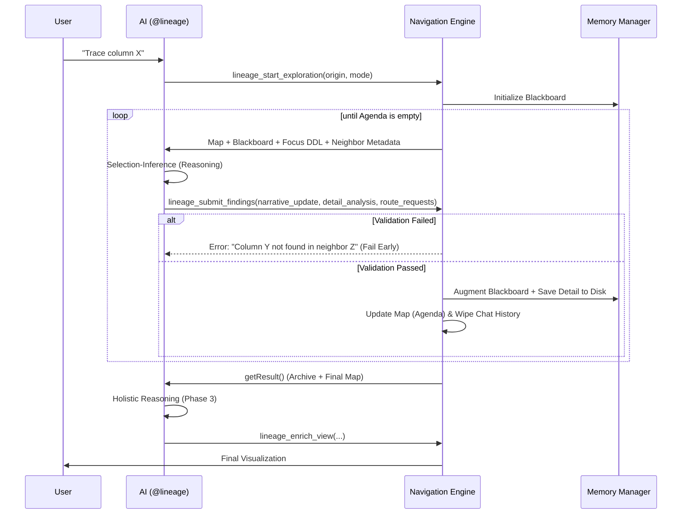

# AI Assistant Architecture — "Grounded Router"

The `@lineage` AI participant bridges deterministic graph traversal with semantic reasoning. It implements an autonomous **"Map & Router"** architecture where the extension host manages the topological state (The Map) and the AI performs the semantic analysis (The Router).

---

## 1. The Core Concept: Map & Router

To ensure stability during deep traces (30+ hops), the architecture strictly separates topological state from semantic insights.

- **The Map (Deterministic)**: Managed by the extension host (`NavigationEngine`). It tracks `Visited Nodes`, the `Active Agenda`, and provide **Metadata (Column Lists)** for all neighbors.
- **The Router (Semantic)**: Managed by the AI. It analyzes the DDL of the current node to answer a specific **Sub-Question**, updates the **Blackboard**, and requests the next **Route** to relevant neighbors.

---

## 2. Execution Model: Inline vs. State Machine

The system automatically chooses the delivery strategy based on the complexity of the investigation.

| Mode | Threshold | Context Strategy | Short Memory | Reasoning Capability |
| :--- | :--- | :--- | :--- | :--- |
| **Inline Mode** | Fits budget (< 10 nodes) | **One-Shot**: Full DDL and columns for all nodes are provided simultaneously. | **None**: The AI sees the "full picture" immediately. | **Holistic**: Turn-zero reasoning and logical grouping. |
| **State Machine (SM) Mode** | Exceeds budget | **Hop-and-Distill**: Only the focus node's DDL is provided per round. | **Incremental Blackboard**: A single, dense narrative synthesis. | **Segmented**: Requires a final Phase 3 for holistic reasoning. |

### The Unified Navigation Engine (`smBase.ts`)
We no longer use fragmented state machine classes. A single `NavigationEngine` handles all modes (Blackboard, Column Trace, Dependency) using **Selection-Inference Validation**:
1.  **Metadata Guard**: The engine provides column lists for neighbors *before* the AI visits them.
2.  **Fail Early**: If the AI asks a question about a non-existent column or node, the tool call is rejected immediately, forcing self-correction.
3.  **Grounded Routing**: Every hop is driven by a specific AI-generated sub-question attached to the node on the agenda.

### Singleton Session Model
One `AiSession` per extension instance. The whole extension holds one active exploration at a time.

- **User-facing safety**: `lineage_start_exploration.prepareInvocation` shows a VS Code confirmation dialog ("Wipe active exploration?") when an in-progress SM exists. The user explicitly acknowledges progress loss before a new exploration wipes the old one.
- **Auto-reset**: `AiSession.isStale()` returns true after 1 hour of inactivity (`src/ai/session.ts:81`). `resetIfStale()` fires on the next `start_exploration` call if stale OR if the prior SM reached `complete`.
- **Eval implication**: `toolProxy` bypasses `prepareInvocation` (invokes tools directly), so `POST /session` silently resets. Eval runs therefore execute strictly sequentially — parallel agents against one extension host race on the shared session and corrupt state. See `.claude/skills/eval-loop/SKILL.md` § "Execution Model — Sequential Only".

---

## 3. The Three Lifecycle Phases

### Phase 1: Discovery (Initiation)
The AI maps the starting point and scope using `lineage_search_objects` and `lineage_run_bfs_trace`. 
- **Grounded Start**: The engine seeds the initial Agenda with neighbors and generic questions to kickstart the analysis.

### Phase 2: Analysis (The Hop Loop)
The AI navigates the graph hop-by-hop.
- **Sliding Memory**: After every successful submission, the conversation history is wiped (Context Cleaning).
- **Working Memory**: In each round, the AI receives:
    1.  **The Blackboard**: The current incremental narrative synthesis.
    2.  **The Map**: A list of Visited nodes and the Open Agenda (with questions).
    3.  **The Metadata**: Columns and types of all immediate neighbors.
- **Selection-Inference**: The AI must provide a `narrative_update` (High-level insights) and `route_requests` (Next nodes + Specific Questions).

### Phase 3: Holistic Synthesis & Presentation
Once the agenda is empty, the AI receives the **Archive (Detail Memory)**.
- **Grounding Contract**: The AI uses the verbatim findings from every hop to build the final document.
- **Enrich View**: The AI calls `lineage_enrich_view` to generate sections, badges, and notes.

---

## 4. Memory Architecture: Asymmetric Tiering

Inspired by MemGPT, the memory is split into two tiers to prevent the $O(N)$ token leak.

| Tier | Visibility | Lifetime | Content |
| :--- | :--- | :--- | :--- |
| **Short Memory (Blackboard)** | **Every Hop** | Persistent | A single narrative string that the AI "augments" per hop. Dense business logic only. |
| **Detail Memory (Hard Drive)** | **Phase 3 Only** | persistent | Full-fidelity technical evidence and verbatim SQL snippets. |

### Topological Map (Grounding)
The Map is provided by the system in every hop. It provides the **Context of Location** so the AI doesn't have to repeat topological facts in the Blackboard, saving significant tokens.

### Algorithmic Integrity
To maintain the stability of the Navigation Engine, all core graph algorithms (BFS, SCC, pathfinding) are verified against a high-fidelity reference model. This ensures that semantic reasoning is grounded in a deterministic, verified topological foundation.

---

## 5. Process Flow Diagram

---
