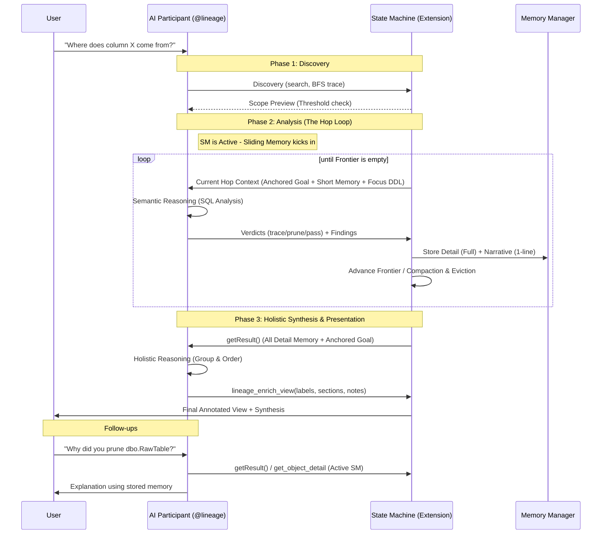

# AI Assistant Architecture — "Explore-First" & "Hop-and-Distill"

This document provides the high-fidelity technical specification for the `@lineage` AI participant. It describes how the system bridges deterministic graph traversal with semantic LLM reasoning.

---

## 1. The Core Tension: Structural vs. Semantic Knowledge

Column-level lineage in SQL is a "predicated graph traversal" problem:
- **Structural Knowledge**: The extension knows which objects exist and how they connect (O(V+E)).
- **Semantic Knowledge**: Only an agent (AI) can reason about how specific columns flow through complex DDL (INSERT/SELECT, renames, derivations).

To solve this without overwhelming the LLM's context window, we use the **Hop-and-Distill** pattern.

---

## 2. Execution Model: Inline vs. State Machine

The system automatically chooses between two core concepts based on the scope of the investigation.

| Concept | Threshold | Context Strategy | "Sliding Memory" Behavior | Reasoning Capability |
| :--- | :--- | :--- | :--- | :--- |
| **Inline Mode** | Fits budget (e.g. < 10 nodes) | **One-Shot**: Full DDL for all nodes in scope. | **None**: The AI sees the "full picture" from the start. | **Holistic**: One turn is sufficient for logical grouping. |
| **State Machine (SM) Mode** | Exceeds budget | **Hop-and-Distill**: Focus DDL only for the current hop. | **Strict**: Context is purged per hop to save tokens. | **Segmented**: Requires Phase 3 for final holistic reasoning. |

### State Machine (SM) Types
1. **Type 1: Blackboard (`blackboardState.ts`)**: Passive SM. AI drives exploration via sub-questions. SM manages an **Agenda Priority Queue**.
2. **Type 2: Dependency Trace**: Active SM. Linear object-level traversal.
3. **Type 3: Column Trace (`columnTraceState.ts`)**: Active SM. Tracks specific fields, handles **Rename Tracking**, and enforces **Fail-Early Validation**.

---

## 3. The Three Lifecycle Phases

A typical `@lineage` session moves through three distinct phases: **Discovery**, **Analysis**, and **Presentation**.

### Phase 1: Discovery (Initiation)
The AI begins with a "blank slate" and uses retrieval tools (`lineage_search_objects`, `lineage_run_bfs_trace`) to identify the starting point (Origin) and investigation scope.
- **Session Lifecycle**: AI state is strictly tied to the VS Code Chat Window. If a new chat session is detected (history length = 0), the previous session state is wiped to prevent cross-window leaks.
- **BFS Constraint**: `lineage_run_bfs_trace` is for scope discovery only. It does NOT generate a State Machine result and therefore cannot trigger the `lineage_enrich_view` visualization. AI must follow up with a full exploration SM to build a view.
- **Schema Filtering**: AI can now pass an optional `schemas[]` array to SM tools (`start_exploration`, `start_column_trace`) to explicitly target objects outside the active user filter.
- **Context Management**: Standard communication is used. Full history is provided to the AI.
- **Eviction Threshold**: If the history grows too large, the oldest turns are evicted (keeping a minimum of 6 messages) to prevent context overflow.

### Phase 2: Analysis (The Hop Loop)
If the scope is complex, the **State Machine (SM)** activates. The AI enters a "Sliding Memory" loop, where it processes the lineage hop-by-hop.
- **Fresh Mind**: Every hop, the AI is provided with a clean context containing the original **User Question**, the **Short Memory** (narrative digest of all prior hops), and for the current hop, the specific focus node's **DDL and Metadata**.
- **Goal Anchoring**: The original user goal is re-injected every round, ensuring the AI never loses focus during a long investigation.
- **Verdicts**: The AI evaluates the focus node and issues verdicts for neighbors (`trace`, `prune`, `pass`).
- **Compaction**: Stale tool results from prior hops are replaced with 1-line stubs to save tokens.

### Phase 3: Holistic Synthesis & Presentation
Once the analysis is complete, the session enters the critical synthesis phase. 
- **Holistic Reasoning**: Because the Analysis phase (Hop Loop) uses a Sliding Memory "blinders" pattern to save tokens, the AI never sees the full path at once. Phase 3 is the only time the AI receives the **un-truncated Detail Memory** for the entire traversed subgraph.
- **Logical Ordering**: The AI must process this entire context simultaneously to perform complex, cross-node logical reasoning. It deducts the final business logic and determines the logical grouping and narrative flow (represented as UI `sections`). This is why the LLM must own the output structure: it ensures that visualization labeling and numbering reflect a coherent business story.
- **Label-Section Contract**: The AI calls `lineage_enrich_view` to build the final visualization. It fills out the missing JSON fields (labels, sections, badges) which are then rendered in the UI. The UI numbers labels in the order the AI provides them.
- **Active SM for Follow-ups**: The SM remains "Active." Users can ask follow-up questions in the same session, and the AI can still use the stored SM context or classic tools (like `get_object_detail`) to answer.

---

## 4. Memory Architecture (Two-Tier Model)

Inspired by MemGPT, the `AiMemoryManager` separates narrative summaries from grounded evidence.

| Tier | Purpose | Fidelity | Context Visibility |
| :--- | :--- | :--- | :--- |
| **Short Memory** | Narrative digest | 1-line summaries | **Visible every hop** in `working_memory`. |
| **Detail Memory** | Grounded evidence | Full un-truncated text | **Synthesis only**. Used to build the final view. |

### Context Pressure Guards
- **Compaction**: Replaces stale tool results with 1-line summaries.
- **Eviction**: Drops oldest history pairs when input tokens > 75% of budget.

---

## 5. Process Flow Diagram

---

## 6. Directory Governance & Best Practices

To maintain high-quality documentation in a public repository:

| Best Practice | Implementation in this Project |
| :--- | :--- |
| **Visual Reasoning** | Complex state transitions and data flows are modeled with **Mermaid.js** diagrams for native GitHub rendering. |
| **Terminology Rigor** | Core classes (`AiSession`, `AiMemoryManager`) and modes (Inline vs. SM) are consistently named between code and documentation. |
| **Grounding** | All architectural decisions are documented with their research provenance (e.g., MemGPT, ReAct). |

- `src/ai/`: Core implementation. Zero VS Code dependencies for SM classes to ensure testability.
- `docs/AI_ARCHITECTURE.md`: (This file) Public-facing technical specification.
