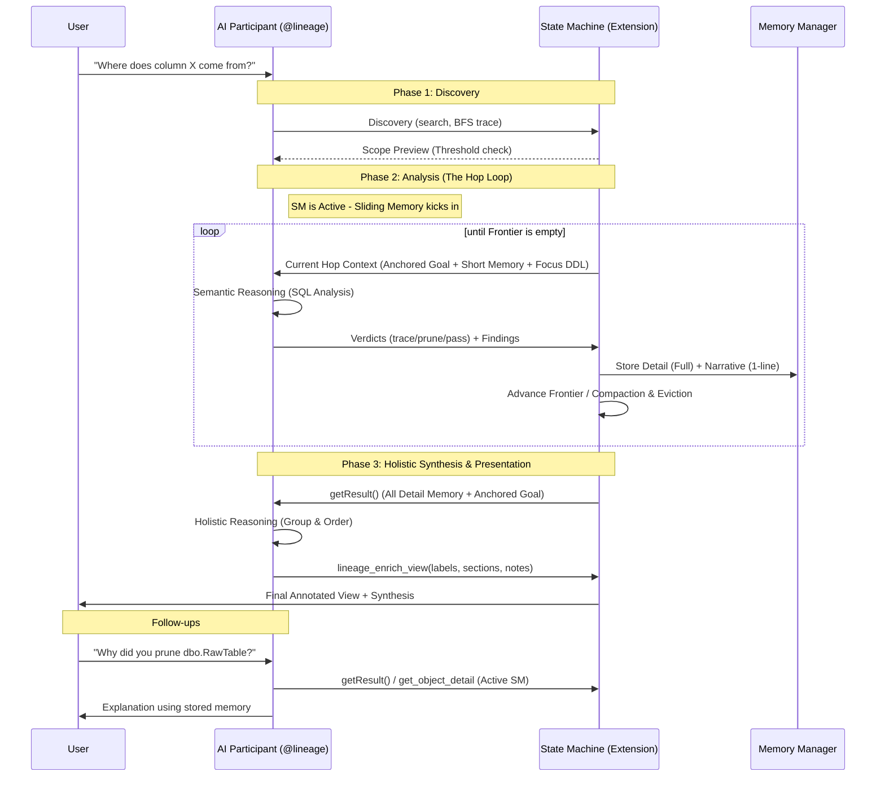

# AI Assistant Architecture — "Explore-First" & "Hop-and-Distill"

The `@lineage` AI participant bridges deterministic graph traversal with semantic reasoning to help users understand complex data flows. This document provides the high-fidelity technical specification for the assistant's architecture, lifecycle, and memory management.

---

## 1. The Core Tension: Structural vs. Semantic Knowledge

Column-level lineage in SQL is a "predicated graph traversal" problem that requires two distinct types of knowledge:
- **Structural Knowledge**: The extension host manages the deterministic graph (nodes/edges). It knows which objects exist and how they connect based on catalog dependencies (O(V+E)).
- **Semantic Knowledge**: Only an agent (AI) can reason about how specific columns flow through complex DDL (INSERT/SELECT expressions, renames, CASE logic, and derivations).

To solve this without overwhelming the LLM's context window, the system uses the **Hop-and-Distill** pattern.

---

## 2. Execution Model: Inline vs. State Machine

The system automatically chooses between two core execution modes based on the complexity (scope) of the investigation.

| Mode | Threshold | Context Strategy | "Sliding Memory" Behavior | Reasoning Capability |
| :--- | :--- | :--- | :--- | :--- |
| **Inline Mode** | Fits budget (e.g., < 10 nodes) | **One-Shot**: Full DDL and columns for all nodes in scope are provided simultaneously. | **None**: The AI sees the "full picture" from the start. | **Holistic**: A single turn is sufficient for reasoning and logical grouping. |
| **State Machine (SM) Mode** | Exceeds budget | **Hop-and-Distill**: Only the focus node's DDL is provided per round. | **Strict**: Context is aggressively purged per hop to save tokens. | **Segmented**: Requires a final Phase 3 for holistic reasoning across accumulated findings. |

### State Machine (SM) Types
1. **Blackboard (`blackboardState.ts`)**: Passive exploration for broad questions. The SM manages an **Agenda Priority Queue** based on sub-questions and discovery.
2. **Column Trace (`columnTraceState.ts`)**: Active field-level tracking. Enforces **Rename Tracking** (INSERT→SELECT mapping) and **Fail-Early Validation** to prevent hallucinations.
3. **Dependency Trace**: Active object-level traversal (Column Trace without specific field tracking).

---

## 3. The Three Lifecycle Phases

A typical `@lineage` session moves through three distinct phases: **Discovery**, **Analysis**, and **Presentation**.

### Phase 1: Discovery (Initiation)
The AI identifies the starting point (Origin) and investigation scope using retrieval tools.
- **Tools**: `lineage_search_objects`, `lineage_run_bfs_trace`.
- **Constraint**: `lineage_run_bfs_trace` is for scope discovery only. It does NOT generate a state-machine result and cannot trigger the `lineage_enrich_view` visualization.
- **Session Isolation**: AI state is strictly tied to the VS Code Chat session. A new chat session triggers an **Atomic Wipe** of previous reasoning state.

### Phase 2: Analysis (The Hop Loop)
If the scope is complex, the **State Machine (SM)** activates. The AI enters a "Sliding Memory" loop, processing the lineage hop-by-hop.
- **Fresh Mind**: Every hop, the AI receives a clean context containing the **User Question**, the **Short Memory** (narrative digest), and the focus node's **DDL**.
- **Goal Anchoring**: The original user goal is re-injected every round to maintain focus during deep traces.
- **Compaction**: Stale tool results from prior hops are replaced with 1-line "stubs" in the history to save tokens.

### Phase 3: Holistic Synthesis & Presentation
Once the frontier is empty, the session enters the synthesis phase. 
- **Holistic Reasoning**: This is the only time the AI receives the **un-truncated Detail Memory** for the entire traversed subgraph. It processes the accumulated findings to deduce final business logic.
- **Visual Synthesis**: The AI calls `lineage_enrich_view` to build the final visualization, including depth-ordered **sections**, semantic **badges**, and node-level **notes**.
- **Active SM for Follow-ups**: The SM remains active. Users can ask follow-up questions, and the AI can reason using the stored state or detailed object lookups.

---

## 4. Memory Architecture: Two-Tier Model

Inspired by MemGPT, the `AiMemoryManager` separates narrative summaries from grounded evidence to maintain fidelity across long sessions.

| Tier | Purpose | Fidelity | Context Visibility |
| :--- | :--- | :--- | :--- |
| **Short Memory** | Narrative digest | 1-line summaries | **Visible every hop** in `working_memory`. |
| **Detail Memory** | Grounded evidence | Full un-truncated text | **Synthesis only**. Used for the final view. |

### Context Pressure Guards
- **Compaction**: `compactStaleHopResult` replaces old hop data with metadata stubs.
- **Eviction**: Drops the oldest history turns when input tokens exceed 75% of the model's budget (`CONTEXT_PRESSURE_THRESHOLD`).

---

## 5. Process Flow Diagram

---
