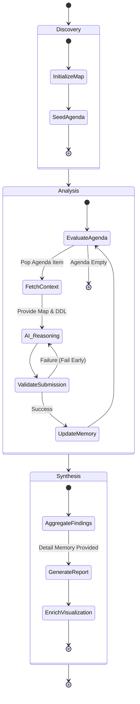

# AI Assistant Architecture — "Grounded Router"

## Overview
This guide is for Super Power Users who want to understand the conceptual framework behind the `@lineage` participant. The `@lineage` AI participant bridges deterministic graph traversal with semantic reasoning. It implements an autonomous **"Map & Router"** architecture where the extension host manages the topological state and the AI performs the semantic analysis.

## Key Concepts
- **The Map (Deterministic)**: Managed by the extension host (`NavigationEngine`). It tracks `Visited Nodes`, the `Active Agenda`, and provides **Metadata (Column Lists)** for all neighbors.
- **The Router (Semantic)**: Managed by the AI. It analyzes the DDL of the current node to answer a specific **Sub-Question**, updates the **Blackboard**, and requests the next **Route** to relevant neighbors.
- **Selection-Inference Validation**: Ensures the AI only requests routes to valid, existing columns and nodes.

## Architecture/Workflow

### Execution Model: Inline vs. State Machine (SM)
The system automatically chooses the delivery strategy based on the complexity of the investigation.

| Mode | Threshold | Context Strategy | Short Memory | Reasoning Capability |
| :--- | :--- | :--- | :--- | :--- |
| **Inline Mode** | Fits budget (< 10 nodes) | **One-Shot**: Full DDL and columns for all nodes are provided simultaneously. | **None**: The AI sees the "full picture" immediately. | **Holistic**: Turn-zero reasoning and logical grouping. |
| **SM Mode** | Exceeds budget | **Local-Neighborhood (GraphRAG)**: Only the focus node's DDL + the detailed analysis of its immediate (1-hop) neighbors are provided per round. | **Incremental Blackboard**: A single, dense narrative synthesis. | **Segmented**: High-fidelity local edge reasoning, requires a final Phase 3 for holistic reasoning. |

### Memory Tiering (SM Mode)
To solve the token explosion problem inherent in large graphs while preserving the high-fidelity reasoning required for data lineage, the SM Mode utilizes a **Two-Tier Memory Model**:
1. **Short Memory (Blackboard)**: A length-capped, incrementally updated global narrative of the business logic. Injected in full every hop.
2. **Detail Memory (Archive)**: The AI's full technical analysis (SQL transforms, math formulas) for every analyzed node. Stored in `AiMemoryManager.detailSlots` as the single source of truth. Exposed in two modes:
   - **Inside mode (per hop)**: a budget-bounded slice — "local detail context" — is injected alongside the focus DDL. See [Working-Set Selection](#working-set-selection-sm-mode) below.
   - **Outside mode (Phase 3 synthesis)**: the full detail archive is delivered for holistic reasoning and correction. See `AiMemoryManager.getResult()`.

#### Working-Set Selection (SM Mode)
Per-hop DetailSlot delivery is driven by a single policy, independent of `SmMode`, implemented in `src/ai/workingSet.ts → selectWorkingSet()`.

**Inputs**: `{ focusId, originId, graph }`, the full DetailSlot map, and a token budget (default `WORKING_SET_TOKEN_BUDGET = 4000`, ≈ 25% of a 16 K context).

**Selection tiers**:
1. **PathFrame** — slots on the shortest `origin → focus` path (excluding focus). Always included; may overspend the budget. Preserves structural continuity on the current branch.
2. **BranchLocal (near)** — 1-hop neighbors of focus (bidirectional), minus path and focus.
3. **BranchLocal (far)** — 2-hop neighbors of focus, minus path, focus, and near.

**Budget pack**: path slots are unconditional; near then far fill the remaining budget, each skipped if adding would cross it. Within each tier, nodes are sorted by id for determinism.

**Emission order**: `[path → near → far]` — breadcrumbs first, then nearest evidence.

**Three failure modes fixed** (versus the previous static 1-hop × 5-cap policy):

| Topology | Old behavior | New behavior |
|---|---|---|
| Daisy chain `A→B→C→D→E`, focus `C` | Only `{B, D}` delivered (1-hop). Path context lost. | `[A, B, D, E]` — path prefix + 2-hop tail. |
| Hub (focus has 50 fat neighbors) | Arbitrary 5 kept, 45 evicted. | Budget caps output at ~3–15 depending on slot size; path always retained. |
| Branch-jump (focus moves to different subtree) | Last 5 visited followed focus — leaked abandoned-branch context. | PathFrame recomputes from new focus; abandoned branch falls out of the window. |

**Grounding**: Working Set Theory (Denning, 1968); MemGPT two-tier memory (Packer et al., 2023); GraphRAG local-mode retrieval (Edge et al., Microsoft 2024).

**Applies only in SM mode.** Inline mode delivers the full detail archive at synthesis, so no per-hop selection is performed (`NavigationEngine.getHopContext` passes `undefined` to `getWorkingMemory`).

### Exploration Modes (`SmMode`)
The same `NavigationEngine` serves three personas, selected by the mode of the active session:
- **`blackboard`** — Business Logic Analyst (Functional Focus). The default for "explain / summarize" style questions.
- **`column_trace`** — Data Lineage Analyst (Column Focus). Activated when the user asks about specific column flow.
- **`dependency`** — Structural Analyst (Dependency Focus). Structural topology questions ("what depends on X"). Uses the same hop workflow and memory tiering as `blackboard`; only the role framing of the system prompt differs.

### Completion Contract (when SM says "done")
Completion semantics depend on the execution mode:

| Mode | Trigger | AI action |
| :--- | :--- | :--- |
| **Inline mode** (scope ≤ `inlineNodeCap` AND ≤ `inlineTokenBudget`) | AI sets `complete: true` on `submit_findings`. No coverage gate — the AI has the full picture one-shot and decides when the question is answered. | On acceptance, the tool returns `{ ok: true, done: true, result }` and the AI produces the chat answer + `enrich_view`. |
| **SM sliding-memory mode** (scope exceeds either threshold) | **AI does not decide.** The engine drains the agenda: every item must receive one of the three verdicts — `relevant`, `pass`, `irrelevant`. When the last verdict is dispatched, `submit_findings` returns `{ ok: true, done: true, result }`. The `complete: true` field is silently ignored here. | Produce the chat answer + `enrich_view` when the `done: true` response arrives. |

Three verdicts (SM mode):
- `relevant` — full 5-block analysis stored; drives badges/notes.
- `pass` — visited, no analysis stored, always accepted. Intended for variant siblings of an already-analyzed archetype (reference the archetype in the blackboard).
- `irrelevant` — cascade-prune the node + unreachable downstream. May be rejected by orphan / cascade-width guards; fall back to `pass`.

This replaces the earlier `premature_complete` coverage-floor guard. That guard (removed) refused `complete=true` in SM mode until coverage ≥ 80%, which was unreachable on variant-heavy neighborhoods and created rejection loops. The drain-only contract is always satisfiable (each verdict is a legal move) and the SM — not the AI — decides when the session is over.

### Repeat-Rejection Belt
A session-level idempotency counter (`src/ai/repeatRejectGuard.ts → RepeatRejectGuard`) aborts the exploration cleanly if the model sends the same tool call three consecutive times and it fails every time. Any successful call resets the counter. The abort surfaces a typed envelope (`RepeatRejectAbort` in `src/ai/smErrors.ts`) and a user-visible message in chat. This is a belt against any future guard-interaction loop; it is orthogonal to SM semantics and applies to every tool call, not just `submit_findings`. The existing `dataLineageViz.ai.maxRounds` setting (default 50) remains the absolute round-cap.

### View Refinement: Prune
`enrich_view` supports pruning nodes from the delivered result graph. Pruning **removes the listed nodes and every edge that touches them** — it does not reconnect edges across pruned nodes. Passthrough-style reconnection was deliberately removed because, for a shared hub `P` in `A→P→B, C→P→D`, it fabricated phantom edges (`A→D`, `C→B`) between otherwise-unrelated lineage siblings.

### The Hop Payload
Every hop, `NavigationEngine.getHopContext()` returns a single JSON object delivered to the model as the tool result. It is self-contained — the agent does not need conversation history to reason about the current hop.

| Section | Field | Purpose |
| :--- | :--- | :--- |
| **Index** | `hop` | Integer hop number (1-based) |
| **Focus DDL** | `focus_node` | `{id, schema, name, type, ddl, columns, fks}` for the current node |
| **Local metadata** | `neighbors[]` | Each entry: `{id, schema, name, type, edge_direction, edge_type, boundary, cols, fks, hasDdl}` — enables grounded routing decisions without fetching |
| **Sub-question** | `current_question` | The grounded question driving *this* hop (set by `route_requests` from a prior hop, or the root question on hop 1) |
| **Short Memory** | `working_memory.blackboard` | Full cumulative narrative; AI overwrites it each hop via `narrative_update` |
| **Pending** | `working_memory.pending_questions` | Neighbors the AI deferred for later hops |
| **Progress** | `working_memory.checklist` | `{current_hop, noted, total, coveragePct}` — feeds the premature-complete guard |
| **Detail Memory (slice)** | `working_memory.local_detail_context` | DetailSlots per the inside-mode policy (see Memory Tiering) |
| **The Map** | `working_memory.topological_map` | `{navigation_path, visited_nodes, current_focus, agenda}` — the deterministic structural grounding |

The user's original natural-language question is **not** re-injected into `current_question` after hop 1. It reaches the model via two paths: (1) the VS Code chat-history messages on every LM call, and (2) verbatim inside the hop-1 `current_question` as `"Root Question: <user text>"` (set at `init`). Long traces that survive sliding-history eviction rely on path (2) + the Blackboard for anti-drift grounding; promoting the root question into `topological_map.root_question` is a cheap future reinforcement.

### The Three Lifecycle Phases
1. **Discovery (Initiation)**: The AI maps the starting point and scope. The engine seeds the initial Agenda.
2. **Analysis (The Hop Loop)**: The AI navigates the graph hop-by-hop. In each round, the AI receives The Blackboard, The Map, and The Metadata.
3. **Holistic Synthesis & Presentation**: Once the agenda is empty, the AI uses the **Archive (Detail Memory)** to build the final document and generate visual sections/badges.

### State Diagram: AI Navigation Engine

## Detailed Specs

### The Unified Navigation Engine
A single `NavigationEngine` handles all modes (Blackboard, Column Trace, Dependency).
- **Metadata Guard**: The engine provides column lists for neighbors *before* the AI visits them.
- **Fail Early**: Hallucinated questions or non-existent columns are rejected immediately.
- **Grounded Routing**: Every hop is driven by a specific AI-generated sub-question attached to the node on the agenda.

### Singleton Session Model
One `AiSession` per extension instance.
- **User-facing safety**: Explicit user acknowledgement is required before a new exploration wipes an active one.
- **Auto-reset**: Sessions auto-reset after 1 hour of inactivity.

## References
- [Graph BFS Standard References](https://en.wikipedia.org/wiki/Breadth-first_search)
- Internal developer documentation: `docs-internal/AI_IMPLEMENTATION.md`
