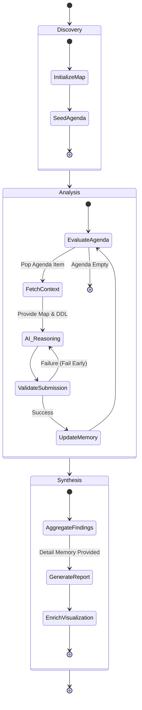

# AI Assistant Architecture — "Grounded Router"

## Overview
This guide is for Super Power Users who want to understand the conceptual framework behind the `@lineage` participant. The `@lineage` AI participant bridges deterministic graph traversal with semantic reasoning. It implements an autonomous **"Map & Router"** architecture where the extension host manages the topological state and the AI performs the semantic analysis.

## Key Concepts
- **The Map (Deterministic)**: Managed by the extension host (`NavigationEngine`). It tracks `Visited Nodes`, the `Active Agenda`, and provides **Metadata (Column Lists)** for all neighbors.
- **The Router (Semantic)**: Managed by the AI. It analyzes the DDL of the current node to answer a specific **Sub-Question**, updates the **Blackboard**, and requests the next **Route** to relevant neighbors.
- **Selection-Inference Validation**: Ensures the AI only requests routes to valid, existing columns and nodes.

## Architecture/Workflow

### Execution Model: Inline vs. State Machine (SM)
The system automatically chooses the delivery strategy based on the complexity of the investigation.

| Mode | Threshold | Context Strategy | Short Memory | Reasoning Capability |
| :--- | :--- | :--- | :--- | :--- |
| **Inline Mode** | Fits budget (< 10 nodes) | **One-Shot**: Full DDL and columns for all nodes are provided simultaneously. | **None**: The AI sees the "full picture" immediately. | **Holistic**: Turn-zero reasoning and logical grouping. |
| **SM Mode** | Exceeds budget | **Hop-and-Distill**: Only the focus node's DDL is provided per round. | **Incremental Blackboard**: A single, dense narrative synthesis. | **Segmented**: Requires a final Phase 3 for holistic reasoning. |

### The Three Lifecycle Phases
1. **Discovery (Initiation)**: The AI maps the starting point and scope. The engine seeds the initial Agenda.
2. **Analysis (The Hop Loop)**: The AI navigates the graph hop-by-hop. In each round, the AI receives The Blackboard, The Map, and The Metadata.
3. **Holistic Synthesis & Presentation**: Once the agenda is empty, the AI uses the **Archive (Detail Memory)** to build the final document and generate visual sections/badges.

### State Diagram: AI Navigation Engine

## Detailed Specs

### The Unified Navigation Engine
A single `NavigationEngine` handles all modes (Blackboard, Column Trace, Dependency).
- **Metadata Guard**: The engine provides column lists for neighbors *before* the AI visits them.
- **Fail Early**: Hallucinated questions or non-existent columns are rejected immediately.
- **Grounded Routing**: Every hop is driven by a specific AI-generated sub-question attached to the node on the agenda.

### Singleton Session Model
One `AiSession` per extension instance.
- **User-facing safety**: Explicit user acknowledgement is required before a new exploration wipes an active one.
- **Auto-reset**: Sessions auto-reset after 1 hour of inactivity.

## References
- [Graph BFS Standard References](https://en.wikipedia.org/wiki/Breadth-first_search)
- Internal developer documentation: `docs-internal/AI_IMPLEMENTATION.md`
