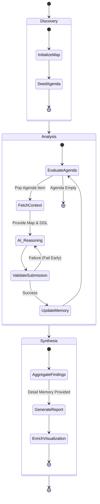

# AI Assistant Architecture — "Grounded Router"

## Overview
This guide is for Super Power Users who want to understand the conceptual framework behind the `@lineage` participant. The `@lineage` AI participant bridges deterministic graph traversal with semantic reasoning. It implements an autonomous **"Map & Router"** architecture where the extension host manages the topological state and the AI performs the semantic analysis.

## Key Concepts
- **The Map (Deterministic)**: Managed by the extension host (`NavigationEngine`). It tracks `Visited Nodes`, the `Active Agenda`, and provides **Metadata (Column Lists)** for all neighbors.
- **The Router (Semantic)**: Managed by the AI. It analyzes the DDL of the current node to answer a specific **Sub-Question**, updates the **Blackboard**, and requests the next **Route** to relevant neighbors.
- **Selection-Inference Validation**: Ensures the AI only requests routes to valid, existing columns and nodes.

## Architecture/Workflow

### Execution Model: Inline vs. State Machine (SM)
The system automatically chooses the delivery strategy based on the complexity of the investigation.

| Mode | Threshold | Context Strategy | Per-Hop Memory | Reasoning Capability |
| :--- | :--- | :--- | :--- | :--- |
| **Inline Mode** | Fits budget (< 10 nodes) | **One-Shot**: Full DDL and columns for all nodes are provided simultaneously. | **None** — the AI sees the full picture immediately. | **Holistic**: Turn-zero reasoning and logical grouping. |
| **SM Mode** | Exceeds budget | **Focus + auto-delivered summaries**: the current node's DDL plus every prior hop's one-line summary. | **`all_summaries`** — cumulative, unbounded, system-managed. | **Per-hop** local edge reasoning, converges in a final synthesis phase. |

### Memory Model (SM Mode)
SM mode preserves the 0.9.8 design: **storage + delivery + execution** only — no filtering, no ranking, no content decisions. Two stores back every session:

1. **Detail Archive** (`AiMemoryManager.detailSlots`) — full technical analysis per node, written in `submit_findings.detail_analysis`. Never compressed. Exposed at synthesis via `AiMemoryManager.getResult()`.
2. **Per-hop Working Memory** (`AiMemoryManager.getWorkingMemory`) — the `WorkingMemory` snapshot delivered at every hop:
   - `user_question` — echoed verbatim so the root question survives sliding-history eviction.
   - `all_summaries: Array<{ nodeId, summary }>` — every prior hop's `submit_findings.summary`, in visit order, **unbounded**. No token budget, no path/neighbor prioritization. The model decides which summaries matter for the current hop.
   - `pending_questions` — self-ask entries the model posted via `route_requests` but has not yet visited.
   - `checklist` — `{ current_hop, noted, total, open, coveragePct }` for drain signaling.

No AI-managed narrative string. No `blackboard`. No `local_detail_context` slice. The model reads the snapshot and the focus node's DDL; it writes a fresh analysis + one-line summary; the engine appends the summary to `all_summaries` for the next hop.

**Grounding**: simple per-hop delivery matches the original 0.9.8 behavior and the project's SM-never-truncates principle. Earlier iterations attempted MemGPT-style cumulative narratives and token-budget working sets; both were abandoned because the AI frequently compressed, paraphrased, or lost information when asked to manage memory, and because filtering violated the stored design principle.

### Exploration Modes (`SmMode`)
The same `NavigationEngine` serves three personas, selected by the mode of the active session:
- **`blackboard`** — Business Logic Analyst (Functional Focus). The default for "explain / summarize" style questions.
- **`column_trace`** — Data Lineage Analyst (Column Focus). Activated when the user asks about specific column flow.
- **`dependency`** — Structural Analyst (Dependency Focus). Structural topology questions ("what depends on X"). Uses the same hop workflow and memory tiering as `blackboard`; only the role framing of the system prompt differs.

### Completion Contract (when SM says "done")
Completion semantics depend on the execution mode:

| Mode | Trigger | AI action |
| :--- | :--- | :--- |
| **Inline mode** (scope ≤ `inlineNodeCap` AND ≤ `inlineTokenBudget`) | AI sets `complete: true` on `submit_findings`. No coverage gate — the AI has the full picture one-shot and decides when the question is answered. | On acceptance, the tool returns `{ ok: true, done: true, result }` and the AI produces the chat answer + `enrich_view`. |
| **SM sliding-memory mode** (scope exceeds either threshold) | **AI does not decide.** The engine drains the agenda: every item must receive one of the three verdicts — `relevant`, `pass`, `irrelevant`. When the last verdict is dispatched, the engine emits the synthesis trigger and the AI produces the chat answer + `enrich_view`. `complete: true` is **rejected** with `{error:'complete_not_allowed'}` so the AI cannot self-finalize. | Synthesis trigger delivered as a distinct user message; the continuation-phase nav prompt contains no mention of completion. |
| **MAX_ROUNDS cap** (safety cut-off at `ai.maxRounds`, default 50) | The loop exits without the SM reaching `complete`. The session persists a **partial resultGraph** (flagged `partial: true`, `partialCoverage: {analyzed, total}`) from all nodes analyzed so far. | `enrich_view` / "Show in Graph" still renders the partial result; the UI surfaces a "cap hit" notice. |

Three verdicts (SM mode):
- `relevant` — full 5-block analysis stored; drives badges/notes.
- `pass` — visited, no analysis stored, always accepted. Intended for variant siblings of an already-analyzed archetype (reference the archetype in the blackboard).
- `irrelevant` — cascade-prune the node + unreachable downstream. May be rejected by orphan / cascade-width guards; fall back to `pass`.

This replaces the earlier `premature_complete` coverage-floor guard. That guard (removed) refused `complete=true` in SM mode until coverage ≥ 80%, which was unreachable on variant-heavy neighborhoods and created rejection loops. The drain-only contract is always satisfiable (each verdict is a legal move) and the SM — not the AI — decides when the session is over.

### Repeat-Rejection Belt
A session-level idempotency counter (`src/ai/repeatRejectGuard.ts → RepeatRejectGuard`) aborts the exploration cleanly if the model sends the same tool call three consecutive times and it fails every time. Any successful call resets the counter. The abort surfaces a typed envelope (`RepeatRejectAbort` in `src/ai/smErrors.ts`) and a user-visible message in chat. This is a belt against any future guard-interaction loop; it is orthogonal to SM semantics and applies to every tool call, not just `submit_findings`. The existing `dataLineageViz.ai.maxRounds` setting (default 50) remains the absolute round-cap.

### View Refinement: Prune
`enrich_view` supports pruning nodes from the delivered result graph. Pruning **removes the listed nodes and every edge that touches them** — it does not reconnect edges across pruned nodes. Passthrough-style reconnection was deliberately removed because, for a shared hub `P` in `A→P→B, C→P→D`, it fabricated phantom edges (`A→D`, `C→B`) between otherwise-unrelated lineage siblings.

### The Hop Payload
Every hop, `NavigationEngine.getHopContext()` returns a single JSON object delivered to the model as the tool result. It is self-contained — the agent does not need conversation history to reason about the current hop.

| Section | Field | Purpose |
| :--- | :--- | :--- |
| **Engine status** | `sm_status` | `'awaiting_findings'` while the loop is draining — the explicit "you are mid-loop" signal that survives sliding-memory wipes |
| **Index** | `hop` | Integer hop number (1-based) |
| **Drain signal** | `agenda_remaining` | Count of nodes still on the agenda — tells the AI how much work is left this session |
| **Focus DDL** | `focus_node` | `{id, schema, name, type, ddl, columns, fks}` for the current node |
| **Local metadata** | `neighbors[]` | Each entry: `{id, schema, name, type, edge_direction, edge_type, boundary, cols, fks, hasDdl}` — enables grounded routing decisions without fetching |
| **Sub-goal** | `current_task` | The grounded task driving *this* hop (set by `route_requests` from a prior hop, or the root question on hop 1) |
| **User question** | `working_memory.user_question` | The original user question, echoed verbatim every hop |
| **Auto-delivered memory** | `working_memory.all_summaries` | `Array<{nodeId, summary}>` — every prior hop's one-line summary, in visit order, unbounded |
| **Pending** | `working_memory.pending_questions` | Neighbors the AI deferred for later hops |
| **Progress** | `working_memory.checklist` | `{current_hop, noted, total, open, coveragePct}` — `open = total − noted`, the per-hop count of un-analyzed nodes in scope |
| **The Map** | `working_memory.topological_map` | `{navigation_path, visited_nodes, current_focus, agenda}` — the deterministic structural grounding |

The hop payload is designed to survive sliding-memory wipes: `sm_status`, `agenda_remaining`, and `checklist.open` give the AI the situational awareness it needs to keep draining even when the conversation history has been trimmed to the last turn. Omitting these signals — as earlier iterations did — forces the AI to fall back on acknowledge-the-data prose after each hop, which shows up as a "premature final answer" pattern. The fix is data, not more prose rules.

The user's original question reaches the model via three paths every hop: (1) `working_memory.user_question` (echoed verbatim by the engine), (2) the VS Code chat-history messages on every LM call, and (3) `current_task` on hop 1 as `"Root Question: <user text>"`. Sliding-history wipes preserve paths (1) and (3) because they live in tool results, not user messages.

### The Three Lifecycle Phases
1. **Discovery (Initiation)**: The AI maps the starting point and scope. The engine seeds the initial Agenda.
2. **Analysis (The Hop Loop)**: The AI navigates the graph hop-by-hop. Each hop it receives `all_summaries`, the Map, the focus DDL, and neighbor metadata.
3. **Holistic Synthesis & Presentation**: Once the agenda drains, the AI uses the full Detail Archive to write the chat prose + `enrich_view` sections.

### State Diagram: AI Navigation Engine

## Detailed Specs

### The Unified Navigation Engine
A single `NavigationEngine` handles all modes (Blackboard, Column Trace, Dependency).
- **Metadata Guard**: The engine provides column lists for neighbors *before* the AI visits them.
- **Fail Early**: Hallucinated questions or non-existent columns are rejected immediately.
- **Grounded Routing**: Every hop is driven by a specific AI-generated sub-question attached to the node on the agenda.

### Singleton Session Model
One `AiSession` per extension instance.
- **Cross-session guard (chat-visible, non-modal)**: Each `start_exploration` stamps `engine.sessionId = sess.id`. A new `start_exploration` from a *different* session (`sess.id` rotates on every empty-history chat turn) wipes the prior SM silently and queues a one-line notice on `sess.pendingUserNotice`, which `runWithTools` drains as a `stream.markdown` blockquote after the tool round. No `confirmationMessages` modal, ever — blocking dialogs are forbidden by design.
- **Same-session re-call is a hard error, not a wipe**: `start_exploration` is strictly one-shot per turn. Re-calling it within the same session returns `{ error: 'already_started', hint: '…' }` without touching the live SM, so the AI cannot accidentally wipe in-progress findings (e.g. after a `complete_rejected` verdict — the queued neighbors are served on the next `submit_findings`).
- **Auto-reset**: Sessions auto-reset after 30 minutes of inactivity (`STALE_AFTER_MS`), or immediately when the prior SM has reached `complete`. Stale resets are silent — no notice.
- **Result-graph preservation across new chat**: When VS Code creates an empty-history chat thread and the session has a `resultGraph` less than 5 minutes old, the graph is preserved across the reset so follow-up prompts like *"Show the trace result in the graph"* can still render. Transient state (`stateMachine`, agenda) is always cleared — only the completed / partial result survives the window.

### Column validation scope
`submit_findings.route_requests[].columns` is validated against the target node's columns **only in `column_trace` mode**. In `blackboard` / `dependency` mode the field is silently dropped (it has no semantic meaning there) — the AI cannot trigger a `route_validation_failed` error by copying source-node column names onto a target UDF or proc.

## References
- [Graph BFS Standard References](https://en.wikipedia.org/wiki/Breadth-first_search)
- Internal developer documentation: `docs-internal/AI_IMPLEMENTATION.md`
