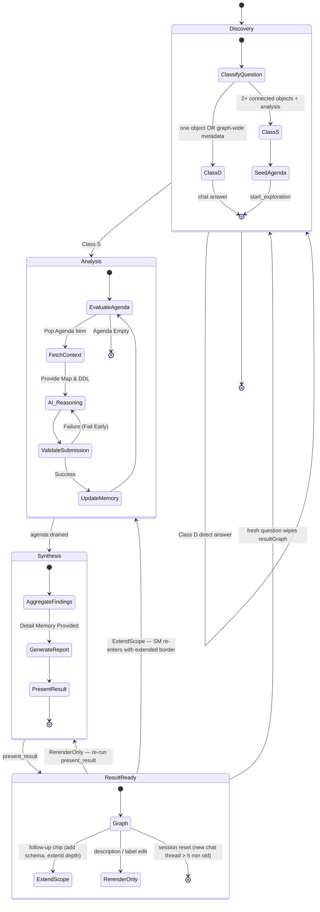
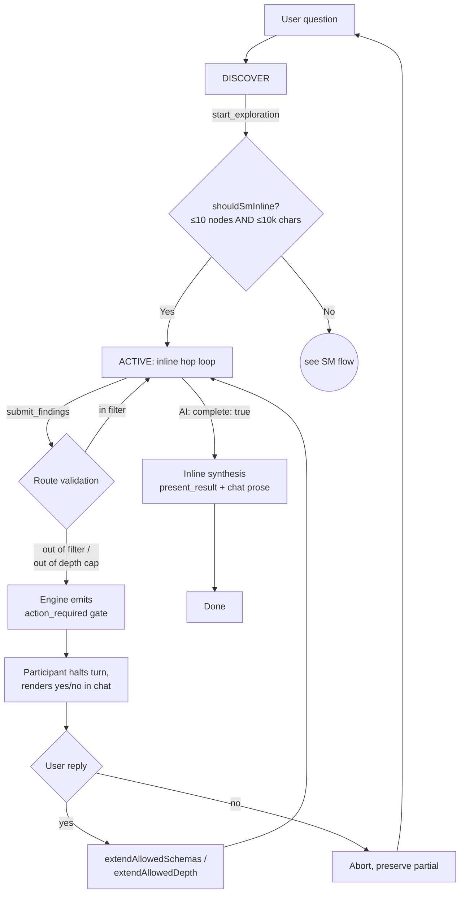
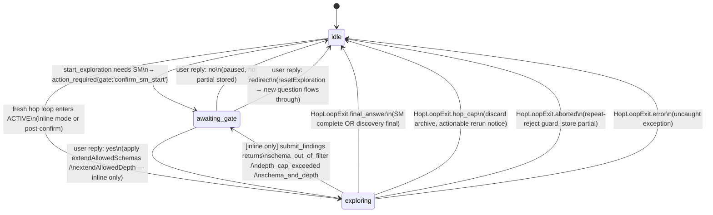

# AI Assistant Architecture — "Grounded Router"

## Overview
This guide is for Super Power Users who want to understand the conceptual framework behind the `@lineage` participant. The `@lineage` AI participant bridges deterministic graph traversal with semantic reasoning. It implements an autonomous **"Map & Router"** architecture where the extension host manages the topological state and the AI performs the semantic analysis.

## Key Concepts
- **The Map (Deterministic)**: Managed by the extension host (`NavigationEngine`). It tracks `Visited Nodes`, the `Active Agenda`, and provides **Metadata (Column Lists)** for all neighbors.
- **The Router (Semantic)**: Managed by the AI. It analyzes the DDL of the current node to answer a specific **Sub-Question**, updates the **Blackboard**, and requests the next **Route** to relevant neighbors.
- **Selection-Inference Validation**: Ensures the AI only requests routes to valid, existing columns and nodes.

## Engineering Standards
As foundational mandates for the AI Assistant:
- **Zod Validation**: IPC bridge validation, tool inputs, and extension host boundaries must strictly use `zod` for strong type safety, runtime validation, and security.
- **DRY & OOP**: Emphasize explicit composition, reusability, and delegation. The `NavigationEngine` and similar core orchestration systems must serve as the single source of truth for their domains without redundant logic. Do not duplicate logic or introduce anti-patterns to bypass structural designs.

## VS Code API Compliance & AI Tooling
- **Model Handle Protocol**: The `@lineage` participant strictly uses the `request.model` handle provided by the VS Code Chat API. This ensures that the user's explicit model selection (e.g., GPT-4o, Claude Haiku) is respected. The extension does not perform secondary model discovery or switching, relying on the user-selected model's registered capabilities.
- **Tool Mode Logic**: To comply with VS Code API constraints, the participant dynamically selects the `LanguageModelChatToolMode`:
    - **`Required`**: Used during ACTIVE phase and for `/search`/`/trace` commands. Requests the model to always call a tool. VS Code's API may downgrade `Required` to `Auto` when more than one tool is exposed — the SM ACK/WAIT guard (see below) covers that gap.
    - **`Auto`**: Used in DISCOVERY and SYNTHESIS (conversational phases) so the model can answer directly without a tool call.
- **SM ACK/WAIT Contract**: SM hop-by-hop runs as a server–client protocol. The engine (server) is the sole authority over session termination; the AI (client) must reply with a legal tool call on every hop until the engine reports `sm_status == "complete"`. Three enforcement layers:
    - **Mechanical (primary)**: a minimal tool palette keeps `toolMode.Required` effective — SM ACTIVE exposes only `submit_findings` and `get_neighbor_columns`.
    - **Structural (defense-in-depth)**: if the provider ignores `Required` and emits free text, the hop loop injects a corrective user message and continues (bounded by `MAX_ROUNDS`).
    - **Narrative (transparency)**: every SM hop ships a `<mission_state>` block in the dynamic prompt suffix stating `expected_reply`, `legal_replies`, and `session_ends_when`.
- **Termination Guard**: In DISCOVERY / SYNTHESIS a toolless response ends the turn (standard chat yield). In SM ACTIVE a toolless response is treated as a protocol violation and triggers the inject-retry guard above.

## Tools

The participant exposes a phase-scoped tool surface. `src/ai/toolPolicy.ts` is the single source of truth — one table, one filter helper, used at every phase transition.

| Tool | Discovery | ACTIVE (inline BB) | ACTIVE (SM BB + SM CT) | Synthesis | Purpose |
| :--- | :---: | :---: | :---: | :---: | :--- |
| `get_context` | ✓ | — | — | ✓ | Schemas, stats, active filter, saved views |
| `search_objects` | ✓ | — | — | ✓ | Resolve name / column name → ID; list candidates |
| `search_ddl` | ✓ | — | — | ✓ | Regex over SP / view / function DDL bodies |
| `get_object_detail` | ✓ | — | — | ✓ | Full metadata + DDL + neighbors for ONE object. Verbatim-quoting use cases (DISCOVERY exploration, SYNTHESIS polish). Not exposed in SM ACTIVE — SM uses `get_neighbor_columns` for structural pruning inspections. |
| `get_neighbor_columns` | — | — | ✓ | — | Structural metadata (columns + types + nullability + foreign keys) for one or more direct neighbors of the current focus. **Never returns DDL.** Used to decide whether to prune a neighbor when the focus DDL uses `SELECT *`. Ids must be direct neighbors of focus AND in scope (enforced by `NavigationEngine.validateNeighborIds`). |
| `detect_graph_patterns` | ✓ | — | — | ✓ | Graph-wide structural analysis (hubs / orphans / cycles / islands / longest-path / external-refs) |
| `start_exploration` | ✓ | — | — | ✓ (re-entry) | Hand off to the state machine (Blackboard or Column-Trace) |
| `submit_findings` | — | ✓ | ✓ | — | Submit hop analysis + route next hops + prune. ACTIVE-only; `Required` mode. |
| `present_result` | — | — | — | ✓ | Author the final enrich-view report (sections, summary, highlights) |

**Not LM-visible in any phase:** `lineage_get_neighborhood`. Tool remains registered so panel / webview / engine consumers can still call it directly, but the language model never sees it — its BFS + DDL shape overlaps `start_exploration` without engine supervision (no archive, no gate, no verdicts).

**Class D / Class S routing** (lives in `buildDiscoveryPrompt()`): every user question lands in exactly one class — Class D = one named object or graph-wide metadata → chat answer from discovery tools; Class S = ≥ 2 connected objects + analysis request → `start_exploration`. See `docs/AI_PROMPTS.md` § 3 and `docs-internal/AI_TOOLS_REFERENCE.md` for the full contract + few-shot examples.

## Architecture/Workflow

### Execution Model: Inline vs. State Machine (SM)
The system automatically chooses the delivery strategy based on the complexity of the investigation.

| Mode | Threshold | Context Strategy | Per-Hop Memory | Reasoning Capability |
| :--- | :--- | :--- | :--- | :--- |
| **True Inline Mode** | Fits budget (< 10 nodes) AND no column tracing | **One-Shot**: Full DDL and columns for ALL nodes in the scope are provided simultaneously. | **None** — the AI sees the full graph context immediately. History is not wiped. | **Holistic**: Turn-zero reasoning, logical grouping, and batch submission of findings. |
| **SM Mode (Sliding Memory)** | Exceeds budget OR column tracing active | **Focus + auto-delivered summaries**: the current node's DDL plus a sliding window of recent node summaries (Hourglass context model). | **`short_term_memory`** — incremental, sliding-window (last 3 nodes). History is wiped every hop. | **Per-hop** local edge reasoning, converges in a final synthesis phase. |

#### Mode contract (who gates what, who decides when done)

| Contract dimension | True Inline Mode | SM Mode (hop-by-hop) |
| :--- | :--- | :--- |
| **Session-entry yes/no gate** | **None.** Small scope runs immediately. | **`confirm_sm_start`** — engine surfaces planned scope (nodes, schemas, depth, budget) and pauses for user approval before hop 1. |
| **Out-of-filter / out-of-depth route mid-session** | **Consent gate.** Engine emits `action_required`; participant halts, asks yes/no. Resumes turn after approval. | **Silent deferral.** Engine calls `deferQuestion({...})`; the hop loop keeps running. Deferred entries surface post-synthesis. |
| **Termination authority** | **AI-led Batch.** AI submits an array of findings for all nodes via `submit_findings`. It can also set `complete: true` to finalize. | **Engine-led Flow.** AI analyzes nodes one-by-one. Synthesis fires only when the engine drains the agenda. `complete: true` is silently ignored. |
| **Scope extension** | AI can request routes outside the filter; stepping outside requires the consent gate. | Approved border is locked. Out-of-border intent is collected for follow-up only. |

True Inline Mode (Blackboard only) simplifies exploration for small graphs by allowing the AI to reason about all nodes at once, while explorations with an active **Column Aspect** are strictly restricted to Sliding Memory to manage the inherent complexity of column-level attribution.

The inline contract trusts the AI with a small scope and gives the user a veto on each scope stretch. The SM contract trusts the user with the up-front border and gives the AI a closed loop to drain inside it.

### Memory Model (SM Mode)
SM mode follows an **"Asymmetric Tiering"** memory pattern to manage context efficiency:

1. **Detail Archive** (`AiMemoryManager.detailSlots`) — full technical `analysis` string per node, written in `submit_findings.detail_analysis`. Never compressed. **Not shipped per hop.** Includes the `reason_for_visit` (concatenated intent questions) to maintain "Human Reasoning" traceability. Exposed at synthesis via `AiMemoryManager.getResult()`.
2. **Per-hop Working Memory** (`AiMemoryManager.getWorkingMemory`) — a strictly isolated snapshot:
   - `user_question` — echoed verbatim so the root question survives sliding-history eviction.
   - `column_aspect` — (Conditional) present when `target_columns` are being tracked. Includes `target_columns`, `done_columns`, and `active_columns`.
   - `short_term_memory: Array<{ nodeId, summary }>` — a **sliding window** (last 3 nodes) of prior hop summaries. In SM mode this is rendered as a `<short_term_memory>` XML block **inside the system prompt** (`buildMemoryBlock`), not in the tool result JSON. Implements incremental loading to prevent global context bloat.
   - `checklist` — `{ current_hop, noted, total, open, coveragePct }` for drain signaling.

**Mechanical Strictness**: The AI operates like a "horse with blinders." Global state arrays (`agenda`, `visited_nodes`, `pending_questions`) are **intentionally excluded** from the payload to prevent token bloat and hallucination. The Detail Archive is captured locally and only surfaces at synthesis. Anchoring context (`mission_brief`, `current_task`, `short_term_memory`) lives in the system prompt, not the JSON payload, so it survives the sliding wipe as part of message reconstruction rather than relying on JSON parsing.

### Unified Exploration Engine (`src/ai/smBase.ts`)
The `NavigationEngine` is a single, unified state machine. It handles both high-level architecture investigations and deep column-level lineage via a conditional **Column Aspect**:
- **Blackboard (Default)** — Business Logic Analyst. Used for "explain / summarize / what depends on X" style questions. Carries immediate context via `working_memory.short_term_memory`.
- **Column Aspect (Active)** — Data Lineage Analyst (Column Focus). Activated when `start_exploration` is called with `targetColumns`. Adds **Column Validation** on `route_requests` and requires structured **Column Attribution** (`column_flow`) in `submit_findings`.

The engine implements **Task Aggregation (Best Practice)**: when multiple reasoning paths converge on the same physical node (e.g., tracing Sales and Email), the engine merges the sub-questions and column lists into a single prioritized agenda entry. This prevents "forgetting" intent during complex graph traversals.

**Agenda Shaping**: The AI manages the Engine's BFS agenda dynamically through two complementary mechanisms in `submit_findings`:
1.  **Auto-Add (`route_requests`)**: The AI explicitly adds new nodes to the agenda by providing a focused sub-question and optional column list. This is used for discovery beyond the initial BFS depth.
2.  **Auto-Prune (`prune_neighbors`)**: The AI can remove irrelevant branches from the agenda by providing an array of node IDs. When a View or Procedure's DDL proves that certain joined neighbors do not contribute to the mission (e.g., demographic tables in a column trace for 'JobTitle'), the AI prunes them. Pruning a node automatically **cascade-prunes** its unvisited descendants, ensuring maximum token and hop efficiency.

### Completion Contract (when SM says "done")

Completion semantics depend on the execution mode. The engine implements a **Proactive Agenda-Drain Exit**: if a finding (especially a prune verdict) results in an empty agenda, the engine immediately transitions to the complete status and returns the result, saving an unnecessary LLM turn.
Completion semantics depend on the execution mode:

| Mode | Trigger | AI action |
| :--- | :--- | :--- |
| **Inline mode** (scope ≤ `inlineNodeCap` AND ≤ `inlineTokenBudget`) | AI sets `complete: true` on `submit_findings`. No coverage gate — the AI has the full picture one-shot and decides when the question is answered. | On acceptance, the tool returns `{ ok: true, done: true, result }` and the AI produces the chat answer + `present_result`. |
| **SM sliding-memory mode** (scope exceeds either threshold) | **AI does not decide.** The engine drains the agenda: every item must receive one of the three verdicts — `analyze`, `pass`, `prune`. When the last verdict is dispatched, the engine emits the synthesis trigger and the AI produces the chat answer + `present_result`. `complete: true` is **silently ignored** — the engine's termination contract is unchanged, but submission is no longer an error. | Synthesis trigger delivered as a distinct user message; the continuation-phase nav prompt contains no mention of completion. |
| **MAX_ROUNDS cap** (safety cut-off at `ai.maxRounds`, default 50) | The loop exits without the SM reaching `complete`. **All-or-nothing by design:** the partial archive is discarded (`sess.memory.reset()`) and an actionable rerun message is rendered. No partial graph is shown — missing nodes could invert the picture. | User sees: "Exploration incomplete — hit the N-round safety cap with X node(s) pending" plus concrete narrowing options (reduce depth, filter schemas, narrower origin, raise `ai.maxRounds`). |

Three verdicts (SM mode):
- `analyze` — full 5-block analysis stored; drives badges/notes.
- `pass` — visited, no analysis stored, always accepted. Intended for variant siblings of an already-analyzed archetype (reference the archetype in the blackboard).
- `prune` — cascade-prune the node + unreachable downstream. May be rejected by the orphan guard (would disconnect an already-analyzed node); fall back to `pass`.

This replaces the earlier `premature_complete` coverage-floor guard. That guard (removed) refused `complete=true` in SM mode until coverage ≥ 80%, which was unreachable on variant-heavy neighborhoods and created rejection loops. The drain-only contract is always satisfiable (each verdict is a legal move) and the SM — not the AI — decides when the session is over.

### Repeat-Rejection Belt
 A session-level idempotency counter (`src/ai/repeatRejectGuard.ts → RepeatRejectGuard`) aborts the exploration cleanly if the model sends the same tool call three consecutive times and it fails every time. Any successful call resets the counter. The abort surfaces a typed envelope (`RepeatRejectAbort` in `src/ai/smErrors.ts`) and a user-visible message in chat. This is a belt against any future guard-interaction loop; it is orthogonal to SM semantics and applies to every tool call, not just `submit_findings`. The existing `dataLineageViz.ai.maxRounds` setting (default 50) remains the absolute round-cap.

### View Refinement: Prune
`present_result` supports pruning nodes from the delivered result graph. Pruning **removes the listed nodes and every edge that touches them** — it does not reconnect edges across pruned nodes. Passthrough-style reconnection was deliberately removed because, for a shared hub `P` in `A→P→B, C→P→D`, it fabricated phantom edges (`A→D`, `C→B`) between otherwise-unrelated lineage siblings.

### The Hop Payload
Every hop, `NavigationEngine.getHopContext()` returns a single JSON object delivered to the model as the tool result. It is self-contained — the agent does not need conversation history to reason about the current hop.

| Section | Field | Purpose |
| :--- | :--- | :--- |
| **Engine status** | `sm_status` | `'awaiting_findings'` while the loop is draining — the explicit "you are mid-loop" signal that survives sliding-memory wipes |
| **Index** | `hop` | Integer hop number (1-based) |
| **Drain signal** | `agenda_remaining` | Count of nodes still on the agenda — tells the AI how much work is left this session |
| **Focus DDL** | `focus_node` | `{id, schema, name, type, ddl, columns, fks}` for the current node |
| **Local metadata** | `neighbors[]` | Each entry: `{id, schema, name, type, edge_direction, edge_type, boundary, cols, fks, hasDdl}` — enables grounded routing decisions without fetching |
| **Sub-goal** | `current_task` | The grounded task driving *this* hop (set by `route_requests` from a prior hop, or the root question on hop 1) |
| **User question** | `working_memory.user_question` | The original user question, echoed verbatim every hop |
| Auto-delivered memory | `working_memory.short_term_memory` | `Array<{nodeId, summary}>` — a **sliding window** (last 3 nodes) of prior hop summaries |
| **Progress** | `working_memory.checklist` | `{current_hop, noted, total, open, coveragePct}` — `open = total − noted` |
| **The Map** | `working_memory.topological_map` | `{navigation_path, current_focus}` — the deterministic structural grounding |


The hop payload is designed to survive sliding-memory wipes: `sm_status`, `agenda_remaining`, and `checklist.open` give the AI the situational awareness it needs to keep draining even when the conversation history has been trimmed to the last turn. Omitting these signals — as earlier iterations did — forces the AI to fall back on acknowledge-the-data prose after each hop, which shows up as a "premature final answer" pattern. The fix is data, not more prose rules.

The user's original question reaches the model via three paths every hop: (1) `working_memory.user_question` (echoed verbatim by the engine), (2) the VS Code chat-history messages on every LM call, and (3) `current_task` on hop 1 as `"Root Question: <user text>"`. Sliding-history wipes preserve paths (1) and (3) because they live in tool results, not user messages.

### The Three Lifecycle Phases
1. **Discovery (Initiation)**: A conversational phase where the AI handles ad-hoc user inquiries (search, show, explain). The AI may use search tools to gather context. If the AI provides a text-only response, the turn ends and returns control to the user. A transition to the **Active phase** only occurs if the AI explicitly calls `lineage_start_exploration`.
2. **Analysis (The Hop Loop)**: The AI navigates the graph hop-by-hop. Each hop it receives `short_term_memory`, the Map, the focus DDL, and neighbor metadata.
3. **Holistic Synthesis & Presentation**: Once the agenda drains, the synthesis phase (`lineageParticipant.ts` active→synthesis transition) injects the full Detail Archive as a fresh user message; the AI produces the chat prose + `present_result` sections directly.

At `start_exploration` time the AI declares its **classification** via the optional `classification` enum parameter (`business` | `technical` | `both`). The value is stored on the session (`AiSession.classification`, Zod-validated at the boundary) and drives which subsections render inside each `present_result` section: `business` omits the `#### Technical` block; `technical` treats the body as the technical write-up; `both` emits business body + Technical subsection. Omitting the parameter defaults to `business` (asymmetric conservative default). Inline mode surfaces a one-line banner (`> Starting analyze phase — <kind>-driven.`) at synthesis start; SM mode folds the value into `confirm_sm_start`. See `docs/AI_PROMPTS.md` §6 for the onion-layered document shape.

### Phase-Boundary Contract for Prompt Authors

- **DISCOVERY → ACTIVE** — triggered by `lineage_start_exploration`. `buildStageSystemPrompt('active')` replaces `buildStageSystemPrompt('discover')`. The mode block (`buildModeBlock`) for BB or CT is included in the system prompt. Tool set narrows per mode: inline BB exposes only `submit_findings`; SM BB / SM CT expose `submit_findings` + `get_neighbor_columns`. There is no separate `navPrompt` User message.
- **ACTIVE hop loop** — in SM the AI submits hop-by-hop via `submit_findings` and may call `get_neighbor_columns` for pruning-decision column lookups on direct neighbors of the current focus (no DDL). On every sliding-memory wipe the full system prompt is rebuilt from scratch: base + active protocol + tool usage + mode block + YAML capture rules + `<mission_brief>` + `<current_task>` + `<short_term_memory>` + `<mission_state>` (ACK/WAIT envelope). All anchoring context is in message 0, not in the JSON payload.
- **ACTIVE → SYNTHESIS** — triggered when the engine drains the agenda. `buildStageSystemPrompt('synthesis')` is used; it includes the YAML render rules + `<mission_brief>` but omits the mode block and `<short_term_memory>` (synthesis reads the archive, not the sliding window).

### Prompt Assembly Architecture

The system prompt is assembled by `buildStageSystemPrompt` ([`src/ai/lineageParticipant.ts:309-353`](../src/ai/lineageParticipant.ts#L309-L353)) by composing builder functions in a fixed order. Each builder owns one concern; no logic is duplicated across phase variants.

```
buildGeneralSystemPrompt(platform, schemas)               ← global invariants            [always]
  + buildDiscoveryPrompt() | buildActivePhasePrompt(isInline) | buildSynthesisPrompt()
                                                          ← phase protocol               [phase-specific]
  + buildToolUsageBlock()                                 ← submit/prune/route usage     [active only]
  + buildModeBlock(isInline, targetColumns?)              ← BB or CT mode block          [active only]
  + buildColumnAspectPrompt(targetColumns)                ← <column_state> XML           [CT active only]
  + resolveStagePrompt(yaml, phase, classification)       ← YAML capture/render rules    [stage + classification gated]
  + buildMissionBriefBlock(brief, question)               ← <mission_brief> XML, session-stable [active + synthesis]
  + buildCurrentTaskBlock(currentTask)                    ← <current_task> XML, per-hop dynamic [active + synthesis]
  + buildMemoryBlock(stm, tally, hop, n)                  ← <short_term_memory> XML      [SM active only]
```

**Hybrid format rule** — structural sections use Markdown headers; dynamic per-hop data uses XML tags so the model can locate them precisely:
- `<mission_brief>` — filled from `engine.memory.getMissionBrief()`
- `<current_task>` — filled from `engine.getCurrentTask()`
- `<short_term_memory>` — filled from `engine.memory.getShortTermMemory()`
- `<column_state>` — filled from `engine.columnAspect` via `buildColumnAspectPrompt` (CT only)

These XML tags align with the placeholder names already used in rules (e.g. "Align every verdict with `<mission_brief>`") so the filled tags are immediately recognisable to the model.

**YAML drives content, not structure.** `assets/aiOutputTemplates.yaml` controls what the AI writes into `detail_analysis` per hop (`*_capture` keys) and how the final document renders (`*_subsection` keys). It does not define the prompt structure or the delivery mechanism — that is `templateRenderer.ts` + the builder functions above.

### Mechanical Map-&-Router enforcement (2026-04-18)

The ACTIVE phase of the chat loop sets `vscode.LanguageModelChatToolMode.Required` on every `sendRequest`. The AI **cannot** produce free-form text during the hop loop — it must call `submit_findings`. This enforces the Map-&-Router contract ("the engine owns the loop") at the API level rather than relying on prompt discipline.

Consequences:
- **No self-exit for the AI.** `complete: true` is honored only in inline mode (`_inlineMode === true`); in sliding-memory mode it is silently ignored. Termination is owned by the engine — `getHopContext` sets status to `'complete'` when the agenda is empty, which triggers the `active → synthesis` phase transition.
- **Speed control via verbs, not adjectives.** If the AI judges a branch unworthy, it emits `verdict: "prune"` for each focus node → cascade-prune drains the agenda quickly → synthesis fires. No silent text bail possible.
- **ACTIVE tool set is narrowed to `submit_findings` only.** `start_exploration` is dropped from the ACTIVE schema (the parallel-call guard in `toolProvider.ts` remains as defense-in-depth). This both satisfies the "some models support only a single tool under Required" caveat in the VS Code API and removes the AI's temptation to re-enter discovery.
- **Prompt surfaces contain no exit vocabulary.** `BLOCK.completionContract` in `smPrompts.ts` describes only the loop (call `submit_findings` with a verdict until the engine drains). No mention of `complete: true`, "final answer", or "`present_result` only after" — those would teach the AI a path it cannot take.

Reference: VS Code API `LanguageModelChatToolMode.Required` at `node_modules/@types/vscode/index.d.ts:20843`.

### Known Failure Modes (observed in production logs)

| Mode | Symptom | Root cause | Mitigation |
|---|---|---|---|
| **Parallel `start_exploration` storm** | After `complete_rejected`, AI emits N parallel `start_exploration` calls (one per unvisited neighbor) instead of continuing `submit_findings`. Wipes the accumulated Detail Archive, forcing synthesis into an empty-evidence state. | `already_started` guard is sequential. Prompt-level "Do NOT call start_exploration" in the `complete_rejected` hint is not reliably binding. Multi-call rounds are unprotected. | Mechanical guard in `toolProvider.ts`: reject calls 2..N of `start_exploration` within one LM round with a structured `{error:'parallel_call_forbidden', hint}` envelope. Prose hints alone do not enforce. |
| **Utility-proc DDL overflow** | One hop returns 50k-char tool result (e.g., `LogMessage` DDL with verbose boilerplate). Next hop's input jumps from ~7k to ~17k tokens. | `aiPresenter.ts` does not cap DDL length for utility/log procedures. | Full DDL is shipped per hop (no truncation, no refetch — simpler contract). If a mega-proc (> 500K chars) pushes the envelope past the provider limit, the natural token-limit error surfaces to the user; mitigate by pruning via `prune_neighbors` or refining the start-exploration scope. |
| **Synthesis with empty archive** | Final round receives synthesis prompt but no archive slots (because SM was wiped mid-exploration). Output is truncated (<100 tokens) with no `present_result`. | Consequence of the parallel-storm failure mode, or any `start_exploration` re-call during ACTIVE phase. | Detect empty-archive synthesis and emit a user-facing warning + re-run suggestion. |

### State Diagram: AI Navigation Engine



## Detailed Specs

### The Unified Navigation Engine
A single `NavigationEngine` handles both modes (Blackboard, Column Trace).
- **Metadata Guard**: The engine provides column lists for neighbors *before* the AI visits them.
- **Fail Early**: Hallucinated questions or non-existent columns are rejected immediately.
- **Grounded Routing**: Every hop is driven by a specific AI-generated sub-question attached to the node on the agenda.

### Singleton Session Model
One `AiSession` per extension instance.
- **Cross-session guard (chat-visible, non-modal)**: Each `start_exploration` stamps `engine.sessionId = sess.id`. A new `start_exploration` from a *different* session (`sess.id` rotates on every empty-history chat turn) wipes the prior SM silently and queues a one-line notice on `sess.pendingUserNotice`, which `runWithTools` drains as a `stream.markdown` blockquote after the tool round. No `confirmationMessages` modal, ever — blocking dialogs are forbidden by design.
- **Same-session re-call is a hard error, not a wipe**: `start_exploration` is strictly one-shot per turn. Re-calling it within the same session returns `{ error: 'already_started', hint: '…' }` without touching the live SM, so the AI cannot accidentally wipe in-progress findings (e.g. after a `complete_rejected` verdict — the queued neighbors are served on the next `submit_findings`).
- **Auto-reset**: Sessions auto-reset after 30 minutes of inactivity (`STALE_AFTER_MS`), or immediately when the prior SM has reached `complete`. Stale resets are silent — no notice.
- **Result-graph preservation across new chat**: When VS Code creates an empty-history chat thread and the session has a `resultGraph` less than 5 minutes old, the graph is preserved across the reset so follow-up prompts like *"Show the trace result in the graph"* can still render. Transient state (`stateMachine`, agenda) is always cleared — only the completed / partial result survives the window.

### Column validation scope
`submit_findings.route_requests[].columns` is validated against the target node's columns **only in `column_trace` mode**. In `blackboard` mode the field is silently dropped (it has no semantic meaning there) — the AI cannot trigger a `route_validation_failed` error by copying source-node column names onto a target UDF or proc.

### Two-Kind Pruning Protocol
The navigation prompt enforces two distinct pruning strategies based on node type (see `BLOCK.pruningProtocol` in `src/ai/smPrompts.ts`):

- **table / view / function**: Column definitions are available without visiting the node. When the focus DDL does not explicitly enumerate the columns read from a neighbor, the AI calls `lineage_get_neighbor_columns({ids: [...]})` to inspect `columns[].n` before adding the node to `prune_neighbors`. The tool scopes to direct neighbors of the current focus and returns columns + foreign keys only (no DDL).
- **procedure**: DDL only arrives when the node becomes the focus of a hop. Pre-pruning is therefore always premature — the AI routes to the SP with `question="Prune candidate — [reason]"` and submits `verdict=prune` at that hop after reading the DDL.

`HopNeighbor.cols` is populated only in Column Trace mode. In Blackboard mode, column lookup for pruning decisions uses `lineage_get_neighbor_columns` on-demand.

## Scope Budget Enforcement (2026-04-18)

Two complementary guards keep the exploration loop inside the user's declared scope:

1. **Preflight scope-vs-budget gate** — at `start_exploration`, sliding-memory sessions whose initial BFS scope exceeds `ai.maxRounds × 0.7` are rejected with `scope_exceeds_budget`. The AI receives a `safe_depth_hint` (largest depth fitting the budget) and asks the user to narrow the question or raise the setting. Inline sessions are exempt — they complete in a single reasoning round.
2. **Per-hop consent gate** — during ACTIVE, any route that leaves the schema filter or exceeds the mode-specific depth cap returns an `action_required` envelope. The participant pauses the active loop, surfaces the question in chat, and resumes on the user's next NL reply. "Yes" caches the class (schema or depth level) on the session; "no" aborts the exploration and offers synthesis from partial findings.

### Three depth-enforcement cases

| User signal | Engine mode | Cap | Behavior on out-of-cap route |
|-------------|-------------|-----|------------------------------|
| `/depth N` slash command OR clear NL ("direct neighbors", "one level", "immediate") | `strict` | `depth` exactly | `action_required` gate |
| Vague NL ("nearby", "surrounding", "next level") | `soft` | `depth + 1` | `action_required` gate |
| No depth mentioned | `silent` | `depth + 2` | `action_required` gate |

`strict` mode admits zero silent expansion; `soft` and `silent` let the engine expand the scope within their cap and log every expansion to `working_memory.budget_expansions`. Any route past the cap surfaces a gate; the user decides.

### Two-loop control flow — one per mode

**Inline mode** — no session-entry gate. The AI drives the hop loop and "compiles" its own completion via `complete: true`. Per-route approval gates only fire when the AI wants to step outside the user-declared filter schemas or depth cap.



**SM mode** — session-entry gate locks the contract; no mid-session gates after approval. The engine owns termination. Out-of-border routes are collected into a deferred bucket surfaced at synthesis as follow-up offers, and reported back to the AI per-route via `route_outcomes[]` so the AI can distinguish accepted vs deferred in its own analysis.

```mermaid
flowchart TD
    U[User question] --> D[DISCOVER]
    D -->|start_exploration| PG{Preflight:<br/>scope > maxRounds × 0.7?}
    PG -- Yes --> ReAsk[Return scope_exceeds_budget<br/>+ safe_depth_hint]
    ReAsk --> U
    PG -- No --> CS[Engine primes,<br/>emits confirm_sm_start]
    CS --> UC{User reply}
    UC -- no --> N1[Abort, idle]
    UC -- redirect --> U
    UC -- yes --> SA[ACTIVE: SM hop loop<br/>LanguageModelChatToolMode.Required]
    SA -->|submit_findings| SV{Route validation}
    SV -- in approved border --> SA
    SV -- out of border --> SD[deferQuestion<br/>+ route_outcomes[deferred:true]]
    SD --> SA
    SA -->|engine drains agenda| SS[SM synthesis<br/>+ Unanswered section<br/>+ /followup chips]
    SS --> End[Done]
```

### Inline consent-gate lifecycle (mid-session yes/no — inline mode only)

Inline sessions run without a session-entry gate, but every out-of-filter or out-of-depth-cap route during the hop loop is a two-turn pause. The engine halts, the participant asks the user, the user replies in natural language, then the loop resumes or aborts. SM sessions never enter this lifecycle — their out-of-border routes are deferred silently (see the SM contract lifecycle below).

```mermaid
sequenceDiagram
    participant AI
    participant Engine
    participant Participant
    participant User

    AI->>Engine: submit_findings({route_requests: [out-of-scope-node]})
    Engine->>Engine: Check schema filter + depth cap (inline branch)
    Engine-->>AI: {error: 'action_required', gate, classes, nodeIds}
    Participant->>Participant: Detect action_required in tool result
    Participant->>User: stream.markdown("Scope expansion requested — Reply yes/no")
    Participant->>Participant: sess.pendingGate = {...}; return from turn
    Note over User: Turn ends. User reads and types reply.
    User->>Participant: "yes" (or "no", or a refined question)
    Participant->>Participant: classifyGateReply(prompt)
    alt yes
        Participant->>Engine: engine.extendAllowedSchemas(class) / extendAllowedDepth(n)
        Participant->>AI: effectivePrompt = "Resume. Route the previously blocked nodes"
        Note right of AI: Loop resumes
    else no
        Participant->>Participant: storeBbResultPartial()
        Participant->>User: "Exploration paused. Refine or 'synthesize'"
        Note right of User: Loop aborted
    end
```

### SM contract lifecycle (entry gate + deferred bucket — SM mode only)

SM sessions are gated **once**, at the entrance. Once the user approves `confirm_sm_start`, the session runs as a closed loop with a single tool visible (`lineage_submit_findings`) under `LanguageModelChatToolMode.Required`. Out-of-border routes during the loop are not mid-session gates — they flow into a typed deferred bucket surfaced at synthesis.

```mermaid
sequenceDiagram
    participant AI
    participant Engine
    participant Participant
    participant User

    AI->>Engine: start_exploration(scope)
    Engine->>Engine: Preflight — scope > maxRounds × 0.7 ?
    alt scope fits budget
        Engine->>Engine: Prime engine (status='awaiting_findings'), capture hop_context
        Engine-->>AI: {error: 'action_required', gate: 'confirm_sm_start', hop_context}
        Participant->>User: Render scope summary, ask yes/no/redirect
        Note over User: Turn ends. User reads and types reply.
        User->>Participant: "yes"
        Participant->>Participant: sess.enterExploring() — engine already primed
        Note right of AI: Hop loop runs. Out-of-border routes are deferred for post-synthesis follow-up offers.
        AI->>Engine: submit_findings (drain...)
        Engine->>Engine: deferQuestion({...}) on out-of-border targets
        Engine-->>AI: hop_context + approved_border + deferred_count + route_outcomes[accepted|deferred]
        Engine->>Participant: agenda drained → synthesis trigger
        Participant->>AI: Detail archive + DEFERRED QUESTIONS block + synthesis prompt
        AI->>User: Final report with "Unanswered (out of approved scope)" section
        Participant->>User: /followup chips for each deferred entry
    else scope too big
        Engine-->>AI: {error: 'scope_exceeds_budget', safe_depth_hint}
        AI->>User: Ask to narrow or raise ai.maxRounds
    end
```

### AI-visible signals

Each hop's `working_memory` carries the diagnostics the AI needs to self-correct:
- `checklist.rounds_used` — monotonic counter (not countdown — countdowns anchor the model toward premature stopping per s1 / Muennighoff et al. 2025)
- `checklist.scope_growth` — cumulative auto-expansions
- `verdict_counts` — running A/P/Pr tally (flags "many analyze, zero prunes" imbalance)
- `recent_rejections` — last 5 blocked routes, so the same invalid ID isn't re-submitted
- `active_schemas` — current session allowlist (grows on each consented schema)
- `depth_cap` — engine-enforced ceiling, always surfaced when a budget is set (removed the old silent-mode gate)

Per-neighbor flags: `in_budget`, `in_approved_scope`, `would_trigger_action_required` — the AI knows before routing whether it will trip the gate (inline mode) or be deferred (SM mode).

### Log telemetry: `authored=<N>` is a counter, not a payload

The structured `[AI] [Hop N]` debug log emits `authored=<N>` — a scalar counter on `NavigationEngine.archiveChars` (incremented by `detailChars + summaryChars` per successful hop). It tracks the cumulative character count the AI has **authored** across all hops (every `submit_findings.detail_analysis` + `.summary` written so far). It is **not** the size of any payload shipped to the model. `DetailSlot.analysis` text is never on the wire during hops — it only leaves memory at synthesis via `AiMemoryManager.getResult()`. So a log line with `authored=87000` on hop 22 means "the AI has written ~87 KB of analysis+summary text total," while the hop-22 input to the model is bounded to ~15–20 KB by the sliding-memory wipe (see §Memory Model). Readers of the debug log should not conflate this counter with per-hop context size.

### SM closed-loop contract & deferred-questions checkpoint (2026-04-18)

After `confirm_sm_start` is approved, the SM session runs as a closed loop — no mid-session consent gates. The AI's tool surface is restricted to `lineage_submit_findings` (primary) and `lineage_get_neighbor_columns` (structural pruning lookups, no DDL). `LanguageModelChatToolMode.Required` is requested; if the VS Code API downgrades to `Auto` (multi-tool) the SM ACK/WAIT guard injects a corrective message on any free-text round. The engine enforces the border mechanically:

- **Approved border** — `working_memory.approved_border = { schemas, depth_cap }` surfaced every hop. Locked at session start; extensions require a new session.
- **Deferral, not rejection** — when the AI routes to an out-of-border node, the engine calls `deferQuestion({...})` into an internal bucket (single encapsulated mutation point on `NavigationEngine`) and the hop proceeds. In-border routes in the same `route_requests` array are accepted normally.
- **Visibility every hop** — `working_memory.deferred_count` shows the running tally. The structured `[AI] [Hop N]` log line carries `routed=<new>/<rejected>/<deferred>` and `deferred_queued=<N>`.
- **Synthesis surfaces the gap** — the Detail Archive is accompanied by a `DEFERRED QUESTIONS` block listing `(nodeId, schema, question, fromFocusNode, reason)` per entry. The synthesis prompt instructs the AI to render an "Unanswered (out of approved scope)" section at the tail of the report.
- **Post-synthesis checkpoint** — when the session completes with a non-empty deferred list, the participant streams a concluding summary of deferred entries so the user can decide to follow up in a new question. The gate literal `confirm_scope_extension` is reserved in `PendingGateSchema` for future one-click re-spawn flows.

Grounded in: Anthropic *Effective Context Engineering* (compaction over truncation), Reflexion / ReAct (self-reflective deferral in the reasoning trace), MemGPT (hierarchical memory preservation), and HITL-batching (two checkpoints — entry and optional exit — rather than many mid-flight).

### Prompt caching — out of our hands

The VS Code Chat Participant API ([code.visualstudio.com/api/extension-guides/ai/chat](https://code.visualstudio.com/api/extension-guides/ai/chat)) is a UI-host surface: it exposes message roles, tool registration, streaming, and participant lifecycle — nothing about token caching. `vscode.lm.sendRequest` does not carry `cache_control` blocks, cache keys, or prefix hints; those are model-provider concepts that VS Code cannot plumb through without Copilot exposing them.

What actually caches, today, in a live extension:
- **Azure OpenAI / OpenAI (GPT-4o+)** — the service auto-caches identical prompt prefixes. TTL 5–10 min idle, pricing discount on cached input tokens. No extension action required; we just need to keep byte-identical prefixes across turns to benefit.
- **Anthropic Claude via `vscode.lm`** — their `cache_control` block mechanism requires the caller to mark cacheable segments in the message payload. `vscode.lm` has no API to set it, so Claude requests through VS Code run without extension-managed caching.
- **Copilot-routed models** — Copilot may interpose its own caching layer; opaque to us.

**Implication for this codebase:** do not write code that assumes it can set cache_control or measure cache hits — it can't. The architectural win is structural: keep the stable system prompt byte-identical across hops, isolate dynamic memory/task in a separate message slot, and let the model provider's own auto-cache kick in where it exists. This is §3.10 in the Tier 4 plan — useful, but not a correctness issue.

### Design citations

- **LangGraph `interrupt_on` / HumanInTheLoopMiddleware** — the consent-gate pattern. Halt on structured signal, resume on user input. [docs.langchain.com/oss/python/langchain/human-in-the-loop](https://docs.langchain.com/oss/python/langchain/human-in-the-loop)
- **Anthropic, *Building Effective Agents* (Dec 2024)** — fewer, orthogonal tools; include stopping conditions. [anthropic.com/research/building-effective-agents](https://www.anthropic.com/research/building-effective-agents)
- **s1 / Budget Forcing (Muennighoff et al., 2025)** — exposing a budget can cause premature stopping. Use monotonic `used` counters, not `remaining` countdowns. [arxiv.org/abs/2501.19393](https://arxiv.org/abs/2501.19393)
- **$47k Agent Loop (Nov 2025)** — preflight budget checks prevent loops that can't finish. [relayplane.com/blog/agent-runaway-costs-2026](https://relayplane.com/blog/agent-runaway-costs-2026)

## Cascade-prune guards — content-blind by design (2026-04-18)

Three topological guards govern `prune`-verdict pruning. All are content-blind — they operate on graph reachability, never second-guess the AI's verdict.

| Guard | Where | Role |
|---|---|---|
| `wouldOrphanNotedNode` | Pre-prune ([smBase.ts submitFindings](src/ai/smBase.ts)) | Rejects a prune that would disconnect an already-analyzed (noted) node from the origin. Protects work already done. |
| `findBridgeNodes` | Post-exploration ([smBase.ts getResult](src/ai/smBase.ts)) | At result-graph assembly, reinserts pruned nodes that would leave the final graph disconnected. Purely a rendering safety net for the user's visualization. |

**Principle:** engine guards are topological only. Content judgment lives in the AI + the prompts that frame it.

## Trust + Blinkers model (2026-04-18 iteration 3)

The `@lineage` exploration loop implements the **Orchestrator-Workers** pattern (Anthropic, [*Building Effective Agents*](https://www.anthropic.com/research/building-effective-agents), Dec 2024):

- **Orchestrator** — `NavigationEngine`. Decomposes the user question into hop-sized work items (focus nodes), presents them one at a time via `getHopContext()`, decides termination (agenda drained, gate emitted, or MAX_ROUNDS).
- **Worker** — the AI at each hop. Reads DDL, emits a verdict + optional route requests via `submit_findings`. That's the entire job.
- **Aggregator** — synthesis phase, which lifts the detail archive into the final report.

The worker is bounded by **horse-with-blinkers mechanics**:
- `LanguageModelChatToolMode.Required` in ACTIVE — can't emit free-form text.
- Tool filter narrows the visible toolset to `submit_findings` only — no `present_result`, `lineage_get_neighborhood`, `lineage_detect_graph_patterns`, etc.
- Engine silently ignores `complete: true` in SM mode — worker can't self-terminate, but submitting it is not an error.

**Consent gates are two-turn pauses** (not a sub-loop): engine emits `action_required` envelope → turn ends → user replies yes/no/redirect → next turn resumes. On yes, the participant does NOT mechanically advance the engine — the engine was already primed at gate-emission time (tool called `getHopContext()` before returning the envelope). AI's next `submit_findings` land on an already-primed engine. **Trust-on-resume** — no runtime coupling between participant state and engine state beyond what the AI sees in its history.

Design citation: Orchestrator-Workers. Key deviation from autonomous-agent patterns (plain ReAct, AutoGPT): we give up the AI's termination authority in exchange for bounded, auditable completion.

## Session FSM & Typed Exit Dispatch (2026-04-18 iteration 2)

Follow-up to the scope-budget bundle. The mid-exploration consent gate above worked, but the turn handler had four implicit exit reasons (final_answer / gate / budget / error) with only one return path — so post-loop partial-result storage ran after any exit, including a paused gate. Fix: promote session state to a typed discriminated union; make every hop-loop exit typed; dispatch on the kind.

### Phases (`SessionPhase`)

Persists across VS Code chat turns. Turn-entry switches on `phase.kind`.



### Typed hop-loop exits (`HopLoopExit`)

Single `dispatchExit` switch owns all post-loop cleanup. Each variant's cleanup lives in exactly one place — TypeScript discriminated-union exhaustiveness prevents the "paused gate rendered as incomplete" regression structurally.

| `HopLoopExit.kind` | Triggered by | Cleanup in `dispatchExit` |
|---|---|---|
| `final_answer` | AI produced chat response with no tool calls (SM complete or discovery final) | `sess.enterIdle()` → optional "Show in Graph" button if SM completed |
| `gate` | Tool result carried `action_required` envelope (Zod-validated) | `sess.enterGate(gate)` → stream consent question. **No** partial storage, **no** "incomplete" notice |
| `hop_cap` | `MAX_ROUNDS` reached without completion | `sess.memory.reset()` → `sess.enterIdle()` → actionable rerun notice (no partial graph — all-or-nothing by design) |
| `aborted` | Repeat-reject guard tripped | `storeBbResultPartial()` if slots exist → `sess.enterIdle()` |
| `error` | Uncaught exception | `sess.enterIdle()` → error message |

### Confirm-SM-start gate (reuses the same dispatch)

`lineage_start_exploration` emits `action_required{gate:'confirm_sm_start'}` when sliding-memory mode is needed (non-inline session, scope fits budget). The tool returns the envelope; `HopLoopExit.gate` carries it; `dispatchExit` transitions to `awaiting_gate`; the participant surfaces the scope + depth + budget summary in chat. On `yes` the engine is live and resumes directly (no re-init). On `redirect` the session resets and the new question flows through normal discovery.

### Dual UX Strategy (Chat vs. React)

To maintain architectural clarity and reliable state transitions, the system follows a strict separation of concerns for interactive elements:

1.  **Chat Participant (Agentic Control)**: All "Human-in-the-loop" decisions (e.g., *Approve Scope expansion*, *Show in Graph*) use **interactive buttons in the Chat thread**. These are rendered via the `stream.button` API. This is the only way to deterministically resume or branch the AI reasoning loop.
2.  **React Webview (Graph Interaction)**: All standard graph manipulations (e.g., *Export to Draw.io*, *Interactive Tracing*, *Schema Filtering*) use **React components** within the webview. These are user-led actions that do not interact with the active agentic loop.

**Note**: There are no buttons in the React UI for controlling the AI exploration state machine.

## References
- [Graph BFS Standard References](https://en.wikipedia.org/wiki/Breadth-first_search)
- Internal developer documentation: `docs-internal/DEVELOPER_GUIDE.md` §8 "Prompt System Architecture"

