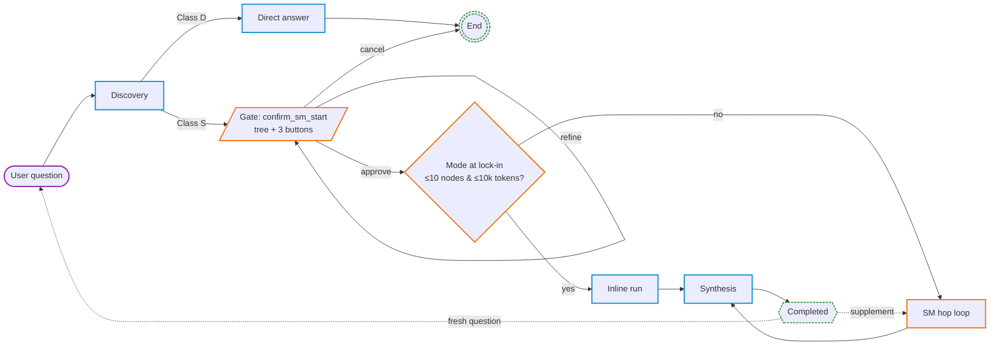
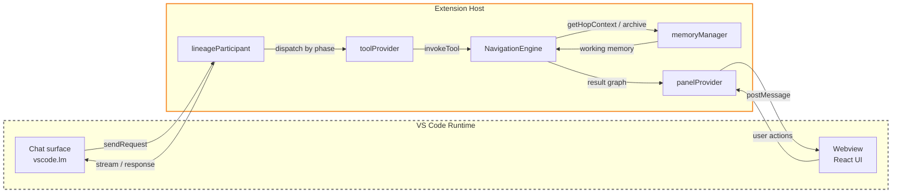
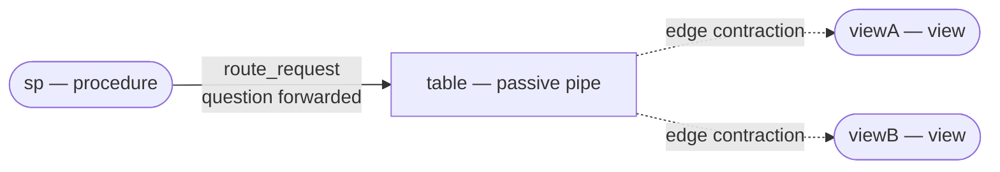
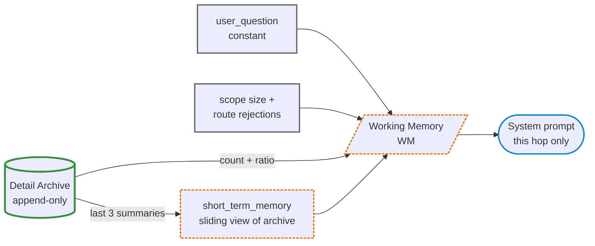
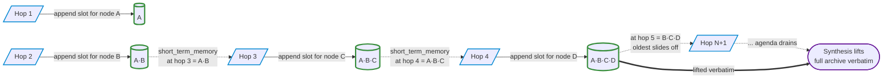
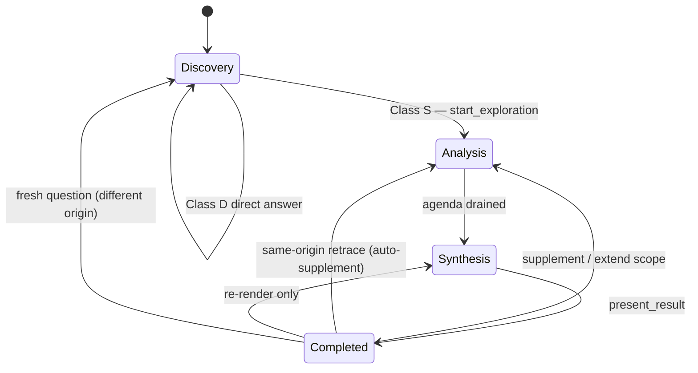
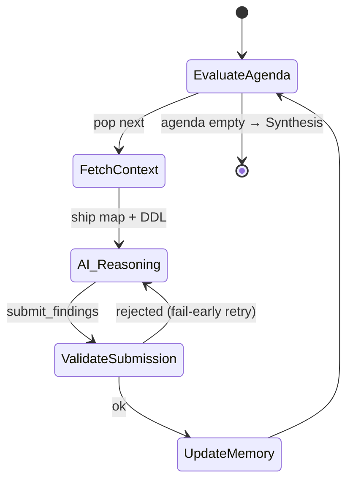

# Architecture

The `@lineage` participant uses a **Map & Router** pattern: the extension host owns topological authority and termination; the language model owns semantic per-node analysis. This document maps that contract to source files. For the YAML knobs that shape AI output, see [`AI_PROMPTS.md`](AI_PROMPTS.md). For build / ingestion / IPC reference, see [`DEVELOPER_GUIDE.md`](DEVELOPER_GUIDE.md).

## End-to-end journey

One turn of a `@lineage` question. The diagram encodes **ownership** (who terminates each step) by colour, **node role** (decision / gate / activity / terminator) by shape — UML activity-diagram conventions.

Legend (border colour only — interior follows light/dark theme): purple = user-driven · blue = AI-driven · orange = engine-driven · green dashed = terminator. Termination authority is therefore: AI in Discovery / Inline / Synthesis, Engine in SM hop loop and the consent gate.

| Phase | Owner | Behaviour |
|-------|-------|-----------|
| **Discovery** | AI | Searches the catalog and classifies the question. **Class D** = single object or graph-wide metadata, answered directly. **Class S** = relationships spanning ≥2 connected objects, hands off to the engine via `start_exploration`. |
| **Gate** | Engine | Emits `action_required: confirm_sm_start` for every Class-S exploration. Renders the BFS scope as a Schema → Type → Node tree with three buttons: **Approve & Proceed**, **Refine scope**, **Cancel**. Detail markdown is produced by `renderScopeSummaryMd()` in [`src/ai/scopeSummaryRenderer.ts`](../src/ai/scopeSummaryRenderer.ts) from the `ScopeSummary` snapshot returned by `engine.getScopeSummary()`. The participant always re-renders the gate detail when the session is `awaiting_gate` at finalizer time — even when the AI narrates without re-calling `start_exploration`. Mode (Inline / Sliding-Memory) is decided at lock-in based on the post-filter scope size + DDL cost (≤10 nodes ∧ ≤10k tokens → Inline) — refining can flip the mode. |
| **Refine loop** | AI + Engine | While the gate is pending, free-text user replies are routed to the AI as scope-refinement intent. The AI translates natural language ("ignore the staging schema", "drop views", "trace TotalRevenue") into a full re-spec on `lineage_start_exploration` — `excludeTypes` / `excludeSchemas` / `excludeNodeIds` / `passNodeIds` / `forceMode` / `classification` / `targetColumns`. Engine re-runs BFS, rebuilds the scope summary, and re-emits the gate. Loop until Approve or Cancel. |
| **Inline run** | AI | One-shot analysis collapsing Active capture and Synthesis into a single agent-loop turn. After gate approval the engine ships one unified brief (full DDL + verdict/sections/badge/routing/pruning + synthesis contract + synthesis-stage YAML keys); the AI calls `submit_findings` (batched), reads the `synthesis_reminder` from its tool_result, and calls `lineage_present_result` in the same turn. Self-terminates with `complete: true` on the final finding. |
| **SM hop loop** | Engine | Hop-by-hop drain of the agenda. Memory wipes each hop. AI's `complete: true` is silently ignored — the engine emits the synthesis trigger when the agenda is empty. |
| **Synthesis** | AI | Lifts the full Detail Archive and authors the final report via `present_result`. |
| **Completed** | User | Holds the result graph. Three convergent operations (no gate, no wipe): (1) edits/prunes via `present_result`; (2) `supplement` adds specific nodes inline; (3) same-origin retrace (e.g. new column on the same view) auto-routes to supplement — visited nodes re-queued, `targetColumns`/`mission_brief` updated, no archive reset. Different-origin `start_exploration` is the only divergent path (gate + archive wipe + Discovery return). |

## Component map

C4 Container view. Deployment boundaries as containers; modules inside; arrows are asymmetric calls (a typed contract crosses every arrow — either a Zod schema boundary or a VS Code API).

The webview never talks to the engine directly. **Map** (engine, deterministic) — agenda, visited set, neighbour metadata, consent gates, route / column validation. **Router** (AI, semantic) — read focus DDL, write `sections[]` (one entry per fired `*_capture` template — classification-locked: 1 for `business`/`technical`, 2 for `both`) + summary, emit verdict, issue `route_requests`. The two sides couple through exactly two calls: `getHopContext` downstream, `submit_findings` upstream.

| Module | File | Role |
|--------|------|------|
| Chat surface | `vscode.lm` / `ChatResponseStream` | VS Code chat API — `sendRequest`, tool results, stream writer |
| `lineageParticipant` | [`src/ai/lineageParticipant.ts`](../src/ai/lineageParticipant.ts) | Turn handler, phase dispatch, system-prompt assembly (`buildStageSystemPrompt`), gate finalizer (`dispatchExit`) |
| `toolProvider` | [`src/ai/toolProvider.ts`](../src/ai/toolProvider.ts) | Tool registration, Zod boundary, classification-locked `submit_findings` validation, scope-budget preflight |
| `toolPolicy` | [`src/ai/toolPolicy.ts`](../src/ai/toolPolicy.ts) | Phase × mode tool filter — single source of truth for which LM tools are exposed in discover / active-inline / active-SM / synthesis / completed |
| `NavigationEngine` | [`src/ai/smBase.ts`](../src/ai/smBase.ts) | Map owner — agenda, visited set, route validation, scope summary, deferred-question bucket |
| `scopeSummaryRenderer` | [`src/ai/scopeSummaryRenderer.ts`](../src/ai/scopeSummaryRenderer.ts) | Pure markdown renderer for the `confirm_sm_start` gate detail (Schema → Type → Node tree + active filters), driven by `ScopeSummary` from the engine |
| `templateRenderer` | [`src/ai/templateRenderer.ts`](../src/ai/templateRenderer.ts) | Two-stage gate on YAML keys: `STAGE_BY_KEY` (phase routing) then `CLASSIFICATION_GATED` (per-classification filter) |
| `prompts` / `smPrompts` | [`src/ai/prompts.ts`](../src/ai/prompts.ts), [`src/ai/smPrompts.ts`](../src/ai/smPrompts.ts) | Phase-specific prompt builders (`buildDiscoveryPrompt`, `buildActivePhasePrompt`, `buildSynthesisPrompt`, `buildModeBlock`, `buildMissionBriefBlock`, `buildCurrentTaskBlock`, `buildMemoryBlock`, `buildMissionStateBlock`) |
| `messageEnvelope` | [`src/ai/messageEnvelope.ts`](../src/ai/messageEnvelope.ts) | Owner of the chat-message array; enforces tool_use/tool_result pairing invariant; sliding-memory wipe via `wipeAndSeed` |
| `memoryManager` | [`src/ai/memoryManager.ts`](../src/ai/memoryManager.ts) | Detail archive + sliding working memory |
| `panelProvider` | [`src/panelProvider.ts`](../src/panelProvider.ts) | Webview bridge — Zod validation against [`src/engine/shared/bridgeContract.ts`](../src/engine/shared/bridgeContract.ts) |
| Webview | React UI | Graph rendering, filter UI, user actions |

## Bipartite analysis model

The engine treats the lineage graph as bipartite: only **bodied** nodes (views, procedures, functions with a body) carry logic the AI can analyse. Tables have structure but no body — they are pipes, not work.

- **Agenda** — bodied nodes only. Each hop analyses one body.
- **Scope** — every reachable node, including tables. Tables remain routable, referenceable, and inspectable via `get_neighbor_columns`.
- **Edge contraction** — when a bodied node routes to a table, the authored question flows *through* the table to the table's bodied neighbours.

Rounded boxes are bodied (agenda-eligible); the square box is the passive table. Dashed arrows are the contraction path — the AI never sees a "table hop". The invariant is enforced by a single funnel in [`src/ai/smBase.ts`](../src/ai/smBase.ts): `enqueueHop` is the only code path that writes to the agenda.

**Origin exception.** When the user starts a trace at a non-bodied node (typically a table), `enqueueHop` lifts the contraction *for the origin push only*: the starting point gets its own agenda slot and runs the standard `business_capture` / `technical_capture` templates. Middle-graph tables remain contracted.

## Tools per phase

[`src/ai/toolPolicy.ts`](../src/ai/toolPolicy.ts) is the single source of truth. Every ACTIVE-mode toolset has ≥ 2 tools (inline BB: `submit_findings + present_result`; SM BB/CT: `submit_findings + get_neighbor_columns`), so `toolMode.Required` always falls back to `Auto` per VS Code LM rules. The toolless-drift corrective in `lineageParticipant.runHopLoop` (gate on `engine.status === 'awaiting_findings'`) is what actually enforces the contract — for both inline and SM, with mode-specific corrective text.

| Tool | Discovery | ACTIVE inline BB | ACTIVE SM (BB+CT) | Synthesis | Completed | Purpose |
|------|:---------:|:----------------:|:-----------------:|:---------:|:---------:|---------|
| `get_context` | ✓ | — | — | — | — | Schemas, stats, active filter |
| `search_objects` | ✓ | — | — | — | ✓ | Resolve name / column → ID |
| `search_ddl` | ✓ | — | — | — | ✓ | Regex over SP / view / function bodies |
| `get_object_detail` | ✓ | — | — | — | ✓ | Full metadata + DDL + neighbours for one object |
| `get_neighbor_columns` | — | — | ✓ | — | — | Columns + types + FKs for direct neighbours (no DDL); used for prune decisions |
| `detect_graph_patterns` | ✓ | — | — | — | — | Hubs / orphans / cycles / islands / longest-path / external-refs |
| `start_exploration` | ✓ | — | — | — | ✓ (supplement) | Hand off to the state machine |
| `submit_findings` | — | ✓ | ✓ | — | — | Submit hop analysis + route + prune. Required mode. |
| `present_result` | — | ✓ | — | ✓ | ✓ | Author the final report (sections, summary, highlights). Inline BB exposes it in ACTIVE so the AI can call it back-to-back with `submit_findings` in the same turn (Active + Synthesis collapsed). |

## Class D / Class S routing contract

- **Class D — Direct.** One named object in isolation OR graph-wide metadata. Answered directly via chat using discovery tools. Never used to narrate "flow", "lineage", or "join path" across multiple neighbours.
- **Class S — State machine.** Analysis or visualisation of relationships spanning ≥ 2 connected objects. Routes to `start_exploration`. Any "lineage graph", "annotated trace", or "explain the joins / pipeline" request must use Class S.
- **Tiebreaker.** Prefer Class S when ambiguous.

## Inline vs SM execution

| Dimension | Inline mode | SM (sliding-memory) mode |
|-----------|-------------|--------------------------|
| **Trigger** | Scope ≤ `inlineNodeCap` AND ≤ `inlineTokenBudget`, no column tracing | Scope exceeds either threshold, or column tracing active |
| **Context** | Full DDL + columns for ALL scope nodes shipped at once | Focus DDL + sliding window of last 3 node summaries |
| **Brief delivery** | One unified brief at the active-phase start: verdict / sections / badge / routing / pruning / column-aspect (if any) **plus the full Synthesis Contract and synthesis-stage YAML keys**. AI calls `submit_findings` (batched) then `lineage_present_result` back-to-back inside the same agent loop — no second-turn synthesis prompt swap. | Per-hop SM brief: same verdict/sections/badge/routing/pruning every hop, focus DDL rotates. Synthesis contract ships at the synthesis-phase boundary after the agenda drains. |
| **Tools in ACTIVE** | `submit_findings` + `present_result` (both in the same stage) | `submit_findings` + `get_neighbor_columns` |
| **History** | Not wiped | Wiped every hop |
| **Termination** | AI sets `complete: true`; `submit_findings` tool_result carries the `synthesis_reminder` cue that orders the trailing `present_result` call | Engine drains agenda; `complete: true` silently ignored |
| **Mid-session out-of-scope route** | Engine emits `action_required` consent gate | Engine `deferQuestion(...)`; surfaced at synthesis |

True Inline runs Blackboard only; any session with a Column Aspect is forced to SM regardless of scope size. The synthesis contract for inline is **reused verbatim** from `buildSynthesisPrompt()` in [`src/ai/prompts.ts`](../src/ai/prompts.ts) — single source of truth, embedded inside `buildModeBlock(isInline=true)` in [`src/ai/smPrompts.ts`](../src/ai/smPrompts.ts). The synthesis-stage YAML keys (`summary`, `title`, `intro`, `closing`, `highlights`, `notes`) ride alongside the active-stage keys in the same brief; both go through the same `resolveStagePrompt` gate so classification + slot-count rules apply identically.

## Memory model

There is exactly **one** persistent store — the **Detail Archive** (`detailSlots`, append-only across the session). Each hop the prompt builder assembles fresh **Working Memory (WM)** by selectively projecting from the archive plus a few constants — there is no second mutable store and nothing is "wiped". Two diagrams: (1) what WM looks like and where each field comes from; (2) how the archive grows across hops and what the sliding window reads back.

**WM composition (one hop).** Cylinder = persistent datastore (UML); rounded box = projection / derived view; rectangle = constant.

The dashed orange WM boxes are not stored anywhere — they are computed on demand by `getWorkingMemory()` and `getShortTermMemory()`, then serialised into the prompt. The next hop rebuilds WM from the *now-larger* archive. This is what makes the loop bounded: WM stays small even as the archive grows.

**Archive growth across hops.** Each successful `submit_findings` appends one `DetailSlot` to the archive. The sliding window every hop reads is `archive.slice(-3)` — so as the archive grows, the *content* of `short_term_memory` slides forward.

The dotted reverse arrows are **reads back from the archive into the next hop's prompt**. The window stays at 3 entries — past hop 3 the oldest summary slides off. Only at synthesis does the *full* archive get lifted (double arrow), regardless of length.

**Detail Archive** — `AiMemoryManager.detailSlots`. Per-node sections (one entry per fired `*_capture` template, classification-locked: business → 1, technical → 1, both → 2), written via `submit_findings.sections[]`. Never compressed, never shipped mid-loop. Lifted verbatim as peer entries in `present_result.sections[]` once the agenda is drained — for SM that is the synthesis-phase turn; for inline that is the trailing `present_result` call in the same agent loop.

**WM fields.** Three accessors on `AiMemoryManager` produce the inputs the prompt builder needs each hop:

| Field | Source | Purpose |
|-------|--------|---------|
| `user_question` | constant (set at session start) | Root question echoed verbatim every hop so it survives the per-hop prompt rebuild. |
| `checklist` | `getWorkingMemory()` — derived from `detailSlots.size` and scope | `{ current_hop, noted, total, open, coveragePct, rounds_used, scope_growth }` — drain signal so the AI knows agenda progress. |
| `recent_rejections` | `getWorkingMemory()` | Recent route validation failures — feedback channel without re-injecting full errors. |
| `active_schemas` | `getWorkingMemory()` | Schema filter still in effect this hop. |
| `budget_pressure` | `getWorkingMemory()` (optional) | `'tight'` or `'exceeded'` — surfaced when the engine wants the AI to wind down. |
| `short_term_memory` | `getShortTermMemory()` — `detailSlots.values().slice(-3)` | Sliding window of the last three node summaries, injected as the `<short_term_memory>` XML block in the system prompt. **This is the "iteratively growing" view of the archive.** |
| `column_aspect` | column tracker (CT mode only) | `{ target_columns, active_columns, edges[] }` — present only when the session is tracing specific columns. `edges[]` accumulates validated `ColumnEdge` entries each hop; branch termination is structural (`role="source"`). |

None of these WM fields are stored — they are computed from the archive (or the constants) every hop. Global engine state (agenda, visited set, pending questions) is intentionally excluded from this payload; that's what keeps each hop's input bounded even on a long trace.

## The hop payload

`NavigationEngine.getHopContext()` returns one JSON object per hop, delivered as the tool result. It is self-contained — the AI does not need conversation history to reason about the current hop.

| Field | Purpose |
|-------|---------|
| `mode` | `'inline'` or `'sm'` — stamped once at `start_exploration` from the size+budget heuristic; never flips. |
| `sm_status` | `'awaiting_findings'` while draining — explicit "you are mid-loop" signal that survives sliding wipes |
| `hop` | 1-based hop number |
| `agenda_remaining` | Nodes still on the agenda |
| `focus_node` | `{id, schema, name, type, bb_ddl, cols, fks, unresolved_refs}` for the current node — single object in SM mode, array in inline (batch) mode |
| `neighbors[]` | Each entry: `{id, schema, name, type, edge_direction, edge_type, boundary, cols, depth_from_origin, in_budget, in_approved_scope, would_trigger_action_required}` |
| `current_task` | Sub-question driving *this* hop (set by `route_requests` from a prior hop, or the root question on hop 1) |
| `mission_brief` | AI-composed mission statement — set once at `start_exploration`, delivered verbatim every hop, survives sliding-memory wipes |
| `working_memory.user_question` | The user's original question, echoed verbatim every hop |
| `working_memory.short_term_memory` | Sliding window of the last 3 node summaries the AI authored |
| `working_memory.checklist` | Drain progress: `current_hop`, `noted`, `total`, `open`, `coveragePct`, `rounds_used`, `scope_growth` |
| `working_memory.recent_rejections` | Recent route-validation failures (capped at 5) |
| `working_memory.active_schemas` | Schemas currently on the session allowlist |
| `working_memory.topological_map` | `navigation_path` (origin → … → focus) and `current_focus` |
| `working_memory.approved_border` | (SM only) `{ schemas, depth_cap }` locked at `confirm_sm_start` |
| `working_memory.column_aspect` | (CT only) `{ target_columns, active_columns, edges[] }` |

## The system prompt builder

`buildStageSystemPrompt(phase)` in [`src/ai/lineageParticipant.ts`](../src/ai/lineageParticipant.ts) composes the prompt in two parts:

- **`buildStablePart(phase)`** is byte-stable across hops within a phase and is cached on `cachedStablePart`. It assembles, in order: `buildGeneralSystemPrompt` (role + platform + filter context + phase label) → the phase-specific block (`buildDiscoveryPrompt` / `buildActivePhasePrompt` / `buildSynthesisPrompt` / `buildFollowUpPrompt`) → in active phase only, `buildToolUsageBlock` + `buildModeBlock(BB|CT)` → `resolveStagePrompt` (the YAML-driven capture or render templates filtered by `STAGE_BY_KEY` and `CLASSIFICATION_GATED`) → `buildMissionBriefBlock` for active / synthesis / completed.
- **`buildDynamicPart(phase)`** is rebuilt each hop. In active SM mode it carries `buildCurrentTaskBlock`, `buildMemoryBlock` (`<short_term_memory>` + tally), and `buildMissionStateBlock` (the ACK/WAIT protocol envelope). Synthesis emits no dynamic suffix — the closed archive is the substance, and a stale `<current_task>` from the last hop must not leak into the synthesis prompt.

`invalidateStablePart()` is called when the participant flips phase (discover → active, active → synthesis), and the next prompt rebuilds the stable part once for the new phase. The mission brief and the YAML capture instructions live inside the stable part so the prefix stays cacheable across hops within a phase.

## Completion contract

| Mode | Trigger | What happens |
|------|---------|--------------|
| Inline | AI sets `complete: true` on `submit_findings` | Tool returns `{ ok: true, done: true, result }` with a `synthesis_reminder` cue; AI calls `present_result` back-to-back inside the same agent loop. |
| SM | Engine drains the agenda — every item gets `analyze`, `pass`, or `prune` | Engine emits the synthesis trigger; AI produces chat answer + `present_result`. `complete: true` is silently ignored. |
| MAX_ROUNDS cap | `ai.maxRounds` reached without completion | Partial archive discarded (`sess.memory.reset()`); actionable rerun message rendered. **All-or-nothing by design** — missing nodes can invert the picture. |

Three verdicts (SM mode):

- `analyze` — full analysis stored; drives badges and notes.
- `pass` — visited, no analysis stored. Intended for variant siblings of an already-analysed archetype.
- `prune` — cascade-prune the node + its unreachable downstream. Rejected by the orphan guard if it would disconnect an already-analysed node; fall back to `pass`.

The orphan guard (`wouldOrphanNotedNode`) is content-blind. Engine guards are topological only — content judgement lives in the AI and the prompts that frame it.

## Mechanical enforcement

The ACTIVE phase sets `vscode.LanguageModelChatToolMode.Required` on every `sendRequest`, but every ACTIVE-mode toolset has ≥ 2 tools (inline BB: `submit_findings + present_result`; SM BB/CT: `submit_findings + get_neighbor_columns`), so per VS Code LM rules `Required` always falls back to `Auto`. The contract is enforced in `lineageParticipant.runHopLoop` by a toolless-drift corrective: when the engine is `awaiting_findings` and the AI emits free-form text instead of a tool call, a mode-specific corrective user message is pushed onto the envelope and the loop continues. `MAX_ROUNDS` is the safety net for repeated drift.

- **Speed via verbs, not adjectives.** `verdict: "prune"` drains the agenda quickly → synthesis fires. No silent text bail.
- **ACTIVE tool palette by mode** — inline BB exposes `submit_findings + present_result` (Active + Synthesis collapsed into one agent loop); SM BB/CT exposes `submit_findings + get_neighbor_columns` (synthesis is a separate later turn after the agenda drains). Single source: [`src/ai/toolPolicy.ts`](../src/ai/toolPolicy.ts).
- **Repeat-Reject Guard** — [`src/ai/repeatRejectGuard.ts`](../src/ai/repeatRejectGuard.ts). Aborts the session cleanly if the same tool call fails three consecutive times. Surfaces via `HopLoopExit.aborted` with `{ error: 'session_aborted_repeat_reject' }`.
- **Termination authority** stays with the engine in SM. The engine emits the synthesis trigger after the last verdict; the AI never decides "we're done here" — `complete: true` is silently ignored in SM mode.
- **Classification gate at session lock-in.** `start_exploration` requires `classification` (`business` | `technical` | `both`); missing or invalid values are rejected at the Zod boundary — there is no engine fallback. The tool-param description in `package.json` biases the AI toward `business` for ambiguous intent (`technical` only for explicit perf/index/tuning asks; `both` only for explicit "both angles" requests). The locked value drives `CLASSIFICATION_GATED` in [`templateRenderer.ts`](../src/ai/templateRenderer.ts). Each `submit_findings` is mechanically validated against the locked classification at the tool handler boundary (`toolProvider.validateSectionsAgainstClassification`); a slot whose `sections[]` shape disagrees with the lock rejects with `classification_lock_violation`.
- **Two-stage template gate** — `STAGE_BY_KEY` (phase routing) and `CLASSIFICATION_GATED` (per-classification filter) in [`templateRenderer.ts`](../src/ai/templateRenderer.ts) decide which YAML keys ship per stage. `closing` carries an additional `slotCount >= 5` gate. No template body for an un-fired stage / classification ever reaches the model.
- **Identifier-match contract on capture.** `submit_findings` rejects with `focus_subject_mismatch` when any captured `section.text` opens by naming a different scope node than the declared `focus_node_id`. Mechanical scan of the first 200 chars; not a content-quality judgement.
- **Gate detail always rendered** — when the session is `awaiting_gate` at finalizer time, `dispatchExit` rebuilds the detail from `engine.getScopeSummary()` (rendered through `renderScopeSummaryMd`) if no `gate`-exit fired this turn. Refine narration ("I'll remove the views…") with no tool call still shows the current scope tree above the buttons.
- **Synthesis pre-tool prose is shape-bounded.** The streamer's prose-gate (in `lineageParticipant.handleChatRequest`) surfaces synthesis prose only after the first `tool_use` part is observed; pre-tool prose is suppressed because the rendered chat narrative comes after the `present_result` call. A `## ` heading-slice on synthesis prose strips the model's planning preamble ("Now I have all slots. Assembling the final report.") so it never welds onto the synthesised answer.

## Known failure modes

These are observed in production logs; the mitigations are real code paths, not hypothetical.

| Mode | Symptom | Mitigation |
|------|---------|------------|
| **Parallel `start_exploration` storm** | After a `complete_rejected`, the AI emits N parallel `start_exploration` calls (one per unvisited neighbour) and wipes the accumulated archive. | Hard guard in `toolProvider.ts`: rejects calls 2..N within one LM round with `{error:'parallel_call_forbidden', hint}`. Prose hints alone are not binding. |
| **DDL overflow** | One hop returns a 50K-char tool result (verbose log SP) and the next hop's input jumps from ~7K to ~17K tokens. | Full DDL is shipped per hop (no truncation, no refetch — simpler contract). On a > 500K-char mega-proc the provider's token limit surfaces naturally; the user prunes via `prune_neighbors` or refines the start scope. |
| **Synthesis on empty archive** | Final round receives the synthesis prompt but no archive slots — output is truncated with no `present_result`. | Detect empty-archive synthesis and emit a user-facing warning + re-run suggestion. |

## State diagram — navigation engine

Two zoom levels. The top-level FSM shows phase transitions; the Analysis loop is the only phase with non-trivial internal mechanics, so it gets its own focused view.

**Top-level phases.** Cross-phase transitions only — sub-states are documented in their respective sections above.

**Analysis hop loop.** Inside the Analysis phase, every hop runs this cycle until the agenda is empty.

Discovery sub-states (`ClassifyQuestion → ClassD | ClassS → SeedAgenda`) and Synthesis sub-states (`AggregateFindings → GenerateReport → PresentResult`) are linear and are documented inline in those phase descriptions. The Completed phase branches on the user's follow-up action — see the cross-phase transitions above.

## Session FSM & typed exit dispatch

`SessionPhase` ([`src/ai/sessionPhase.ts`](../src/ai/sessionPhase.ts)) is a typed discriminated union; every hop-loop exit is typed; one `dispatchExit` switch owns all post-loop cleanup. TypeScript exhaustiveness prevents "paused gate rendered as incomplete" regressions structurally.

| `HopLoopExit.kind` | Triggered by | Cleanup |
|--------------------|--------------|---------|
| `final_answer` | AI produced chat response with no tool calls (SM complete or discovery final) | `sess.enterIdle()` + optional "Show in Graph" button |
| `gate` | Tool result carried `action_required` envelope (Zod-validated) | `sess.enterGate(gate)` + stream consent question. No partial storage. |
| `hop_cap` | `MAX_ROUNDS` reached | `sess.memory.reset()` + `sess.enterIdle()` + actionable rerun notice |
| `aborted` | Repeat-reject guard | `storeBbResultPartial()` if slots exist + `sess.enterIdle()` |
| `error` | Uncaught exception | `sess.enterIdle()` + error message |

## Singleton session model

One `AiSession` per extension instance.

- **Cross-session guard** — each `start_exploration` stamps `engine.sessionId = sess.id`. A new call from a different session ID wipes the prior SM silently and queues a one-line notice. No blocking dialogs.
- **Same-session re-call is a hard error**, not a wipe. Returns `{ error: 'already_started', hint }`. **Exception — refine round:** while `phase === 'awaiting_gate'` with `gate === 'confirm_sm_start'`, a second `start_exploration` is a full re-spec; the engine is reused and `init()` re-runs with the merged filters. The `isRefining` predicate keys on session phase + gate (NOT `engine.status`, which flips to `awaiting_findings` at gate emission).
- **Auto-reset** after 30 min of inactivity (`STALE_AFTER_MS`) or immediately when the prior SM has reached `complete`.
- **Result-graph preservation** — when VS Code creates an empty-history thread and the session has a `resultGraph` ≤ 5 min old, the graph survives the reset so follow-up prompts like *"show the trace result in the graph"* still render.

## Scope-budget enforcement

Two complementary guards keep the loop inside the user's declared scope:

1. **Preflight gate** — at `start_exploration`, SM sessions whose initial BFS scope exceeds `ai.maxRounds × 0.7` are rejected with `scope_exceeds_budget`. The AI receives a `safe_depth_hint` and asks the user to narrow the question.
2. **Per-hop consent gate** — during ACTIVE, any route leaving the schema filter or exceeding the depth cap returns an `action_required` envelope. Inline mode pauses for yes/no; SM mode silently defers (deferred questions surface at synthesis).

## Glossary

| Term | Meaning |
|------|---------|
| **Map** | Deterministic state owned by `NavigationEngine`: agenda, visited set, neighbour metadata, gates. |
| **Router** | Semantic decisions made by the AI: sub-question, verdict, route requests, prune judgements. |
| **Class D** | Direct answer via discovery tools — one isolated object or graph-wide metadata. No "flow" narration. |
| **Class S** | State-machine exploration via `start_exploration` — anything spanning ≥ 2 connected objects. |
| **BB** (Blackboard) | Default nav mode. Used when no target columns are specified. |
| **CT** (Column Trace) | Nav mode activated when `targetColumns` are set. Every hop has the same `sections[].text` obligation as BB, plus the CT addition: `column_flow` — structured JSON declaring how each active column flows through the node. `column_flow` is mechanically enforced for every non-prune verdict; engine rejects with `column_flow_required` if omitted. Validated edges accumulate in `SmResult.columnAspect.edges[]`; a branch is terminal when its last edge carries `role="source"`. Synthesis receives a `buildCtSynthesisBlock` chain so `present_result` is anchored to the traced path. |
| **Inline mode** | One-shot execution for scopes within `inlineNodeCap` and `inlineTokenBudget`. AI may self-terminate. |
| **SM mode** | Hop-by-hop execution for larger scopes. Memory wiped each hop; engine owns termination. |
| **Bodied node** | View / procedure / function. Only these enter the agenda as hop focuses. |
| **Edge contraction** | Routing through a table forwards the question to the table's bodied neighbours. |
| **Detail Archive** | Per-node full `analysis` text, written each hop, shipped only at synthesis. |
| **Working Memory** (WM) | Per-hop snapshot the prompt builder assembles from the archive plus constants — `user_question`, `checklist`, `recent_rejections`, `active_schemas`, optional `budget_pressure`; `short_term_memory` (last 3 summaries) is a sibling sliding view from `getShortTermMemory()`. Not stored — recomputed every hop. |
| **`action_required`** | Engine envelope that emits a consent gate. Turn ends; user reply resumes or aborts. |
| **Deferred question** | In SM, an out-of-border route collected silently and surfaced at synthesis. |
