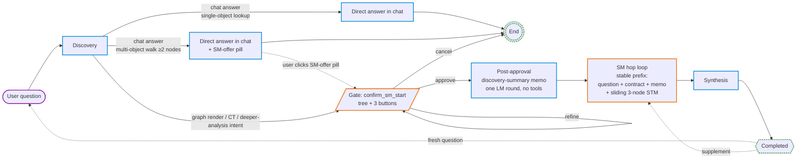
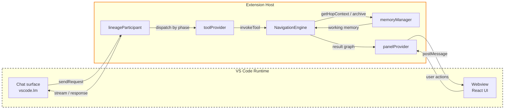
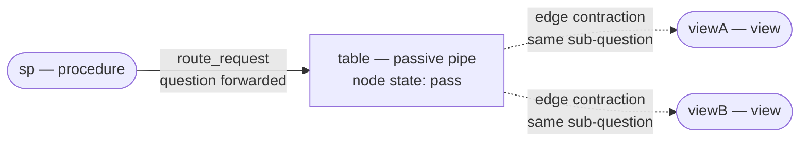
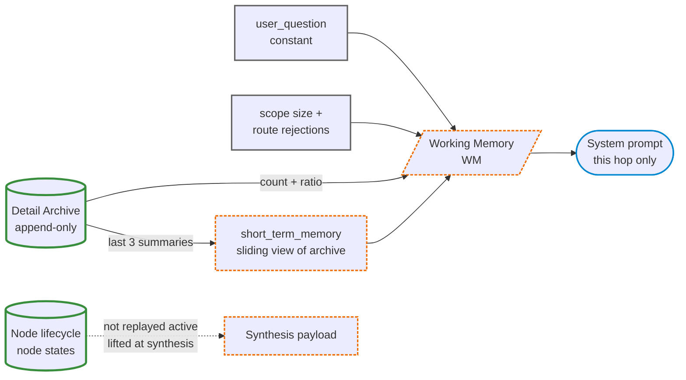
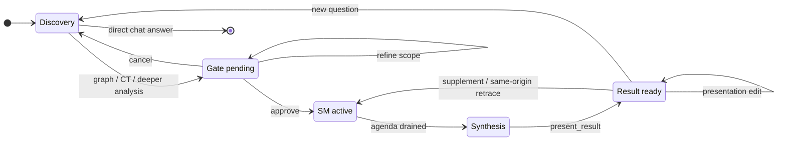

# Architecture

The `@lineage` participant uses a **Map & Router** pattern: the extension host owns topological authority and termination; the language model owns semantic per-node analysis. This document maps that contract to source files. For the YAML knobs that shape AI output, see [`AI_PROMPTS.md`](AI_PROMPTS.md). For build / ingestion / IPC reference, see [`DEVELOPER_GUIDE.md`](DEVELOPER_GUIDE.md).

## End-to-end journey

One turn of a `@lineage` question. The diagram encodes **ownership** (who terminates each step) by colour, **node role** (decision / gate / activity / terminator) by shape — UML activity-diagram conventions.

**Three user-driven paths into SM:** explicit graph-render request, column trace request, and the post-discovery SM-offer pill. The pill appears only after a sufficiently broad discovery walk and disappears as soon as a gate is pending.

**Post-approval discovery-summary memo.** Between gate approval and the first SM hop, the engine captures a short memo from the discovery turn and carries it into the SM prefix alongside `<mission_brief>`. It preserves the user intent that the gate fields alone do not express.

Legend (border colour only — interior follows light/dark theme): purple = user-driven · blue = AI-driven · orange = engine-driven · green dashed = terminator. Termination authority is therefore: AI in Discovery / Synthesis, Engine in SM hop loop and the consent gate.

| Phase | Owner | Behaviour |
|-------|-------|-----------|
| **Discovery** | AI | Default chat state. Single-object questions use `lineage_get_object_detail`; graph-scope questions use one bounded BFS retrieval via `lineage_get_scope_bundle` (optionally `include_ddl:true`). Escalates via `lineage_start_exploration` on explicit visual graph render, explicit column tracing, explicit post-discovery deeper-analysis intent, or `over_discovery_budget` from scope bundle retrieval. |
| **Gate** | Engine | Emits `action_required: confirm_sm_start` for every escalation. Renders the BFS scope as a Schema → Type → Node tree with three buttons: **Approve & Proceed**, **Refine scope**, **Cancel**. Detail markdown is produced by `renderScopeSummaryMd()` in [`src/ai/prompting/scopeSummaryRenderer.ts`](../src/ai/prompting/scopeSummaryRenderer.ts) from the `ScopeSummary` snapshot returned by `engine.getScopeSummary()`. The participant always re-renders the gate detail when the session is `awaiting_gate` at finalizer time — even when the AI narrates without re-calling `start_exploration`. |
| **Refine loop** | AI + Engine | While the gate is pending, free-text user replies are routed to the AI as scope-refinement intent. The AI translates natural language ("ignore the staging schema", "drop views", "trace TotalRevenue") into a full re-spec on `lineage_start_exploration` — `excludeTypes` / `excludeSchemas` / `excludeNodeIds` / `passNodeIds` / `classification` / `targetColumns`. Engine re-runs BFS, rebuilds the scope summary, and re-emits the gate. Loop until Approve or Cancel. |
| **SM hop loop** | Engine | Hop-by-hop drain of the agenda. Memory wipes each hop. AI's `complete: true` is silently ignored — the engine emits the synthesis trigger when the agenda is empty. |
| **Synthesis** | AI | Lifts the full Detail Archive and authors the final report via `present_result`. If `present_result` is attempted but fails validation, fallback copy reports validation failure (with reason), not "tool not invoked". |
| **Completed** | User | Holds the result graph. Three convergent operations: (1) edits/prunes via `present_result`; (2) `supplement` adds specific nodes via SM; (3) same-origin retrace (e.g. new column on the same view) auto-routes to supplement — visited nodes re-queued, `targetColumns`/`mission_brief` updated, no archive reset. Different-origin `start_exploration` is the only divergent path (gate + archive wipe + Discovery return). Completed turns use compact replay (minimal trailing tool pair + current rendered-result snapshot), not full broad history replay. |

Active-hop routing/pruning instruction ownership is single-source: `smPrompts.ts` (`Neighbor Decision Contract`). `prompts.ts` no longer duplicates route/prune policy text.

## Component map

C4 Container view. Deployment boundaries as containers; modules inside; arrows are asymmetric calls (a typed contract crosses every arrow — either a Zod schema boundary or a VS Code API).

The webview never talks to the engine directly. **Map** (engine, deterministic) owns agenda, visited set, gates, and validation. **Router** (AI, semantic) reads the current focus, writes findings, emits verdicts, and proposes next routes. The two sides couple through `getHopContext` downstream and `submit_findings` upstream.

| Module | File | Role |
|--------|------|------|
| Chat surface | `vscode.lm` / `ChatResponseStream` | VS Code chat API |
| `lineageParticipant` | [`src/ai/participant/lineageParticipant.ts`](../src/ai/participant/lineageParticipant.ts) | Turn handler and phase dispatch |
| `toolProvider` | [`src/ai/tools/toolProvider.ts`](../src/ai/tools/toolProvider.ts) | Tool registration and boundary validation |
| `NavigationEngine` | [`src/ai/sm/smBase.ts`](../src/ai/sm/smBase.ts) | Engine-owned map, agenda, and hop state |
| `prompts` / `smPrompts` | [`src/ai/prompting/prompts.ts`](../src/ai/prompting/prompts.ts), [`src/ai/prompting/smPrompts.ts`](../src/ai/prompting/smPrompts.ts) | Prompt composition |
| `memoryManager` | [`src/ai/session/memoryManager.ts`](../src/ai/session/memoryManager.ts) | Detail archive and working memory |
| `panelProvider` | [`src/panelProvider.ts`](../src/panelProvider.ts) | Webview bridge |
| Webview | React UI | Graph rendering and user actions |

## Bipartite analysis model

The engine treats the lineage graph as bipartite: bodied nodes carry analyzable logic, while tables act as routed connectors. The agenda follows bodied nodes, but tables can still be traversed and inspected.

Rounded boxes are bodied and therefore agenda-eligible; the square box is a table connector. The AI reasons over the routed question, not over an extra middle-table hop.

## Tools per phase

[`src/ai/tools/toolPolicy.ts`](../src/ai/tools/toolPolicy.ts) is the single source of truth. Active SM uses a narrow toolset, while discovery and synthesis expose broader catalog and presentation tools.

| Tool | Discovery | ACTIVE SM | Synthesis | Completed | Purpose |
|------|:---------:|:---------:|:---------:|:---------:|---------|
| `get_context` | ✓ | — | — | — | Current schema and filter context |
| `search_objects` | ✓ | — | — | ✓ | Resolve names to IDs |
| `get_scope_bundle` | ✓ | — | — | — | Bounded discovery walk |
| `get_object_detail` | ✓ | — | — | ✓ | One-object lookup |
| `get_neighbor_columns` | — | ✓ | — | — | Direct-neighbour column detail |
| `start_exploration` | ✓ | — | — | ✓ (supplement) | Hand off to SM |
| `submit_findings` | — | ✓ | — | — | Submit hop findings and route decisions |
| `present_result` | — | — | ✓ | ✓ | Build the final report |

## Discovery escalation contract

Discovery is the default chat state. It answers small questions directly and escalates to SM when the user explicitly asks for graph rendering, column tracing, or deeper hop-by-hop analysis. A discovery walk can also escalate when the scope exceeds budget.

## SM execution

There is one execution mode: SM, with optional column tracing (CT) when `targetColumns` is set. SM is gate-approved before the first hop runs, and the engine records only three lifecycle actions: `analyze`, `pass`, and `prune`.

CT keeps the same hop loop, but column flow becomes the main structured signal and pruning is engine-controlled. BB keeps the richer prune vocabulary.

SM is hop-by-hop and intentionally short-memory: each hop focuses on the current node and its neighbors, while synthesis receives the full archive only after the agenda drains. The synthesis prompt is assembled at the phase boundary, and completed turns can either refine the result or start a new trace.

| Dimension | SM |
|-----------|----|
| Trigger | Graph render, column trace, or deeper-analysis intent |
| Context | Current focus, neighbors, and a short summary window |
| Termination | Engine drains the agenda and emits synthesis |
| Mid-session out-of-scope | Deferred for follow-up instead of blocking the hop |

## Memory model

There is one persistent content store, the Detail Archive. Process state lives separately in `NavigationEngine.nodeStates`. Each hop rebuilds a compact Working Memory projection from the archive plus a few constants, so the active prompt stays bounded even as the archive grows.

**WM composition (one hop).** Cylinder = persistent store; rounded box = derived view; rectangle = constant.

The dashed orange WM boxes are computed on demand by `getWorkingMemory()` and `getShortTermMemory()`, then serialized into the prompt. The next hop rebuilds WM from the growing archive.

**ACTIVE isolation contract.** Active SM uses a short sliding-memory loop: broad chat-history replay is disabled, and each hop replays only the current task plus a minimal continuity tail.

**Final graph/detail text ownership.** `present_result.sections[]` is the authoritative final graph/detail link surface. Final labels, linked nodes, and captions are assembled at synthesis; they are not inferred from the archive.

**Node lifecycle and atomicity.** `NavigationEngine.nodeStates` records analyze/pass/prune outcomes, while `submit_findings` is all-or-nothing. A rejected hop does not partially mutate the archive or routing state.

**Working Memory fields.** The hop prompt carries the user question, progress checklist, recent rejections, active schemas, optional budget pressure, and a short-term memory window. CT adds column-aspect context when tracing columns. Everything is derived per hop rather than stored as a second mutable content store.

| WM field | Role |
|----------|------|
| `user_question` | Stable root question |
| `checklist` | Progress and coverage signal |
| `recent_rejections` | Short route-error memory |
| `active_schemas` | Current schema allowlist |
| `short_term_memory` | Last few node summaries |
| `column_aspect` | CT-only column chain context |

## The hop payload

`NavigationEngine.getHopContext()` returns one JSON object per hop. It is self-contained, so the AI can reason about the current hop without replaying the whole conversation.

| Field | Purpose |
|-------|---------|
| `mode` | `'sm'` — always SM; set once at `start_exploration`. |
| `sm_status` | `'awaiting_findings'` while draining — explicit "you are mid-loop" signal that survives sliding wipes |
| `hop` | 1-based hop number |
| `agenda_remaining` | Nodes still on the agenda (`hopProgress.open`) |
| `focus_node` | Current node under analysis |
| `neighbors[]` | Direct neighbors for routing and pruning decisions |
| `current_task` | Sub-question for this hop |
| `mission_brief` | Stable mission summary across the session |
| `working_memory` | Progress, short-term memory, and other hop-local context |

`node_states[]` is not part of the active hop prompt. It is emitted after submit and at synthesis so the final renderer can reason about lifecycle without inferring it from missing detail text.

## The system prompt builder

`buildStageSystemPrompt(phase)` in [`src/ai/participant/lineageParticipant.ts`](../src/ai/participant/lineageParticipant.ts) builds a stable phase prompt plus a small dynamic hop suffix. The stable part carries the phase protocol and mission brief; the dynamic part carries the current hop context.

## Completion contract

| Trigger | What happens |
|---------|--------------|
| Engine drains the agenda | Engine emits synthesis and AI produces `present_result` |
| `ai.maxRounds` reached | Partial archive is discarded and the user gets a rerun message |

The lifecycle actions stay simple: analyze stores detail, pass keeps topology without detail, and prune removes the node from the active answer path. CT narrows the traced column chain; BB keeps the richer prune workflow.

## Mechanical enforcement

The ACTIVE phase uses a strict tool loop with repetition guards, classification gating, and engine-owned termination. The important point is structural: the model can propose, but the engine decides when a hop is valid and when the session ends.

- Active SM uses a narrow tool palette.
- Repeat-reject protection stops the same failing call from looping forever.
- Classification is locked at exploration start and carried into synthesis.
- The engine owns the final transition to synthesis; `complete: true` is not authoritative.

## Known failure modes

These are the main observed failure modes: repeated `start_exploration` storms, oversized DDL payloads, empty-archive synthesis, and disconnected nodes after prune. The mitigations are real code paths, not hypothetical, but the overview only needs the names of the failure classes.

Typical mitigations are: guard repeated start calls, keep DDL payloads untrimmed but bounded by the provider, fail fast on empty archive synthesis, and enforce origin-closure after prune.

## State diagram — navigation engine

This diagram is intentionally overview-only. It shows phase ownership and the coarse routes between phases; detailed hop mechanics live in `NavigationEngine` code and JSDoc.

Discovery sub-states (`ClassifyQuestion → direct | escalation → SeedAgenda`) and Synthesis sub-states (`AggregateFindings → GenerateReport → PresentResult`) are linear and are documented inline in those phase descriptions. Inside `SM active`, the engine owns selection, lifecycle recording, and termination. The AI only reasons while the engine is awaiting a `submit_findings` call.

## Session FSM & typed exit dispatch

`SessionPhase` ([`src/ai/session/sessionPhase.ts`](../src/ai/session/sessionPhase.ts)) is a typed discriminated union; every hop-loop exit is typed; one `dispatchExit` switch owns all post-loop cleanup. TypeScript exhaustiveness prevents "paused gate rendered as incomplete" regressions structurally.

| `HopLoopExit.kind` | Triggered by | Cleanup |
|--------------------|--------------|---------|
| `final_answer` | AI produced chat response with no tool calls (SM complete or discovery final) | `sess.enterIdle()` + optional "Show in Graph" button |
| `gate` | Tool result carried `action_required` envelope (Zod-validated) | `sess.enterGate(gate)` + stream consent question. No partial storage. |
| `hop_cap` | `MAX_ROUNDS` reached | `sess.memory.reset()` + `sess.enterIdle()` + actionable rerun notice |
| `aborted` | Repeat-reject guard | `storeBbResultPartial()` if slots exist + `sess.enterIdle()` |
| `error` | Uncaught exception | `sess.enterIdle()` + error message |

## Singleton session model

One `AiSession` per extension instance.

- **Cross-session guard** — each `start_exploration` stamps `engine.sessionId = sess.id`. A new call from a different session ID wipes the prior SM silently and queues a one-line notice. No blocking dialogs.
- **Same-session re-call is a hard error**, not a wipe. Returns `{ error: 'already_started', hint }`. **Exception — refine round:** while `phase === 'awaiting_gate'` with `gate === 'confirm_sm_start'`, a second `start_exploration` is a full re-spec; the engine is reused and `init()` re-runs with the merged filters. The `isRefining` predicate keys on session phase + gate (NOT `engine.status`, which flips to `awaiting_findings` at gate emission).
- **Auto-reset** after 30 min of inactivity (`STALE_AFTER_MS`) or immediately when the prior SM has reached `complete`.
- **Result-graph preservation** — when VS Code creates an empty-history thread and the session has a `resultGraph` ≤ 5 min old, the graph survives the reset so follow-up prompts like *"show the trace result in the graph"* still render.

## Scope-budget enforcement

Two complementary guards keep the loop inside the user's declared scope:

1. **Preflight gate** — at `start_exploration`, SM sessions whose initial BFS scope exceeds `ai.maxRounds × 0.7` are rejected with `scope_exceeds_budget`. The AI receives a `safe_depth_hint` and asks the user to narrow the question.
2. **Per-hop deferral** — during ACTIVE, any route leaving the schema filter or exceeding the depth cap is silently deferred via `engine.deferQuestion(...)`. The deferred questions surface at synthesis (rendered as the "Unanswered" section) and to the user post-turn via the `dataLineageViz.showDeferredQuestions` button.

## Glossary

| Term | Meaning |
|------|---------|
| **Map** | Deterministic state owned by `NavigationEngine`: agenda, visited set, neighbour metadata, gates. |
| **Router** | Semantic decisions made by the AI: sub-question, verdict, route requests, prune judgements. |
| **Discovery** | Default chat state — AI uses catalog tools and answers in chat. Cannot render a graph or sustain large-BFS analysis; both require SM. |
| **SM (Sliding-Memory)** | Gate-approved hop-by-hop execution. Triggered by visual graph-render request, column tracing, or explicit deeper-analysis intent. Memory wiped each hop; engine owns termination. |
| **BB** (Blackboard) | Default SM analysis mode. Used when no target columns are specified. |
| **CT** (Column Trace) | SM analysis mode activated when `targetColumns` are set. Every hop has the same `sections[].text` obligation as BB, plus mandatory `column_flow` — structured JSON declaring how each active column flows through the node. `column_flow` is mechanically enforced for every CT finding; missing field is rejected at the tool boundary (`ct_field_required`). AI prune commands are disabled in CT (`ct_verdict_forbidden` / `bb_field_forbidden_in_ct`); non-contributors use `column_flow: []` and engine-side CT auto-prune records `node_states[].action="prune"`. Validated edges accumulate in `SmResult.columnAspect.edges[]`; a branch is terminal when its last edge carries `role="source"`. Synthesis receives a `buildCtSynthesisBlock` chain so `present_result` is anchored to the traced path, including terminal table sources that may have pass-state but no detail slot. |
| **Bodied node** | View / procedure / function. Only these enter the agenda as hop focuses. |
| **Edge contraction** | Routing through a table forwards the question to the table's bodied neighbours and records the table as lifecycle `pass`; it does not create a detail slot. |
| **Detail Archive** | Per-node full `analysis` text, written each hop, shipped only at synthesis. |
| **Node lifecycle state** | `node_states[]` records explicit process actions (`analyze`, `pass`, `prune`) and reasons. Synthesis uses it as evidence, but final labels still come only from `present_result.sections[]`. |
| **Working Memory** (WM) | Per-hop snapshot the prompt builder assembles from the archive plus constants — `user_question`, `checklist`, `recent_rejections`, `active_schemas`, optional `budget_pressure`; `short_term_memory` (last 3 summaries) is a sibling sliding view from `getShortTermMemory()`. Not stored — recomputed every hop. |
| **`action_required`** | Engine envelope that emits a consent gate. Turn ends; user reply resumes or aborts. |
| **Deferred question** | In SM, an out-of-border route collected silently and surfaced at synthesis. |
