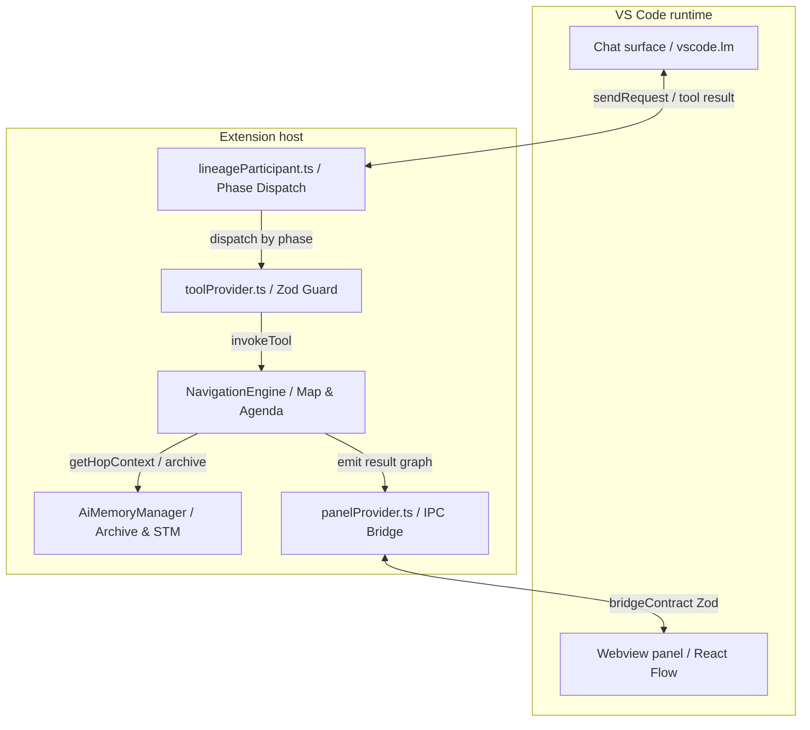
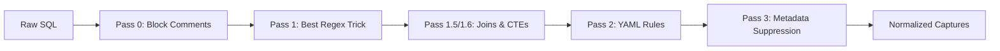

# System Architecture: "Grounded Router"

## 1. Overview & Core Philosophy
Data Lineage Viz implements an autonomous **Map & Router** architecture designed to bridge deterministic graph traversal with semantic AI reasoning. The system solves the primary challenge of automated lineage: maintaining 100% logical accuracy while navigating massive SQL schemas that exceed the token budgets and attention spans of modern Large Language Models (LLMs).

The architecture follows the **Orchestrator-Worker** pattern. The **Map (Orchestrator)** is a deterministic TypeScript engine that owns the topological authority and loop termination. The **Router (Worker)** is the Language Model which performs the semantic reasoning. By isolating reasoning to single-node "hops" and using a tiered memory model, the extension prevents the **"Lost in the Middle"** phenomenon and ensures that reasoning quality remains high regardless of total graph depth.

## 2. High-Level Component Map
The system separates topological authority (Extension Host) from semantic reasoning (Language Model).

### 2.1 Component Responsibilities
- **`lineageParticipant`**: The entry point for the `@lineage` participant. it manages the 4-phase lifecycle (Discovery, Active, Synthesis, Completed) and assembles the phase-scoped system prompts.
- **`NavigationEngine`**: The core state machine. It owns the Breadth-First Search (BFS) agenda, the visited set, and the topological map. It validates all AI-requested routes against the actual database catalog to prevent hallucinations.
- **`AiMemoryManager`**: Manages the asymmetric tiering model. It provides sliding short-term memory (STM) to the AI during the loop and persists the monotonic Detail Archive for final synthesis.
- **`toolProvider`**: Registers the AI tools and enforces phase-based availability policies. Every tool input is strictly validated via Zod schemas.
- **`panelProvider`**: Manages the React Webview lifecycle and the Zod-validated IPC bridge.

## 3. The Four Lifecycle Phases

The exploration engine orchestrates autonomous reasoning using a unified state machine with distinct termination authorities.

### 3.1 Phase 1: Discovery (Wide Context)
The AI identifies user intent and maps the initial scope.
- **Class D (Direct)**: Isolation only. Handles metadata lookups (e.g., "Show me the columns for table X"). Turn ends immediately with a chat answer.
- **Class S (State Machine)**: Relationship-driven. Handles traces and logic analysis (e.g., "Trace lineage from X to Y"). Triggers the `start_exploration` tool.
- **Consent Gate**: Discovery is content-blind. After scope is built and inline-vs-SM mode is decided, the engine pauses and emits a `confirm_sm_start` gate for **every** exploration — the user reviews scope (nodes, schemas, excluded types, mode) before any analysis runs. Mode is locked at approval; refining the scope returns to discovery and rebuilds from scratch.

### 3.2 Phase 2: Active Loop (Narrow Context)
The engine drains the BFS agenda using a Reasoning + Acting (ReAct) cycle. 
- **True Inline Mode**: For small graphs (< 10 nodes), the AI receives the entire scope batch-delivered for one-shot reasoning.
- **Sliding Memory Mode**: For deep traces, the AI analyzes one node per turn. The engine aggressively wipes chat history between hops to preserve the token budget for the current focus node's DDL.

### 3.3 Phase 3: Holistic Synthesis (Wide Context)
Once the agenda is empty, the AI regains access to the full, unbounded **Detail Archive**.
- **Process**: The AI reads all collected evidence → answers the original question in 1–2 sentences → groups findings by data-flow role → writes the final `present_result` payload.
- **Output**: The synthesis result triggers an `ai-view-activate` IPC message to the webview, which renders the enriched, annotated lineage graph.

### 3.4 Phase 4: Follow-Up (Completed)
The session persists on a singleton, allowing for refinement without re-running the trace.
- **Supplement Mode**: Chip-based actions (e.g., "Add schema X") re-enter the state machine with an extended border. The archive is preserved, and the hop loop resumes only for the new nodes.
- **Re-render Mode**: Label or description edits re-invoke the Synthesis phase against the existing archive.

## 4. AI Architecture Pillars

### 4.1 Bipartite Analysis Model (Edge Contraction)
The engine treats the SQL graph as a **bipartite work graph**, distinguishing between logic-bearing nodes and passive data pipes.

- **Bodied Nodes (Work)**: Procedures, Views, and Functions carry SQL logic. These are the only nodes eligible for the exploration agenda.
- **Passive Nodes (Pipes)**: Tables carry no logic. When a path hits a table, the engine performs **edge contraction**, forwarding the AI's question verbatim to the table's bodied neighbors. This prevents "invented prose" for passive objects.
- **The Origin Exception**: If the user explicitly starts a trace *at* a table, contraction is lifted for that node so the user gets a dedicated analysis of their starting point.

### 4.2 Asymmetric Memory Tiering
To maintain reasoning quality across deep traversals, the system implements a tiered memory strategy:

| Tier | Payload | Delivery | Purpose |
| :--- | :--- | :--- | :--- |
| **Short-Term Memory (STM)** | Last 3 node summaries | Every Hop | Provides local topological context (e.g., "Parent proc X passed us column Y"). |
| **Detail Archive** | Full technical analysis | **Synthesis Only** | The "Blackboard". High-fidelity evidence stored monotonically but hidden until synthesis. |

### 4.3 Mechanical Blinkers (Protocol Enforcement)
During the ACTIVE phase, the AI is mechanically blocked from emitting free-form prose via `vscode.LanguageModelChatToolMode.Required`. 
- **Termination Authority**: The engine owns the loop. It ignores any "complete: true" signals from the AI in Sliding Memory mode until the agenda is physically empty. This ensures the AI node-by-node drains the budget rather than self-terminating prematurely.

## 5. Data Ingestion & SQL Parsing

### 5.1 Dual Strategy Ingestion
Metadata is normalized into a shared `DatabaseModel`Regardless of the source:
1. **DACPAC Extraction**: Streams XML from SQL Server Data-Tier Application packages (`.dacpac`). ZIP/XML extraction ensures offline accuracy.
2. **DMV Extraction**: Executes a two-phase SQL load (Catalog → Deep-Dive) defined in `assets/dmvQueries.yaml`.

### 5.2 Regex Parsing Pipeline
Stored procedures are parsed using a high-performance, multi-pass regex engine (`src/engine/sqlBodyParser.ts`) to handle dependencies without the overhead of a full SQL AST.

- **Pass 1 (The Best Regex Trick)**: A single leftmost-match pass that neutralizes string literals and line comments, protecting quoted identifiers (`[...]`) from false positives.
- **Pass 3 (Suppression)**: Filters out CLR methods (e.g., `.nodes()`, `.value()`) that are not catalog objects unless bracket-quoted.

## 6. Safety Guards & Stability

- **Repeat-Reject Guard**: An idempotency counter that aborts the session if the AI repeats the same failing tool call three times consecutively.
- **Orphan Guard**: Prevents the AI from pruning branches that would disconnect already-analyzed nodes from the origin.
- **Zod Boundaries**: 100% of tool inputs and IPC messages (Extension ↔ Webview) are strictly validated via Zod schemas in `bridgeContract.ts`.

## 7. Implementation Reference
- `src/ai/smBase.ts`: Core state machine implementation and bipartite agenda management.
- `src/engine/sqlBodyParser.ts`: SQL cleansing and regex extraction pipeline.
- `src/ai/memoryManager.ts`: Tiered memory management and archive persistence.
- `src/ai/lineageParticipant.ts`: Phase management and prompt builder hierarchy.
- [Microsoft SQL Server DMV Reference](https://learn.microsoft.com/sql/relational-databases/system-dynamic-management-views/sys-dm-db-stats-properties-transact-sql)
