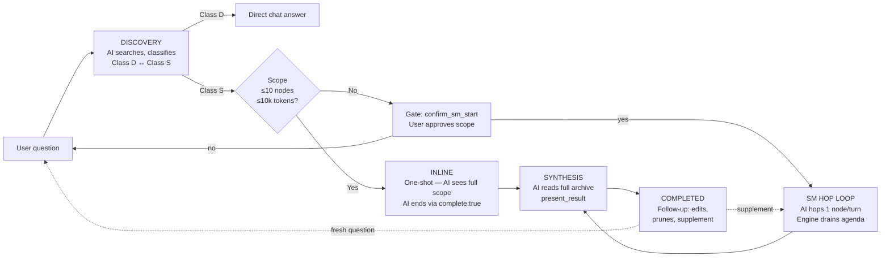
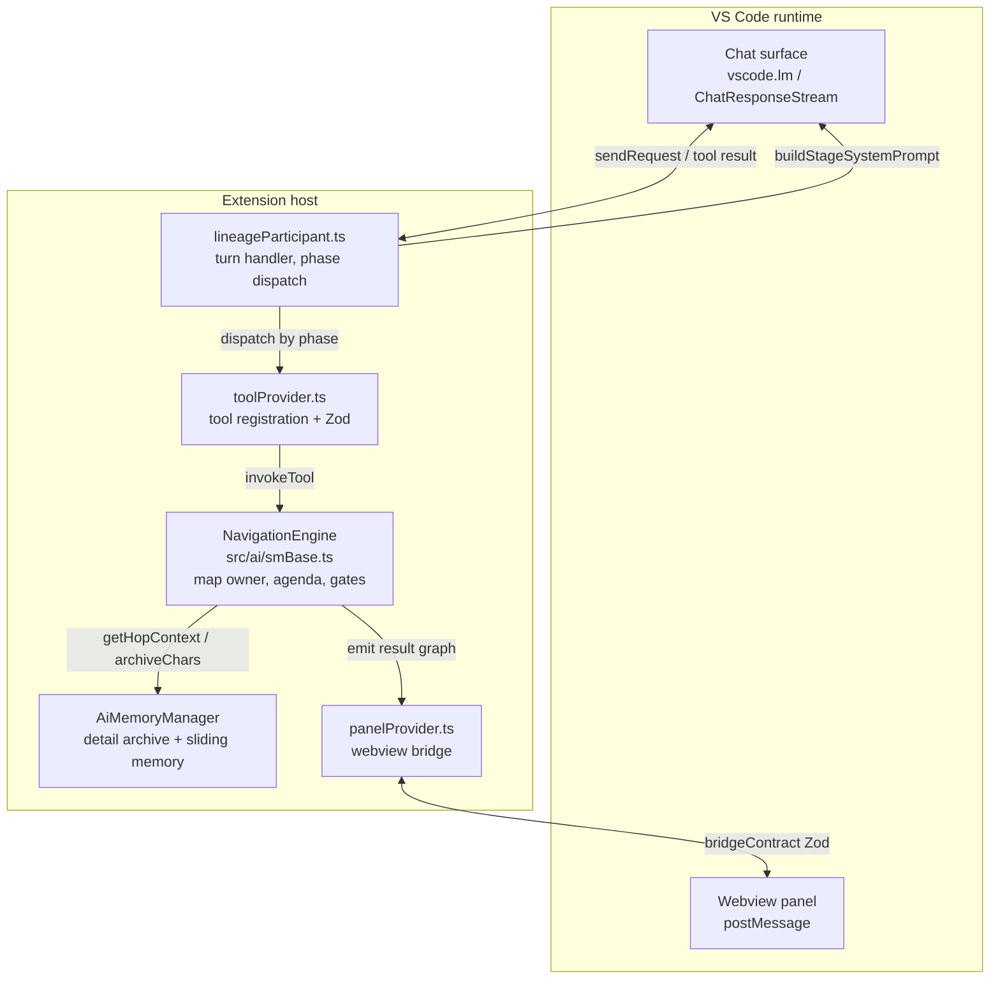
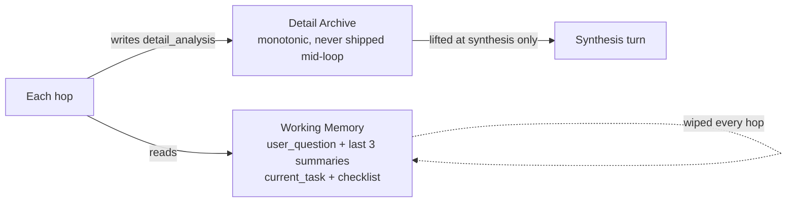
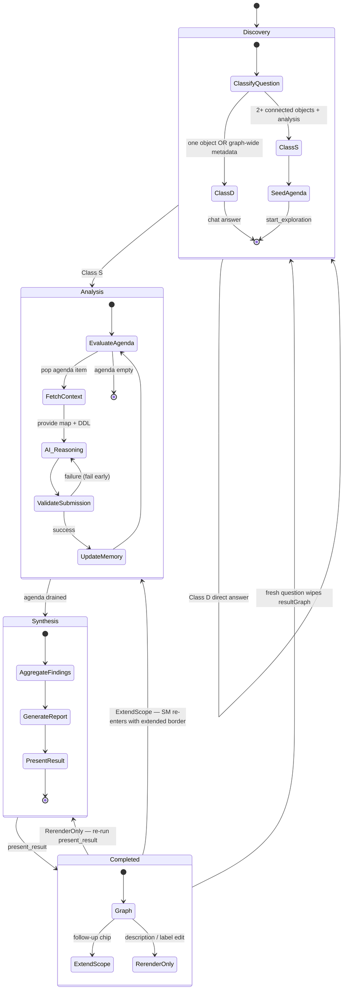

# Architecture

The `@lineage` participant uses a **Map & Router** pattern: the extension host owns topological authority and termination; the language model owns semantic per-node analysis. This document maps that contract to source files. For the YAML knobs that shape AI output, see [`AI_PROMPTS.md`](AI_PROMPTS.md). For build / ingestion / IPC reference, see [`DEVELOPER_GUIDE.md`](DEVELOPER_GUIDE.md).

## End-to-end journey

One turn of a `@lineage` question. Termination authority differs per phase — **AI** in Discovery, **AI** in Inline, **Engine** in SM, **AI** in Synthesis.

## Component map

Five modules own the AI participant surface. Each arrow is a typed contract — crossing it means crossing a Zod boundary or a VS Code API.

The webview never talks to the engine directly. **Map** (engine, deterministic) — agenda, visited set, neighbour metadata, consent gates, route / column validation. **Router** (AI, semantic) — read focus DDL, write `detail_analysis` + summary, emit verdict, issue `route_requests`. The two sides couple through exactly two calls: `getHopContext` downstream, `submit_findings` upstream.

## Bipartite analysis model

The engine treats the lineage graph as bipartite: only **bodied** nodes (views, procedures, functions with a body) carry logic the AI can analyse. Tables have structure but no body — they are pipes, not work.

- **Agenda** — bodied nodes only. Each hop analyses one body.
- **Scope** — every reachable node, including tables. Tables remain routable, referenceable, and inspectable via `get_neighbor_columns`.
- **Edge contraction** — when a bodied node routes to a table, the authored question flows *through* the table to the table's bodied neighbours.

Rounded boxes are bodied (agenda-eligible); the square box is the passive table. Dashed arrows are the contraction path — the AI never sees a "table hop". The invariant is enforced by a single funnel in [`src/ai/smBase.ts`](../src/ai/smBase.ts): `enqueueHop` is the only code path that writes to the agenda.

**Origin exception.** When the user starts a trace at a non-bodied node (typically a table), `enqueueHop` lifts the contraction *for the origin push only*: the starting point gets its own agenda slot and runs the standard `business_capture` / `technical_capture` templates. Middle-graph tables remain contracted.

## Tools per phase

[`src/ai/toolPolicy.ts`](../src/ai/toolPolicy.ts) is the single source of truth. The narrow ACTIVE palette is what keeps `toolMode.Required` effective: providers may downgrade `Required` to `Auto` when more than one tool is visible.

| Tool | Discovery | ACTIVE inline BB | ACTIVE SM (BB+CT) | Synthesis | Completed | Purpose |
|------|:---------:|:----------------:|:-----------------:|:---------:|:---------:|---------|
| `get_context` | ✓ | — | — | ✓ | — | Schemas, stats, active filter |
| `search_objects` | ✓ | — | — | ✓ | ✓ | Resolve name / column → ID |
| `search_ddl` | ✓ | — | — | ✓ | ✓ | Regex over SP / view / function bodies |
| `get_object_detail` | ✓ | — | — | ✓ | ✓ | Full metadata + DDL + neighbours for one object |
| `get_neighbor_columns` | — | — | ✓ | — | — | Columns + types + FKs for direct neighbours (no DDL); used for prune decisions |
| `detect_graph_patterns` | ✓ | — | — | ✓ | — | Hubs / orphans / cycles / islands / longest-path / external-refs |
| `start_exploration` | ✓ | — | — | — | ✓ (supplement) | Hand off to the state machine |
| `submit_findings` | — | ✓ | ✓ | — | — | Submit hop analysis + route + prune. Required mode. |
| `present_result` | — | — | — | ✓ | ✓ | Author the final report (sections, summary, highlights) |

## Class D / Class S routing contract

- **Class D — Direct.** One named object in isolation OR graph-wide metadata. Answered directly via chat using discovery tools. Never used to narrate "flow", "lineage", or "join path" across multiple neighbours.
- **Class S — State machine.** Analysis or visualisation of relationships spanning ≥ 2 connected objects. Routes to `start_exploration`. Any "lineage graph", "annotated trace", or "explain the joins / pipeline" request must use Class S.
- **Tiebreaker.** Prefer Class S when ambiguous.

## Inline vs SM execution

| Dimension | Inline mode | SM (sliding-memory) mode |
|-----------|-------------|--------------------------|
| **Trigger** | Scope ≤ `inlineNodeCap` AND ≤ `inlineTokenBudget`, no column tracing | Scope exceeds either threshold, or column tracing active |
| **Context** | Full DDL + columns for ALL scope nodes shipped at once | Focus DDL + sliding window of last 3 node summaries |
| **History** | Not wiped | Wiped every hop |
| **Termination** | AI sets `complete: true` | Engine drains agenda; `complete: true` silently ignored |
| **Mid-session out-of-scope route** | Engine emits `action_required` consent gate | Engine `deferQuestion(...)`; surfaced at synthesis |

True Inline runs Blackboard only; any session with a Column Aspect is forced to SM regardless of scope size.

## Memory model

- **Detail Archive** — `AiMemoryManager.detailSlots`. Full technical `analysis` per node, written via `submit_findings.detail_analysis`. Never compressed, never shipped mid-loop. Lifted at synthesis only.
- **Working memory** — `AiMemoryManager.getWorkingMemory`, per-hop isolated snapshot:
  - `user_question` — echoed verbatim so the root question survives sliding wipes.
  - `column_aspect` — present in CT mode (`target_columns`, `done_columns`, `active_columns`).
  - `short_term_memory: Array<{nodeId, summary}>` — sliding window of the last 3 node summaries, rendered as a `<short_term_memory>` XML block inside the system prompt.
  - `checklist: {current_hop, noted, total, open, coveragePct}` — drain signal.

Global state (agenda, visited, pending questions) is intentionally excluded from the payload — that's what keeps each hop's input bounded even on long traces.

## The hop payload

`NavigationEngine.getHopContext()` returns one JSON object per hop, delivered as the tool result. It is self-contained — the AI does not need conversation history to reason about the current hop.

| Field | Purpose |
|-------|---------|
| `sm_status` | `'awaiting_findings'` while draining — explicit "you are mid-loop" signal that survives sliding wipes |
| `hop` | 1-based hop number |
| `agenda_remaining` | Nodes still on the agenda |
| `focus_node` | `{id, schema, name, type, ddl, columns, fks}` for the current node |
| `neighbors[]` | Each entry: `{id, schema, name, type, edge_direction, edge_type, boundary, cols, fks, hasDdl}` |
| `current_task` | Sub-question driving *this* hop (set by `route_requests` from a prior hop, or the root question on hop 1) |
| `working_memory.user_question` | Original user question, verbatim every hop |
| `working_memory.short_term_memory` | Sliding window of the last 3 node summaries |
| `working_memory.checklist` | Drain progress |
| `working_memory.topological_map` | `{navigation_path, current_focus}` — deterministic structural grounding |

## Completion contract

| Mode | Trigger | What happens |
|------|---------|--------------|
| Inline | AI sets `complete: true` on `submit_findings` | Tool returns `{ ok: true, done: true, result }`; AI produces chat answer + `present_result` |
| SM | Engine drains the agenda — every item gets `analyze`, `pass`, or `prune` | Engine emits the synthesis trigger; AI produces chat answer + `present_result`. `complete: true` is silently ignored. |
| MAX_ROUNDS cap | `ai.maxRounds` reached without completion | Partial archive discarded (`sess.memory.reset()`); actionable rerun message rendered. **All-or-nothing by design** — missing nodes can invert the picture. |

Three verdicts (SM mode):

- `analyze` — full analysis stored; drives badges and notes.
- `pass` — visited, no analysis stored. Intended for variant siblings of an already-analysed archetype.
- `prune` — cascade-prune the node + its unreachable downstream. Rejected by the orphan guard if it would disconnect an already-analysed node; fall back to `pass`.

The orphan guard (`wouldOrphanNotedNode`) is content-blind. Engine guards are topological only — content judgement lives in the AI and the prompts that frame it.

## Mechanical enforcement

The ACTIVE phase sets `vscode.LanguageModelChatToolMode.Required` on every `sendRequest`. The AI cannot emit free-form text during the hop loop — it must call `submit_findings`.

- **Speed via verbs, not adjectives.** `verdict: "prune"` drains the agenda quickly → synthesis fires. No silent text bail.
- **ACTIVE tool palette is narrow** — `submit_findings` only in inline BB; `+ get_neighbor_columns` in SM. Multi-tool would force `Required` to downgrade to `Auto` on some providers.
- **Repeat-Reject Guard** — [`src/ai/repeatRejectGuard.ts`](../src/ai/repeatRejectGuard.ts). Aborts the session cleanly if the same tool call fails three consecutive times. Surfaces via `HopLoopExit.aborted` with `{ error: 'session_aborted_repeat_reject' }`.
- **Termination authority** stays with the engine in SM. The engine emits the synthesis trigger after the last verdict; the AI never decides "we're done here".

## Known failure modes

These are observed in production logs; the mitigations are real code paths, not hypothetical.

| Mode | Symptom | Mitigation |
|------|---------|------------|
| **Parallel `start_exploration` storm** | After a `complete_rejected`, the AI emits N parallel `start_exploration` calls (one per unvisited neighbour) and wipes the accumulated archive. | Hard guard in `toolProvider.ts`: rejects calls 2..N within one LM round with `{error:'parallel_call_forbidden', hint}`. Prose hints alone are not binding. |
| **DDL overflow** | One hop returns a 50K-char tool result (verbose log SP) and the next hop's input jumps from ~7K to ~17K tokens. | Full DDL is shipped per hop (no truncation, no refetch — simpler contract). On a > 500K-char mega-proc the provider's token limit surfaces naturally; the user prunes via `prune_neighbors` or refines the start scope. |
| **Synthesis on empty archive** | Final round receives the synthesis prompt but no archive slots — output is truncated with no `present_result`. | Detect empty-archive synthesis and emit a user-facing warning + re-run suggestion. |

## State diagram — navigation engine

## Session FSM & typed exit dispatch

`SessionPhase` ([`src/ai/sessionPhase.ts`](../src/ai/sessionPhase.ts)) is a typed discriminated union; every hop-loop exit is typed; one `dispatchExit` switch owns all post-loop cleanup. TypeScript exhaustiveness prevents "paused gate rendered as incomplete" regressions structurally.

| `HopLoopExit.kind` | Triggered by | Cleanup |
|--------------------|--------------|---------|
| `final_answer` | AI produced chat response with no tool calls (SM complete or discovery final) | `sess.enterIdle()` + optional "Show in Graph" button |
| `gate` | Tool result carried `action_required` envelope (Zod-validated) | `sess.enterGate(gate)` + stream consent question. No partial storage. |
| `hop_cap` | `MAX_ROUNDS` reached | `sess.memory.reset()` + `sess.enterIdle()` + actionable rerun notice |
| `aborted` | Repeat-reject guard | `storeBbResultPartial()` if slots exist + `sess.enterIdle()` |
| `error` | Uncaught exception | `sess.enterIdle()` + error message |

## Singleton session model

One `AiSession` per extension instance.

- **Cross-session guard** — each `start_exploration` stamps `engine.sessionId = sess.id`. A new call from a different session ID wipes the prior SM silently and queues a one-line notice. No blocking dialogs.
- **Same-session re-call is a hard error**, not a wipe. Returns `{ error: 'already_started', hint }`.
- **Auto-reset** after 30 min of inactivity (`STALE_AFTER_MS`) or immediately when the prior SM has reached `complete`.
- **Result-graph preservation** — when VS Code creates an empty-history thread and the session has a `resultGraph` ≤ 5 min old, the graph survives the reset so follow-up prompts like *"show the trace result in the graph"* still render.

## Scope-budget enforcement

Two complementary guards keep the loop inside the user's declared scope:

1. **Preflight gate** — at `start_exploration`, SM sessions whose initial BFS scope exceeds `ai.maxRounds × 0.7` are rejected with `scope_exceeds_budget`. The AI receives a `safe_depth_hint` and asks the user to narrow the question.
2. **Per-hop consent gate** — during ACTIVE, any route leaving the schema filter or exceeding the depth cap returns an `action_required` envelope. Inline mode pauses for yes/no; SM mode silently defers (deferred questions surface at synthesis).

## Glossary

| Term | Meaning |
|------|---------|
| **Map** | Deterministic state owned by `NavigationEngine`: agenda, visited set, neighbour metadata, gates. |
| **Router** | Semantic decisions made by the AI: sub-question, verdict, route requests, prune judgements. |
| **Class D** | Direct answer via discovery tools — one isolated object or graph-wide metadata. No "flow" narration. |
| **Class S** | State-machine exploration via `start_exploration` — anything spanning ≥ 2 connected objects. |
| **BB** (Blackboard) | Default nav mode. Used when no target columns are specified. |
| **CT** (Column Trace) | Nav mode activated when `targetColumns` are set. Adds column validation + `column_flow` attribution. |
| **Inline mode** | One-shot execution for scopes within `inlineNodeCap` and `inlineTokenBudget`. AI may self-terminate. |
| **SM mode** | Hop-by-hop execution for larger scopes. Memory wiped each hop; engine owns termination. |
| **Bodied node** | View / procedure / function. Only these enter the agenda as hop focuses. |
| **Edge contraction** | Routing through a table forwards the question to the table's bodied neighbours. |
| **Detail Archive** | Per-node full `analysis` text, written each hop, shipped only at synthesis. |
| **Working memory** | Per-hop snapshot — `user_question`, `<short_term_memory>`, `current_task`, `checklist`. |
| **`action_required`** | Engine envelope that emits a consent gate. Turn ends; user reply resumes or aborts. |
| **Deferred question** | In SM, an out-of-border route collected silently and surfaced at synthesis. |
