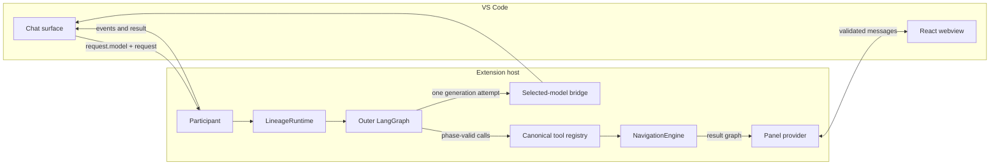
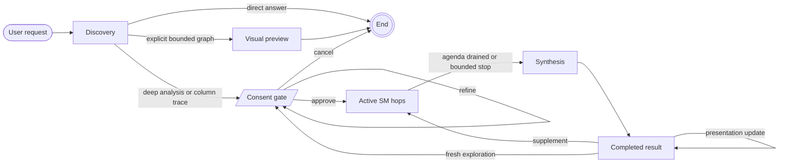

# Architecture

The extension separates semantic reasoning from deterministic process state.
`@lineage` uses an outer LangGraph for phase control and a Map & Router model
for exploration: the selected language model proposes semantic actions, while
`NavigationEngine` owns topology, validation, mutation, and termination.

For build, ingestion, and host/webview details, see
[`DEVELOPER_GUIDE.md`](DEVELOPER_GUIDE.md). For prompt and template behavior,
see [`AI_PROMPTS.md`](AI_PROMPTS.md).

## Architectural boundaries

- `@lineage` is the only AI surface. Every request uses exactly
  `ChatRequest.model`; the extension has no provider, endpoint, credential,
  model-picker, or fallback configuration.
- AI code operates on the loaded lineage snapshot. It cannot connect to a
  database, execute SQL, refresh ingestion, start DMV extraction, or start
  profiling.
- The participant is a native VS Code adapter for requests, history,
  cancellation, progress, gates, and result metadata. It does not own the
  exploration loop.
- The outer graph owns phase transitions, model generations, semantic retries,
  interrupts, synthesis, and turn settlement.
- `NavigationEngine` owns agenda, scope, lifecycle state, route/prune checks,
  graph closure, and completion.
- Model tools pass through the local canonical registry, phase policy, and
  strict Zod dispatcher. Production does not route its own calls through
  `vscode.lm.invokeTool`.
- Extension-host/webview messages cross the Zod schemas in
  [`src/engine/shared/bridgeContract.ts`](../src/engine/shared/bridgeContract.ts)
  before handlers consume them.

Evaluated and rejected alternatives (2026-08 AI SQL documentation review; do
not re-open without new evidence):

- No generic wiki/documentation-platform replacement for the SQL walk.
- No Deep Agents or recursive subagents for the normal per-hop exploration,
  including LangChain's 2026-06 Dynamic Subagents mode — code-owned graph
  routing already provides deterministic control the model must not own.
- No model-controlled routing, instruction selection, or termination.
- No complete object inventory unless the question asks for it.
- No stakeholder, ownership, roadmap, or governance sections in SQL-object
  documentation output.

## Component map


```mermaid
flowchart LR
    subgraph VSC[VS Code]
        CHAT[Chat surface]
        WV[React webview]
    end

    subgraph HOST[Extension host]
        PART[Participant]
        RUNTIME[LineageRuntime]
        GRAPH[Outer LangGraph]
        MODEL[Selected-model bridge]
        TOOLS[Canonical tool registry]
        NAV[NavigationEngine]
        PANEL[Panel provider]
    end

    CHAT -->|request.model + request| PART
    PART -->|events and result| CHAT
    PART --> RUNTIME --> GRAPH
    GRAPH -->|one generation attempt| MODEL --> CHAT
    GRAPH -->|phase-valid calls| TOOLS --> NAV
    NAV -->|result graph| PANEL
    PANEL <-->|validated messages| WV
```

| Owner | Primary source | Responsibility |
|---|---|---|
| Native adapter | [`src/ai/participant/lineageParticipant.ts`](../src/ai/participant/lineageParticipant.ts) | VS Code request/history/stream/button translation |
| Runtime | [`src/ai/runtime/lineageRuntime.ts`](../src/ai/runtime/lineageRuntime.ts) | Turn lease, cancellation, invocation/resume, settlement |
| Phase graph | [`src/ai/agent/graph.ts`](../src/ai/agent/graph.ts) | Discovery, gate, active loop, synthesis, completed follow-ups |
| Model boundary | [`src/ai/model/`](../src/ai/model/) | Provider-neutral messages/tools around the exact selected model |
| Tool boundary | [`src/ai/tools/`](../src/ai/tools/) | Registry, schemas, policy, strict dispatch, result assembly |
| Navigation state | [`src/ai/sm/smBase.ts`](../src/ai/sm/smBase.ts) | Scope, agenda, lifecycle, routing, pruning, closure |
| Exploration memory | [`src/ai/session/memoryManager.ts`](../src/ai/session/memoryManager.ts) | Findings archive and bounded hop projections |
| Turn contracts | [`src/ai/core/`](../src/ai/core/) | Terminal turn outcome and round-limit constants shared by every runner |
| Runtime host | [`src/ai/host/`](../src/ai/host/) | Thread identity, gate emission, resume delivery, cancellation around the LangGraph runtime |
| Process rules | [`src/ai/interaction/`](../src/ai/interaction/) | Phase- and state-dependent tool checks that Zod schemas cannot express |
| Diagnostic trace | [`src/ai/observability/`](../src/ai/observability/) | `wireLog` `wire-request` / `wire-response` / `wire-error` / `generation` / `provider-raw` records and the `aiTraceWriter` session NDJSON sink. `wireLog.ts` is `vscode`-free so every model port emits the same record surface; the VS Code message projection lives in `vscodeWireLog.ts`. |
| Provider policy | [`src/ai/providers/`](../src/ai/providers/) | Cancellation classification, structured-output validation, `traceSecurity` redaction |
| Shared helpers | [`src/ai/support/`](../src/ai/support/) | Presentation, normalization, truncation, token budget, and rejection-envelope utilities |
| UI bridge | [`src/panelProvider.ts`](../src/panelProvider.ts) | Result delivery and main webview routing |

## Conversation lifecycle


```mermaid
flowchart LR
    Q([User request]) --> D[Discovery]
    D -->|direct answer| END(((End)))
    D -->|explicit bounded graph| P[Visual preview] --> END
    D -->|deep analysis or column trace| G[/Consent gate/]
    G -->|refine| G
    G -->|cancel| END
    G -->|approve| A[Active SM hops]
    A -->|agenda drained or bounded stop| S[Synthesis]
    S --> C[Completed result]
    C -->|presentation update| C
    C -->|supplement| A
    C -->|fresh exploration| G
```

### Discovery and visual preview

Every turn first passes a `detect_entry` hop. Host-owned aggregate questions
about the loaded platform, schema count, or current-schema object count are
answered there directly from the snapshot with no provider call. Unless that
narrow fast path, a slash command, or a UI trigger fixes the route, entry
detection is a model call whose answer must satisfy `EntryDetectionSchema` — one
of `column_trace`, `visual_render`, or `discovery`, with explicitly named columns
required for a trace and forbidden otherwise.
`selectInitialAgentStage` then combines that semantic route with the mechanical
execution trigger to pick the first stage, so an explicit trigger always
outranks the model's classification.

Discovery is the default read-only chat state. It answers bounded catalog or
lineage questions with snapshot tools. Answers lead with the user's question,
then organize supported business and technical facts by lineage flow rather
than dumping tool fields or one heading per node. A discovery answer cannot complete until
the turn has accepted at least one trusted tool observation; tool-less model
prose is withheld and repaired within the existing bounded attempt policy. An
explicit graph/render request can commit a bounded transient preview; this path
does not grant SM authority. The preview reuses the preceding discovery answer
and retained bounded scope: only `present_result` is exposed, and the model may
regroup verbatim section bodies, label/link nodes, choose semantic colors, and
select verbatim captions — each caption one unbroken span of the cached answer,
never phrases joined across it. The existing presentation validator, held-draft
repair store, description assembler, and webview commit remain the single shared
path; there is no preview-specific renderer or retry subsystem. Preview composes
its system prompt through the same phase dispatcher as every other stage, so the
shared presentation contract cannot detach from one caller while the shared
validator still enforces it.

A completed discovery answer can also offer to continue as an exploration. The
offer is a mechanical read of what the turn actually did, not a second model
judgement: when accepted observations show at least two distinct objects
inspected through `lineage_get_object_detail`, the walk is treated as
multi-object and the SM-offer pill is seeded from its first object and final
answer.

Requests that need hop-by-hop analysis, explicit named-column tracing, or more
scope than discovery permits are routed to SM entry. Tool availability for
these stages is defined only in
[`src/ai/tools/toolPolicy.ts`](../src/ai/tools/toolPolicy.ts).

### Consent gate

Every fresh SM proposal pauses at `confirm_sm_start`. The engine owns the scope
summary and renders every in-scope object for approval or cancellation. The
native chat gate exposes three participant buttons and no notifications:
**Approve & Proceed** resumes the gate with the proposed classes, **Cancel**
clears the pending proposal without creating an engine, and **Change scope**
resumes with a `hold` decision. Scope-expansion gates omit **Change scope**;
their scope is a yes/no on what the running exploration already needs.

`hold` routes to `hold_gate`, which ends the turn with `outcome: 'ok'` while
leaving the session in `awaiting_gate` with `pendingExploration` intact. Ending
the turn is what releases the Copilot chat input — VS Code offers a parked turn
only *Add to Queue* (which never fires) or *Stop and Send* (which aborts the
gate). The host then prefills the input with the participant mention through
`workbench.action.chat.open` and `isPartialQuery`, so the user types the change
as an ordinary chat message.

`detect_entry` claims that next free-text prompt for the held proposal and
routes it straight to `gate_refine`, carrying the pending gate and its revision.
A stated slash command outranks the hold: it clears the pending proposal and
runs fresh. A new chat still cancels the gate at the history boundary.

A refinement — delivered across turns from a held gate, or in-turn by a
`refine` decision — runs the revision-bound `gate_refine` phase.
That phase may use `lineage_search_objects`
when the edit needs name, typo, pattern, or newly named-object resolution, but it
does not rerun entry detection, discovery, scope-bundle retrieval, or the
unchanged origin search. The model submits a strict patch through the refine-only
`lineage_start_exploration` schema. The handler mechanically preserves omitted
proposal fields and the original GUI filter snapshot, computes the candidate on
an unpublished preview engine, and re-emits the approval gate at the next
revision. A failed or no-op patch leaves the previous revision pending. Every
gate emission mints a new gate id, so a superseded card's buttons resolve
nothing; they are ignored with a debug log and no notification, because the
replaced card stays visible in the transcript. No `NavigationEngine` is
published as active until approval succeeds.

### Active exploration

After approval, the engine drains an agenda one focus at a time. The model sees
the current focus, immediate routing facts, the current task, and bounded recent
context. It returns one structured finding proposal. The engine validates the
proposal and either commits it atomically or returns a structured correction.

The engine records lifecycle separately from prose:

- `analyze` keeps the node and stores classified findings;
- `passthrough` keeps topology without treating the node as a key transform;
- `prune` removes an irrelevant node only when closure checks allow it.

BB neighbor pruning is narrower than a focus-node `prune`: it can remove only
an adjacent, topology-safe object outside the approved exploration scope.
Approved in-scope neighbors remain protected. Repeated attempts against an
object already removed are accepted as explicit already-pruned no-ops so the
diagnostic record does not misclassify them as analyzed and retained.

Tables and other non-bodied nodes can be contracted as topology-only
passthroughs so the agenda stays focused on analyzable SQL bodies. The model is
never the owner of a completion flag; synthesis starts when the engine reaches
its terminal condition.

### Synthesis and completed follow-ups

Synthesis receives a fresh completion envelope containing the findings archive,
node lifecycle, deferred questions, and CT provenance when present. The AI
authors structured presentation fields; the engine validates them, assembles
the Markdown, derives badges, and commits the result graph. Contracted in-scope
objects remain part of that graph and are labeled as retained supporting
objects; only schema, depth, or budget boundaries are presented as deferred
follow-up work.

Completed follow-ups can update presentation, supplement the existing
exploration with explicit nodes, begin a fresh exploration, or answer directly.
Supplements retain the existing archive and return through the active loop.
Fresh exploration follows the consent path and establishes new state.

## Memory and state ownership

`AiSession` persists the current conversation phase and the engine/result
handles required across native chat turns. Phase transitions use guarded
session writers rather than prompt-inferred state. An empty native
`ChatContext.history` is the new-chat signal and clears exploration state
through the normal reset path.

The Detail Archive is the durable semantic store for an exploration.
`NavigationEngine` separately owns agenda and node lifecycle. Each active hop
rebuilds a bounded Working Memory projection from the archive and current
engine facts; active requests do not accumulate the full transcript. Synthesis
receives the complete archived result surface.

`submit_findings` is atomic. Route, column, required-neighbor, and prune checks
complete before findings or topology are committed. Unresolvable references
that are safe to skip become structured notices; unsafe or malformed mutations
reject with correction data. Any phase that declares a required terminal tool
never streams model prose to the chat: a text-only finish there is a rejected
attempt (`missing_required_tool_call`) and its buffered prose is withheld, so
only synthesis-stage output reaches the user.

## BB and column-trace modes

BB is whole-object analysis. It supports focus verdicts, semantic route
requests, and engine-validated neighbor pruning.

CT is activated only for explicitly named target columns. It uses the same
agenda and lifecycle model but requires structured `column_flow` at every
active submission. Validated upstream column edges drive continuation and are
preserved for synthesis. CT rejects BB-only neighbor pruning; focus pruning
still uses the topology-safe engine path.

Both modes keep process state separate from detail text. A table can therefore
be an important source, target, or passthrough in the final graph even when it
has no analyzed detail slot.

## Result and presentation ownership

The final view must remain connected to its origin. Closure is checked on prune
and follow-up edit paths and again when the result is read.

The AI owns summary text, report sections, section-to-node associations,
captions, and semantic highlights. The engine owns node-ID resolution,
structural validation, section numbering, badge derivation, object links,
Markdown and KaTeX validation, assembly, and commit. Invalid block/fenced math,
unclosed block-math fences, and unmatched inline-code delimiters are rejected
before graph commit. Nodes may remain visible without a badge or highlight;
pruning is the only operation that removes them from the answer graph.

In CT, validated terminal source nodes must remain visible in the final source
presentation surface so the rendered answer cannot silently drop the root of a
column chain.

## History, privacy, and no-egress boundary

VS Code supplies prior participant turns through `ChatContext.history`.
[`src/ai/participant/chatHistoryAdapter.ts`](../src/ai/participant/chatHistoryAdapter.ts)
projects ordered user/assistant text and preserves only complete native
tool-call/result pairs. It does not select a model or own exploration memory.

The local LangChain bridge is a translation boundary, not a provider
abstraction. The root npm override resolves LangChain's transitive `langsmith`
dependency to the inert local stub in `stubs/langsmith/`; ambient tracing flags
fail closed before graph/model invocation. The bundle gate checks that the real
client is not shipped.

Each model-port operation makes exactly one `vscode.lm.sendRequest` call. The
extension does not add a transport retry, model fallback, or duplicate retry UI:
VS Code owns Stop/cancellation and the native whole-request Retry action. The one
bound it does add is a zero-output watchdog — a generation that streams nothing
at all is cancelled rather than left to hold the turn open indefinitely, and the
first streamed chunk disarms it for the rest of that generation. Provider
failures settle once through `ChatResult.errorDetails`; graph loops remain
limited to semantic repair with fresh model generations.

## Verification

Use focused tests while changing an owner, then run the local gate before
push:

```bash
npm run typecheck
npm run typecheck:tests
npm test
npm run test:bfs
npm run test:runtime
npm run test:prompts
npm run gate
```

Prompt or tool-policy changes require matching prompt/schema/registry tests.
Navigation changes require success, rejection, cancellation, malformed-input,
and closure coverage as applicable. The complete extension can optionally be
checked with `npm run test:e2e-electron` in the Extension Development Host; see
[`E2E_TESTING.md`](E2E_TESTING.md).
