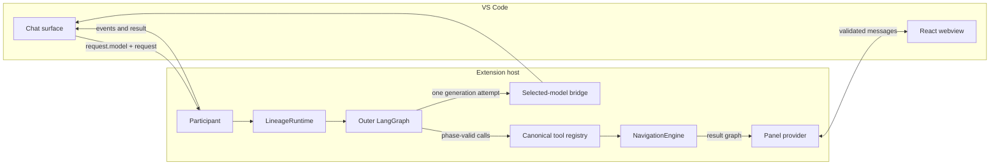
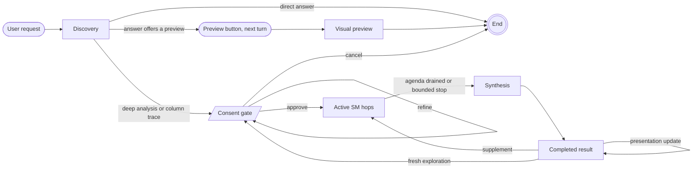

# Architecture

The extension separates semantic reasoning from deterministic process state.
`@lineage` uses an outer LangGraph for phase control and a Map & Router model
for exploration: the selected language model proposes semantic actions, while
`NavigationEngine` owns topology, validation, mutation, and termination.

Build, ingestion, and host/webview details: [`DEVELOPER_GUIDE.md`](DEVELOPER_GUIDE.md).
Prompt and template behavior: [`AI_PROMPTS.md`](AI_PROMPTS.md).

## Architectural boundaries

- `@lineage` is the only AI surface. Every request uses exactly
  `ChatRequest.model`; the extension has no provider, endpoint, credential,
  model-picker, or fallback configuration.
- AI code operates on the loaded lineage snapshot. It cannot connect to a
  database, execute SQL, refresh ingestion, start DMV extraction, or start
  profiling.
- The participant is a native VS Code adapter for requests, history,
  cancellation, progress, gates, and result metadata. It does not own the
  exploration loop.
- The outer graph owns phase transitions, model generations, semantic retries,
  interrupts, synthesis, and turn settlement.
- `NavigationEngine` owns agenda, scope, lifecycle state, route/prune checks,
  graph closure, and completion.
- Model tools pass through the local canonical registry, phase policy, and
  strict Zod dispatcher. Production does not route its own calls through
  `vscode.lm.invokeTool`. `package.json` `languageModelTools` is the
  read-effect subset of
  [`src/ai/tools/toolDefs.ts`](../src/ai/tools/toolDefs.ts); mutating tools
  (`lineage_get_scope_bundle`, `lineage_start_exploration`,
  `lineage_submit_findings`, `lineage_present_result`) stay on the participant
  dispatcher and are never `vscode.lm.registerTool`. Phase availability is
  [`src/ai/tools/toolPolicy.ts`](../src/ai/tools/toolPolicy.ts).
- Extension-host/webview messages cross the Zod schemas in
  [`src/engine/shared/bridgeContract.ts`](../src/engine/shared/bridgeContract.ts)
  before handlers consume them.

Model input crosses three layers, in this order:

- **Normalization** — helpers in
  [`src/ai/support/inputNormalization.ts`](../src/ai/support/inputNormalization.ts)
  coerce a tool argument into its declared shape and resolve a model-written
  object reference against the loaded snapshot. Every rewrite is logged as
  `[Normalize] tool=… field=… from=… to=…`.
- **Schema parse** — the tool's Zod schema is the structural contract; a payload
  that does not parse never reaches a handler. Structural only: a content cap
  (a label length, a legend-group count) is stated in the JSON schema the model
  reads but never parsed, because a parse rejection carries no measured size, no
  held draft, and no repairable classification.
- **Policy rejection** — phase- and state-dependent checks a schema cannot
  express ([`src/ai/interaction/`](../src/ai/interaction/)), returned through
  one shared error envelope. A code belongs in
  [`src/ai/support/rejectionCodes.ts`](../src/ai/support/rejectionCodes.ts) when
  its wire `error` literal reaches the model on a second surface. Prose that
  teaches a refusal without naming its code is not an emission site:
  `route_columns_flow_conflict` is taught by the `route_requests[].columns`
  `.describe()` but emitted only from `ROUTE_REJECTION_CODE` in
  `smRouteValidation.ts`, so the map stays its single owner.

Handlers assume a parsed payload and a resolved id. A defensive re-check
further in points at a defect in the layer that owns the contract.

## Component map

```mermaid
flowchart LR
    subgraph VSC[VS Code]
        CHAT[Chat surface]
        WV[React webview]
    end

    subgraph HOST[Extension host]
        PART[Participant]
        RUNTIME[LineageRuntime]
        GRAPH[Outer LangGraph]
        MODEL[Selected-model bridge]
        TOOLS[Canonical tool registry]
        NAV[NavigationEngine]
        PANEL[Panel provider]
    end

    CHAT -->|request.model + request| PART
    PART -->|events and result| CHAT
    PART --> RUNTIME --> GRAPH
    GRAPH -->|one generation attempt| MODEL --> CHAT
    GRAPH -->|phase-valid calls| TOOLS --> NAV
    NAV -->|result graph| PANEL
    PANEL <-->|validated messages| WV
```

| Owner | Primary source | Responsibility |
|---|---|---|
| Native adapter | [`src/ai/participant/lineageParticipant.ts`](../src/ai/participant/lineageParticipant.ts) | VS Code request/history/stream/button translation |
| Runtime | [`src/ai/runtime/lineageRuntime.ts`](../src/ai/runtime/lineageRuntime.ts) | Turn lease, cancellation, invocation/resume, settlement |
| Phase graph | [`src/ai/agent/graph.ts`](../src/ai/agent/graph.ts) | Discovery, gate, active loop, synthesis, completed follow-ups |
| Model boundary | [`src/ai/model/`](../src/ai/model/) | Provider-neutral messages/tools around the exact selected model |
| Tool boundary | [`src/ai/tools/`](../src/ai/tools/) | Registry, schemas, policy, strict dispatch, result assembly |
| Navigation state | [`src/ai/sm/smBase.ts`](../src/ai/sm/smBase.ts) | Scope, agenda, lifecycle, routing, pruning, closure |
| Exploration memory | [`src/ai/session/memoryManager.ts`](../src/ai/session/memoryManager.ts) | Findings archive and bounded hop projections |
| Turn contracts | [`src/ai/core/`](../src/ai/core/) | Terminal turn outcome and round-limit constants shared by every runner |
| Runtime host | [`src/ai/host/`](../src/ai/host/) | Thread identity, gate emission, resume delivery, cancellation around the LangGraph runtime |
| Process rules | [`src/ai/interaction/`](../src/ai/interaction/) | Phase- and state-dependent tool checks that Zod schemas cannot express |
| Diagnostic trace | [`src/ai/observability/`](../src/ai/observability/) | `wireLog` records and the `aiTraceWriter` session NDJSON sink |
| Provider policy | [`src/ai/providers/`](../src/ai/providers/) | Cancellation classification, structured-output validation, `traceSecurity` redaction |
| Shared helpers | [`src/ai/support/`](../src/ai/support/) | Presentation, normalization, truncation, token budget, and rejection-envelope utilities |
| UI bridge | [`src/panelProvider.ts`](../src/panelProvider.ts) | Result delivery and main webview routing |

## Conversation lifecycle

```mermaid
flowchart LR
    Q([User request]) --> D[Discovery]
    D -->|direct answer| END(((End)))
    D -->|answer offers a preview| PB([Preview button, next turn]) --> P[Visual preview] --> END
    D -->|deep analysis or column trace| G[/Consent gate/]
    G -->|refine| G
    G -->|cancel| END
    G -->|approve| A[Active SM hops]
    A -->|agenda drained or bounded stop| S[Synthesis]
    S --> C[Completed result]
    C -->|presentation update| C
    C -->|supplement| A
    C -->|fresh exploration| G
```

### Discovery and visual preview

Every turn first passes a `detect_entry` hop. Host-owned aggregate questions
about the loaded platform, schema count, or current-schema object count are
answered there from the snapshot with no provider call. Unless that fast path,
a slash command, or a UI trigger fixes the route, entry detection is a model
call whose answer must satisfy `EntryDetectionSchema` — one of `column_trace`,
`visual_render`, or `discovery`, with explicitly named columns required for a
trace and forbidden otherwise. `selectInitialAgentStage` then combines that
semantic route with the mechanical execution trigger; an explicit trigger
always outranks the model's classification.

Discovery is the default chat state: it answers bounded catalog or lineage
questions with snapshot tools and does not publish a `NavigationEngine`.
Answers lead with the user's question, then organize supported facts by
lineage flow. A discovery answer cannot complete until the turn has accepted
at least one trusted tool observation.

`visual_render` is a semantic label only: a free-text graph/render request
enters this same discovery loop. The bounded transient preview is a later,
host-owned action (`preview_button`); it does not grant SM authority. The
preview reuses the preceding discovery answer and retained bounded scope: only
`present_result` is exposed, and the model may regroup verbatim section
bodies, label/link nodes, choose semantic colors, and select verbatim
captions. The existing presentation validator, held-draft repair store,
description assembler, and webview commit remain the shared path.

A completed discovery answer can also offer to continue as an exploration.
When accepted observations show at least two distinct objects inspected
through `lineage_get_object_detail`, the walk is treated as multi-object and
the SM-offer pill is seeded from its first object and final answer.

Only a mechanical trigger opens SM entry: the `/trace` command, the user's
SM-offer pill, or the discovery budget guard. Every free-text request, including
one the detector classifies as `column_trace`, runs discovery first. When the
scope exceeds the discovery budget on either metric — the node cap or the token
budget — `lineage_get_scope_bundle` returns the bare `over_discovery_budget`
rejection with the `scope_proposal` it measured. Graph dispatch treats that
result as a reroute terminal: discovery is cut, the turn is handed to SM entry
as `discovery_budget`, and `lineage_start_exploration` opens the consent gate
there, where the user approves or cancels. The model is never given another
discovery attempt to answer inline from the rejection. Tool availability is
defined only in [`src/ai/tools/toolPolicy.ts`](../src/ai/tools/toolPolicy.ts).

Which traversal mode runs, BB or CT, is settled at the consent gate, never by
this routing step.

### Consent gate

Every fresh SM proposal pauses at `confirm_sm_start`. The engine owns the
scope summary and renders every in-scope object for approval or cancellation.
The native chat gate exposes three participant buttons and no notifications:
**Approve & Proceed** resumes with the proposed classes, **Cancel** clears the
pending proposal without creating an engine, and **Change scope** resumes with
a `hold` decision. Scope-expansion gates omit **Change scope**.

`hold` routes to `hold_gate`, which ends the turn with `outcome: 'ok'` while
leaving the session in `awaiting_gate` with `pendingExploration` intact.
Ending the turn releases the Copilot chat input. The host then prefills the
input with the participant mention, so the user types the change as an
ordinary chat message.

`detect_entry` claims that next free-text prompt for the held proposal and
routes it to `gate_refine`. A stated slash command outranks the hold: it
clears the pending proposal and runs fresh. A new chat still cancels the gate
at the history boundary.

A refinement — from a held gate, or in-turn by a `refine` decision — runs the
revision-bound `gate_refine` phase. That phase may use `lineage_search_objects`
to resolve a name, typo, pattern, or newly named object, but it does not rerun
entry detection, discovery, or the unchanged origin search. The model submits
a strict patch through the refine-only `lineage_start_exploration` schema.
The handler preserves omitted proposal fields and the original GUI filter
snapshot, computes the candidate on an unpublished preview engine, and
re-emits the approval gate at the next revision. A failed or no-op patch
leaves the previous revision pending. Every gate emission mints a new gate
id, so a superseded card's buttons resolve nothing. No `NavigationEngine` is
published as active until approval succeeds.

The gate card splits rules by source: **From your question** is what the user
stated; **How I read it** is the assistant's mechanization (exclusions,
passthroughs, schema/type filters); **My plan** is what the assistant chose
(hop and scope counts, tracing mode, an estimated depth). Which strength a
rule carries is a typed field — the host enforces it and never guesses from
prose.

`approveGateNode` builds the engine with `init(proposal.init)` — the same
object that produced the summary the user read. `activatePendingExploration`
is the sole site that publishes a navigation engine: it refuses a stale
revision before construction and restores session memory on any failure.
Afterwards one predicate, `checkBorder`, is consulted at every admission
purpose (seed BFS, routing, supplement, column-trace contraction, display),
with the sole scope-add write site behind it. Naming an object in a follow-up
admits that object, never its schema siblings.

The consent gate authorizes one hop-by-hop run and is spent when that run's
result is presented. A follow-up asking for an object is therefore the user's
own consent to add it: the object is admitted by name, whether or not the run
deferred it and whether or not the assistant pruned it. Objects the user
excluded are the one exception — that removal was theirs, and it stays a hard
wall.

An instruction that maps to no filter field is carried as `scopeNotes` into
every hop, but it is prose addressed to the model: the engine has no field to
test, so nothing rejects a violation of it.

### Active exploration

After approval, the engine drains an agenda one focus at a time. The model
sees the current focus, immediate routing facts, the current task, and bounded
recent context. It returns one structured finding proposal. The engine
validates the proposal and either commits it atomically or returns a
structured correction.

Lifecycle is recorded separately from prose:

- `analyze` keeps the node and stores classified findings;
- `passthrough` keeps topology without treating the node as a key transform;
- `prune` removes an irrelevant node only when closure checks allow it.

Neighbor pruning is narrower than a focus-node `prune`: it can remove only
an adjacent, topology-safe object — outside the approved scope, or in scope
when the hop decides it is off the answer path. A neighbor that already owns
a queued hop is never pulled, and the don't-orphan closure check governs every
accepted prune. Repeated attempts against an object already removed are
accepted as already-pruned no-ops.

Tables and other non-bodied nodes can be contracted as topology-only
passthroughs so the agenda stays focused on analyzable SQL bodies. The model
is never the owner of a completion flag; synthesis starts when the engine
reaches its terminal condition.

In CT, once an accepted `route_requests` entry names a neighbor for the
traced column, that node is protected from `prune_neighbors` for the rest of
the run. Per-hop memory resets to the anchor, so a later hop cannot recall a
relevance the run already established. The protection is additive on the
tracer and empty in BB. A non-bodied target is contracted the instant it is
enqueued, so the declaration record is what refuses a later prune of a
declared dead-end table.

### Synthesis and completed follow-ups

Synthesis receives a fresh completion envelope containing the findings
archive, node lifecycle, deferred questions, and CT provenance when present.
The AI authors structured presentation fields; the engine validates them,
assembles the Markdown, derives badges, and commits the result graph.
Contracted in-scope objects remain part of that graph and are labeled as
retained supporting objects; only schema, depth, or budget boundaries are
presented as deferred follow-up work.

Completed follow-ups can update presentation, supplement the existing
exploration with explicit nodes, begin a fresh exploration, or answer
directly. Supplements retain the existing archive and return through the
active loop, so a named object is analyzed as a hop in the same engine,
against the same origin, with no second approval. The approval covers the
first run up to its presented result; a later request is the user's own and
is not bounded by it. A plain supplement adds only the ids named, and each
object beyond them defers as its own follow-up; a supplement with `chain`
(`upstream`/`downstream`, a depth or `all`) also adds every object reached from
them, stopping only at objects the user removed. Analysing an object resolves
the open leads that pointed at it. Fresh
exploration follows the consent path and establishes new state.

A follow-up that exhausts its correction budget still delivers the answer it
already wrote, with a plain statement that the graph did not change — the
mirror of synthesis's held-draft salvage.

## Memory and state ownership

`AiSession` persists the current conversation phase and the engine/result
handles required across native chat turns. Phase transitions use guarded
session writers. An empty native `ChatContext.history` is the new-chat signal
and clears exploration state through the normal reset path.

LangGraph checkpointing is in-process and per turn: `buildAgentGraph`
compiles against a fresh in-memory saver so the consent gate can pause and
resume through `Command({ resume })` inside a single turn. Cross-turn state
is `AiSession`; `thread_id` is a fresh value per request.

The Detail Archive is the durable semantic store for an exploration.
`NavigationEngine` separately owns agenda and node lifecycle. Each active hop
sends one stable system prefix plus one bounded hop message carrying the
current task, the focus context, a fixed-size window of recent hop summaries
(`<short_term_memory>`) and the bounded rejection ring
(`<recent_rejections>`). The thread is reseeded to a single continuation
anchor at approval and after every committed hop. Synthesis receives the
complete archived result surface.

`submit_findings` is atomic. Route, column, required-neighbor, and prune
checks complete before findings or topology are committed. Unresolvable
references that are safe to skip become structured notices; unsafe or
malformed mutations reject with correction data. Any phase that declares a
required terminal tool never streams model prose to the chat: a text-only
finish there is a rejected attempt (`missing_required_tool_call`).

## BB and column-trace modes

BB is whole-object analysis. It supports focus verdicts, semantic route
requests, and engine-validated neighbor pruning.

CT is BB plus column tracking, never a parallel traversal. It runs the same
agenda, the same approved scope, the same retention, and the same lifecycle.
What it adds is that the AI records in `column_flow` which upstream columns
feed each output column, and that the engine tracks and verifies those
records. CT is activated only for explicitly named target columns and
requires structured `column_flow` at every active submission.

A focus with no body of its own (a storage table) declares continuation, not attribution:
its `column_flow` names the neighbours on its carrier side carrying the tracked column
unchanged, and the column is attributed on the writer's own hop, where the body is in view.
Continuation rides the existing route machinery — same routes, same prunes, same node set as
BB — so the CT graph cannot diverge from the BB graph. Where the engine holds no carrier-side
neighbour data the edge is accepted unverified and logged, the same tolerance an unverifiable
column already gets.

The engine's role over `column_flow` is verification, not authorship. It
checks every declared column against the loaded model and rejects a reference
the model cannot support. Validated upstream column edges drive continuation
and emphasis; they never bound the result. The result scope is the approved
BFS scope in both modes, so an object that restricts the row set, sets the
grain, or feeds a sibling column is retained even though it carries no column
edge.

A behaviour both modes share has one implementation and one instruction. At
the AI preview / synthesis surface, the column-trace presentation block
replaces the whole-object block (same graph, presented differently). At the
per-hop instruction surface, the whole-object instruction always ships, and a
neighbor that carries traced columns earns the column-trace rider on top; a
neighbor that only shapes rows gets the whole-object instruction alone.

`route_requests[].columns` is required on every CT route request
(`CtRouteRequestSchema` in `toolSchemas.ts`): a non-empty list, or the word
`none`, never an omitted field. `ColumnCarry` (`smTypes.ts`) has exactly two
states — `carry` (the listed columns) and `row_role_only` (the neighbor
carries no traced value and is dispatched as a plain object). There is no
silent default; a CT route that skips the decision is rejected before
commit. BB's route form carries no `columns` field at all — the channel does
not exist in that mode — and when a BB-mode hop inside a CT run is read for
its (structurally absent) decision, it resolves to `row_role_only`, the same
as an explicit `none`.

The decision persists on the agenda entry (`columnCarry`). At dispatch, a
dequeued CT candidate's base active-column set is `[]` when the carry is
`row_role_only`, otherwise the entry's own recorded `activeColumns`; spine
recovery — the accumulated committed `column_flow` edges, bound against the
node's own declared columns — overrides that base only when it resolves
non-empty. No other fallback exists: a stale seed-target set is never
re-applied to a node several hops from where it was resolved.

Where the two channels disagree, the engine does not pick a winner. A route
stating `columns: 'none'` for a node the SAME submission names in
`column_flow[].upstream_columns` is one payload contradicting itself, so it is
refused (`route_columns_flow_conflict`) with the neighbour and the attributed
columns named, and the model repairs whichever half it meant. That is a CT
content fact on the submit, not a BB admission fact: a neighbour BB would
defer or exclude is still refused when the same payload names it both ways,
and the repair path is `route_requests[].columns`. The refusal is scoped to
model-authored routes: the engine synthesizes its own routes from
`column_flow` and from the required-neighbour fill, and states their columns at
the point of synthesis rather than leaving them to be resolved later.

The reverse order — a `'none'` contradicted by an edge committed at an EARLIER
hop — is not a contradiction in one payload: each statement was correct when it
was made. `routeCarryFor` honours the stated `'none'` and enqueues it as
submitted. The committed column is not dropped: the dispatch-time spine bind in
`getHopContext` binds it (logged as `[Normalize] dispatch carry`), and the
committed edge's continuation question is dispatched with it, so the node that
owns the answer is asked about the column on its own hop. A route's column
decision describes that one edge; it never narrows a demand another edge placed.

A column edge carries an optional multi-select transform classification.
`COLUMN_TRANSFORM_CLASSES` in `src/engine/shared/bridgeContract.ts` is the
single home for the five values. They align to OpenLineage's
`ColumnLineageDatasetFacet` transformation types.

| class | direction | covers |
|---|---|---|
| `pass_through` | DIRECT | rename, `SELECT *`, synonym, straight copy |
| `compute` | DIRECT | formula, `CASE`, `COALESCE`, cast, concat, string and date functions |
| `aggregate` | DIRECT | `SUM`/`COUNT`/`MIN`/`MAX`, `GROUP BY`, window functions, `PIVOT` |
| `combine` | INDIRECT | `JOIN`, `UNION`/`EXCEPT`/`INTERSECT`, `APPLY`, `UNPIVOT` |
| `filter` | INDIRECT | `WHERE`, `HAVING`, a join `ON` predicate, `TOP`, `DISTINCT` |

DIRECT means the upstream value reaches the output; INDIRECT means no value
crosses the edge and the node only decided which rows appear. The field is
optional on both contracts, and the engine never fills it in.

Neighbor visibility is the same in both modes, structurally: CT presents the
focus node's full neighbor set, exactly as BB does, and routing eligibility
is never filtered by column state — a neighbor that carries none of the
traced columns is still routable, dispatched under the whole-object contract.
Neighbor prune is the same topology-safe engine path in both modes; CT adds
column-flow verification on top of that path.

Given identical routing decisions, the two modes reach an identical node set:
nothing in CT's column handling can silently exclude a neighbor BB would
keep, because every CT route now states an explicit column decision (`carry`
or `row_role_only`) and no fallback exists to reinterpret a missing one. This
is pinned by `tests/unit/sm/bb-ct-node-set-parity.test.ts`, which drives one
fixture through independent BB and CT engine instances and asserts their
`getResult().fullNodes` id sets are equal, including a column-less branch
reachable only through a `row_role_only` hop. That two independently-run
traces of the *same question* issue matching routing decisions in the first
place is a property of the model's own behaviour, not something any engine
mechanism enforces. `tests/unit/sm/ct-chain-connectivity.test.ts` pins a
related but distinct invariant — that the committed `column_flow` edges form
one connected component reaching the origin, so a column chain can never start
detached from the traced origin.

The webview renders the result through engine-owned node types
(`CustomNodeData`, `ColumnTraceNodeData` in
[`src/engine/types.ts`](../src/engine/types.ts)); components import them, never
the reverse. Display mode is derived once in
[`src/engine/graphDisplayMode.ts`](../src/engine/graphDisplayMode.ts): a scoped
surface (trace, path, or AI result) outranks Schema View, which outranks
Object View. Expanded Schema View is schema-membership only
([`src/engine/schemaProjection.ts`](../src/engine/schemaProjection.ts)) — it
never becomes a lineage cone. Column Detail is a second rendering of the same
approved scope ([`src/engine/columnTraceView.ts`](../src/engine/columnTraceView.ts)),
not a parallel BFS.

## Result and presentation ownership

The final view must remain connected to its origin. Closure is checked on
prune and follow-up edit paths and again when the result is read.

The AI owns summary text, report sections, section-to-node associations,
captions, and semantic highlights. The engine owns node-ID resolution,
structural validation, section numbering, badge derivation, object links,
assembly, and commit. Markdown and KaTeX formatting is never validated and
never rejects a commit: an expression the renderer cannot parse degrades to
its original source text. Nodes may remain visible without a badge or
highlight; pruning is the only operation that removes them from the answer
graph.

A content cap — an authored label's length, the legend-group count — is
advertised, not parsed. The JSON schema the model reads states every one of them
as a typed constraint; the model port validates structure only; and
`validatePresentResult` enforces them, rejecting the overrun with the measured
size, the limit, and the single field to resend — a repairable failure that
holds the draft and is repaired as a field patch. `submit_findings` follows the
same rule through the held finding draft: `badge_label` and
`column_flow[].upstream_columns[].note` are checked in `NavigationEngine` ahead
of every mutation, and the retry may omit `sections` to keep the prose already
authored. Parsed instead, a label two words too long would reject the whole call
at the port, with no held draft, and charge a full resend of an answer that was
otherwise correct. Nothing is silently truncated on either path;
engine-authored prose is fitted to the cap where it is written, never submitted
over it.

In CT, the synthesis prompt requires validated terminal source nodes to remain
visible in the final source presentation surface so the rendered answer cannot
silently drop the root of a column chain; no validator rejects an omission.

## History, privacy, and no-egress boundary

VS Code supplies prior participant turns through `ChatContext.history`.
[`src/ai/participant/chatHistoryAdapter.ts`](../src/ai/participant/chatHistoryAdapter.ts)
projects ordered user/assistant text and preserves only complete native
tool-call/result pairs. It does not select a model or own exploration memory.

The local LangChain bridge is a translation boundary, not a provider
abstraction. An npm override resolves LangChain's transitive `langsmith`
dependency to the inert local stub in `stubs/langsmith/`; ambient tracing
flags fail closed before graph/model invocation. The bundle gate checks that
the real client is not shipped.

Each model-port operation makes exactly one `vscode.lm.sendRequest` call. The
extension does not add a transport retry, model fallback, or duplicate retry
UI: VS Code owns Stop/cancellation and the native whole-request Retry action.
A generation that streams nothing at all is cancelled rather than left to
hold the turn open indefinitely; the first streamed chunk disarms that
watchdog for the rest of that generation. Provider failures settle once
through `ChatResult.errorDetails`; graph loops remain limited to semantic
repair with fresh model generations.
