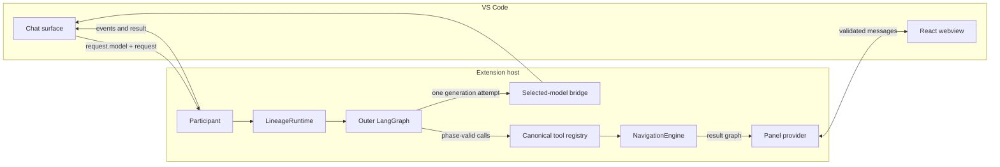

# Architecture

The extension separates semantic reasoning from deterministic process state.
`@lineage` uses an outer LangGraph for phase control and a Map & Router model
for exploration: the selected language model proposes semantic actions, while
`NavigationEngine` owns topology, validation, mutation, and termination.

Build, ingestion, and host/webview details: [`DEVELOPER_GUIDE.md`](DEVELOPER_GUIDE.md).
Prompt and template behavior: [`AI_PROMPTS.md`](AI_PROMPTS.md).

## Architectural boundaries

- `@lineage` is the only AI surface. Every request uses exactly
  `ChatRequest.model`; the extension has no provider, endpoint, credential,
  model-picker, or fallback configuration.
- AI code operates on the loaded lineage snapshot. It cannot connect to a
  database, execute SQL, refresh ingestion, start DMV extraction, or start
  profiling.
- The participant is a native VS Code adapter for requests, history,
  cancellation, progress, gates, and result metadata. It does not own the
  exploration loop.
- The outer graph owns phase transitions, model generations, semantic retries,
  interrupts, synthesis, and turn settlement.
- The agent runtime uses LangGraph and LangChain as designed: the model
  adapter is a custom `BaseChatModel` over `vscode.lm`, history is LangChain
  messages under LangGraph's message reducer, and cancellation rides the run
  config. Own code covers product rules only; the sequential tool executor is
  the one deliberate departure from the library default, because gates, the
  turn lease and ordered effects forbid parallel tool execution.
- Own code carries only product rules no library provides (phase rules, turn
  lease, approval gate, id resolution, memory policy). Zod is the single schema
  source for tool input, its model-facing JSON Schema and its error text; the
  VS Code language-model API supplies model facts such as token counts. A
  malformed model call is rejected by its schema with a hint rather than
  repaired by a special case, and a rejection is the tool result of the call it
  rejects, in one shape emitted where the rule is checked.
- `NavigationEngine` owns agenda, scope, lifecycle state, route/prune checks,
  graph closure, and completion.
- **Backend and model roles.** In hop-by-hop, the backend alone routes: it
  schedules hops, guards, verifies that objects are correct, and drives the
  defined process — phase changes (discovery → consent → hop-by-hop →
  synthesis) and the metadata-driven prompt for each phase. It tracks which
  neighbors it has routed and which still owe one, and ends hop-by-hop only
  when the agenda drains or a bounded stop is reached — never when the model
  calls it finished (§Conversation lifecycle). It applies only stated,
  deterministic rules and never authors content, infers intent, guesses what a
  node needs, defers on speculation, judges relevance, or rewrites the
  model's findings. Content judgement belongs to the model alone: a node's
  status and findings at its own visit, and, per not-yet-visited neighbor, one
  action — a prune, a question, or (by omission) inclusion, plus columns in
  CT. The backend's own bookkeeping name for that included outcome is a
  route; that name is not a routing decision, since routing names only the
  backend's agenda, which the model neither reads nor sets. The model names
  an object to visit next only in the completed phase, past the AI preview,
  as a follow-up that supplements the existing exploration or opens a fresh
  one (§Synthesis and completed follow-ups). In CT the backend checks every
  declared column against the loaded model and carries tracked columns
  forward as context (§BB and column-trace modes); where a chain starts or
  ends, which columns join, and whether the columns are complete are the
  model's calls, and a tracked column not yet accounted for is served back to
  it as data, never enforced. Every backend response to model output is
  ACCEPT, REJECT (code plus recovery hint), or NORMALIZE-WITH-LOG; a rejection
  reaches the model with its hint, a normalization is written to the host log,
  and each non-accepted per-route outcome is written to the host log as one
  line: the hop ack returns none of them to the model, and a deferred route
  reaches the final report as a follow-up lead. This is the standard split of agent
  frameworks: the application owns control flow and validation, the model owns
  decisions.
- **Instructions.** Each stage prompt states the task, the deliverable, the
  tools, and only the invariants the tool schemas cannot express. Each rule has
  one home; a field's meaning lives in its Zod `.describe()`, which ships with
  the tool on every call. No worked example is built from a fixture, and no
  sentence is written to patch one observed failure — such a sentence is
  removed, not extended. Template and wording detail:
  [`AI_PROMPTS.md`](AI_PROMPTS.md).
- Model tools pass through the local canonical registry, phase policy, and
  strict Zod dispatcher. Production does not route its own calls through
  `vscode.lm.invokeTool`. `package.json` `languageModelTools` is the
  read-effect subset of
  [`src/ai/tools/toolDefs.ts`](../src/ai/tools/toolDefs.ts); mutating tools
  (`lineage_get_scope_bundle`, `lineage_start_exploration`,
  `lineage_submit_findings`, `lineage_present_result`) stay on the participant
  dispatcher and are never `vscode.lm.registerTool`. Phase availability is
  [`src/ai/tools/toolPolicy.ts`](../src/ai/tools/toolPolicy.ts).
- **Model bridge.** `vscode.lm` has no system role, so
  [`toVscodeMessage`](../src/ai/model/vscodeLangChainBridge.ts) sends a
  `SystemMessage` to the model as a User turn. Tool choice is projected across
  the two type systems: LangChain `any` or a named tool becomes
  `LanguageModelChatToolMode.Required` (a named choice exposes only that tool),
  and `none` sends no tools. An unsupported choice, an unavailable named tool
  or an assistant tool call without an ID throws a `ModelPortError` before the
  request is sent.
- Extension-host/webview messages cross the Zod schemas in
  [`src/engine/shared/bridgeContract.ts`](../src/engine/shared/bridgeContract.ts)
  before handlers consume them.

Model input crosses three layers, in this order:

- **Normalization** — helpers in
  [`src/ai/support/inputNormalization.ts`](../src/ai/support/inputNormalization.ts)
  coerce a tool argument into its declared shape and resolve a model-written
  object reference against the loaded snapshot. Every rewrite is logged as
  `[Normalize] tool=… field=… from=… to=…`.
- **Schema parse** — the tool's Zod schema, as served to the model for the hop, is
  the structural contract. The tool-attempt boundary parses each call once against
  it and answers a failure with `makeRejection` built from `z.prettifyError` (every
  issue in one parse, a repeated issue collapsed, the expected shape shown once,
  nothing echoed); a payload that does not parse never reaches a handler, and a
  handler never parses again. The `submit_findings` content caps are advertised
  in the JSON schema but enforced in `NavigationEngine` (§Result and
  presentation ownership), because an over-length field is a field-scoped content
  error the engine rejects against its held draft with a repairable classification.
- **Policy rejection** — phase- and state-dependent checks a schema cannot
  express ([`src/ai/interaction/`](../src/ai/interaction/)), returned through
  one shared error envelope. A code belongs in
  [`src/ai/support/rejectionCodes.ts`](../src/ai/support/rejectionCodes.ts) when
  its wire `error` literal reaches the model on a second surface. Prose that
  teaches a refusal without naming its code is not an emission site; a code
  emitted only from `ROUTE_REJECTION_CODE` in `smRouteValidation.ts` stays
  owned by that map.

Handlers assume a parsed payload and a resolved id. A defensive re-check
further in points at a defect in the layer that owns the contract.

## Component map


```mermaid
flowchart LR
    subgraph VSC[VS Code]
        CHAT[Chat surface]
        WV[React webview]
    end

    subgraph HOST[Extension host]
        PART[Participant]
        RUNTIME[LineageRuntime]
        GRAPH[Outer LangGraph]
        MODEL[Selected-model bridge]
        TOOLS[Canonical tool registry]
        NAV[NavigationEngine]
        PANEL[Panel provider]
    end

    CHAT -->|request.model + request| PART
    PART -->|events and result| CHAT
    PART --> RUNTIME --> GRAPH
    GRAPH -->|one generation attempt| MODEL --> CHAT
    GRAPH -->|phase-valid calls| TOOLS --> NAV
    NAV -->|result graph| PANEL
    PANEL <-->|validated messages| WV
```

| Owner | Primary source | Responsibility |
|---|---|---|
| Native adapter | [`src/ai/participant/lineageParticipant.ts`](../src/ai/participant/lineageParticipant.ts) | VS Code request/history/stream/button translation |
| Runtime | [`src/ai/runtime/lineageRuntime.ts`](../src/ai/runtime/lineageRuntime.ts) | Turn lease, cancellation, invocation/resume, settlement |
| Phase graph | [`src/ai/agent/graph.ts`](../src/ai/agent/graph.ts) | Discovery, gate, active loop, synthesis, completed follow-ups |
| Model boundary | [`src/ai/model/`](../src/ai/model/) | Provider-neutral messages/tools around the exact selected model |
| Tool boundary | [`src/ai/tools/`](../src/ai/tools/) | Registry, schemas, policy, strict dispatch, result assembly |
| Navigation state | [`src/ai/sm/smBase.ts`](../src/ai/sm/smBase.ts) | Scope, agenda, lifecycle, routing, pruning, closure |
| Exploration memory | [`src/ai/session/memoryManager.ts`](../src/ai/session/memoryManager.ts) | Findings archive and bounded hop projections |
| Turn contracts | [`src/ai/core/`](../src/ai/core/) | Terminal turn outcome and round-limit constants shared by every runner |
| Runtime host | [`src/ai/host/`](../src/ai/host/) | Thread identity, gate emission, resume delivery, cancellation around the LangGraph runtime |
| Process rules | [`src/ai/interaction/`](../src/ai/interaction/) | Phase- and state-dependent tool checks that Zod schemas cannot express |
| Diagnostic trace | [`src/ai/observability/`](../src/ai/observability/) | `wireLog` records and the `aiTraceWriter` session NDJSON sink |
| Provider policy | [`src/ai/providers/`](../src/ai/providers/) | Cancellation classification, structured-output validation, `traceSecurity` redaction |
| Shared helpers | [`src/ai/support/`](../src/ai/support/) | Presentation, normalization, truncation, token budget, and rejection-envelope utilities |
| UI bridge | [`src/panelProvider.ts`](../src/panelProvider.ts) | Result delivery and main webview routing |

## Database connection providers

Live ingestion opens one `DbSession` ([`src/engine/db/dbSession.ts`](../src/engine/db/dbSession.ts)) per
operation through `connectDatabase` in [`src/engine/connectionManager.ts`](../src/engine/connectionManager.ts).
The setting `dataLineageViz.database.connectionProvider` selects the implementation; the DMV and profiling
code sees only the `DbSession` contract (`executeSimpleQuery`, `getServerInfo`, `dispose`).

- **`mssqlExtension`** (default) — [`mssqlExtensionProvider.ts`](../src/engine/db/mssqlExtensionProvider.ts) wraps the
  mssql extension's connection API (legacy `connect` or saved profiles with connection sharing). Sessions stay
  with that extension and are not closed by this one.
- **`builtIn`** — [`builtInProvider.ts`](../src/engine/db/builtInProvider.ts) opens a `tedious` connection loaded by
  dynamic import and bundled by esbuild. It serializes requests, cancels on the wire when `dataLineageViz.dmvQueryTimeout`
  elapses, returns the first result set, and is closed after the operation. With this provider nothing looks up,
  activates or calls the mssql extension, and `extensionDependencies` stays empty.
- **Connection store** — [`connectionSettings.ts`](../src/engine/db/connectionSettings.ts) reads the application-scoped
  array `dataLineageViz.database.connections` tolerantly and validates every write; the item schema has no password
  property. Passwords live in `SecretStorage` under `dataLineageViz.database.password.<id>`. Entra connections request a
  `microsoft` session for `https://database.windows.net//.default` (plus `VSCODE_TENANT:<tenant>`) and pass the token to
  the driver.
- **Commands and wizard** — [`connectionCommands.ts`](../src/engine/db/connectionCommands.ts) registers add, edit,
  remove and update-password; `addDatabaseConnection` also accepts a Zod-validated `{connection, password?}` argument
  and then runs without prompts, except the certificate-trust confirmation when the argument turns trust on.
- **Errors** — [`connectionErrors.ts`](../src/engine/db/connectionErrors.ts) is the one owner of connection failure
  presentation for both providers. The message is `<connection name>: <original driver text>` with secrets redacted;
  actions are chosen by error number, code or text pattern and are never retried automatically.
- **Persistence** — `StoredConnectionInfoSchema` carries optional `provider` and `connectionId`; a record without
  `provider` reads as `mssqlExtension`. When a stored record names a different provider than the setting, the setting
  wins and one info message says so.
- **Webview** — `mssql-status` carries `provider`; while `mssqlExtension` is active the wizard shows an inline retirement
  notice whose button posts `use-builtin-connection`, and the host sets the setting to `builtIn` globally.

`src/ai` never imports these modules; the AI surface cannot open a connection.

## Conversation lifecycle


```mermaid
flowchart LR
    Q([User request]) --> D[Discovery]
    D -->|direct answer| END(((End)))
    D -->|answer offers a preview| PB([Preview button, next turn]) --> P[Visual preview] --> END
    D -->|deep analysis or column trace| G[/Consent gate/]
    G -->|refine| G
    G -->|cancel| END
    G -->|approve| A[Active SM hops]
    A -->|agenda drained or bounded stop| S[Synthesis]
    S --> C[Completed result]
    C -->|presentation update| C
    C -->|supplement| A
    C -->|fresh exploration| G
```

### Discovery and visual preview

Every turn first passes a `detect_entry` hop. Host-owned aggregate questions
about the loaded platform, schema count, or current-schema object count are
answered there from the snapshot with no provider call. Unless that fast path,
a slash command, or a UI trigger fixes the route, entry detection is a model
call whose answer must satisfy `EntryDetectionSchema` — one of `column_trace`,
`visual_render`, or `discovery`, with explicitly named columns required for a
trace and forbidden otherwise. That semantic route never selects the stage:
`selectInitialAgentStage` reads only the turn's mechanical execution trigger.
`preview_button` opens the visual preview; `/trace`, the SM-offer pill and the
discovery budget guard open SM entry; every free-text turn, a `column_trace`
verdict included, starts in discovery.

Discovery is the default chat state: it answers bounded catalog or lineage
questions with snapshot tools and does not publish a `NavigationEngine`.
Answers lead with the user's question, then organize supported facts by
lineage flow. Tool choice is the model's: it calls a read tool when the
conversation does not already hold the facts, and replies directly when it
does, or when the question needs no lineage facts (a greeting, a capability
question, a decline of a request outside the graph). Grounding is a prompt
rule — only ids, columns and relationships tools returned — not a forced call.

`visual_render` is a semantic label only: a free-text graph/render request
enters this same discovery loop. The bounded transient preview is a later,
host-owned action (`preview_button`); it does not grant SM authority. The
preview reuses the preceding discovery answer and retained bounded scope: only
`present_result` is exposed, and the model groups the served answer blocks
into sections by start block, labels and links nodes, and chooses semantic
colors; the engine assembles the section text. The existing presentation validator, held-draft repair store,
description assembler, and webview commit remain the shared path.

A completed discovery answer can also offer to continue as an exploration.
A `lineage_get_scope_bundle` walk of two or more nodes, or two or more distinct
objects read through `lineage_get_object_detail`, is recorded as the discovery
walk: it seeds the SM-offer pill, and a walked scope also backs the **Show graph
preview** offer. A later answer that reads nothing (a direct reply) keeps both
offers for the last walk; one that reads the catalog without walking a scope
drops the preview offer, so a preview never pairs an old scope with a new
answer.

Only a mechanical trigger opens SM entry: the `/trace` command, the user's
SM-offer pill, or the discovery budget guard. Every free-text request, including
one the detector classifies as `column_trace`, runs discovery first. When the
scope exceeds the discovery budget on either metric — the node cap or the token
budget — `lineage_get_scope_bundle` returns the bare `over_discovery_budget`
rejection with the `scope_proposal` it measured. Graph dispatch treats that
result as a reroute terminal: discovery is cut, the turn is handed to SM entry
as `discovery_budget`, and `lineage_start_exploration` opens the consent gate
there, where the user approves or cancels. The model is never given another
discovery attempt to answer inline from the rejection. SM entry names no
required terminal tool: a text-only reply, such as a clarifying question, is
streamed as the turn's answer and ends the turn without a gate. Tool availability is
defined only in [`src/ai/tools/toolPolicy.ts`](../src/ai/tools/toolPolicy.ts).

Which traversal mode runs, BB or CT, is settled at the consent gate, never by
this routing step.

### Consent gate

Every fresh SM proposal pauses at `confirm_sm_start`. The engine owns the
scope summary; the full plan lists every in-scope object for approval or
cancellation.
The native chat gate exposes three participant buttons and no notifications:
**Approve & Proceed** runs the proposed filters and limits, **Cancel** clears the
pending proposal without creating an engine, and **Change scope** resumes with
a `hold` decision. `confirm_sm_start` is the only gate a run raises. A plain
Approve does not lift a schema exclusion. Change scope pauses for a new plan;
it does not admit a schema by itself. A route that reaches past the border
during the run is deferred and offered after the answer as a follow-up lead.
Asking for that object after the answer opens a new consent card. It is not
added to the finished run.

The participant resolves every card with `hold` the moment it renders, so
`hold_gate` ends the turn with `outcome: 'ok'` while leaving the session in
`awaiting_gate` with `pendingExploration` intact. Ending the turn releases the
Copilot chat input. The card stays live while the session holds its proposal:
**Approve & Proceed** and **Cancel** submit a trigger prompt naming the plan
revision the card shows, as a fresh turn that `detect_entry` routes straight to
`approve_gate` / `cancel_gate` without a model call — a trigger for a revision
no longer pending gets a fixed reply; **Change scope** prefills the input with
the participant mention.

`detect_entry` reads any other prompt typed while a proposal is held with one
structured model call (`GateReplySchema`): approve, change (routed to
`gate_refine` with the text as the instruction), cancel, or other — a separate
question, answered like any chat turn while the proposal and its card stay
pending. A stated slash command outranks the hold: it clears the pending
proposal and runs fresh. A new chat still cancels the gate at the history
boundary.

A refinement — from a held gate, or in-turn by a `refine` decision — runs the
revision-bound `gate_refine` phase. That phase may use `lineage_search_objects`
to resolve a name, typo, pattern, or newly named object, but it does not rerun
entry detection, discovery, or the unchanged origin search. The model submits
a strict patch through the refine-only `lineage_start_exploration` schema.
The handler preserves omitted proposal fields and the original GUI filter
snapshot, computes the candidate on an unpublished preview engine, and
re-emits the approval gate at the next revision. A failed or no-op patch
leaves the previous revision pending. A text-only reply, such as a clarifying
question, is streamed as the turn's answer and ends the turn with the reviewed
revision still pending. Every gate emission mints a new gate
id, so a superseded card's buttons resolve nothing. No `NavigationEngine` is
published as active until approval succeeds.

The card is a summarized view, fact lines only — no AI-authored prose reaches it,
so the goal, the discovery summary and noted constraints stay full-plan-only.
It states depth per side (`≈` marks an estimate; no separate direction line, the
depth line names the side(s) it covers), estimated hop and node counts, schemas
in whichever wording is shortest, tracing mode and columns, analysis angle,
in-scope objects grouped by type and capped at three lines (the rest folded into
one `…` line), exclusions (schemas and objects; excluded object types are
full-plan-only), passthroughs and a removed filter, each list rendered in full.
Its **Show full plan** follow-up is the only follow-up offered while the gate is
open, and the card's closing line sits above the buttons so that the card stays
the response's last markdown (VS Code folds every part before it). The follow-up
renders, from the held proposal and without a model call, the discovery summary (when the proposal carries one) ahead of the
plan, then every in-scope object uncut, with the card's buttons again — the
same underlying scope data the model's own gate copy carries, reordered and
never folded for the user, while the model-facing copy (discovery summary
trailing) keeps its own order and cap unchanged. The plan splits rules by
source: **From the question** is what the user stated; **Read as** is the
assistant's mechanization (exclusions, passthroughs, schema/type filters);
**Plan** is what the assistant chose (hop and scope counts, tracing mode, an
estimated depth), followed by every in-scope object. Which strength a
rule carries is a typed field — the host enforces it and never guesses from
prose. Depth is the concrete instance: `depth` (`ExplorationDepthSelectionSchema`,
`src/engine/shared/explorationDepthContract.ts`) is a required per-side shape,
both `upstream` and `downstream` always present, each carrying its own `levels`
and `exactness` — `'exact'` for a count the user stated, `'approximate'` for
the model's own estimate — never inferred from whether `levels` carries a
number, and never a backend-supplied default for an unstated side. `levels: 0`
permanently closes that direction for the session whatever its `exactness`, and
both sides `0` is rejected at the schema (`asymmetric_depth_both_zero`). An
`'exact'` side is enforced as a border per direction: a node inside either
side's own ceiling is admitted. An `'approximate'` side is shown on the plan
but does not bound the scope. A missing
`depth` is rejected at the tool boundary (`missingField`, [`handlers/startExploration.ts`](../src/ai/tools/handlers/startExploration.ts)). Once approved, the border a rule carries
holds for the whole hop-by-hop run; the model may extend a hard value only
after synthesis, as a deferred lead or `supplement` follow-up, or through a
fresh refine at this same gate carrying the user's own correction — never by
its own initiative mid-run.

The approval is a contract over rules, never over individual objects: schemas,
the level up and the level down, object types, exclusions, and the discovery
summary. The full plan's object list is the dry-run result of those rules. The
discovery summary is composed once at proposal time, shown in the full plan, and
reused verbatim at approval (`NavigationEngine.setDiscoverySummary`), never
recomposed. On Approve the card's values fill the BFS call and the backend
guards unchanged, and hop-by-hop acts on those values and on nothing else.

`approveGateNode` builds the engine with `init(proposal.init)` — the same
object that produced the summary the user read. `activatePendingExploration`
is the sole site that publishes a navigation engine: it refuses a stale
revision before construction and restores session memory on any failure.
Afterwards one predicate, `checkBorder`, is consulted at every admission
purpose (seed BFS, routing, supplement, column-trace contraction).
Its schema border is the exclusion set fixed at `init`: every schema the GUI
selection hides is excluded by default, except the origin's own schema and any
schema the proposal stopped excluding. Naming an origin in a hidden or
excluded schema removes that schema from the exclusion set — the card lists it
under "Filter removed" — so the schema's other objects are admitted under the
remaining borders. Naming an origin also drops its own id from
`excludeNodeIds`. A type exclusion is copied through unchanged.

The consent gate authorizes one hop-by-hop run and is spent when that run's
result is presented. A follow-up that names an object the border kept out is
a new proposal at this same gate, not an addition to the finished run.

Hop-by-hop scope is that approved depth BFS. The webview's route focus answers
a different question: `unionConnectingPaths` (`src/engine/traceScope.ts`) keeps
every node on a directed path between the origin and the chosen targets,
including both branches of a diamond.

An instruction that maps to no filter field is carried as `scopeNotes` into
every hop, but it is prose addressed to the model: the engine has no field to
test, so nothing rejects a violation of it.

### Active exploration

After approval, the hop loop is LangGraph's orchestrator-worker pattern:
`activeCoordinatorNode` asks the engine for the next focus and
`activeWorkerNode` runs one model hop on it
([`src/ai/agent/graph.ts`](../src/ai/agent/graph.ts)). The lineage graph is
data, scheduled inside the coordinator's `NavigationEngine`; it is never
compiled into LangGraph nodes, because a compiled topology is static and
re-runs a node on every channel update, while a database object is visited
once. The model sees the current focus, its inbox, immediate neighbor facts,
and bounded recent context. It returns one structured finding proposal. The
engine validates the proposal and either commits it atomically or returns a
structured correction.

On the wire, a kept hop states its neighbor decisions as `prune_neighbors`
(`[{id, reason}]`) and optional `questions` (`[{nodeId, question}]`); the
focus-node verdict is `analyze`, `passthrough` or `end_branch`.

**One visit per node.** The backend schedules until every in-scope node has
had exactly one hop, in BB and CT alike. A hop never travels back to a visited
node; it reads its own body and its neighbors' columns, never a neighbor's
SQL, and a question about a neighbor's logic reaches that neighbor as a note.
Revisiting a node is a follow-up after the result is delivered, never part of
exploration.

**Scheduling** is the textbook worklist schedule, computed from recorded state
only:

- *Direction.* A note travels from the node that can ask to the node that
  answers: in an upstream trace a consumer is visited before its producer;
  downstream, a producer before its consumer; a bidirectional run applies each
  rule on its own side and orders nothing across sides. Edges contract through
  non-bodied carriers.
- *Readiness* (Kahn, 1962). A node is ready when every in-scope node that can
  still send it a note has been visited or pruned. The worklist drains ready
  nodes until none is queued (Aho, Lam, Sethi and Ullman, *Compilers*, ch. 9).
- *Loops* (Tarjan, 1972). Strongly connected components are condensed, so a
  loop is scheduled as one unit, earliest first inside it by the tie-break. With
  no revisit, a loop gets one pass.
- *Tie-break.* Priority-queue topological order: the origin and follow-up tier
  first, then directed distance from the origin, then node id. Column count,
  question length and arrival order play no part.
- *Dynamic order* (Pearce and Kelly, 2006). Readiness is recomputed at every
  dequeue, so a prune releases the nodes waiting on it and scope growth can
  delay a queued node.

The condensation of the live graph is acyclic, so a ready node exists whenever
the queue is non-empty; no stalemate fallback exists or is needed.

**Message passing.** At each hop the model records the focus node's findings
and, for not-yet-visited neighbors only, a note: a prune (`prune_neighbors`,
with a reason) or a question (`questions`, one specific check). It never sends
a route. Every open neighbor the hop does not prune, and that `admitsRoute`
admits (inside the exclusion and direction borders and the depth border), is enqueued by the backend and visited exactly once. An open
neighbor the hop does not name is deferred as a lead on one axis only: past
the depth border (`depth`); one outside the exclusion or direction border is
neither visited nor deferred. A neighbor the hop names in a question or in
`column_flow` is deferred on every axis `admitsRoute` fails: `excluded`,
`direction`, or `depth`. A question shapes what
that hop is asked, never whether it happens. In CT, what a kept neighbor carries comes from the
hop's `column_flow` — the columns `upstream_columns` names on it (and, on the
downstream side, what the focus writes to its readers); a kept neighbor named
in none is visited row-role-only. A node's inbox — every
note on its incoming edges — is rendered as one templated block built only from
recorded facts: the sender, the carrier, the columns, and the sender's verbatim
question. The backend writes no summary, paraphrase, or question of its own
into it. A note never causes a second visit. A prune of a visited, resolved-
removed, or queued neighbor is a no-op stated to the model in the next hop's
`recent_rejections`. A question on a neighbor the same submission also names
in `prune_neighbors` is never dropped: the prune stands and the question is
kept as a deferred follow-up (`DeferredQuestion.reason: 'pruned'`), reaching
`engine.deferredQuestions`, the synthesis completion envelope, and the
post-answer generic "Follow-up questions" badge the same way a schema- or
depth-deferred question does. A question on a
queued neighbor joins that neighbor's inbox for its one visit; a question on a
visited or resolved-removed neighbor gets no hop and is recorded as the route
outcome `already_visited` or `already_pruned`. A question on a neighbor whose
prune vote is still pending is itself a vote — a keep — and queues that
neighbor, so it is kept (see below). Route
outcomes are not returned to the model; every non-accepted one is written to
the host log.

**Node status** is decided at the node's own visit and recorded separately
from prose:

- `analyze` — the node transforms; its classified findings are stored;
- `passthrough` — identity: the node moves data without logic (OpenLineage
  IDENTITY versus TRANSFORMATION); it drives the Column Detail view's
  passthrough versus transformation line;
- `end_branch` — off the answer path, knowable only after reading its SQL. It
  carries only a reason (`summary`, `sections` and `badge_label` sent with it are
  dropped), never on the origin (`prune_origin_forbidden`), and
  never on a node carrying a tracked column a visited neighbor's `column_flow`
  declared on it (`prune_carries_tracked_column`, naming the columns; the hint
  asks for `analyze` or `passthrough` instead). Stored
  internally as node action `prune`.

A neighbor prune is narrower than `end_branch`: it targets an adjacent object
the hop has not visited, based on the focus's SQL alone, and it is one
sender's vote on that edge, not an immediate removal. A pruned neighbor
resolves once every live sender — every in-scope, unvisited node that can
still reach it — has been heard: removed only if every sender that took a
position on it voted prune, kept the moment any sender routes it, questions
it, or (in CT) names it in `column_flow`. A sole live sender's vote resolves
at once, the same immediacy a single-sender prune always had. A vote still
pending when the agenda empties — its remaining senders reachable only
through the pruned neighbor itself, as on a cycle — resolves on the votes
cast, and the unheard senders are logged. A reactivated
sender casting a fresh verdict on a neighbor it kept or pruned earlier
replaces its own prior vote, never adds a second one, so a live sender's
current position, not its first, decides the vote. While a neighbor's vote is
pending it is offered to every other sender exactly as an untouched one is —
never disclosed as already-removed — and it is never enqueued on the
pruner's behalf. A neighbor that already owns a queued hop is never pulled,
and a declared column carrier is refused with the same code, whether the
neighbor is untouched or its vote is still pending. Repeated attempts against
an object already resolved removed are accepted as already-pruned no-ops; an
attempt against one still pending is a fresh vote.

**The cut.** Once an accepted `end_branch` or a neighbor-prune vote resolves
removed, it also removes every unvisited node reachable from the origin only
through the removed node (undirected reachability inside scope, before
versus after) — the cut runs at that resolution, never at the vote that may
only be one of several a pending neighbor still owes. A visited node is never
cut. The cut is logged (`[Cut] hop=N via=X dropped=[…]`) and recorded as node
state `bb_prune_neighbor` with the removing node; it is not returned to the
model, and no would-orphan refusal exists.

Tables and other non-bodied nodes are never visited: with no SQL body to read,
their status is keep or prune only. A note addressed to one is forwarded to
its bodied writers or readers (bipartite contraction), and readiness is
computed on that contracted graph. In CT, where the committing focus only
reads or only writes the carrier, the note's question and columns reach only
the side the tracked column continues to; a neighbor on the other side is
still queued, with no question and no columns, and the skipped forward is
logged. The model is never the owner of a
completion flag; synthesis starts when the engine reaches its terminal
condition.

In CT, once a committed `column_flow` entry names a node for a traced column
(`upstream_columns` or `writes_to`), that node is protected from
`prune_neighbors` and from its own `end_branch` for the rest of the run. Per-hop memory resets to the anchor, so a later hop cannot recall a
relevance the run already established. The protection is additive on the
tracer and empty in BB. A non-bodied target is contracted the instant it is
enqueued, so the declaration record is what refuses a later prune of a
declared dead-end table.

### Synthesis and completed follow-ups

Synthesis receives a fresh completion envelope containing the findings
archive, node lifecycle, deferred questions, and CT provenance when present.
The AI authors structured presentation fields; the engine validates them,
assembles the Markdown, derives badges, and commits the result graph.
Contracted in-scope objects remain part of that graph and are labeled as
retained supporting objects. Deferred follow-up work carries one of six
reasons: `schema`, `depth`, `direction`, `pruned`, `excluded`, or `contracted`; a lead restored from
an older record may still carry `budget`. Every deferred question reaches the completion envelope; an
`excluded` one is not offered as a follow-up.

Completed follow-ups can update presentation, supplement the existing
exploration with explicit nodes, begin a fresh exploration, or answer
directly. Every discovery read tool stays available, so a question beyond the
report is answered by walking the loaded graph; a follow-up walk never backs a
preview offer, and the rendered graph changes only through an update or a
supplement. Supplements retain the existing archive and return through the
active loop, so a named object is analyzed as a hop in the same engine,
against the same origin, with no second approval. The approval covers the
first run up to its presented result; a later request is the user's own and
is not bounded by it. A plain supplement adds only the ids named, and each
object beyond them defers as its own follow-up; a supplement with `chain`
(`upstream`/`downstream`, a depth or `all`) also adds every object reached from
them, stopping only at objects the user removed. Analysing an object resolves
the open leads that pointed at it. Fresh
exploration follows the consent path and establishes new state.

A follow-up that exhausts its correction budget still delivers the answer it
already wrote, with a plain statement that the graph did not change — the
mirror of synthesis's held-draft render: when synthesis's breaker trips with a
held, repairable `lineage_present_result` draft, or the panel/preview dispatch
throws after a committed result, the held draft's own intro, sections and
closing render straight into the chat stream through the existing assembler,
followed by one plain line that the AI preview could not be rendered; the
cause is in the debug log and a warning toast is raised once, from the
participant.

## Memory and state ownership

`AiSession` persists the current conversation phase and the engine/result
handles required across native chat turns. Phase transitions use guarded
session writers. An empty native `ChatContext.history` is the new-chat signal
and clears exploration state through the normal reset path.

LangGraph checkpointing is in-process and per turn: `buildAgentGraph`
compiles against a fresh in-memory saver so the consent gate can pause and
resume through `Command({ resume })` inside a single turn. Cross-turn state
is `AiSession`; `thread_id` is a fresh value per request.

The findings archive is the durable semantic store for an exploration.
`NavigationEngine` separately owns agenda and node lifecycle. Each active hop
sends one stable system prefix plus one bounded hop message carrying the
current task, the focus context, a fixed-size window of recent hop summaries
(`<short_term_memory>`) and the bounded rejection ring
(`<recent_rejections>`). The thread is reseeded to a single continuation
anchor at approval and after every committed hop. Synthesis receives the
complete archived result surface.

`submit_findings` is atomic. Neighbor, column, and prune checks complete
before findings or topology are committed. Unresolvable
references that are safe to skip become structured notices; unsafe or
malformed mutations reject with correction data. Any phase that declares a
required terminal tool never streams model prose to the chat: a text-only
finish there is a rejected attempt (`missing_required_tool_call`).

Within one tool phase a rejection is answered by the rejected call's own tool
result (code, reason, hint); only a generation that produced no tool call is
followed by a user-role correction. A replayed assistant turn carries the
provider's own stream parts (thinking parts and their signatures) verbatim
ahead of its text and calls, so a provider that validates signatures on the
current turn accepts the history. A read that an earlier generation already had
accepted and the model asks for again is answered with a `duplicate_read`
rejection naming the accepted call ID; a duplicate inside the same batch is
reused silently. A phase stops after `MAX_TOOL_PROVIDER_CALLS` model replies in a row
that add no accepted observation — rejected, duplicate, empty or text-only.

## BB and column-trace modes

BB is whole-object analysis. It supports focus verdicts and engine-validated
neighbor decisions (`prune_neighbors`, `questions`); every remaining open
in-scope neighbor not pruned is enqueued and visited once, automatically.

CT is BB plus column tracking, never a parallel traversal. It runs the same
agenda, the same approved scope, the same retention, and the same lifecycle.
What it adds is that the AI records in `column_flow` which upstream columns
feed each output column, and that the engine tracks and verifies those
records. CT is activated only for explicitly named target columns and
requires structured `column_flow` at every active submission.

A focus with no body of its own (a storage table) declares continuation, not attribution:
its `column_flow` names the neighbours on its carrier side carrying the tracked column
unchanged, and the column is attributed on the writer's own hop, where the body is in view.
Continuation rides the existing route machinery — same routes, same prunes, same node set as
BB — so the CT graph cannot diverge from the BB graph beyond the one write-sink exception stated
below. Where the engine holds no carrier-side
neighbour data the edge is accepted unverified and logged, the same tolerance an unverifiable
column already gets.

The engine's role over `column_flow` is verification, not authorship. It
checks every declared column against the loaded model and rejects a reference
the model cannot support. The engine stores the tracked columns, hands them on
to the next object as served context, carries a tracked column across a table
by name, and checks that every column link the model records joins two real
columns. Where a chain starts or ends, whether a new column joins, and whether
the accounted columns are complete are the model's decisions: tracked columns
not yet accounted for are served as data, never enforced as an obligation. Validated upstream column edges drive continuation
and emphasis; they never bound the result. The result scope is the approved
BFS scope in both modes, so an object that restricts the row set, sets the
grain, or feeds a sibling column is retained even though it carries no column
edge.

A behaviour both modes share has one implementation and one instruction. At
the AI preview / synthesis surface, the column-trace presentation block
replaces the whole-object block (same graph, presented differently). At the
per-hop instruction surface, the whole-object instruction always ships, and a
neighbor that carries traced columns earns the column-trace rider on top; a
neighbor that only shapes rows gets the whole-object instruction alone.

What a kept neighbor carries is derived from the hop's own `column_flow`,
never stated per neighbor: the columns `upstream_columns` names on it, and on
the downstream side of the trace the `out_col` the focus writes to its readers
(or `writes_to.col` for the named write target). `ColumnCarry` (`smTypes.ts`)
has exactly two states — `carry` (the derived columns) and `row_role_only` (a
kept neighbor named in no entry, dispatched as a plain object). BB derives no
carry at all. `questions` carry no columns in either mode.

The carry persists on the agenda entry (`columnCarry`). At dispatch, a
dequeued CT candidate's base active-column set is `[]` when the carry is
`row_role_only`, otherwise the entry's own recorded `activeColumns`; spine
recovery — the accumulated committed `column_flow` edges, bound against the
node's own declared columns — overrides that base only when it resolves
non-empty. No other fallback exists: a stale seed-target set is never
re-applied to a node several hops from where it was resolved. A column edge
committed at an earlier hop is never dropped by a later hop's
`row_role_only`: the dispatch-time spine bind in `getHopContext` binds it
(logged as `[Normalize] dispatch carry`), and the committed edge's
continuation question is dispatched with it.

A column edge carries an optional multi-select transform classification.
`COLUMN_TRANSFORM_CLASSES` in `src/engine/shared/bridgeContract.ts` is the
single home for the five values. They align to OpenLineage's
`ColumnLineageDatasetFacet` transformation types.

| class | direction | covers |
|---|---|---|
| `pass_through` | DIRECT | rename, `SELECT *`, synonym, straight copy |
| `compute` | DIRECT | formula, `CASE`, `COALESCE`, cast, concat, string and date functions |
| `aggregate` | DIRECT | `SUM`/`COUNT`/`MIN`/`MAX`, `GROUP BY`, window functions, `PIVOT` |
| `combine` | INDIRECT | `JOIN`, `UNION`/`EXCEPT`/`INTERSECT`, `APPLY`, `UNPIVOT` |
| `filter` | INDIRECT | `WHERE`, `HAVING`, a join `ON` predicate, `TOP`, `DISTINCT` |

DIRECT means the upstream value reaches the output; INDIRECT means no value
crosses the edge and the node only decided which rows appear. The field is
optional on both contracts, and the engine never fills it in.

Scheduling, the inbox, and node status are the same in both modes (§Active
exploration): the visit order is identical, and CT adds only columns on a note
and `column_flow` on a finding.

Neighbor visibility is the same in both modes, structurally: CT presents the
focus node's full neighbor set, exactly as BB does, and routing eligibility
is never filtered by column state — a neighbor that carries none of the
traced columns is still routable, dispatched under the whole-object contract.
Neighbor prune is the same topology-safe engine path in both modes; CT adds
column-flow verification on top of that path.

One exception lets CT subtract a node BB would keep: the write-sink gate. It
follows the output templates' sink policy — a sink that does not hold the
traced column's values is operational, not lineage of that column. In the
post-commit neighbor walk, a neighbor the engine opened automatically (no
model-authored question) that has no body of its own, that the committing
focus writes without reading back, and that no committed `column_flow` edge
names with a tracked column ends the branch instead of being contracted
through. It is recorded not-kept with the settled route reason
`carries_no_tracked_column` and a rejection note telling the model to route
beyond it explicitly if it answers the question; left undispositioned, it
leaves the render as a side-effect sink. The gate keys on the column record's
presence, never on a mode name, so BB — which has no column record — never
applies it; a carrier the model routed explicitly is dispatched for the model
to judge at its own focus, and the seed, supplement and user pass-through
forwarding are never gated. The implementation is `columnFreeSinkVia` in
[`src/ai/sm/smBase.ts`](../src/ai/sm/smBase.ts).

Independently of BB and CT, the answer's classification decides how an
operational sink is described, never whether it is traversed: a business answer
folds a run-audit sink (which procedure ran, when, with what outcome) into a
one-line mention on the node it hangs off, a technical answer describes it in
full, and `both` is the union of the two. A question that names neither angle is
classified `both`.

Given identical routing decisions, the two modes reach an identical node set,
the write-sink gate above excepted: nothing else in CT's column handling can
exclude a neighbor BB would keep, because every CT route now states an explicit column decision (`carry`
or `row_role_only`) and no fallback exists to reinterpret a missing one. The
internal state-machine suite pins this by driving one fixture through
independent BB and CT engine instances and asserting their `getResult().fullNodes`
id sets are equal, including a column-less branch reachable only through a
`row_role_only` hop. That two independently-run
traces of the *same question* issue matching routing decisions in the first
place is a property of the model's own behaviour, not something any engine
mechanism enforces. The internal state-machine suite ("CT chain connectivity") pins a
related but distinct invariant — that the committed `column_flow` edges form
one connected component reaching the origin, so a column chain can never start
detached from the traced origin.

The webview renders the result through engine-owned node types
(`CustomNodeData`, `ColumnTraceNodeData` in
[`src/engine/types.ts`](../src/engine/types.ts)); components import them, never
the reverse. Display mode is derived once in
[`src/engine/graphDisplayMode.ts`](../src/engine/graphDisplayMode.ts): a scoped
surface (trace, path, or AI result) outranks Schema View, which outranks
Object View. Expanded Schema View is schema-membership only
([`src/engine/schemaProjection.ts`](../src/engine/schemaProjection.ts)) — it
never becomes a lineage cone. Column Detail is a second rendering of the same
approved scope ([`src/engine/columnTraceView.ts`](../src/engine/columnTraceView.ts)),
not a parallel BFS.

## Result and presentation ownership

The final view must remain connected to its origin. Closure is checked on
prune and follow-up edit paths and again when the result is read.

The AI owns summary text, report sections, section-to-node associations,
captions, and semantic highlights. The engine owns node-ID resolution,
structural validation, section numbering, badge derivation, object links,
assembly, and commit. Markdown and KaTeX formatting is never validated and
never rejects a commit: an expression the renderer cannot parse degrades to
its original source text. Nodes may remain visible without a badge or
highlight; pruning is the only operation that removes them from the answer
graph.

A `present_result` bound — an authored label's length, the legend-group count,
a blank required field, a repeated section label — is one Zod declaration on the
model schema. The JSON schema the model reads states it as a typed constraint
(`maxLength`, `maxItems`, `minLength`), the tool-attempt boundary rejects a violation
with the measured size against the limit, and the handler's boundary parse enforces
the same schema. `validatePresentResult` keeps only what a schema cannot
express: node-id resolution against the result graph and highlight, section and
note coverage. `submit_findings` advertises its caps without parsing them:
`badge_label` and `column_flow[].upstream_columns[].note` are checked in
`NavigationEngine` ahead of every mutation as a repairable single-field
rejection against a held finding draft. The retry resends the full call
(`sections: {}` and `summary: ""` keep the held values) and names only the
section angle it changes: `RepairDraftStore.mergeByKey` keeps every other held
angle and an empty summary keeps the held one. Nothing is silently truncated on either path;
engine-authored prose is fitted to the cap where it is written, never submitted
over it.

A held `present_result` repair merges `sections` by label through
`RepairDraftStore.mergeByKey`: a resent section replaces the held section with
that label, a new label appends, `{label, remove: true}` drops one, and every
unnamed held section is kept as authored. A resent section may omit its
stage's body field (`text`; `start` in the preview) or `node_ids` to keep the held
values, and the hint names only the field the stage's schema accepts. The rejection shows the model the
held section labels (with the start block of a preview section) and nothing the
rejected call already carries. `notes` and `highlight_groups` resend as a whole
list. A held draft is cleared only on success or turn reset, never by a failed
retry.

Every captured SQL fence served to synthesis carries an evidence id in its
info string (```` ```sql S7 ````). Section text may reuse a block by writing
that opening line with an empty body; the handler expands it in place, at the
same position and indentation, before validation, assembly and persistence,
so committed text never depends on ids. A fence that carries an id and a body
keeps the model's body; a reference to SQL the section already shows renders
once; an unknown id is a repairable `sections` rejection. References are
optional — SQL written out is never rejected.

Large model messages follow one pattern: content the engine already holds is
referenced by id and assembled by the engine, never retyped by the model —
answer blocks (`B<n>`) for the preview, SQL snippets (`S<n>`) for synthesis. A
rejected large message is repaired by resending only the named part; every held
part not resent is kept.

In CT, the synthesis prompt requires validated terminal source nodes to remain
visible in the final source presentation surface so the rendered answer cannot
silently drop the root of a column chain; no validator rejects an omission.

## History, privacy, and no-egress boundary

VS Code supplies prior participant turns through `ChatContext.history`.
[`src/ai/participant/chatHistoryAdapter.ts`](../src/ai/participant/chatHistoryAdapter.ts)
projects ordered user/assistant text and preserves only complete native
tool-call/result pairs. It does not select a model or own exploration memory.

The local LangChain bridge is a translation boundary, not a provider
abstraction. An npm override resolves LangChain's transitive `langsmith`
dependency to the inert local stub in `stubs/langsmith/`; ambient tracing
flags fail closed before graph/model invocation. The bundle gate checks that
the real client is not shipped.

Each model-port operation makes exactly one `vscode.lm.sendRequest` call. The
extension does not add a transport retry, model fallback, or duplicate retry
UI: VS Code owns Stop/cancellation and the native whole-request Retry action.
No generation is cut by the extension: the provider's own limits and the
user's Stop end a call, however long a reasoning phase runs. Provider failures settle once
through `ChatResult.errorDetails`; graph loops remain limited to semantic
repair with fresh model generations.
