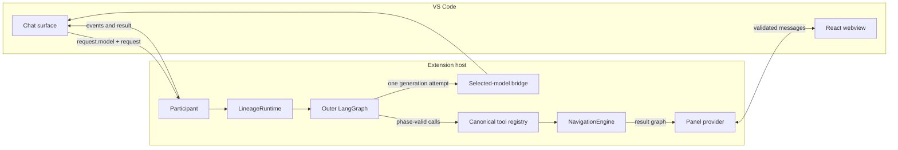
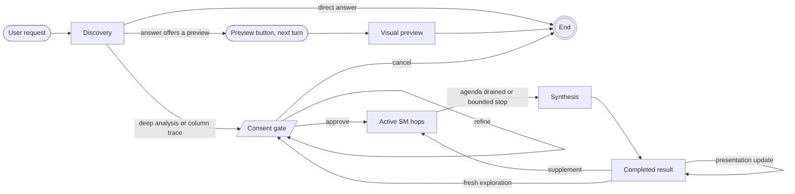

# Architecture

The extension separates semantic reasoning from deterministic process state.
`@lineage` uses an outer LangGraph for phase control and a Map & Router model
for exploration: the selected language model proposes semantic actions, while
`NavigationEngine` owns topology, validation, mutation, and termination.

Build, ingestion, and host/webview details: [`DEVELOPER_GUIDE.md`](DEVELOPER_GUIDE.md).
Prompt and template behavior: [`AI_PROMPTS.md`](AI_PROMPTS.md).

## Architectural boundaries

- `@lineage` is the only AI surface. Every request uses exactly
  `ChatRequest.model`; the extension has no provider, endpoint, credential,
  model-picker, or fallback configuration.
- AI code operates on the loaded lineage snapshot. It cannot connect to a
  database, execute SQL, refresh ingestion, start DMV extraction, or start
  profiling.
- The participant is a native VS Code adapter for requests, history,
  cancellation, progress, gates, and result metadata. It does not own the
  exploration loop.
- The outer graph owns phase transitions, model generations, semantic retries,
  interrupts, synthesis, and turn settlement.
- The runtime uses LangGraph for phase control and a custom LangChain
  `BaseChatModel` over `vscode.lm`. Tools execute sequentially because gates,
  the turn lease, and ordered mutations require it.
- `NavigationEngine` owns scope, agenda, lifecycle, validation, pruning,
  graph closure, and termination. The model authors findings, neighbor prune
  decisions, questions, and column evidence. It does not schedule hops or
  declare exploration complete.
- Input validation returns structured rejection codes and recovery hints.
  Normalization is logged. Column references are checked against the loaded
  model; missing provenance remains unresolved rather than being inferred.
- **Guarantee boundary.** The backend validates object and column identities,
  declared graph routes, pruning, carried-work continuity, visit-once scheduling
  and termination. The AI owns whether its SQL analysis finds every relevant
  contributor. A valid committed record is not proof of exhaustive SQL lineage;
  absent or malformed calls never authorize invented graph facts or a successful hop.
- Stage prompts describe the task and invariants not expressible by tool
  schemas. Field contracts live in the tool schemas; customizable content lives
  in the output templates. See [`AI_PROMPTS.md`](AI_PROMPTS.md).
- Model tools pass through the local canonical registry, phase policy, and
  strict Zod dispatcher. Production does not route its own calls through
  `vscode.lm.invokeTool`. `package.json` `languageModelTools` is the
  read-effect subset of
  [`src/ai/tools/toolDefs.ts`](../src/ai/tools/toolDefs.ts); mutating tools
  (`lineage_get_scope_bundle`, `lineage_start_exploration`,
  `lineage_submit_findings`, `lineage_present_result`) stay on the participant
  dispatcher and are never `vscode.lm.registerTool`. Phase availability is
  [`src/ai/tools/toolPolicy.ts`](../src/ai/tools/toolPolicy.ts).
- **Model bridge.** `vscode.lm` has no system role, so
  [`toVscodeMessage`](../src/ai/model/vscodeLangChainBridge.ts) sends a
  `SystemMessage` to the model as a User turn. Tool choice is projected across
  the two type systems: LangChain `any` or a named tool becomes
  `LanguageModelChatToolMode.Required` (a named choice exposes only that tool),
  and `none` sends no tools. An unsupported choice, an unavailable named tool
  or an assistant tool call without an ID throws a `ModelPortError` before the
  request is sent.
- Extension-host/webview messages cross the Zod schemas in
  [`src/engine/shared/bridgeContract.ts`](../src/engine/shared/bridgeContract.ts)
  before handlers consume them.

Model input crosses three layers, in this order:

- **Normalization** — helpers in
  [`src/ai/support/inputNormalization.ts`](../src/ai/support/inputNormalization.ts)
  coerce a tool argument into its declared shape and resolve a model-written
  object reference against the loaded snapshot. Every rewrite is logged as
  `[Normalize] tool=… field=… from=… to=…`.
- **Schema parse** — the tool's Zod schema, as served to the model for the hop, is
  the structural contract. The canonical receiving boundary parses each call once against
  it and answers a failure with `makeRejection` built from `z.prettifyError` (every
  issue in one parse, a repeated issue collapsed, the expected shape shown once,
  nothing echoed). For `submit_findings`, the serialized registry's receiving handler owns
  that raw parse before normalization, held-draft merging or engine mutation;
  native and HTTP transport decoding does not perform a second parse. Direct typed
  engine calls validate the separate internal finding shape against the same hop mode.
  The `submit_findings` content caps are advertised
  in the JSON schema but enforced in `NavigationEngine` (§Result and
  presentation ownership), because an over-length field is a field-scoped content
  error the engine rejects against its held draft with a repairable classification.
- **Policy rejection** — phase- and state-dependent checks a schema cannot
  express ([`src/ai/interaction/`](../src/ai/interaction/)), returned through
  one shared error envelope. A code belongs in
  [`src/ai/support/rejectionCodes.ts`](../src/ai/support/rejectionCodes.ts) when
  its wire `error` literal reaches the model on a second surface. Prose that
  teaches a refusal without naming its code is not an emission site; a code
  emitted only from `ROUTE_REJECTION_CODE` in `smRouteValidation.ts` stays
  owned by that map.

Each receiving boundary owns its input shape. Do not apply the model's sections-object
schema to the engine's sections-array contract or add a duplicate parser downstream.

## Component map


```mermaid
flowchart LR
    subgraph VSC[VS Code]
        CHAT[Chat surface]
        WV[React webview]
    end

    subgraph HOST[Extension host]
        PART[Participant]
        RUNTIME[LineageRuntime]
        GRAPH[Outer LangGraph]
        MODEL[Selected-model bridge]
        TOOLS[Canonical tool registry]
        NAV[NavigationEngine]
        PANEL[Panel provider]
    end

    CHAT -->|request.model + request| PART
    PART -->|events and result| CHAT
    PART --> RUNTIME --> GRAPH
    GRAPH -->|one generation attempt| MODEL --> CHAT
    GRAPH -->|phase-valid calls| TOOLS --> NAV
    NAV -->|result graph| PANEL
    PANEL <-->|validated messages| WV
```

| Owner | Primary source | Responsibility |
|---|---|---|
| Native adapter | [`src/ai/participant/lineageParticipant.ts`](../src/ai/participant/lineageParticipant.ts) | VS Code request/history/stream/button translation |
| Runtime | [`src/ai/runtime/lineageRuntime.ts`](../src/ai/runtime/lineageRuntime.ts) | Turn lease, cancellation, invocation/resume, settlement |
| Phase graph | [`src/ai/agent/graph.ts`](../src/ai/agent/graph.ts) | Discovery, gate, active loop, synthesis, completed follow-ups |
| Model boundary | [`src/ai/model/`](../src/ai/model/) | Provider-neutral messages/tools around the exact selected model |
| Tool boundary | [`src/ai/tools/`](../src/ai/tools/) | Registry, schemas, policy, strict dispatch, result assembly |
| Navigation state | [`src/ai/sm/smBase.ts`](../src/ai/sm/smBase.ts) | Scope, agenda, lifecycle, routing, pruning, closure |
| Exploration memory | [`src/ai/session/memoryManager.ts`](../src/ai/session/memoryManager.ts) | Findings archive and bounded hop projections |
| Turn contracts | [`src/ai/core/`](../src/ai/core/) | Terminal turn outcome and round-limit constants shared by every runner |
| Runtime host | [`src/ai/host/`](../src/ai/host/) | Thread identity, gate emission, resume delivery, cancellation around the LangGraph runtime |
| Process rules | [`src/ai/interaction/`](../src/ai/interaction/) | Phase- and state-dependent tool checks that Zod schemas cannot express |
| Diagnostic trace | [`src/ai/observability/`](../src/ai/observability/) | `wireLog` records and the `aiTraceWriter` session NDJSON sink |
| Provider policy | [`src/ai/providers/`](../src/ai/providers/) | Cancellation classification, structured-output validation, `traceSecurity` redaction |
| Shared helpers | [`src/ai/support/`](../src/ai/support/) | Presentation, normalization, truncation, token budget, and rejection-envelope utilities |
| UI bridge | [`src/panelProvider.ts`](../src/panelProvider.ts) | Result delivery and main webview routing |

## Database connection providers

Live ingestion opens one `DbSession` ([`src/engine/db/dbSession.ts`](../src/engine/db/dbSession.ts)) per
operation through `connectDatabase` in [`src/engine/connectionManager.ts`](../src/engine/connectionManager.ts).
The setting `dataLineageViz.database.connectionProvider` selects the implementation; the DMV and profiling
code sees only the `DbSession` contract (`executeSimpleQuery`, `getServerInfo`, `dispose`).

- **`mssqlExtension`** (default) — [`mssqlExtensionProvider.ts`](../src/engine/db/mssqlExtensionProvider.ts) wraps the
  mssql extension's connection API (legacy `connect` or saved profiles with connection sharing). Import sessions
  stay with that extension and are not closed by this one (`releaseSession` is a no-op for them). The one
  exception is the table-statistics session: negotiated once and reused for the panel's lifetime, it is
  disconnected when the panel closes or another project loads.
- **`builtIn`** — [`builtInProvider.ts`](../src/engine/db/builtInProvider.ts) opens a `tedious` connection loaded by
  dynamic import and bundled by esbuild. It serializes requests, cancels on the wire when `dataLineageViz.dmvQueryTimeout`
  elapses, returns the first result set, and is closed after the operation. Its `getServerInfo` runs the YAML
  `platform-info` query from the panel's DMV query cache (reloaded by each import and when
  `dataLineageViz.dmvQueriesFile` names another file), so platform detection does not retry it as a fallback. With this provider nothing looks up,
  activates or calls the mssql extension, and `extensionDependencies` stays empty.
- **Connection store** — [`connectionSettings.ts`](../src/engine/db/connectionSettings.ts) reads the application-scoped
  array `dataLineageViz.database.connections` tolerantly and validates every write; the item schema has no password
  property. Upserts and deletes rewrite the list one at a time through a module-level queue, so concurrent saves
  never drop an entry. Passwords live in `SecretStorage` under `dataLineageViz.database.password.<id>`. Entra connections request a
  `microsoft` session for `https://database.windows.net//.default` (plus `VSCODE_TENANT:<tenant>`) and pass the token to
  the driver.
- **Commands and wizard** — [`connectionCommands.ts`](../src/engine/db/connectionCommands.ts) registers add, edit,
  remove and update-password; `addDatabaseConnection` also accepts a Zod-validated `{connection, password?}` argument
  and then runs without prompts, except the certificate-trust confirmation when the argument turns trust on.
  Update-password accepts only SQL login connections, whether picked or named by id; an Entra ID id is refused with a
  warning and nothing is stored.
- **Errors** — [`connectionErrors.ts`](../src/engine/db/connectionErrors.ts) is the one owner of connection failure
  presentation for both providers. The message is `<connection name>: <original driver text>` with secrets redacted;
  actions are chosen by error number, code or text pattern and are never retried automatically.
- **Persistence** — `StoredConnectionInfoSchema` carries optional `provider` and `connectionId`; a record without
  `provider` reads as `mssqlExtension`. When a stored record names a different provider than the setting, the setting
  wins and one info message says so.
- **Identifier comparison** — `DatabaseModel.identifierCaseSensitive` is enabled only by checked source catalog metadata. Database imports probe the effective collation of `sys.schemas.name`; data/column or server collation does not establish identifier comparison. DACPAC imports read the model's explicit case comparator and catalog-collation options, including Azure's separate catalog setting. Missing or ambiguous metadata retains the existing CI normalization and IDs. Verified CS imports retain exact object/schema/column identities through catalog, dependencies, AI routing, checkpoints and the webview. Existing CI bookmarks keep their IDs; an old checkpoint cannot reinterpret a previously collapsed object as a new CS identity.
  Canonical IDs are comparison keys: CI folds casing, CS preserves casing, and both compare keys exactly. Object and column display names come from source metadata when available. Snapshots record their comparison policy; legacy snapshots without the flag remain CI. Historical recall uses the saved policy independently of the current model.
  In a DACPAC ZIP, the inputs are in `model.xml`: `DataSchemaModel/@CollationCaseSensitive` and the `SqlDatabaseOptions` properties `CatalogCollation` and `Containment`. Repeated or conflicting options cannot enable CS. For live imports, the DMV platform query returns the catalog column's collation and `ComparisonStyle`; extraction validates that single metadata record before enabling CS.
- **Dependency scanning** — The configured `maxNodes` governs model admission. SQL extraction has no per-rule match-count cutoff: every match contributes to dependency resolution. Validated rules must be global; the shared collector advances correctly after zero-width matches, including Unicode input, rather than dropping references after an arbitrary count.
- **Webview** — `mssql-status` carries `provider`; while `mssqlExtension` is active the wizard shows an inline retirement
  notice whose button posts `use-builtin-connection`, and the host sets the setting to `builtIn` globally.

`src/ai` never imports these modules; the AI surface cannot open a connection.

## Conversation lifecycle


```mermaid
flowchart LR
    Q([User request]) --> D[Discovery]
    D -->|direct answer| END(((End)))
    D -->|answer offers a preview| PB([Preview button, next turn]) --> P[Visual preview] --> END
    D -->|deep analysis or column trace| G[/Consent gate/]
    G -->|refine| G
    G -->|cancel| END
    G -->|approve| A[Active SM hops]
    A -->|agenda drained or bounded stop| S[Synthesis]
    S --> C[Completed result]
    C -->|presentation update| C
    C -->|supplement| A
    C -->|fresh exploration| G
```

### Discovery and visual preview

Every turn first passes a `detect_entry` hop. Host-owned aggregate questions
about the loaded platform, schema count, or current-schema object count are
answered there from the snapshot with no provider call. Unless that fast path,
a slash command, or a UI trigger fixes the route, entry detection is a model
call whose answer must satisfy `EntryDetectionSchema` — one of `column_trace`,
`visual_render`, or `discovery`, with explicitly named columns required for a
trace and forbidden otherwise. That semantic route never selects the stage:
`selectInitialAgentStage` reads only the turn's mechanical execution trigger.
`preview_button` opens the visual preview; `/trace`, the SM-offer pill and the
discovery budget guard open SM entry; every free-text turn, a `column_trace`
verdict included, starts in discovery.

Native-regexp object and DDL searches execute in a packaged Node worker, keeping
untrusted matching off the extension host thread. Syntax normalization remains
browser-safe; substring helpers stay synchronous. Cancellation or an execution
deadline terminates the worker without serving partial results. A deadline names
an unfinished search, not a diagnosed pattern structure.

Discovery is the default chat state: it answers bounded catalog or lineage
questions with snapshot tools and does not publish a `NavigationEngine`.
Answers lead with the user's question, then organize supported facts by
lineage flow. Tool choice is the model's: it calls a read tool when the
conversation does not already hold the facts, and replies directly when it
does, or when the question needs no lineage facts (a greeting, a capability
question, a decline of a request outside the graph). Grounding is a prompt
rule — only ids, columns and relationships tools returned — not a forced call.

`visual_render` is a semantic label only: a free-text graph/render request
enters this same discovery loop. The bounded transient preview is a later,
host-owned action (`preview_button`); it does not grant SM authority. The
preview reuses the preceding discovery answer and retained bounded scope: only
`present_result` is exposed, and the model groups the served answer blocks
into sections by start block, labels and links nodes, and chooses semantic
colors; the engine assembles the section text. The existing presentation validator, held-draft repair store,
description assembler, and webview commit remain the shared path.

A completed discovery answer can also offer to continue as an exploration.
A `lineage_get_scope_bundle` walk of two or more nodes, or two or more distinct
objects read through `lineage_get_object_detail`, is recorded as the discovery
walk: it seeds the SM-offer pill, and a walked scope also backs the **Show graph
preview** offer. A later answer that reads nothing (a direct reply) keeps both
offers for the last walk; one that reads the catalog without walking a scope
drops the preview offer, so a preview never pairs an old scope with a new
answer.

Only a mechanical trigger opens SM entry: the `/trace` command, the user's
SM-offer pill, or the discovery budget guard. Every free-text request, including
one the detector classifies as `column_trace`, runs discovery first. When the
scope exceeds the discovery budget on either metric — the node cap or the token
budget — `lineage_get_scope_bundle` returns the bare `over_discovery_budget`
rejection with the `scope_proposal` it measured. Graph dispatch treats that
result as a reroute terminal: discovery is cut, the turn is handed to SM entry
as `discovery_budget`, and `lineage_start_exploration` opens the consent gate
there, where the user approves or cancels. The model is never given another
discovery attempt to answer inline from the rejection. SM entry names no
required terminal tool: a text-only reply, such as a clarifying question, is
streamed as the turn's answer and ends the turn without a gate. Tool availability is
defined only in [`src/ai/tools/toolPolicy.ts`](../src/ai/tools/toolPolicy.ts).

Which traversal mode runs, BB or CT, is settled at the consent gate, never by
this routing step.

### Consent gate

Every fresh SM proposal pauses at `confirm_sm_start`. The engine owns the
scope summary; the full plan lists every in-scope object for approval or
cancellation.
The native chat gate exposes three participant buttons and no notifications:
**Approve & Proceed** runs the proposed filters and limits, **Cancel** clears the
pending proposal without creating an engine, and **Change scope** resumes with
a `hold` decision. `confirm_sm_start` is the only gate a run raises. A plain
Approve does not lift a schema exclusion. Change scope pauses for a new plan;
it does not admit a schema by itself. A route that reaches past the border
during the run is deferred and offered after the answer as a follow-up lead.
Asking for that object after the answer opens a new consent card. It is not
added to the finished run.

The participant resolves every card with `hold` the moment it renders, so
`hold_gate` ends the turn with `outcome: 'ok'` while leaving the session in
`awaiting_gate` with `pendingExploration` intact. Ending the turn releases the
Copilot chat input. The card stays live while the session holds its proposal. **Approve & Proceed**
and **Cancel** open a fresh turn whose visible text is only the short action
label. After the host validates the clicked gate and revision, it applies
`gateTriggerPrompt` internally, and `detect_entry` routes that prompt straight
to `approve_gate` / `cancel_gate` without a model call. The internal prompt is
not the chat query. A click whose revision is no longer pending does not submit
that prompt: the command returns without opening chat, and the fixed stale
reply is only for a turn that was already opened. **Change scope** prefills
the input with the participant mention and does not submit.

`detect_entry` reads any other prompt typed while a proposal is held with one
structured model call (`GateReplySchema`): approve, change (routed to
`gate_refine` with the text as the instruction), cancel, or other — a separate
question, answered like any chat turn while the proposal and its card stay
pending. A stated slash command outranks the hold: it clears the pending
proposal and runs fresh. A new chat still cancels the gate at the history
boundary.

A refinement — from a held gate, or in-turn by a `refine` decision — runs the
revision-bound `gate_refine` phase. That phase may use `lineage_search_objects`
to resolve a name, typo, pattern, or newly named object, but it does not rerun
entry detection, discovery, or the unchanged origin search. The model submits
a strict patch through the refine-only `lineage_start_exploration` schema.
The handler preserves omitted proposal fields and the original GUI filter
snapshot, computes the candidate on an unpublished preview engine, and
re-emits the approval gate at the next revision. A failed or no-op patch
leaves the previous revision pending. A text-only reply, such as a clarifying
question, is streamed as the turn's answer and ends the turn with the reviewed
revision still pending. Every gate emission mints a new gate
id, so a superseded card's buttons resolve nothing. No `NavigationEngine` is
published as active until approval succeeds.

The card summarizes engine-owned scope facts. **Show full plan** displays
all in-scope objects, discovery context, and the source of each rule without a
model call. The model cannot rewrite the card's scope facts.

The native chat command buttons remain **Approve & Proceed**, **Change scope** and
**Cancel**. A pending card releases the raising request so typed input reaches a new
participant turn. Change scope focuses an unsent input; revision happens only after
the user's text is submitted. Approve and Cancel show only their short action labels
in native chat. The host retains and validates the clicked gate and revision before
deterministic routing; backend instructions are not submitted as visible user text.
Duplicate, malformed and stale clicks cannot approve another revision. Typed approval,
scope changes and cancellation continue through the AI gate-reply classifier.

Depth is a required per-side shape in
[`explorationDepthContract.ts`](../src/engine/shared/explorationDepthContract.ts).
Both `upstream` and `downstream` carry `levels` and `exactness`: `exact`
enforces a stated border; `approximate` displays an estimate without bounding
scope. `levels: 0` closes that side whatever its exactness, and both sides zero is rejected.
A node within either side's permitted ceiling is admitted. Approved hard
borders hold throughout the run; changing them requires a gate refinement or
post-result follow-up.

The approval is a contract over rules, never over individual objects: schemas,
the level up and the level down, object types, exclusions, and the discovery
summary. The full plan's object list is the dry-run result of those rules. The
discovery summary is composed once at proposal time, shown in the full plan, and
reused verbatim at approval (`NavigationEngine.setDiscoverySummary`), never
recomposed. On Approve the card's values fill the BFS call and the backend
guards unchanged, and hop-by-hop acts on those values and on nothing else.

`approveGateNode` builds the engine with `init(proposal.init)` — the same
object that produced the summary the user read. `activatePendingExploration`
is the sole site that publishes a navigation engine: it refuses a stale
revision before construction and restores session memory on any failure.
Afterwards one predicate, `checkBorder`, is consulted at every admission
purpose (seed BFS, routing, supplement, column-trace contraction).
Its schema border is the exclusion set fixed at `init`: every schema the GUI
selection hides is excluded by default, except the origin's own schema and any
schema the proposal stopped excluding. Naming an origin in a hidden or
excluded schema removes that schema from the exclusion set — the card lists it
under "Filter removed" — so the schema's other objects are admitted under the
remaining borders. Naming an origin also drops its own id from
`excludeNodeIds`. A type exclusion is copied through unchanged.

The consent gate authorizes one hop-by-hop run and is spent when that run's
result is presented. A follow-up that names an object the border kept out is
a new proposal at this same gate, not an addition to the finished run.

Hop-by-hop scope is that approved depth BFS. The webview's route focus answers
a different question: `unionConnectingPaths` (`src/engine/traceScope.ts`) keeps
every node on a directed path between the origin and the chosen targets,
including both branches of a diamond.

An instruction that maps to no filter field is carried as `scopeNotes` into
every hop, but it is prose addressed to the model: the engine has no field to
test, so nothing rejects a violation of it.

### Active exploration

After approval, the hop loop is LangGraph's orchestrator-worker pattern:
`activeCoordinatorNode` asks the engine for the next focus and
`activeWorkerNode` runs one model hop on it
([`src/ai/agent/graph.ts`](../src/ai/agent/graph.ts)). The lineage graph is
data, scheduled inside the coordinator's `NavigationEngine`; it is never
compiled into LangGraph nodes, because a compiled topology is static and
re-runs a node on every channel update, while a database object is visited
once. The model sees the current focus, its inbox, immediate neighbor facts,
and bounded recent context. It returns one structured finding proposal. The
engine validates the proposal and either commits it atomically or returns a
structured correction.

On the wire, a kept hop states its neighbor decisions as `prune_neighbors`
(`[{id, reason}]`) and optional `questions` (`[{nodeId, question}]`); the
focus-node verdict is `analyze` or `passthrough`. The focus is not removed.
Each neighbor is pruned or visited; pruning every neighbor leaves the focus
visible as a dead end.

**One visit per bodied node.** Retained SQL-bodied nodes receive one hop,
in BB and CT alike; non-bodied objects are contracted as described below. A hop never travels back to a visited
node; it reads its own body and its neighbors' columns, never a neighbor's
SQL, and a question about a neighbor's logic reaches that neighbor as a note.
Revisiting a node is a follow-up after the result is delivered, never part of
exploration.

**Scheduling** uses the contracted note graph. Upstream consumers precede
producers; downstream producers precede consumers. A node becomes ready once
its remaining potential senders have been visited or pruned. Strongly connected
components are condensed so cycles receive one pass. Readiness is recomputed after
topology changes. Among ready nodes, carried CT work comes first, then BB prerequisites of pending
CT work, then other BB work; explicit priority, directed distance from the origin
and node id break ties. This priority never
bypasses readiness: a shared receiver waits for both a CT sender and a BB sender,
so their questions reach its single visit. Both modes use the same scheduler and
graph. A cycle cannot require every member to finish before its first member starts.

**Message passing.** At each hop the model records the focus node's findings
and, for not-yet-visited neighbors only, a note: a prune (`prune_neighbors`,
with a reason) or a question (`questions`, one specific check). It never sends
a route. Every open neighbor the hop does not prune, and that `admitsRoute`
admits (inside the exclusion and direction borders and the depth border), is enqueued by the backend and visited exactly once. An open
neighbor the hop does not name is deferred as a lead on one axis only: past
the depth border (`depth`); one outside the exclusion or direction border is
neither visited nor deferred. A neighbor the hop names in a question or in
`column_flow` is deferred on every axis `admitsRoute` fails: `excluded`,
`direction`, or `depth`. A question shapes what
that hop is asked, never whether it happens. In CT, what a kept neighbor carries comes from the
hop's `column_flow` — the columns `upstream_columns` names on it (and, on the
downstream side, the explicit model-authored write mapping); a kept neighbor named
in none is visited row-role-only. A node's inbox — every
note on its incoming edges — is rendered as one templated block built only from
recorded facts: the sender, the carrier, the columns, and the sender's verbatim
question. The backend writes no summary, paraphrase, or question of its own
into it. A note never causes a second visit. A prune of a visited, resolved-
removed, or queued neighbor is a no-op stated to the model in the next hop's
`recent_rejections`. Naming the same resolved neighbor in `questions` and
`prune_neighbors` rejects the complete submission before commit: the model must
choose pruning or investigation. Older checkpoints with a pruned-question
follow-up remain readable in saved records but are no longer offered. New
follow-up leads name relevant work beyond the approved schema, exclusion,
direction or depth; an in-scope terminal passthrough creates no follow-up. A question on a
queued neighbor joins that neighbor's inbox for its one visit; a question on a
visited or resolved-removed neighbor is rejected before commit with its field path
and eligible neighbor identities. A cycle cannot silently reopen a completed hop
or treat the new question as answered; a deliberate re-investigation belongs to
the completed follow-up phase. Recorded factual column references may still cite
previously visited nodes without reopening them. Automatic inclusion that reaches
a finished node remains a logged `already_visited` or `already_pruned` route outcome.
A question on a neighbor whose
prune vote is still pending is itself a vote — a keep — and queues that
neighbor, so it is kept (see below). Route
outcomes are not returned to the model; every non-accepted one is written to
the host log.

**Node status** is decided at the node's own visit and recorded separately
from prose:

- `analyze` — the node transforms; its classified findings are stored;
- `passthrough` — identity: the node moves data without logic (OpenLineage
  IDENTITY versus TRANSFORMATION); it drives the Column Detail view's
  passthrough versus transformation line;
- a dead end — the focus is `analyze` or `passthrough` and every neighbor is
  pruned. The node stays visible. The model tool does not offer `end_branch`.

A neighbor prune is a sender's vote based on the focus SQL, not necessarily
an immediate removal. It resolves after the remaining live senders finish:
all recorded votes must be prune votes for removal; a keep vote preserves the
object. A sole sender's vote resolves immediately. If the agenda empties with
votes pending on a cycle, resolution uses the votes already cast and logs the
unheard senders. A reactivated sender replaces its own previous vote.
Queued or visited neighbors are not pulled from the agenda by a later prune.
The prunes one hop resolves together are cut as one proposal, so the removed set never depends on the order of `prune_neighbors`.

**The cut.** AI pruning and Trace View removal use the same pure policy,
`analyzeRemoval` in `src/engine/graphGuards.ts`. Its inputs include the origin,
scope, removed nodes, committed visited nodes, current/clicked node and explicit
open direction legs. Trace View derives those legs from its effective upstream
and downstream levels; a side at zero levels is closed. Preview and application
use the same trace membership and levels. Display-only undirected reachability
is not a pruning decision: it never keeps a node the directed cut removes. Trace
View also removes a manually added neighbour outside the directed legs once the
removal leaves it with no visible link to the origin (`canPruneTraceNode` in
`src/engine/traceScope.ts`), so the trace stays connected.

The origin is protected. Previously visited nodes cannot be pruned by another
node. The current node may self-prune, but a removal that would disconnect
another committed visited node is rejected before any state changes. The
renderer is not used to repair an invalid accepted removal.

After a resolved neighbor vote, the cut is every open unvisited node that an
approved fixed direction leg reached from the origin before the removal and
that no leg reaches after it. A shared join with surviving directed support
stays; a continuation whose only directed path ran through the removed node
leaves, even behind a join the other leg still holds. Upstream and
downstream support are separate walks; neither changes direction partway.
CT and BB use the same cut.

One invariant follows, and the delivered graph is read from the same state:
every retained object has a directed path to the origin on an approved leg, or
was added by a completed follow-up and is linked to the trace. A visited object
is never removed by another object.

For A → B ↔ C → D, with A/B already visited, C self-prune removes C and an
exclusive unvisited D. If another surviving path reaches D, only C leaves.
For A → B → C → D → E and B → X → D, pruning C retains D/E through X; pruning
X later cuts D/E when that final arm leaves. An already removed arm does not
provide support. A cut is logged (`[Cut] hop=N via=X dropped=[…]`) and recorded
as node state `bb_prune_neighbor` with the removing node.

Tables and other non-bodied nodes are never visited: with no SQL body to read,
their status is keep or prune only. A note addressed to one is forwarded to
its bodied writers or readers (bipartite contraction), and readiness is
computed on that contracted graph. Reader/writer relationships determine
structural routing; they do not establish column attribution. Recorded column
links and source-qualified unresolved questions retain their source identity
when forwarded. A neighbor without column work still receives BB guidance. The model is never the owner of a
completion flag; synthesis starts when the engine reaches its terminal
condition.

In column trace, column evidence does not create
separate object-retention rules. Object decisions use the shared BB path;
column links and unresolved source-qualified questions remain evidence for the
model to interpret (§BB and column-trace modes). A retained branch with no carried
column work is BB. Historical edges cannot reactivate CT across that gap; an
independent live CT contribution to a shared object still survives. The same
current-hop contract selects tools, findings schema, active instructions and
pending lineage questions. Whole-run CT evidence remains available for synthesis.
On an ordinary non-origin hop, an empty accepted `column_flow` ends forward
column continuation; object neighbors remain subject to the shared BB retention
and pruning rules. Initial source carry and explicitly bound scalar caller outputs
retain their qualified context rather than acquiring an inferred replacement.

### Synthesis and completed follow-ups

Synthesis receives a fresh completion envelope containing the findings
archive, node lifecycle, deferred questions, and CT provenance when present.
The AI authors structured presentation fields; the engine validates them,
assembles the Markdown, derives badges, and commits the result graph.
Contracted in-scope objects remain part of that graph and are labeled as
retained supporting objects. New deferred follow-up work is relevant to the
approved question and crosses a `schema`, `depth`, `direction`, or `excluded`
boundary; the live engine records only those four lead reasons. Legacy
`budget`, `contracted` and pruned lead reasons remain readable in saved
records and are never offered. Eligible questions reach the completion
envelope; an excluded target is offered with a new scope approval requirement.

Completed follow-ups can update presentation, supplement the existing
exploration with explicit nodes, begin a fresh exploration, or answer
directly. Every discovery read tool stays available, so a question beyond the
report is answered by walking the loaded graph; a follow-up walk never backs a
preview offer, and the rendered graph changes only through an update or a
supplement. Supplements retain the existing archive and return through the
active loop, so a named object is analyzed as a hop in the same engine,
against the same origin, with no second approval. The approval covers the
first run up to its presented result; a later request is the user's own and
is not bounded by it. A plain supplement adds only the ids named, and each
object beyond them defers as its own follow-up; a supplement with `chain`
(`upstream`/`downstream`, a depth or `all`) also adds every object reached from
them, stopping only at objects the user removed. Analysing an object resolves
the open leads that pointed at it. Fresh
exploration follows the consent path and establishes new state.

Checkpoints retain the explicitly admitted supplement targets. Their visited
analysis requires connectivity to the retained trace, even when a user follow-up
crosses the initial direction; ordinary exploration retains directed support. A
named object the analysis pruned earlier is the user's decision and returns with
the pruned connectors on its shortest path to the retained trace, in one action;
an object with no path to the start even through pruned objects is refused.

A follow-up that exhausts its correction budget still delivers the answer it
already wrote, with a plain statement that the graph did not change — the
mirror of synthesis's held-draft render: when synthesis's breaker trips with a
held, repairable `lineage_present_result` draft, or the panel/preview dispatch
fails after a committed result, the held draft's own intro, sections and
closing render straight into the chat stream through the existing assembler,
followed by one plain line that the AI preview could not be rendered; the
cause is in the debug log and a warning toast is raised once, from the
participant.

A committed result's preview delivery is one of three named outcomes:
`delivered` (the webview accepted the post), `no_panel` (no panel is open;
delivery is deferred to the "Show in Graph" button and is not a failure) and
`post_failed` (the post was refused or threw; the session is marked
render-degraded by name). The outcome is recorded only after the turn's
commit is accepted, and the latest present of a turn decides it: a delivered
or deferred present clears a mark left by an earlier failed post. The chat
text at the terminal follows the outcome.
When delivered, the preview is on screen and chat carries the authored summary
only. When the post failed, chat carries the summary followed by the whole
assembled description (intro, sections, closing; object links as plain
names), once, then the same
failed-render line and toast; a result with no sections falls back to its
summary, intro and closing. With no panel, chat carries the summary, intro and
closing and the button stays. Nothing is cut and chat is never empty while the
result carries authored text.

## Memory and state ownership

`AiSession` persists the current conversation phase and the engine/result
handles required across native chat turns. Phase transitions use guarded
session writers. An empty native `ChatContext.history` is the new-chat signal
and clears exploration state through the normal reset path.

LangGraph checkpointing is in-process and per turn: `buildAgentGraph`
compiles against a fresh in-memory saver so the consent gate can pause and
resume through `Command({ resume })` inside a single turn. Cross-turn state
is `AiSession`; `thread_id` is a fresh value per request.

A chat turn never rebuilds the navigation engine from a snapshot: the consent
resume and every later hop read the session's live engine. `toJSON` snapshots are
written to the state dump and to saved runs, and are read back only as shape-validated
historical evidence (saved-run recall); a snapshot that fails validation is refused,
never silently upgraded or repaired by inventing bindings. Dispatch and
follow-up do not report a live invariant failure as an invalid saved state: a
dispatch whose recorded function binding no longer holds, or whose column task
has no qualified source, sets the engine's error status with a user-facing
reason, which the coordinator settles through the incomplete-run path, and a
follow-up whose recorded scalar binding no longer resolves is refused before
any state changes. `toJSON` is the exception: it validates its own snapshot and
throws the invalid-checkpoint error when the live state fails the shape check.
Historical column edges
are not a substitute for missing active carry. Valid completed archives remain
available as historical evidence. BB prompt projection excludes stale lineage-question
text without discarding historical facts.

The findings archive is the durable semantic store for an exploration.
`NavigationEngine` separately owns agenda and node lifecycle. Each active hop
sends one stable system prefix plus one bounded hop message carrying the
current task, the focus context, a fixed-size window of recent hop summaries
(`<short_term_memory>`) and the bounded rejection ring
(`<recent_rejections>`). The thread is reseeded to a single continuation
anchor at approval and after every committed hop. Synthesis receives the
complete archived result surface.

`submit_findings` is atomic. Neighbor, column, and prune checks complete
before findings or topology are committed. Unresolvable
references that are safe to skip become structured notices; unsafe or
malformed mutations reject with correction data. Any phase that declares a
required terminal tool never streams model prose to the chat: a text-only
finish there is a rejected attempt (`missing_required_tool_call`).

Within one tool phase a rejection is answered by the rejected call's own tool
result (code, reason, hint); only a generation that produced no tool call is
followed by a user-role correction. A replayed assistant turn carries the
provider's own stream parts (thinking parts and their signatures) verbatim
ahead of its text and calls, so a provider that validates signatures on the
current turn accepts the history. A read that an earlier generation already had
accepted and the model asks for again is answered with a `duplicate_read`
rejection naming the accepted call ID; a duplicate inside the same batch is
reused silently. A phase stops after `MAX_TOOL_PROVIDER_CALLS` model replies in a row
that add no accepted observation — rejected, duplicate, empty or text-only.

## BB and column-trace modes

BB is whole-object analysis. It supports focus verdicts and engine-validated
neighbor decisions (`prune_neighbors`, `questions`); every remaining open
in-scope neighbor not pruned is enqueued and visited once, automatically.

CT is BB plus column tracking, never a parallel traversal. It requires
the same deterministic object graph as BB for the same question, scope and
object decisions, with no write-sink exception. Columns add evidence;
their absence does not remove an otherwise retained object. Classification
changes the explanation, not the graph.

Each hop uses the shared BB contract. Valid current task carry adds the CT
rider; without carried column work the hop is pure BB, including within a CT
exploration. Session-wide historical column evidence does not select that hop's
contract. Approved CT starts with its valid object and explicitly named target
columns as CT; missing or invalid targets are refused before state changes.
The model records column provenance in `column_flow` on CT hops; it decides where a
chain starts or ends and what the available SQL establishes. Unresolved column
work remains a source-qualified question, identifying the object and column
whose mapping is unresolved, rather than an inferred link.

### Verified column identity by object kind

Column validation uses the resolved object's type and authoritative loaded
metadata, never an object name, a special column name, or a generic placeholder
classification. A known column set must validate the submitted name even for an
external object. Missing metadata does not establish a column or a mapping.

| Object kind | Column evidence and boundary |
| --- | --- |
| Table or view | Validate real declared columns. A view's projected SQL aliases are real output names when established by its declaration; referenced source columns are not automatically view outputs. Missing column metadata on an ordinary table or view leaves the reference unresolved and must not bypass validation. |
| External (`external`, with `et`, `file`, or `db` subtype) | Validate any authoritative known columns. With no available column metadata, an actual external object may use contextual attribution, including `et`, `file`, `db`, or legacy subtype records. Catalog external tables normally declare a schema; available columns must validate. This type-based compatibility path does not prove arbitrary names or invent source links. |
| Procedure | A procedure does not own stored table columns. Explicit `writes_to` identifies the real destination, whose columns must validate. The legacy ordinary procedure-contributor path validates known procedure metadata when supplied, or known inbound-source columns when procedure column metadata is absent; these are alternatives. A continuation through a validated carrier can name the writer's renamed output, whose attribution still needs SQL evidence. Neither compatibility path manufactures procedure-owned storage or a destination. |
| Scalar function | Formal parameters are caller-binding context, not graph columns. A columnless scalar contribution needs the supplied, compiler-declared qualified caller output and `returns_to`; a same-named column or parameter is insufficient. |
| Table-valued function | Declared result columns are outputs; parameters and referenced input columns are separate evidence. Validate known result columns rather than treating inputs as return columns. |

An unmatched or unavailable ordinary table/view column remains unresolved. It
is neither silently accepted as lineage nor a reason to prune its object.
No column-name exception, including a particular temporal column name, replaces
these object and metadata checks.

Served procedure CT entries require a nullable `writes_to`: a declared
object/column destination or `null` for no table write. Stored records retain
an optional field for tolerant reads; an omitted destination is not inferred.
For downstream tracing, `out_col` can be the resolved output rename, not just
the incoming column name.
Column-link admission validates identities, attributes and attachment. An `upstream_columns` contributor must be a neighbor of the focus in the object graph, or a read supplier of its declared scalar caller; the same set is served as the contributor enum, and any other node is dropped with an `absent_contributor` notice once its column and, at a carrier, its continuation validate (a column the object does not declare, a literal, or a continuation at a non-writer is refused first). A `writes_to` destination
other than the focus must be a node the focus has a recorded write dependency into. One definition
(`columnAttachment`) decides which endpoints and edges are attached; admission, carry and delivery
all read it. It runs from the requested output columns in the
approved direction over the committed and staged edges: upstream is the requested outputs and
everything that feeds them; downstream is the requested outputs, what they feed and every input of
what they feed; bidirectional is the union. A link is admitted only when its destination is
attached, and a column is carried only when it is attached (downstream, only when the tracked
value flows through it: a second contributor's output is attached but never handed on), so an
island cannot be committed or carried. A second contributor to a reached output is attached as attribution evidence; it does not
seed that contributor's other outputs, so a link out of it into an unrelated column is refused, as
is a link out of a tracked column into a destination that feeds no tracked endpoint. The origin's
own explicit write of a requested output (including a terminal write) attaches that one destination
together with the inputs the origin hop itself recorded into it and whatever feeds those inputs; it
is not an anchor for another hop, whose link into that destination is refused unless the direction
rule attaches it. Delivery always projects the committed edges through the same definition and
names what it withholds, whether the cause is a withheld border endpoint or
a destination or authoring hop that is not in the delivered object result (a source may lie
outside it); the committed state is not rewritten. Downstream continuation
follows validated edges in their data-flow direction, including an explicitly recorded
writer-to-destination edge. The AI authors relationships, row-selection meaning, cardinality and
whether the chain stops; the backend does not infer those decisions from SQL, column names or an
output-side restriction. Detached links remain refused.
An empty whole `column_flow: []` ends ordinary incoming column continuation
at a non-origin hop; it does not forward the incoming name to later objects.
An empty `upstream_columns` in one entry does not end every other incoming
column task in a nonempty partial finding. The origin can seed its
requested output, including an explicit terminal write. Object traversal
continues under the shared BB decisions.
When a hop maps only some incoming columns, the remaining source-qualified
column tasks stay unresolved and continue alongside the recorded outputs.
Mapped inputs are replaced by their outputs; an explicit terminal declaration
ends that input's continuation.

Continuation is carried only by qualified identity. Every non-root column task
holds the (node, column) endpoints of the committed edge or carry that created
it: a routed continuation, a contraction through a non-bodied carrier, a
deferred lead, or a follow-up. The root task's only anchor is the origin with
its explicitly requested target columns. No task recovers its source from task
ancestry, historical edges or a column name that exists on another object. A
follow-up named by object continues from the committed endpoints that object
owns on the traced spine; with none it is an object (BB) visit. A user pass
node is topology only, so no mapping through it is recorded: an ordinary column
continuation that reaches it stays a source-qualified unresolved question and
its neighbors receive the shared BB visit. A column task without qualified
endpoints is an engine invariant violation: its dispatch stops the run with the
engine's error status, never a BB visit and never a continuation by a guess.

The backend owns routing, scope, lifecycle, and validation of recorded object
and column references. It stores model-authored links and passes recorded
context forward. It does not infer a write mapping from column names or choose
a carrier because only one candidate remains. A non-bodied storage object
provides structural context; attribution comes from the SQL body that proves
it, as interpreted by the model. Reader/writer relationships retain their SQL meaning and edge direction; the
AI interprets their column semantics. Those relationships alone do not prove
a column mapping. Missing evidence remains unresolved.

Generated column continuations are derived from accepted, model-authored
`column_flow` edges, not from an exhaustive scan of SQL or every metadata
column. They name the upstream object and its own column, group output column names
for that source, and are attached to the corresponding queued hop. Qualified
destination identities remain in the edge records and caller context; the
generated prose is not a complete inventory of those destinations. They do not
invent a missing edge. The active task renders these continuations alongside
AI-authored neighbor subquestions and the hop's resolved active columns.
AI subquestions are supplemental checks and must be self-contained at their
receiving focus; mentioning an origin output does not prove that a same-named
column belongs to a neighbor. Qualified caller outputs and caller SQL remain
separate binding evidence. The present renderer preserves both question sets
but does not label either PRIMARY; documentation must not promise precedence
or automatic completeness that is absent from the rendered instruction.

Object detail and hop context use shared object detail sections, including
CTE evidence. A CTE is local SQL evidence for its owning object; it has no
separate storage subsystem or traversal graph.

A column edge carries an optional multi-select transform classification.
Synthesis receives the recorded expression note and transform classes with
each edge; these fields do not alter the object's authored detail sections.
`COLUMN_TRANSFORM_CLASSES` in `src/engine/shared/bridgeContract.ts` is the
single home for the five values. They align to OpenLineage's
`ColumnLineageDatasetFacet` transformation types.

| class | direction | covers |
|---|---|---|
| `pass_through` | DIRECT | rename, `SELECT *`, synonym, straight copy |
| `compute` | DIRECT | formula, `CASE`, `COALESCE`, cast, concat, string and date functions |
| `aggregate` | DIRECT | `SUM`/`COUNT`/`MIN`/`MAX`, `GROUP BY`, window functions, `PIVOT` |
| `combine` | INDIRECT | `JOIN`, `UNION`/`EXCEPT`/`INTERSECT`, `APPLY`, `UNPIVOT` |
| `filter` | INDIRECT | `WHERE`, `HAVING`, a join `ON` predicate, `TOP`, `DISTINCT` |

DIRECT means the upstream value reaches the output; INDIRECT means no value
crosses the edge and the node only decided which rows appear. The field is
optional on both contracts, and the engine never fills it in.

A column trace follows direct lineage. `upstream_columns` asks for the columns
whose value flows into the output: expression operands including the operands of
a `CASE` condition, an aggregate's argument, each set-operation branch's column
at that position, and caller-bound value inputs. A column used only to join,
filter, group, partition or order rows is object lineage: its object stays in
the graph, and the rule it applies to the traced value (which rows are summed,
which row is first, which partition) is stated in the hop's sections beside the
calculation, where hop memory keeps it for synthesis and follow-up questions. It
is neither a column source nor traced further: a contributor whose classes are
all INDIRECT stages no column edge, and its object is visited in a row role
without a column task. The INDIRECT
classes remain valid for a source column that also selects rows.

A compiler-declared scalar projection carries its qualified real caller output into
an admitted function task. The optional column `expressionDependencies` metadata
must identify the loaded local scalar function (`SqlScalarFunction`, or catalog
`FN`/`FS`); external, unresolved, table-valued, and absent declarations cannot
bind a return. Identity preserves identifier boundaries, including embedded dots.
The hop exposes exact `caller_output_targets` and loaded `caller_objects` SQL.
The model binds actual arguments to formal parameters and authors contributors;
the engine does not infer contributors from a declaration or SQL text.

On this task, each destination requires one `column_flow` entry with `returns_to`
matching the caller node and column, and `out_col` matching that column. This
relation is separate from, and excludes, `writes_to`. Contributor edges land on
the real caller output with the function as `hop_node`; scalar functions acquire
no synthetic columns, formal-parameter endpoints, or writer edges. Missing flow,
missing destinations, or a prune cannot settle the task. An explicit empty
upstream list can document local production. Multiple callers sharing a column
name remain separate obligations. Existing queued tasks merge demands without
changing traversal order or scheduling a second visit. An ordinary column
arrival at a function already queued for a scalar return, or the reverse, is
neither refused nor dropped: the entry carries the scalar outputs, the ordinary
carry stays its own qualified task on the same visit, and the split is logged.

A completed function follow-up retains the selected task's qualified destinations,
or unions its prior scalar tasks when the function is named directly. Bindings are
revalidated before the follow-up changes engine state. A columnless function with
no established return binding receives a BB visit with the unavailable-binding
diagnostic; a follow-up never guesses new caller obligations.

When a function investigation lacks compiler-declared caller-output bindings,
an explicit caller request can carry the available caller SQL and real loaded
caller columns into column analysis. Missing catalog metadata is not evidence that the
function contributes to every caller output. The model must identify the actual
function invocation, its qualified caller output, and argument bindings from SQL;
the backend validates recorded identities and preserves the approved scope.
Object-level dependencies provide candidate context, not automatic column edges.
The declaration is `questions[].caller_context = { node, col }`, with
`caller_requested_outputs` exposing validated requests separately from established
scalar `caller_output_targets`. Persisted provenance ties the request to its
caller task and the exact caller SQL digest; it does not itself establish a
value edge or replace compiler-declared bindings.
The hop supplies `caller_objects = [{ node, ddl }]` from the loaded caller, not
from prior conversation text. Internal `callerContext` records `callerTaskId`
and `ddlHash` alongside `node` and `col`; validation checks the original active
caller output, directed read relationship, and exact SQL digest before routing
or restoring the request. Without this declaration, the existing unavailable-
binding fallback remains in effect.
Caller context must distinguish value contribution from row selection: a predicate
invocation does not imply a scalar value reaches the output. Table-valued
functions keep their real output columns and ordinary column-routing contract.
An unavailable or ambiguous SQL binding remains unresolved, including remote,
opaque, or unloaded function bodies. This repair must preserve existing declared
bindings and the scalar rule against synthetic return or parameter columns.
Validation establishes caller identity and routing, not completeness of the
model's SQL analysis. A delivered graph can retain every submitted contributor
while still omitting a value input or row-selection dependency from the SQL.

The frozen Fireworks comparison produced a SQL-correct caller declaration in
the candidate; the control fabricated a function endpoint. The local comparison
remained incomplete, and the OpenRouter comparison changed provider routing,
so it cannot establish instruction causality. Offline replay with the recorded
inputs retained every submitted edge through delivery, reusing an existing
native function response rather than producing a new live completion. That
response omitted the latest-rate `ValidFrom` selector, so this evidence does
not establish complete SQL lineage.

Checkpoints with scalar return carry or qualified task targets use
`snapshotVersion: 2`; ordinary records remain version 1. The current decoder
reads both with the same strict schema; version 1 additionally drops agenda
entries already visited. Missing
binding evidence leaves ordinary row-only function visits under BB with an
unavailable-binding diagnostic; those visits do not prove a complete directed
column path. Older metadata and checkpoints never acquire guessed bindings.

Scheduling, the inbox, and node status use the shared BB path. Both modes
expose the same structural neighbors and routing eligibility. A neighbor that
only shapes rows is still explored under BB; column state does not narrow
approved scope or silently end a write-sink branch.

Operational sinks are described according to the answer's classification: a
business answer can fold a run-audit sink into a short mention, a technical
answer explains its mechanics, and `both` combines them. That presentation
choice does not change retention.

Graph parity and column-chain connectivity are separate verification concerns.
Identical object decisions must yield identical BB and CT node sets, including
column-less branches and write-only sinks. Column evidence must remain tied to
its declared source and the traced origin. Independently generated model
decisions are not proof of engine parity; deterministic comparisons must hold
scope and object decisions fixed. Independent live runs may make different
relevance choices; exact graph equality is a measured result, not a guarantee
about model nondeterminism.

The webview renders the result through engine-owned node types
(`CustomNodeData`, `ColumnTraceNodeData` in
[`src/engine/types.ts`](../src/engine/types.ts)); components import them, never
the reverse. Display mode is derived once in
[`src/engine/graphDisplayMode.ts`](../src/engine/graphDisplayMode.ts): a scoped
surface (trace, path, or AI result) outranks Schema View, which outranks
Object View. Expanded Schema View is schema-membership only
([`src/engine/schemaProjection.ts`](../src/engine/schemaProjection.ts)) — it
never becomes a lineage cone. Column Detail is a second rendering of the same
approved scope ([`src/engine/columnTraceView.ts`](../src/engine/columnTraceView.ts)),
not a parallel BFS.

## Result and presentation ownership

The final view must remain connected to its origin. Closure is checked on
prune and follow-up edit paths and again when the result is read.

The AI owns summary text, report sections, section-to-node associations,
captions, and semantic highlights. The engine owns node-ID resolution,
structural validation, section numbering, badge derivation, object links,
assembly, and commit. Markdown and KaTeX formatting is never validated and
never rejects a commit: an expression the renderer cannot parse degrades to
its original source text. Nodes may remain visible without a badge or
highlight; pruning is the only operation that removes them from the answer
graph. A completed-phase `add_node_ids` or `prune_node_ids` edit commits its
resolved node ids and edges to the result graph with the render, whether or
not `is_update` is set, so the next render starts from the view the user saw.

A `present_result` bound — a name, title, section label or highlight label's length,
a blank required field, a repeated section label — is one Zod declaration on the
model schema. The JSON schema the model reads states it as a typed constraint
(`maxLength`, `maxItems`, `minLength`), and the `present_result` handler parses the
raw call once against that same stage schema, rejecting a violation before
normalization, held-draft merging or any session write. A repair's merged
held-draft sections are then checked once against the shared section bound
(`MergedSectionsSchema`). `validatePresentResult`
keeps only what a schema cannot express: node-id resolution against the result
graph and highlight, section and note coverage. Highlight labels are trimmed, must be nonempty, and have a
60-character hard limit for GUI readability, with a soft authoring target of
about 40 characters. An overlong label is rejected for shortening rather than
truncated. A presentation needs at least one highlight group; group count has
no upper bound. Color, node-ID and object-shape validation remain in the schema.
`submit_findings` advertises its caps without parsing them:
`badge_label` and `column_flow[].upstream_columns[].note` are checked in
`NavigationEngine` ahead of every mutation as a repairable single-field
rejection against a held finding draft. The retry resends the full call
(`sections: {}` and `summary: ""` keep the held values) and names only the
section angle it changes: `RepairDraftStore.mergeByKey` keeps every other held
angle and an empty summary keeps the held one. Nothing is silently truncated on either path;
engine-authored prose is fitted to the cap where it is written, never submitted
over it.

A held `present_result` repair merges `sections` by label through
`RepairDraftStore.mergeByKey`: a resent section replaces the held section with
that label, a new label appends, `{label, remove: true}` drops one, and every
unnamed held section is kept as authored. A resent section may omit its
stage's body field (`text`; `start` in the preview) or `node_ids` to keep the held
values, and the hint names only the field the stage's schema accepts. The rejection shows the model the
held section labels (with the start block of a preview section) and nothing the
rejected call already carries. Structural repairs resend `notes` and
`highlight_groups` as whole lists. A rejection confined to highlight labels
instead authorizes `highlight_groups` objects with a zero-based `index` and
replacement `label`. A rejection confined to section labels or text authorizes
`sections` objects with an `index` and only the listed replacement fields.
These indexed repairs preserve colors, node IDs, other text and array order.
The assembled full report is validated before commit. A held draft is cleared
only on success or turn reset, never by a failed retry.

Every captured SQL fence served to synthesis carries an evidence id in its
info string (```` ```sql S7 ````). Section text may reuse a block by writing
that opening line with an empty body; the handler expands it in place, at the
same position and indentation, before validation, assembly and persistence,
so committed text never depends on ids. A fence that carries an id and a body
keeps the model's body; a reference to SQL the section already shows renders
once; an unknown id is a repairable `sections` rejection. References are
optional — SQL written out is never rejected.

Large model messages follow one pattern: content the engine already holds is
referenced by id and assembled by the engine, never retyped by the model —
answer blocks (`B<n>`) for the preview, SQL snippets (`S<n>`) for synthesis. A
rejected large message is repaired by resending only the named part; every held
part not resent is kept.

In CT, every Column Trace Chain node in scope without a detail slot must appear
in a section's node ids or a note, so the rendered answer cannot silently drop
part of a column chain; the present-result handler rejects a render that omits
one, and a highlight group does not cover it.

## History, privacy, and no-egress boundary

VS Code supplies prior participant turns through `ChatContext.history`.
[`src/ai/participant/chatHistoryAdapter.ts`](../src/ai/participant/chatHistoryAdapter.ts)
projects ordered user/assistant text only, bounded by turn count and bytes. Tool
calls and results are not replayed across turns: `ChatResult.metadata` carries
request status and UI flags only, never tool rounds, so database content is not
persisted in VS Code's chat store. A later turn re-reads facts through the
phase-valid read tools; exploration and result state cross turns in `AiSession`.
The adapter does not select a model or own exploration memory.

The local LangChain bridge is a translation boundary, not a provider
abstraction. An npm override resolves LangChain's transitive `langsmith`
dependency to the inert local stub in `stubs/langsmith/`; ambient tracing
flags fail closed before graph/model invocation. The bundle gate checks that
the real client is not shipped.

Each model-port operation makes exactly one `vscode.lm.sendRequest` call. The
extension does not add a transport retry, model fallback, or duplicate retry
UI: VS Code owns Stop/cancellation and the native whole-request Retry action.
No generation is cut by the extension: the provider's own limits and the
user's Stop end a call, however long a reasoning phase runs. Provider failures settle once
through `ChatResult.errorDetails`; graph loops remain limited to semantic
repair with fresh model generations.
