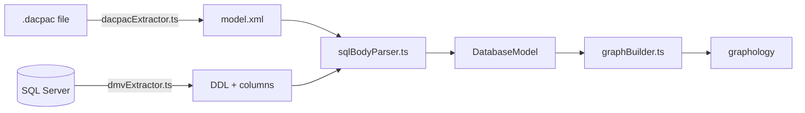
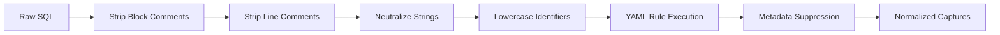

# Developer Guide

This document is the technical reference for Data Lineage Viz engineering processes. For high-level architecture, see [`ARCHITECTURE.md`](ARCHITECTURE.md).

## 1. Engineering Mandates (Stability-First)

**Priority: Stability > Performance > Features.**

- **Explicit Approval Required**: Any change to parser logic (`sqlBodyParser.ts`), AI state machines, or prompt surfaces (`extension.ts`, `aiOutputTemplates.yaml`) must be reviewed and approved.
- **Zero Regression Policy**: Any change to SQL parsing rules must result in an identical output for the baseline stored procedure set in `tests/fixtures/aw-baseline.tsv`.
- **Auditable Logic**:
    - **Metadata Driven**: SQL parsing is 100% driven by YAML metadata (`assets/defaultParseRules.yaml`).
    - **Profiling Transparency**: All generated statistics queries must be logged to the Output Channel so DBAs can verify they are non-destructive and performant.
    - **Action Logging**: Every significant action (SQL execution, file read, AI tool invocation) must be logged with category tags (`[AI]`, `[Parse]`, `[Stats]`).

## 2. Ingestion & Persistence

Both strategies produce the same `DatabaseModel` structure.

### 2.1 Dual Import Strategies
- **DACPAC Extraction**: Streams XML from unzipped `.dacpac` files. Only AdventureWorks sample dacpacs are allowed in the test fixtures.
- **DMV Extraction**: Two-phase load (Catalog then Deep-dive) defined in `assets/dmvQueries.yaml`. Always use `escapeRegexLiteral` for schema placeholders in dynamic SQL.
- **Persistence**: Managed via `projectStore.ts`. Any change to the `Project` or `FilterProfile` types requires a schema migration in `migrateProjectStore()`.

## 3. SQL Parsing Pipeline
The engine (`src/engine/sqlBodyParser.ts`) is a generic rule-runner that processes procedure bodies through a cleansing-first pipeline.

### 3.1 Cleansing Specifics
- **Comment Removal**: Stack-based counter-scan for nested `/* ... */`.
- **String Neutralization**: Replaces content with `''''` using leftmost-match to prevent false positive regex hits.
- **Metadata Suppression**: Captures matching `CLR_TYPE_METHODS` (e.g., `.nodes()`) are rejected unless bracket-quoted, which signifies intent as a catalog object.

## 4. The Bridge: IPC & Zod Validation
The Extension Host and Webview communicate via a **Zod-validated boundary**.

- **Mandate**: 100% of messages sent via `postMessage` must be validated against a Zod schema in `src/engine/shared/bridgeContract.ts`.
- **Abstraction**: `BridgeHost` decouples communication from VS Code, allowing extension logic to be unit-tested in Node.js without a browser.
- **Logging**: Standard categories: `[AI]`, `[Bridge]`, `[Config]`, `[DB]`, `[Dacpac]`, `[Parse]`, `[Project]`, `[Stats]`.

## 5. Prompt System Architecture

### 5.1 Builder Function Hierarchy
The system prompt is assembled by `buildStageSystemPrompt` in a fixed order. Adding a builder requires inserting it at the correct step in `src/ai/lineageParticipant.ts`.

1.  **`buildGeneralSystemPrompt`**: Role, platform, schemas, global invariants.
2.  **Phase Block**: `buildDiscoveryPrompt` | `buildActivePhasePrompt` | `buildSynthesisPrompt` | `buildFollowUpPrompt`.
3.  **Mode Block**: `buildModeBlock` (BB/CT) + `buildToolUsageBlock`.
4.  **YAML Injection**: `resolveStagePrompt` (Merge capture/render rules from YAML).
5.  **Context Tags**: XML slots for `<mission_brief>` and `<short_term_memory>`.

### 5.2 Hybrid Format Rule
- **Markdown Headers**: Used for static structural sections (protocols, numbered rules).
- **XML Tags**: Used for dynamic per-hop data (e.g., `<mission_brief>`, `<column_state>`) so the model can locate dynamic slots precisely.

## 6. Testing Protocol

| Tier | Command | Scope |
| :--- | :--- | :--- |
| **Unit** | `npm run test:unit` | Parsing, graph building, core logic. |
| **AI** | `npm run test:unit:ai` | State machine and memory management. |
| **Snapshot**| `npm run test:snapshot` | Parser baseline regression testing. |
| **Integration**| `npm run test:integration`| Live SQL Server connections (requires `.env`). |
| **E2E** | `npm run test:e2e` | Headless VS Code extension host tests. |
