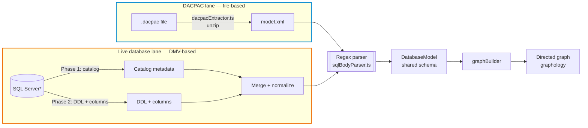
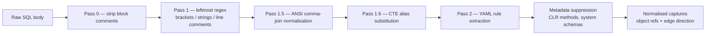

# Developer Guide

Starting point for forking and contributing. The deeper engine concepts live in [`ARCHITECTURE.md`](ARCHITECTURE.md); the YAML knobs in [`AI_PROMPTS.md`](AI_PROMPTS.md) and [`PARSE_RULES.md`](PARSE_RULES.md). Coding standards and PR hygiene live in [`../CONTRIBUTING.md`](../CONTRIBUTING.md).

## Repository layout

| Path | Owns |
|------|------|
| [`src/ai/`](../src/ai/) | `@lineage` chat participant, navigation engine (`smBase.ts`), tool provider, memory manager, prompt builders. |
| [`src/engine/`](../src/engine/) | DACPAC + DMV ingestion, regex SQL parser, profiling engine, connection manager, graph builder. |
| [`src/components/`](../src/components/) | React webview — graph canvas (React Flow), filters, detail panel, AI view card. |
| [`src/engine/shared/bridgeContract.ts`](../src/engine/shared/bridgeContract.ts) | Zod-validated message contract between extension host and webview. |
| [`src/utils/`](../src/utils/) | Logger, sanitizers, theming helpers. |
| [`assets/`](../assets/) | YAML knobs: `defaultParseRules.yaml`, `dmvQueries.yaml`, `aiOutputTemplates.yaml`, plus the demo `.dacpac`. |
| [`tests/`](../tests/) | Unit, integration, and snapshot suites. |

## Build & run

```bash
git clone https://github.com/ChrisDevRepo/vscode_data_lineage.git
cd vscode_data_lineage
npm install
```

Press <kbd>F5</kbd> to launch the Extension Development Host. The webview React bundle and the extension TypeScript are both built by `npm run watch` (started automatically by the launch config).

For a release-style local build:

```bash
npx tsc --noEmit              # type-check only
npm run package               # production webpack bundle
npx @vscode/vsce package      # produce a .vsix
```

## Two ingestion paths, one model

Both paths produce the same `DatabaseModel` consumed by `graphBuilder.ts`.

Two ingestion lanes converge on a single regex parser. The DFD shows ownership (lane = source) and phase ordering within the live-database lane.



*`SQL Server` covers SQL Server, Azure SQL, Fabric, and Synapse — same DMVs, same catalog shape. The cylinder is a UML **datastore** marker; the double-bordered parser is a UML **subroutine / composite activity** (its internals are decomposed in `PARSE_RULES.md`).

The parser has no awareness of the source. Same regex pipeline, same edge-direction inference, same YAML rules.

- **DACPAC** — [`src/engine/dacpacExtractor.ts`](../src/engine/dacpacExtractor.ts). Streams `model.xml` from the unzipped `.dacpac`. Test fixtures must be AdventureWorks only.
- **DMV** — [`src/engine/dmvExtractor.ts`](../src/engine/dmvExtractor.ts) + [`src/engine/connectionManager.ts`](../src/engine/connectionManager.ts). Two-phase load defined in [`assets/dmvQueries.yaml`](../assets/dmvQueries.yaml). DBA contract: [`DMV_QUERIES.md`](DMV_QUERIES.md).
- **Persistence** — [`src/engine/projectStore.ts`](../src/engine/projectStore.ts). Any change to the `Project` or `FilterProfile` types needs a migration in `migrateProjectStore()`.

## SQL parsing pipeline

A multi-pass cleansing engine drives a metadata-driven extractor.



`src/engine/sqlBodyParser.ts` is a generic rule-runner — every rule lives in [`assets/defaultParseRules.yaml`](../assets/defaultParseRules.yaml). The full power-user reference is [`PARSE_RULES.md`](PARSE_RULES.md). Metadata suppression centralises CLR-method filtering in `src/engine/sqlMetadata.ts`; bracket-quoted identifiers bypass it (intent signal).

## The bridge — IPC & Zod validation


Every `postMessage` hits the Zod cage in [`src/engine/shared/bridgeContract.ts`](../src/engine/shared/bridgeContract.ts) exactly once in each direction. Inner layers consume parsed types; no re-validation. Routing and handlers live in [`src/panelProvider.ts`](../src/panelProvider.ts).

Logging categories standardised across the codebase: `[AI]`, `[Bridge]`, `[Config]`, `[DB]`, `[Dacpac]`, `[Detail]`, `[Filter]`, `[Parse]`, `[Project]`, `[Stats]`. Helpers in [`src/utils/log.ts`](../src/utils/log.ts) — never call `outputChannel.*` directly.

## AI prompt builder hierarchy

`buildStageSystemPrompt` ([`src/ai/lineageParticipant.ts`](../src/ai/lineageParticipant.ts)) composes the system prompt in a fixed order. Adding a builder = inserting at the correct step. Adding a phase = extending step 2.

```
1. buildGeneralSystemPrompt          (always — role, platform, schemas, global invariants)
2. one phase-specific block:
     discover    → buildDiscoveryPrompt
     active      → buildActivePhasePrompt
                   + buildToolUsageBlock
                   + buildModeBlock(isInline, targetColumns?, classification)
                       — for isInline=true also embeds buildSynthesisPrompt() as
                         the trailing "Synthesis Contract" so the AI can call
                         present_result back-to-back with submit_findings in the
                         same agent loop (Active + Synthesis collapsed)
                       — buildColumnAspectPrompt is folded in when targetColumns set (CT)
     synthesis   → buildSynthesisPrompt
     completed   → buildDeferredQuestionsPrompt (when deferred questions exist)
               | buildFollowUpPrompt (otherwise)
3. resolveStagePrompt                 (always — YAML keys gated by stage + classification + slotCount; `closing` requires slotCount ≥ 5)
                                      For inline-active it runs twice: once for `active` (capture keys
                                      business_capture / technical_capture / structural_summary) and once
                                      for `synthesis` (summary / title / intro / closing / highlights /
                                      notes / general / loading_pattern). Both blocks ship in the same
                                      bundled brief.
4. buildMissionBriefBlock             (active + completed — <mission_brief>, <current_task>; synthesis emits no <current_task>)
5. buildMemoryBlock                   (SM active only — <short_term_memory> + tally)
```

**Synthesis output contract.** The AI submits `present_result` with structured parts: `summary`, `title`, `intro`, `sections[]` (each `{ label, node_ids[], text }` lifted verbatim from a captured slot body), `closing`, `notes[]`, `highlight_groups[]`. The engine, via `orderAndAssemble()` ([`tools.ts`](../src/ai/tools.ts)), assembles those parts into the rendered description shown in `AiDescriptionOverlay`: section numbering (`## N {label}`), object link headers (`### Objects [name](#focus-node:id)`), badge chips on the graph. The AI never writes the assembled blob; there is no AI-input `description` field. This is enforced mechanically — `PresentResultInput` omits the field — and documented across the YAML header, `buildSynthesisPrompt()`, and `STAGE_BY_KEY`.

| Function | File | Concern |
|----------|------|---------|
| `buildGeneralSystemPrompt` | `prompts.ts` | Role, platform, schemas, phase label, global invariants. |
| `buildDiscoveryPrompt` | `prompts.ts` | Search, mission_brief authoring, `start_exploration` rules. |
| `buildActivePhasePrompt(isInline)` | `prompts.ts` | Hop-loop discipline, verdict semantics, archive contract. |
| `buildSynthesisPrompt` | `prompts.ts` | Archive lift + assembly + intro/closing anchoring. |
| `buildFollowUpPrompt` | `prompts.ts` | Refinement vs re-exploration routing. |
| `buildToolUsageBlock` | `prompts.ts` | `submit_findings` / pruning usage. |
| `buildModeBlock(isInline, targetColumns?, classification)` | `smPrompts.ts` | Mode header + verdict + sections + badges + routing + pruning; CT adds column protocol. For `isInline=true` also prepends the Inline Turn Flow (two-call sequence: submit_findings → present_result) and appends the Synthesis Contract via `buildSynthesisPrompt()` (single source of truth, no duplication). |
| `buildColumnAspectPrompt` | `prompts.ts` | CT protocol block — two-channel contract, role table, terminal source rules. Injected into stable system prompt when CT is active. |
| `buildCtSynthesisBlock(edges)` | `smPrompts.ts` | CT chain summary appended to synthesis reminder. Renders accumulated `ColumnEdge[]` as a directed edge list so `present_result` anchors to the traced path. |
| `buildCurrentTaskBlock(task, columns?)` | `prompts.ts` | `<current_task>` XML block; when `columns` are passed (CT active), appends `<column_trace>` sub-block with the structural lineage sub-question. |
| `resolveStagePrompt` | `templateRenderer.ts` | YAML capture (active) + per-field synthesis keys; classification-gated; `closing` size-gated on slotCount ≥ 5. |
| `orderAndAssemble` | `tools.ts` | Engine-built description blob from AI's title + intro + sections[] + closing — sole assembly path. |
| `buildMissionBriefBlock` | `prompts.ts` | `<mission_brief>` + `<current_task>` XML blocks. |
| `buildMemoryBlock` | `prompts.ts` | `<short_term_memory>` XML block + tally line. |

**Hybrid format rule.** Markdown headers for static structural sections (protocols, numbered rules); XML tags for dynamic per-hop data so the model can locate them precisely (`<mission_brief>`, `<current_task>`, `<short_term_memory>`, `<column_trace>`).

## Testing

| Tier | Command | Scope |
|------|---------|-------|
| **Unit** | `npm test` | Parser, dacpac, graph, AI tool registration, SM robustness. |
| **AI heavy** | `npm run test:unit:ai` | State machine, memory management, prompt assembly. |
| **Snapshot** | `npm run test:snapshot` | Parser regression vs `tests/fixtures/aw-baseline.tsv`. Refresh: `npm run test:snapshot:update`. |
| **Integration** | `npm run test:integration` | Live SQL Server. Requires `.env` with `DB_SERVER`, `DB_USER`, `DB_PASSWORD`, `DB_DATABASE_AW`, `DB_DATABASE_AW_DW`. |

`tsc --noEmit` after every structural change; the type system is the first line of defence.

## Where to look first

| Changing… | Read these |
|-----------|------------|
| SQL parsing rules | [`PARSE_RULES.md`](PARSE_RULES.md), [`assets/defaultParseRules.yaml`](../assets/defaultParseRules.yaml), [`src/engine/sqlBodyParser.ts`](../src/engine/sqlBodyParser.ts). Run `npm run test:snapshot` before merge. |
| AI behaviour or prompts | [`AI_PROMPTS.md`](AI_PROMPTS.md), [`ARCHITECTURE.md`](ARCHITECTURE.md), [`src/ai/prompts.ts`](../src/ai/prompts.ts), [`src/ai/smPrompts.ts`](../src/ai/smPrompts.ts), [`assets/aiOutputTemplates.yaml`](../assets/aiOutputTemplates.yaml). |
| Tool surface or phase routing | [`src/ai/toolProvider.ts`](../src/ai/toolProvider.ts), [`src/ai/toolPolicy.ts`](../src/ai/toolPolicy.ts), [`src/ai/sessionPhase.ts`](../src/ai/sessionPhase.ts). |
| Webview (React Flow, filters, themes) | [`src/panelProvider.ts`](../src/panelProvider.ts), [`src/engine/shared/bridgeContract.ts`](../src/engine/shared/bridgeContract.ts), [`src/components/`](../src/components/). |
| DMV ingestion / DBA contract | [`DMV_QUERIES.md`](DMV_QUERIES.md), [`assets/dmvQueries.yaml`](../assets/dmvQueries.yaml), [`src/engine/dmvExtractor.ts`](../src/engine/dmvExtractor.ts). |
| Profiling SQL | [`PROFILING_PATTERNS.md`](PROFILING_PATTERNS.md), [`src/engine/profilingEngine.ts`](../src/engine/profilingEngine.ts). |
