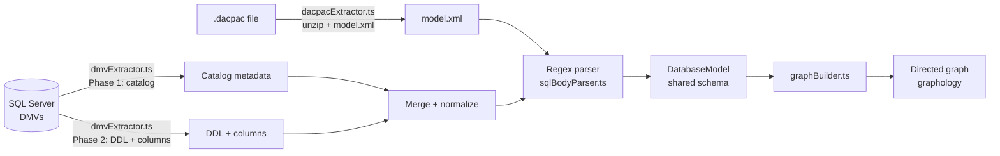
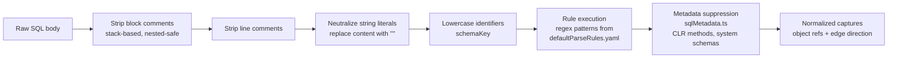
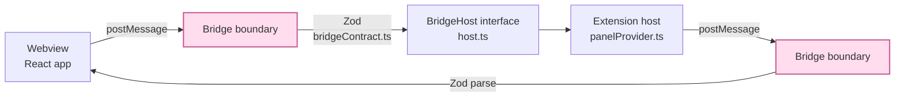
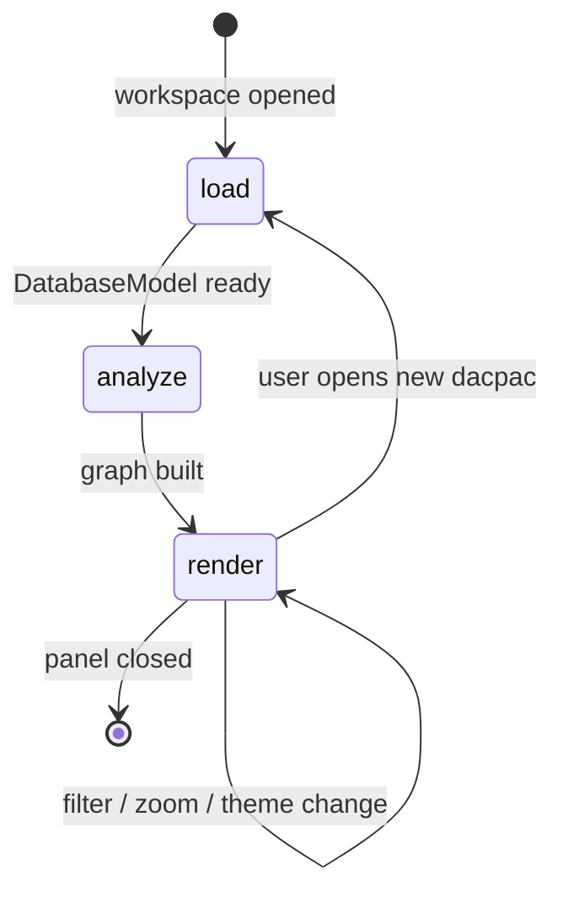
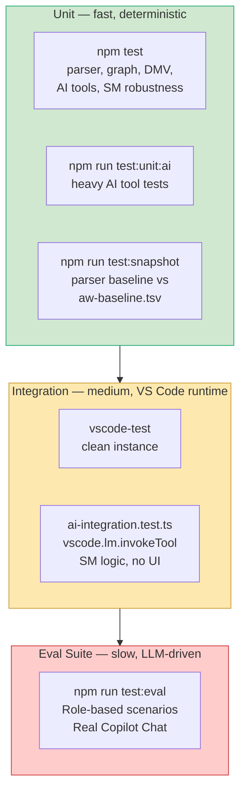
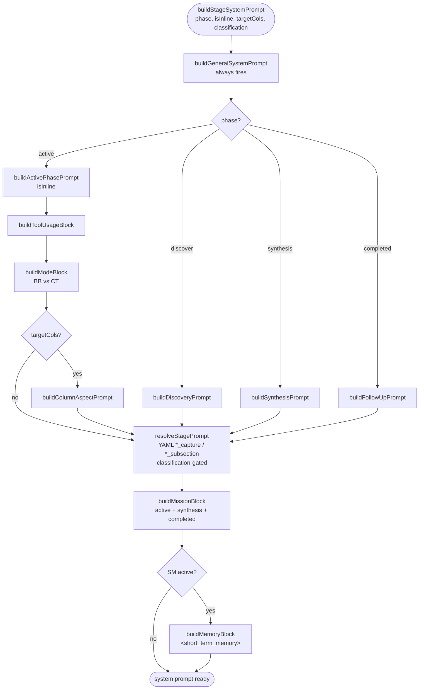

# Developer Guide: Processes & Concepts

This document is the definitive technical reference for the Data Lineage Viz extension. It covers every major architectural component, engineering process, and mandatory coding standard.

> **Related documents:** [`AI_ARCHITECTURE.md`](AI_ARCHITECTURE.md) — AI engine behavior, phases, state machines. [`AI_PROMPTS.md`](AI_PROMPTS.md) — prompt-builder hierarchy, YAML rules.

## Table of contents

1. [Core Engineering Mandates](#1-core-engineering-mandates-the-stability-first-policy)
2. [Data Ingestion: Dual Import Strategies](#2-data-ingestion-dual-import-strategies)
3. [SQL Parsing: The Regex Pipeline](#3-sql-parsing-the-regex-pipeline)
4. [The Bridge: IPC & Zod Validation](#4-the-bridge-ipc--zod-validation)
5. [UI & State Management](#5-ui--state-management)
6. [Testing & AI Verification](#6-testing--ai-verification)
7. [Developer Hygiene](#7-developer-hygiene)
8. [Prompt System Architecture](#8-prompt-system-architecture)

---

## 1. Core Engineering Mandates (The "Stability-First" Policy)

**Priority: Stability > Performance > Features.**

### 1.1 Critical Gates
- **Explicit Approval Required**: Any change to parser logic (`sqlBodyParser.ts`), AI state machines, or prompt surfaces (`extension.ts`, `aiOutputTemplates.yaml`) must be reviewed and approved.
- **Zero Regression Policy**: Any change to SQL parsing rules must result in an identical output for the baseline stored procedure set in `tests/fixtures/aw-baseline.tsv`.
    - **Baseline Composition**: Currently includes ~40 procedures (10 classic, 21 SDK-style from committed dacpacs). Customer or proprietary dacpacs must **never** be committed to this repository — only AdventureWorks fixtures are allowed under `test/`.
- **Auditable Logic**:
    - **Metadata Driven**: SQL parsing is 100% driven by YAML metadata (`assets/defaultParseRules.yaml`).
    - **Profiling Transparency**: The `profilingEngine.ts` must generate standard T-SQL. All generated statistics queries must be logged to the Output Channel so DBAs can verify they are non-destructive and performant.
    - **Action Logging**: Every significant action (SQL execution, file read, AI tool invocation) must be logged with category tags.

### 1.2 Coding Standards
- **Zod Validation**: Strict boundaries required. IPC bridge validation, tool inputs, and extension host boundaries must strictly use zod for strong type safety, runtime validation, and security.
- **DRY & OOP**: Emphasize explicit composition, reusability, and delegation. Do not duplicate logic or introduce anti-patterns to bypass structural designs. The NavigationEngine should serve as the single source of truth.
- **No Chatty Comments**: Omit overly chatty, conversational inline comments inside functions. Focus inline comments on the *why* or complex business rules, not the *what*.
- **Rigorous JSDoc**: Provide rigorous, professional JSDoc comments for all exported types, functions, classes, and properties.

---

## 2. Data Ingestion: Dual Import Strategies

Both strategies produce the same `DatabaseModel` structure.

Two inputs, one output. The parser has no awareness of which input source produced the SQL body — same regex pipeline, same edge-direction inference, same YAML rules. Testing uses DACPAC fixtures; production extensions use whichever is available.

### 2.1 DACPAC Extraction (`dacpacExtractor.ts`)
- **Mechanism**: Unzips `.dacpac` and parses `model.xml`.
- **Constraint**: Only **AdventureWorks** sample dacpacs are allowed in the public `tests/fixtures/` folder. **NEVER** commit customer dacpacs.

### 2.2 SQL/DMV Extraction (`dmvExtractor.ts`)
- **Process**: Two-phase load (Catalog then Deep-dive).
- **SQL Injection**: Always use `escapeRegexLiteral` or parameterized patterns when expanding schema placeholders.

### 2.3 Persistence (`projectStore.ts`)
- **Mandate**: All user-created projects and saved views must be managed via `projectStore.ts`.
- **Schema Versioning**: Any change to the `Project` or `FilterProfile` types must be accompanied by a version bump and a migration in `migrateProjectStore()`.
---

## 3. SQL Parsing: The Regex Pipeline

Each stage has a single responsibility. YAML rules only run against cleansed input, which is why false positives from strings and comments are impossible by construction. Metadata suppression is the last gate — bracket-quoted identifiers bypass CLR-method filtering (intent signal).

### 3.1 Metadata-Driven Extraction
- **Rules**: Extraction logic is stored in `assets/defaultParseRules.yaml`.
- **Engine**: `sqlBodyParser.ts` is a generic rule-runner. It does not contain hardcoded "SELECT" or "INSERT" regexes for business logic; it only handles the pipeline (Cleansing → Rule Execution → Normalization).

### 3.2 Cleansing Pipeline
- **Comment Removal**: Stack-based removal of nested block comments.
- **Literal Neutralization**: Replaces string content with `''''` to prevent false positive regex hits.
- **Normalization**: All identifiers must be lowercased via `schemaKey()` for consistent hashing and Map keys.

### 3.3 Metadata Suppression (`sqlMetadata.ts`)
- **Mandate**: Never hardcode a system schema or CLR method. Centralize them in this file.
- **Filtering**: Captures that match `CLR_TYPE_METHODS` (e.g., `.nodes()`, `.value()`) are rejected unless they are bracket-quoted, which signifies intent as a catalog object.

---

## 4. The Bridge: IPC & Zod Validation

Every `postMessage` hits the Zod cage exactly once in each direction. Inner layers consume parsed types; no re-validation. `BridgeHost` decouples communication from VS Code so the extension logic can be unit-tested in Node.js without a webview.

### 4.1 Type Safety (`bridgeContract.ts`)
- **Mandate**: 100% of messages sent via `postMessage` must be validated against a Zod schema.
- **Bridge Abstraction**: The `BridgeHost` interface (`host.ts`) decouples communication from VS Code, enabling the extension logic to be unit tested in Node.js.

### 4.2 Logging Protocol (`src/utils/log.ts`)
- **Standard Categories**: `[AI]`, `[Bridge]`, `[Config]`, `[DB]`, `[Dacpac]`, `[Detail]`, `[Parse]`, `[Project]`, `[Stats]`.
- **Truncation Rules (Human View)**:
    - AI Prompts/Reasoning: Max 200 chars.
    - JSON Payloads: Max 300 chars.
- **AI Truncation Rule (Semantic Integrity)**:
    - **NEVER** truncate semantic content intended for the AI Brain (DDL, column lists, results).

---

## 5. UI & State Management

### 5.1 The "God Store" (`useAppState.ts`)
- **Architecture**: The extension uses a centralized state hook to manage the lifecycle of a lineage session.
- **Key States**:
    - `loadingPhase`: Tracks `load` → `analyze` → `render`.
    - `filter`: A complex `Set`-based object for schema, type, and search filtering.
    - `aiPreview`: Transient state for AI-curated views before they are committed to the `projectStore`.
- **Constraint**: Avoid "prop drilling" by utilizing `VsCodeContext` for global singletons.

### 5.2 CSS Variables
- **Mandate**: Never hardcode hex/rgb colors in components.
- **System**: VS Code Tokens (`--vscode-*`) → Extension Aliases (`--ln-*`) in `src/index.css`.
- **Testing**: Every UI change must be verified in **Light**, **Dark**, and **High Contrast** themes.

### 5.3 Metadata-Driven AI Overlays
- **Logic**: The presentation of AI findings (sections, badges, descriptions) AND what the AI captures per hop are both driven by `assets/aiOutputTemplates.yaml`.
- **Customization**: Users override both capture and render behaviour without touching the state-machine code. Override path: VS Code setting `dataLineageViz.ai.outputTemplateFile`. Users read the YAML's `stages:` field on each key to understand where that key's instruction is injected.
- **Naming convention: phase-pure keys.** `*_capture` keys fire at ACTIVE; `*_subsection` keys fire at SYNTHESIS. No dual-stage preambles, no `CAPTURE (active phase)` / `RENDER (synthesis phase)` labels inside instruction text. The AI reads clean, phase-specific guidance without meta about phases it isn't in.
- **Stage routing — authoritative map.** `STAGE_BY_KEY` in `templateRenderer.ts` is the single source of truth for phase routing. The YAML `stages:` field on each key is informational for power users reading the YAML; a user overlay that disagrees with the canonical routing is logged (WARN) and ignored. Fallback on malformed user YAML: loader shows a VS Code notification + reverts to shipped defaults.
- **Phase assignment** — canonical mapping (source of truth: `STAGE_BY_KEY` in [`src/ai/templateRenderer.ts`](../src/ai/templateRenderer.ts)):
  - `discover` → `summary`, `description` (chat-only answers without SM — Class D routing)
  - `active` (per-hop) → `business_capture`, `technical_capture` (capture rules for `detail_analysis`)
  - `done` (synthesis) → full render set (`title`, `intro`, `sections`, `closing`, `notes`, `highlights`, `loading_pattern`, `description`, `business_subsection`, `technical_subsection`) + code-injected `**Mission type:** <value>` line
  - post-synthesis follow-up → same template set as `discover` (`summary`, `description`) plus `present_result` for re-render; see `docs/AI_PROMPTS.md § 1.5` for the closing-circle loop
- **Engine invariants stay in TS.** `buildPhaseBlock('active')` in `prompts.ts` owns the archive contract (`detail_analysis` is SOLE evidence, ANCHORING rule). `buildModeBlock` in `smPrompts.ts` owns the per-mode verdict + routing rules. LaTeX directive lives in `buildBaseBlock` (core rules) because it is tied to the webview renderer. Do not restate these in YAML.
- **Onion layers**: `src/ai/templateRenderer.ts` projects graph topology into the description — `renderMetadataBand()` prepends In/Out/Loading-Pattern between `intro` and the first section; `renderSectionObjectTable()` injects a `| Object | In | Out |` table inside any section that groups ≥ 2 nodes. Content stays AI-authored; the renderer only supplies topology. Integrated via `orderAndAssemble()` (`src/ai/tools.ts`) through the `metadataBand` + `sectionTableFor` options.
- **Classification gate** (`src/ai/classification.ts`): mission-type signal (`business | technical | both`) resolved heuristically from mission brief + user question at the active→synthesis transition. Zod-enum-validated at `AiSession.setClassification()` (boundary). Inline mode streams a one-line banner; SM mode folds the signal into the pre-existing `confirm_sm_start` messaging. `CLASSIFICATION_GATED` in `templateRenderer.ts` maps capture + subsection keys to their allowed classification values — at ACTIVE the gate is open (classification undefined → both angles fire); at SYNTHESIS it filters to the resolved value.

---

## 6. Testing & AI Verification

Run bottom-up. A parser change: `test:snapshot` first (blocks on regression). An engine change: `test:unit:ai`. A multi-tool flow change: integration. A prompt-wording change: eval.

### 6.1 Internal AI Integration Suite (The New "Eval Loop")
- **Architecture**: AI correctness is validated using `vscode-test` calling real Copilot Chat tools.
- **Tiers**:
    - **Unit AI** (`npm run test:unit:ai`): Validates tools and navigation engine logic.
    - **Eval Suite** (`npm run test:eval`): Runs deep explorations and role-based scenarios.
    - **Snapshot Suite** (`npm run test:snapshot`): Detects parser regressions against `aw-baseline.tsv`.
- **Quality Gate**: Parser changes MUST be verified via `npm run test:snapshot`. Update the baseline via `npm run test:snapshot:update` only after manual audit of the diff.

### 6.2 External Integration Tests
- **Tool**: `vscode-test` launches a clean VS Code instance.
- **Deterministic Core**: Validates dacpac loading, BFS graph traversal, and command registration without LLM dependencies.
- **AI Tool Mocking**: `src/test/suite/ai-integration.test.ts` contains programmatic tests that invoke tools directly via `vscode.lm.invokeTool` to verify SM logic with zero UI latency.

---

## 7. Developer Hygiene

- **File Size**: Decompose functions at >100 lines. Decompose components at >500 lines.
- **Type Check**: Always run `npx tsc -p tsconfig.extension.json --noEmit` before committing to the `testing` branch.
- **Versioning**: Follow the `feature/*` → `testing` → `main` branch flow.

---

## 8. Prompt System Architecture

### 8.1 Builder Function Hierarchy

All prompt text is assembled by composing pure functions. Each function owns exactly one concern.

The composition order is fixed — builders later in the pipeline see all earlier output. Adding a builder means inserting at the correct position; adding a phase means extending the `{phase?}` decision.

| Function | File | Fires when | Concern |
|---|---|---|---|
| `buildGeneralSystemPrompt(platform, schemas, phase)` | `prompts.ts` | always | Role, platform, schemas, phase label, global invariants (validate, no fabrication, LaTeX, output-shape decision) |
| `buildDiscoveryPrompt()` | `prompts.ts` | discover only | Discovery-phase protocol: search, mission_brief authoring, `start_exploration` rules |
| `buildActivePhasePrompt(isInline)` | `prompts.ts` | active only | Active-phase protocol: hop loop discipline, verdict semantics, archive contract |
| `buildSynthesisPrompt()` | `prompts.ts` | synthesis only | Synthesis-phase protocol: READ → ANSWER → GROUP → WRITE. Forces a one-sentence big-picture intro before per-section work and names variant-sibling grouping (same section + per-variant distinction lines) without compressing per-slot depth |
| `buildFollowUpPrompt()` | `prompts.ts` | completed only | Follow-up-phase protocol: refinement, not re-exploration. Text edits / prunes → re-render `present_result`; deferred-question adds → `start_exploration({ supplement })`; catalog lookups → `get_object_detail` / `search_ddl` |
| `buildToolUsageBlock()` | `prompts.ts` | active only | `submit_findings` / `get_ddl_batch` usage + routing |
| `buildModeBlock(isInline, targetColumns?)` | `smPrompts.ts` | active only | BB verdict/analysis/routing; CT = BB + column protocol |
| `buildColumnAspectPrompt(targetColumns)` | `prompts.ts` | CT active only | `<column_state>` XML block (column-trace context) |
| `resolveStagePrompt(templates, phase, cls)` | `templateRenderer.ts` | always | YAML `*_capture` (active) + `*_subsection` (synthesis) rules. `completed` passes `'synthesis'` so re-renders keep the same formatting contract |
| `buildMissionBlock(brief, q, task)` | `prompts.ts` | active + synthesis + completed | `<mission_brief>` + `<current_task>` XML blocks |
| `buildMemoryBlock(stm, tally, hop, n)` | `prompts.ts` | SM active only | `<short_term_memory>` XML block + tally line |

Composition lives at [`src/ai/lineageParticipant.ts:309-353`](../src/ai/lineageParticipant.ts#L309-L353) `buildStageSystemPrompt`.

### 8.2 Condition Matrix

Four axes drive what fires: **phase** (discover/active/synthesis/completed), **execution** (SM/inline), **nav mode** (BB/CT), **classification** (undefined/business/technical/both).

| Block | discover | active-SM-BB | active-SM-CT | active-inline | synthesis | completed |
|---|:---:|:---:|:---:|:---:|:---:|:---:|
| `buildGeneralSystemPrompt` | ✅ | ✅ | ✅ | ✅ | ✅ | ✅ |
| `buildDiscoveryPrompt` | ✅ | — | — | — | — | — |
| `buildActivePhasePrompt` | — | ✅ | ✅ | ✅ | — | — |
| `buildSynthesisPrompt` | — | — | — | — | ✅ | — |
| `buildFollowUpPrompt` | — | — | — | — | — | ✅ |
| `buildToolUsageBlock` | — | ✅ | ✅ | ✅ | — | — |
| `buildModeBlock(BB)` | — | ✅ | — | ✅ (BB) | — | — |
| `buildModeBlock(CT)` | — | — | ✅ | ✅ (CT) | — | — |
| `buildColumnAspectPrompt` | — | — | ✅ | ✅ (CT) | — | — |
| `resolveStagePrompt` (YAML) | ✅* | ✅* | ✅* | ✅* | ✅** | ✅** |
| `buildMissionBlock` | — | ✅ | ✅ | ✅ | ✅ | ✅ |
| `buildMemoryBlock` | — | ✅ | ✅ | — | — | — |

`*` active: classification=undefined → both `business_capture` and `technical_capture` fire.  
`**` synthesis / completed: `business_subsection`/`technical_subsection` gated by resolved classification. `completed` reuses the synthesis YAML so `present_result` re-renders keep the same formatting contract.

### 8.3 Hybrid Markdown + XML Format

- **Markdown headers** for static structural sections (protocols, numbered rules, verdict tables).
- **XML tags** only for dynamic per-hop data that rules already reference by name:
  - `<mission_brief>` — filled from `engine.memory.getMissionBrief()`
  - `<current_task>` — filled from `engine.getCurrentTask()`
  - `<short_term_memory>` — filled from `engine.memory.getShortTermMemory()`
  - `<column_state>` — filled from `engine.columnAspect` (CT only, inside `buildModeBlock`)

This matches the Anthropic guidance: XML tags for precise slot identification of dynamic content; Markdown for document structure.

### 8.4 What Moves Out of Tool Result JSON

The following fields were previously in the `getHopContext()` JSON return and are being moved to the system prompt:

| Field | Was in JSON | Now in system prompt via |
|---|---|---|
| `mission_brief` | `HopContext.mission_brief` | `buildMissionBlock` |
| `current_task` | `HopContext.current_task` | `buildMissionBlock` |
| `working_memory.short_term_memory` | `WorkingMemory.short_term_memory` | `buildMemoryBlock` |
| `working_memory.tally` | `WorkingMemory.tally` | `buildMemoryBlock` |

Remaining in JSON: `sm_status`, `hop`, `agenda_remaining`, `focus_node` (DDL), `neighbors`, `working_memory.checklist`, `working_memory.approved_border`, `working_memory.topological_map`, `working_memory.recent_rejections`, `working_memory.column_aspect`.

### 8.5 Agenda Composition — Bipartite Rule

Canonical specification lives in [AI_ARCHITECTURE.md → Bipartite Analysis Model](AI_ARCHITECTURE.md#bipartite-analysis-model). Summary for prompt authors: the agenda contains only bodied nodes (view / proc / function); tables are routable + inspectable but never a hop focus; `NavigationEngine.enqueueHop` in [`src/ai/smBase.ts`](../src/ai/smBase.ts) is the single funnel that enforces this. The consequence for `<current_task>` — inherited intent through edge contraction — is why no "table-hop" prompt variant exists.

Test coverage: [`tests/unit/navigation-engine-bipartite.test.ts`](../tests/unit/navigation-engine-bipartite.test.ts).

### 8.6 Adding or Changing Prompts

Key rules:
1. Every prompt change must target a specific builder function in [`src/ai/prompts.ts`](../src/ai/prompts.ts) or [`src/ai/smPrompts.ts`](../src/ai/smPrompts.ts). No free-form strings in [`src/ai/lineageParticipant.ts`](../src/ai/lineageParticipant.ts).
2. Changes to YAML `*_capture` and `*_subsection` keys must be paired — a capture change without the matching subsection change drifts content from capture to render.
3. Run `npm test` after every change (see [`TESTING.md`](TESTING.md)).

### 8.7 Completed Phase — Follow-Up Protocol & Supplement Flow

Canonical state-machine specification: [AI_ARCHITECTURE.md → Phase-Boundary Contract for Prompt Authors](AI_ARCHITECTURE.md#phase-boundary-contract-for-prompt-authors) and [The Four Lifecycle Phases](AI_ARCHITECTURE.md#the-four-lifecycle-phases). What remains here is implementation detail for the engineering audience:

**Transition trigger.** `dispatchExit('final_answer')` (when `sess.stateMachine?.status === 'complete'`) calls `sess.enterCompleted()`. Two log lines fire: INFO `[Phase] synthesis → completed — archive slots=N, deferred=M` + DEBUG `[Phase] follow-up ready — …`.

**Next-turn routing.** `handleChatRequest` detects `sess.phase.kind === 'completed' && chatContext.history.length > 0` and sets `activePhase = 'completed'`. Tool filter in `toolPolicy.ts` exposes: `present_result`, `get_object_detail`, `search_ddl`, `search_objects`, `start_exploration`. Prompt = `buildFollowUpPrompt()` + synthesis-stage YAML + `<mission_brief>`.

**Archive delivery.** No new accessor on `AiMemoryManager`. The prior `submit_findings` tool_result (containing `detail_slots[]`) rides into the next turn via `chatContext.history` replay — `historyManager` compacts stale hop results but preserves the final synthesis result.

**Supplement-agenda flow (`supplement: { nodeIds }`).** Handler: (1) validates `status === 'complete'` — else returns `supplement_requires_complete_engine`; (2) calls `engine.supplementAgenda(nodeIds)` — ids flow through `enqueueHop` (bipartite rule holds, body-less ids contract), `_inlineMode = true`, `_status` flips to `awaiting_findings`; unknown ids returned in `{ agendaed, contracted, skipped }`; (3) `sess.enterExploring()`; (4) returns first hop context. New `storeDetail` calls merge into existing `detailSlots` (no reset). Bypasses `confirm_sm_start` by design — user consented to the parent.

**Fresh `start_exploration` from completed** logs `[Phase] completed → discover`, calls `sess.resetExploration()`, proceeds on the normal fresh-SM path.

Test coverage: [`tests/unit/navigation-engine-supplement.test.ts`](../tests/unit/navigation-engine-supplement.test.ts) — 21 assertions.
