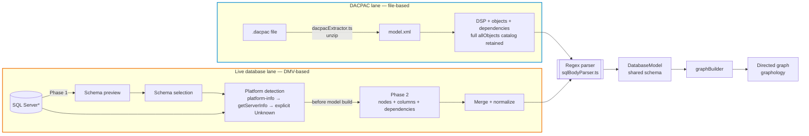
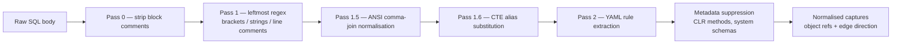
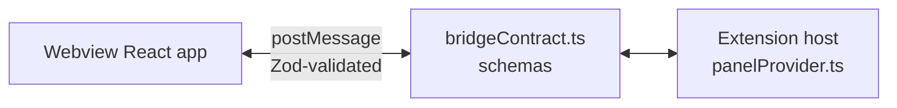

# Developer Guide

Starting point for forking and contributing. The deeper engine concepts live in [`ARCHITECTURE.md`](ARCHITECTURE.md); the YAML knobs in [`AI_PROMPTS.md`](AI_PROMPTS.md) and [`PARSE_RULES.md`](PARSE_RULES.md). Coding standards and PR hygiene live in [`../CONTRIBUTING.md`](../CONTRIBUTING.md).

## Repository layout

| Path | Owns |
|------|------|
| [`src/ai/`](../src/ai/) | `@lineage` chat participant, navigation engine (`smBase.ts`), tool provider, memory manager, prompt builders. |
| [`src/engine/`](../src/engine/) | DACPAC + DMV ingestion, regex SQL parser, profiling engine, connection manager, graph builder. |
| [`src/components/`](../src/components/) | React webview — graph canvas (React Flow), filters, detail panel, AI view card. |
| [`src/engine/shared/bridgeContract.ts`](../src/engine/shared/bridgeContract.ts) | Zod-validated message contract between extension host and webview. |
| [`src/utils/`](../src/utils/) | Logger, sanitizers, theming helpers. |
| [`assets/`](../assets/) | YAML knobs: `defaultParseRules.yaml`, `dmvQueries.yaml`, `aiOutputTemplates.yaml`, plus the demo `.dacpac`. |
| [`tests/`](../tests/) | Unit suite plus the optional AI-backend host check. |

## Build & run

```bash
git clone https://github.com/ChrisDevRepo/vscode_data_lineage.git
cd vscode_data_lineage
npm ci
```

Press <kbd>F5</kbd> to build the extension host and webview bundles and launch
the Extension Development Host. The extension host uses a small activation entry
that registers Quick Actions before loading its runtime bundle. **Run Extension
(Watch)** starts the extension-bundle watcher only;
rebuild the webview with `npm run build:webview` after React/CSS changes.

For a release-style local build:

```bash
npm run typecheck             # type-check only
npm run build                 # esbuild extension + Vite webview
npm run package               # package with the pinned local @vscode/vsce
```

`@vscode/vsce` is an exact-version development dependency. Both packaging and
the package-content gate use that installed local CLI; they do not invoke
`npx`, fetch from the network, or depend on an `npx` cache.

## Two ingestion paths, one model

Both paths produce the same `DatabaseModel` consumed by `graphBuilder.ts`.

Two ingestion lanes converge on a single parser. The DFD shows ownership (lane
= source) and phase ordering within the live-database lane.


```mermaid
flowchart LR
    subgraph DACPAC[DACPAC lane — file-based]
        DP[.dacpac file] -->|dacpacExtractor.ts<br/>unzip| MX[model.xml]
        MX --> DX["DSP + objects + dependencies<br/>full allObjects catalog retained"]
    end
    subgraph LIVE[Live database lane — DMV-based]
        SRV[(SQL Server*)] -->|Phase 1| CAT[Schema preview]
        CAT --> SELECT[Schema selection]
        SELECT --> PI["Platform detection<br/>platform-info → getServerInfo → explicit Unknown"]
        SRV --> PI
        PI -->|before model build| DDL["Phase 2<br/>nodes + columns + dependencies"]
        DDL --> MERGE[Merge + normalize]
    end
    DX --> PARSE[[Regex parser<br/>sqlBodyParser.ts]]
    MERGE --> PARSE
    PARSE --> DM[DatabaseModel<br/>shared schema]
    DM --> GB[graphBuilder] --> G[Directed graph<br/>graphology]

    style DACPAC stroke:#0288d1,stroke-width:2px
    style LIVE stroke:#ef6c00,stroke-width:2px
```

*`SQL Server` covers SQL Server, Azure SQL, Fabric, and Synapse — same DMVs, same catalog shape. The cylinder is a UML **datastore** marker; the double-bordered parser is a UML **subroutine / composite activity** (its internals are decomposed in `PARSE_RULES.md`).

The parser has no awareness of the source. Both lanes use the same
preprocessing, YAML extraction rules, normalization, and edge-direction logic.

Each extractor stamps `DatabaseModel.source` (`'dacpac'` or `'database'`) on the model
it returns; `buildModel` itself stays lane-agnostic. Anything describing the model to
the user or the AI must read that field rather than infer provenance from other
metadata — in particular `dbPlatform` is not a proxy, because a DACPAC derives a
platform label from its DSP exactly as a live import derives one from the server.

- **DACPAC** — [`src/engine/dacpacExtractor.ts`](../src/engine/dacpacExtractor.ts). Streams `model.xml` from the unzipped `.dacpac`, derives `dbPlatform` from its DSP, and retains the full lightweight `allObjects` catalog for dependency resolution. Known DSPs map to platform labels; completely unrecognized DSP text is preserved raw instead of being labelled SQL Server. Test fixtures must be AdventureWorks only.
- **DMV** — [`src/engine/dmvExtractor.ts`](../src/engine/dmvExtractor.ts) + [`src/engine/connectionManager.ts`](../src/engine/connectionManager.ts). After schema selection, platform detection completes before the selected-schema model is built: `platform-info` is preferred, authoritative MSSQL `getServerInfo` metadata is the non-failing fallback, and failure of both records `Unknown database platform`. The former database `all-objects` query and result pipeline were unreachable and are removed; this does not remove the active DACPAC `allObjects` catalog. Query definitions and the DBA contract live in [`assets/dmvQueries.yaml`](../assets/dmvQueries.yaml) and [`DMV_QUERIES.md`](DMV_QUERIES.md).
- **Persistence** — [`src/engine/projectStore.ts`](../src/engine/projectStore.ts). Any change to the `Project` or `FilterProfile` types needs a migration in `migrateProjectStore()`. Records that fail validation are discarded, so the read schema and the write path must stay in agreement: `StoredConnectionInfoSchema` is `.strict()` on read, and `stripSensitiveFields()` selects the same schema's declared keys on write rather than removing known secrets. That direction matters — the mssql extension's connection object is wider than the partial `IConnectionInfo` declaration in this repo, so copying the remainder persisted fields the read side then rejected, silently dropping a saved database project. Keep `.strict()`: it is what keeps a future leaked credential out of the store.

## SQL parsing pipeline

A multi-pass cleansing engine drives a metadata-driven extractor.


```mermaid
flowchart LR
    IN[Raw SQL body] --> C1[Pass 0 — strip block comments]
    C1 --> C2[Pass 1 — leftmost regex<br/>brackets / strings / line comments]
    C2 --> C3[Pass 1.5 — ANSI comma-join normalisation]
    C3 --> C4[Pass 1.6 — CTE alias substitution]
    C4 --> RE[Pass 2 — YAML rule extraction]
    RE --> SUP[Metadata suppression<br/>CLR methods, system schemas]
    SUP --> CAP[Normalised captures<br/>object refs + edge direction]
```

Extraction regexes live in
[`assets/defaultParseRules.yaml`](../assets/defaultParseRules.yaml).
`src/engine/sqlBodyParser.ts` owns the built-in preprocessing passes,
normalization, rule execution, and dependency resolution. The full reference
is [`PARSE_RULES.md`](PARSE_RULES.md). Metadata suppression
centralises CLR-method filtering in
[`src/engine/shared/sqlMetadata.ts`](../src/engine/shared/sqlMetadata.ts);
bracket-quoted identifiers bypass it (intent signal).

## Host/webview boundary


```mermaid
flowchart LR
    WV[Webview React app] <-->|postMessage<br/>Zod-validated| BC[bridgeContract.ts<br/>schemas]
    BC <--> EXT[Extension host<br/>panelProvider.ts]
```

Messages crossing the host/webview boundary are parsed with the Zod schemas in
[`src/engine/shared/bridgeContract.ts`](../src/engine/shared/bridgeContract.ts)
before handlers consume them. Main-panel routing starts in
[`src/panelProvider.ts`](../src/panelProvider.ts); detail-panel handlers live
under [`src/bridge/`](../src/bridge/).

Use the helpers in [`src/utils/log.ts`](../src/utils/log.ts) for extension
logging. They normalize output-channel text and keep severity/category handling
consistent. User-facing errors and warnings must go through the notification
helpers rather than raw output-channel calls.

## AI runtime boundary

`@lineage` always uses the exact `ChatRequest.model` selected by VS Code. The
extension has no provider, endpoint, credential, fallback-model, or model-picker
configuration. AI dependencies receive the loaded lineage snapshot only; they
cannot connect to a database, execute SQL, refresh ingestion, or start
profiling.

The participant in
[`src/ai/participant/lineageParticipant.ts`](../src/ai/participant/lineageParticipant.ts)
adapts native requests, history, cancellation, progress, and buttons. It does
not own prompt construction or the exploration loop. The outer graph in
[`src/ai/agent/graph.ts`](../src/ai/agent/graph.ts) owns phases, semantic retries,
interrupts, and synthesis; `NavigationEngine` in
[`src/ai/sm/smBase.ts`](../src/ai/sm/smBase.ts) owns agenda, topology, gates,
validation, and termination.

Prompt builders live under [`src/ai/prompting/`](../src/ai/prompting/), with
stage assembly in
[`src/ai/agent/stagePrompts.ts`](../src/ai/agent/stagePrompts.ts) and one-call
planning in
[`src/ai/agent/instructionPlan.ts`](../src/ai/agent/instructionPlan.ts). Active
hops use bounded rolling context rather than replaying the full exploration;
synthesis receives the archived findings and engine-owned lifecycle/provenance
state. Tool calls go through the canonical registry, phase policy, and strict
Zod dispatcher under [`src/ai/tools/`](../src/ai/tools/).

The AI authors semantic findings and structured presentation fields. The engine
validates all mutations, keeps the final graph connected to its origin, and
assembles the rendered description from structured result parts. See
[`ARCHITECTURE.md`](ARCHITECTURE.md) for ownership and
[`AI_PROMPTS.md`](AI_PROMPTS.md) for the customization contract.

## Testing

The framework has three logical suites over two runners: Core and AI use
Vitest; optional E2E uses VS Code Electron. SQL parsing and graph traversal
remain protected Core subsets and must not shrink.

| Tier | Command | Scope |
|------|---------|-------|
| **Full local gate** | `npm run gate` | Type-checking, unit tests, builds, and package checks. Run before push; GitHub does not run tests. |
| **Unit suite** | `npm test` | Every maintained unit test. Use the runner output for current totals. |
| **Protected core** | `npm run test:core` | Parser and engine unit projects. |
| **AI units** | `npm run test:ai` | Deterministic AI-core and state-machine logic with a stubbed VS Code API and model doubles; no external model. |
| **Core subsets** | `npm run test:parser`, `npm run test:bfs` | Focused parser or graph traversal/analysis verification. |
| **Test type-checking** | `npm run typecheck:tests` | Type-checks `tests/unit/**` against production source. |
| **Optional E2E suite** | `npm run test:e2e` | Runs the extension in real VS Code. Two labels deliberately have no model; two use a local scripted provider. No external model is contacted. See [`E2E_TESTING.md`](E2E_TESTING.md). |

Run `npm run typecheck` after every structural change; the type system is the
first line of defence.

The AI backend and participant-turn test lanes use deterministic scripted
language-model fixtures registered through the real public `vscode.lm` API.
They verify extension/API wiring with fixed responses; they do not perform
inference, contact an external model provider, or require or read an API key.
Model reasoning and the rendered Chat UI remain outside the automated suite.
Real-provider or manual UAT runs are separate lanes and must be started
explicitly with the required provider credentials.

## AI runtime evidence

Production writes no AI NDJSON by default. Run **Data Lineage: Enable AI Trace
Logging for This Session** from the Command Palette to enable the single
session-scoped writer in
[`src/ai/observability/aiTraceWriter.ts`](../src/ai/observability/aiTraceWriter.ts).
It records lifecycle metadata and full model/tool diagnostics until the
extension host restarts. An open workspace folder is required; files are written
under that workspace's `tmp/lm-trace/` directory, and the command reports the
exact output path in a VS Code notification. Failed provider requests are paired
with a sanitized `wire-error` record in the same file, so enabling the trace does
not change the Data Lineage Viz output-channel log level or open VS Code's
log-level picker. The NDJSON writer resets when the extension host restarts.

The diagnostics contain prompts, model responses, tool definitions and
payloads, database identifiers, and SQL. Enable logging only while gathering
evidence, never commit its output, and review it before sharing.

## Where to look first

| Changing… | Read these |
|-----------|------------|
| SQL parsing rules | [`PARSE_RULES.md`](PARSE_RULES.md), [`assets/defaultParseRules.yaml`](../assets/defaultParseRules.yaml), [`src/engine/sqlBodyParser.ts`](../src/engine/sqlBodyParser.ts). Run `npm run test:parser`; there is no snapshot-update workflow. |
| AI behaviour or prompts | [`AI_PROMPTS.md`](AI_PROMPTS.md), [`ARCHITECTURE.md`](ARCHITECTURE.md), [`src/ai/prompting/prompts.ts`](../src/ai/prompting/prompts.ts), [`src/ai/prompting/smPrompts.ts`](../src/ai/prompting/smPrompts.ts), [`assets/aiOutputTemplates.yaml`](../assets/aiOutputTemplates.yaml). |
| Tool surface, phase routing, or process guards | [`src/ai/tools/toolProvider.ts`](../src/ai/tools/toolProvider.ts), [`src/ai/tools/toolPolicy.ts`](../src/ai/tools/toolPolicy.ts), [`src/ai/session/sessionPhase.ts`](../src/ai/session/sessionPhase.ts), [`src/ai/interaction/rules/`](../src/ai/interaction/rules/). |
| Webview (React Flow, filters, themes) | [`src/panelProvider.ts`](../src/panelProvider.ts), [`src/engine/shared/bridgeContract.ts`](../src/engine/shared/bridgeContract.ts), [`src/components/`](../src/components/). |
| DMV ingestion / DBA contract | [`DMV_QUERIES.md`](DMV_QUERIES.md), [`assets/dmvQueries.yaml`](../assets/dmvQueries.yaml), [`src/engine/dmvExtractor.ts`](../src/engine/dmvExtractor.ts). |
| Profiling SQL | [`PROFILING_PATTERNS.md`](PROFILING_PATTERNS.md), [`src/engine/profilingEngine.ts`](../src/engine/profilingEngine.ts). |
