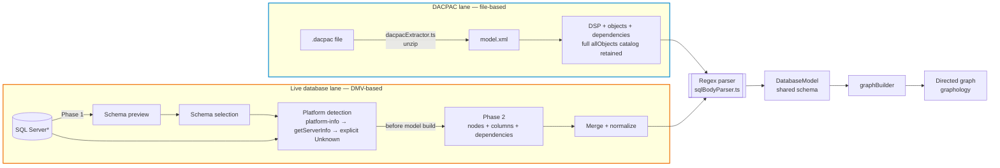
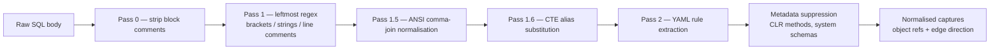
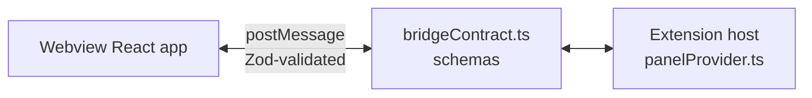

# Developer Guide

Starting point for forking and contributing. The deeper engine concepts live in [`ARCHITECTURE.md`](ARCHITECTURE.md); the YAML knobs in [`AI_PROMPTS.md`](AI_PROMPTS.md) and [`PARSE_RULES.md`](PARSE_RULES.md). Coding standards and PR hygiene live in [`../CONTRIBUTING.md`](../CONTRIBUTING.md).

## Repository layout

| Path | Owns |
|------|------|
| [`src/ai/`](../src/ai/) | `@lineage` chat participant, navigation engine (`smBase.ts`), tool provider, memory manager, prompt builders. |
| [`src/engine/`](../src/engine/) | DACPAC + DMV ingestion, regex SQL parser, profiling engine, connection manager, graph builder. |
| [`src/components/`](../src/components/) | React webview — graph canvas (React Flow), filters, detail panel, AI view card. |
| [`src/engine/shared/bridgeContract.ts`](../src/engine/shared/bridgeContract.ts) | Zod-validated message contract between extension host and webview. |
| [`src/utils/`](../src/utils/) | Logger, sanitizers, theming helpers. |
| [`assets/`](../assets/) | YAML knobs: `defaultParseRules.yaml`, `dmvQueries.yaml`, `aiOutputTemplates.yaml`, plus the demo `.dacpac`. |
| [`tests/`](../tests/) | `unit/` Vitest suites, `integration/` Electron smoke lanes, plus `fixtures/`, `stubs/`, and `tools/`. |

## Build & run

```bash
git clone https://github.com/ChrisDevRepo/vscode_data_lineage.git
cd vscode_data_lineage
npm ci
```

Press <kbd>F5</kbd> to build the extension host and webview bundles and launch
the Extension Development Host. The extension host uses a small activation entry
that registers Quick Actions before loading its runtime bundle. **Run Extension
(Watch)** starts the extension-bundle watcher only;
rebuild the webview with `npm run build:webview` after React/CSS changes.

For a release-style local build:

```bash
npm run typecheck             # type-check only
npm run build                 # esbuild extension + Vite webview
npm run package               # package with the pinned local @vscode/vsce
```

`@vscode/vsce` is an exact-version development dependency. Both packaging and
the package-content gate use that installed local CLI; they do not invoke
`npx`, fetch from the network, or depend on an `npx` cache.

## Two ingestion paths, one model

Both paths produce the same `DatabaseModel` consumed by `graphBuilder.ts`.

Two ingestion lanes converge on a single parser. The DFD shows ownership (lane
= source) and phase ordering within the live-database lane.


```mermaid
flowchart LR
    subgraph DACPAC[DACPAC lane — file-based]
        DP[.dacpac file] -->|dacpacExtractor.ts<br/>unzip| MX[model.xml]
        MX --> DX["DSP + objects + dependencies<br/>full allObjects catalog retained"]
    end
    subgraph LIVE[Live database lane — DMV-based]
        SRV[(SQL Server*)] -->|Phase 1| CAT[Schema preview]
        CAT --> SELECT[Schema selection]
        SELECT --> PI["Platform detection<br/>platform-info → getServerInfo → explicit Unknown"]
        SRV --> PI
        PI -->|before model build| DDL["Phase 2<br/>nodes + columns + dependencies"]
        DDL --> MERGE[Merge + normalize]
    end
    DX --> PARSE[[Regex parser<br/>sqlBodyParser.ts]]
    MERGE --> PARSE
    PARSE --> DM[DatabaseModel<br/>shared schema]
    DM --> GB[graphBuilder] --> G[Directed graph<br/>graphology]

    style DACPAC stroke:#0288d1,stroke-width:2px
    style LIVE stroke:#ef6c00,stroke-width:2px
```

*`SQL Server` covers SQL Server, Azure SQL, Fabric, and Synapse — same DMVs, same catalog shape. The cylinder is a UML **datastore** marker; the double-bordered parser is a UML **subroutine / composite activity** (its internals are decomposed in `PARSE_RULES.md`).

The parser has no awareness of the source. Both lanes use the same
preprocessing, YAML extraction rules, normalization, and edge-direction logic.

Each extractor stamps `DatabaseModel.source` (`'dacpac'` or `'database'`) on the model
it returns; `buildModel` itself stays lane-agnostic. Anything describing the model to
the user or the AI must read that field rather than infer provenance from other
metadata — in particular `dbPlatform` is not a proxy, because a DACPAC derives a
platform label from its DSP exactly as a live import derives one from the server.

- **DACPAC** — [`src/engine/dacpacExtractor.ts`](../src/engine/dacpacExtractor.ts). Streams `model.xml` from the unzipped `.dacpac`, derives `dbPlatform` from its DSP, and retains the full lightweight `allObjects` catalog for dependency resolution. Known DSPs map to platform labels; completely unrecognized DSP text is preserved raw instead of being labelled SQL Server. Test fixtures must be AdventureWorks only.
- **DMV** — [`src/engine/dmvExtractor.ts`](../src/engine/dmvExtractor.ts) + [`src/engine/connectionManager.ts`](../src/engine/connectionManager.ts). After schema selection, platform detection completes before the selected-schema model is built: `platform-info` is preferred, authoritative MSSQL `getServerInfo` metadata is the non-failing fallback, and failure of both records `Unknown database platform`. The live lane has no whole-database object catalog; the `allObjects` catalog is DACPAC-only. Query definitions and the DBA contract live in [`assets/dmvQueries.yaml`](../assets/dmvQueries.yaml) and [`DMV_QUERIES.md`](DMV_QUERIES.md).
- **Persistence** — [`src/engine/projectStore.ts`](../src/engine/projectStore.ts). Any change to the `Project` or `FilterProfile` types needs a migration in `migrateProjectStore()`. Reading and writing apply different strictness, and the split is load-bearing. On read, `ProjectReadSchema` drops fields it does not recognise: a record written by an older build legitimately carries keys this one never declared, and a project is discarded only when a field the schema *requires* is missing or of the wrong type. Every nested object reachable from a persisted record is rebuilt without `.strict()` — one strict level below the top would discard the whole project over a single unrecognised key, which is the loss that shape exists to prevent. On the write and webview paths `StoredConnectionInfoSchema` stays `.strict()`, and `stripSensitiveFields()` selects that schema's declared keys rather than removing known secrets. That direction matters — the mssql extension's connection object is wider than the partial `IConnectionInfo` declaration in this repo, so copying the remainder persists fields the contract never sanctioned. Keep `.strict()` there: it is what keeps a future leaked credential out of the store.
- **AI run records** — [`src/ai/session/runStore.ts`](../src/ai/session/runStore.ts). One record per AI-authored bookmark, held in `globalState` under `dataLineageViz.aiRun.<bookmarkId>` beside the project store rather than inside it, so a run checkpoint never enters the `FilterProfile` contract. `save-view` writes it only when `buildStoredRun` matches the profile's `aiMetadata.runId` to the checkpoint captured by `present_result`; `delete-view` clears it, and `delete-project` clears the record of every profile the project held. Every write and clear is guarded — a failure logs a warning and leaves the bookmark save or project delete successful — and a record over `MAX_STORED_RUN_CHARS` is skipped rather than written, because `globalState` is not a place for multi-megabyte values. `lineage_get_screen_state` is the only reader, through `readStoredRun`, which is fail-closed on `schemaVersion`: a missing, older, or foreign-shaped record answers `no_run_memory`.

## SQL parsing pipeline

A multi-pass cleansing engine drives a metadata-driven extractor.


```mermaid
flowchart LR
    IN[Raw SQL body] --> C1[Pass 0 — strip block comments]
    C1 --> C2[Pass 1 — leftmost regex<br/>brackets / strings / line comments]
    C2 --> C3[Pass 1.5 — ANSI comma-join normalisation]
    C3 --> C4[Pass 1.6 — CTE alias substitution]
    C4 --> RE[Pass 2 — YAML rule extraction]
    RE --> SUP[Metadata suppression<br/>CLR methods, system schemas]
    SUP --> CAP[Normalised captures<br/>object refs + edge direction]
```

Extraction regexes live in
[`assets/defaultParseRules.yaml`](../assets/defaultParseRules.yaml).
`src/engine/sqlBodyParser.ts` owns the built-in preprocessing passes,
normalization, rule execution, and dependency resolution. The full reference
is [`PARSE_RULES.md`](PARSE_RULES.md). Metadata suppression
centralises CLR-method and system-schema filtering in
[`src/engine/shared/sqlMetadata.ts`](../src/engine/shared/sqlMetadata.ts).

## Host/webview boundary


```mermaid
flowchart LR
    WV[Webview React app] <-->|postMessage<br/>Zod-validated| BC[bridgeContract.ts<br/>schemas]
    BC <--> EXT[Extension host<br/>panelProvider.ts]
```

Messages crossing the host/webview boundary are parsed with the Zod schemas in
[`src/engine/shared/bridgeContract.ts`](../src/engine/shared/bridgeContract.ts)
before handlers consume them. Main-panel routing starts in
[`src/panelProvider.ts`](../src/panelProvider.ts); detail-panel handlers live
under [`src/bridge/`](../src/bridge/).

Use the helpers in [`src/utils/log.ts`](../src/utils/log.ts) for extension
logging. They normalize output-channel text and keep severity/category handling
consistent. User-facing errors and warnings must go through the notification
helpers rather than raw output-channel calls.

## AI runtime boundary

`@lineage` always uses the exact `ChatRequest.model` selected by VS Code. The
extension has no provider, endpoint, credential, fallback-model, or model-picker
configuration. AI dependencies receive the loaded lineage snapshot only; they
cannot connect to a database, execute SQL, refresh ingestion, or start
profiling.

The participant in
[`src/ai/participant/lineageParticipant.ts`](../src/ai/participant/lineageParticipant.ts)
adapts native requests, history, cancellation, progress, and buttons. It does
not own prompt construction or the exploration loop. The outer graph in
[`src/ai/agent/graph.ts`](../src/ai/agent/graph.ts) owns phases, semantic retries,
interrupts, and synthesis; `NavigationEngine` in
[`src/ai/sm/smBase.ts`](../src/ai/sm/smBase.ts) owns agenda, topology, gates,
validation, and termination.

Prompt builders live under [`src/ai/prompting/`](../src/ai/prompting/), with
stage assembly in
[`src/ai/agent/stagePrompts.ts`](../src/ai/agent/stagePrompts.ts) and one-call
planning in
[`src/ai/agent/instructionPlan.ts`](../src/ai/agent/instructionPlan.ts). Active
hops use bounded rolling context rather than replaying the full exploration;
synthesis receives the archived findings and engine-owned lifecycle/provenance
state. Tool calls go through the canonical registry, phase policy, and strict
Zod dispatcher under [`src/ai/tools/`](../src/ai/tools/).

The AI authors semantic findings and structured presentation fields. The engine
validates all mutations, keeps the final graph connected to its origin, and
assembles the rendered description from structured result parts. See
[`ARCHITECTURE.md`](ARCHITECTURE.md) for ownership and
[`AI_PROMPTS.md`](AI_PROMPTS.md) for the customization contract.

## Testing

The framework has two logical suites over two runners: Core and Agent runtime
use Vitest; optional Electron smoke lanes are a separate, optional tier. SQL
parsing and graph traversal remain protected Core subsets and must not shrink.

| Tier | Command | Scope |
|------|---------|-------|
| **Full local gate** | `npm run gate` | Type-checking, tool-manifest drift, the AI template schema-version gate, unit tests, builds, and package checks. Run before push; GitHub does not run tests. |
| **Unit suite** | `npm test` | Every maintained unit test. Use the runner output for current totals. |
| **Protected core** | `npm run test:core` | Parser and engine unit projects. |
| **Agent runtime** | `npm run test:runtime` | Deterministic agent-runtime and state-machine logic with a stubbed VS Code API and model doubles. Zero model calls — not an AI test. |
| **Core subsets** | `npm run test:parser`, `npm run test:bfs` | Focused parser or graph traversal/analysis verification. |
| **Test type-checking** | `npm run typecheck:tests` | Type-checks `tests/unit/**` against production source. |
| **Optional Electron lanes** | `npm run test:edh` | Runs the extension in a real VS Code host across four smoke labels. Three deliberately have no provider; one uses a local scripted one. No external model is contacted, so this is not end-to-end in the product sense. See [`EDH_TESTING.md`](EDH_TESTING.md). |

Run `npm run typecheck` after every structural change; the type system is the
first line of defence.

The `participant-turn` lane uses a deterministic scripted language-model
fixture registered through the real public `vscode.lm` API. It verifies
extension/API wiring with fixed responses; it does not perform
inference, contact an external model provider, or require or read an API key.
Model reasoning and the rendered Chat UI remain outside the automated suite.
Real-provider or manual UAT runs are separate lanes and must be started
explicitly with the required provider credentials.

## AI runtime evidence

Production writes no AI NDJSON by default. Run **Data Lineage: Enable AI Trace
Logging for This Session** from the Command Palette to enable the single
session-scoped writer in
[`src/ai/observability/aiTraceWriter.ts`](../src/ai/observability/aiTraceWriter.ts).
It records lifecycle metadata and full model/tool diagnostics until the
extension host restarts. An open workspace folder is required; files are written
under that workspace's `tmp/lm-trace/` directory, and the command reports the
exact output path in a VS Code notification. Failed provider requests are paired
with a sanitized `wire-error` record in the same file, so enabling the trace does
not change the Data Lineage Viz output-channel log level or open VS Code's
log-level picker. The NDJSON writer resets when the extension host restarts.

The diagnostics contain prompts, model responses, tool definitions and
payloads, database identifiers, and SQL. Enable logging only while gathering
evidence, never commit its output, and review it before sharing.

### Reading the trace

**Check line 1 first.** Every trace opens with a `trace-open` record naming its
producer: `extension-host` is a live VS Code session and is valid evidence about
shipped behaviour; `headless-harness` is a capture from the local harness, which
runs the production runtime as a plain Node process against a substituted model
port and is not evidence about a real VS Code session. The
two write the same schema to the same filename pattern, so without that record a
harness capture reads exactly like a UAT one — including its transport
behaviour, which belongs to the harness rather than to the extension. Harness
logs additionally open with a `[harness] RUN ORIGIN:` banner.

Group every lifecycle record by `requestId`; the wire records additionally group
by `generation`. Three details decide most diagnoses:

- **A consent gate is not a rejection.** A gate returns through the rejection
  envelope but is never charged against the semantic budget, so its `tool` record
  carries `status: "gate"`. Counting `status: "rejected"` alone gives the real
  rejection count.
- **A gate pairs with its outcome through `gateId`.** The `gate` record is raised
  by the turn; the answering click is recorded separately as `gate-resolution`,
  because resolution happens in a command handler outside the turn. Its `outcome`
  distinguishes `accepted` from `refused`, and a refusal names the deciding
  condition in `refusedBy`. Without that pair, a card the user could not resolve
  looks identical to one they ignored.
- **Rejections raised without a tool call are still recorded.** A missing
  required terminal tool produces a `tool` record with `durationMs: 0` even
  though no dispatch occurred, so the failures the model was charged for are
  countable from the NDJSON alone.

Lifecycle records carry enumerated codes, counters, and dotted field paths only —
never rejection prose. A turn that *ends* on a rejection has that prose solely in
the `Data Lineage Viz` output channel; `rejectionCode`, `issuePaths`, and
`turn-terminal.reason` are what make it diagnosable from the trace. Provider token
counts are absent by design on this path: `vscode.lm` reports none, so `usage` is
omitted rather than zeroed.

### Transport failures versus provider verdicts

The extension imposes no deadline on a generation that is producing output — VS
Code and Copilot own request lifetime, and a second deadline would fight theirs.
The one exception is the zero-output window: a generation that streams nothing at
all is cancelled after `FIRST_OUTPUT_TIMEOUT_MS`, because a provider that never
starts is indistinguishable from a hung connection and nothing else bounds that
path. The first streamed chunk of any kind disarms the watchdog for the rest of
the generation. What the runtime otherwise owns is the distinction between a
request that failed to complete and a provider that answered:

- A **transport failure** (a Node connection code, or a Chromium `net::ERR_*`
  token recovered from the message because Electron attaches no `code`) ends the
  attempt; the phase does not retry it. The classification still decides
  disposition: an active hop that already submitted findings salvages them as
  partial coverage instead of failing the turn.
- An **empty generation** — no tool call and no text under
  `toolChoice: 'required'` — is likewise a transport artifact and is never
  charged to the semantic (repair) budget, which no correction could spend
  usefully.
- Anything else is a provider verdict and fails the turn as before.

The distinction also decides what the user is told. `vscode.lm` reports a
connection loss as `LanguageModelError` code `Unknown` with the host's own
network-layer message, which is boilerplate rather than a diagnosis — the same
"check your firewall rules" sentence arrives with a connection timeout and with
an HTTP/2 protocol error. The transport branch of
`describeProviderErrorForUser` therefore reports the **code chain only**, so the
line carries one remedy instead of two; the full message stays in the debug log
and the trace diagnostic. A provider verdict keeps its message, because there
the prose is the answer rather than advice about the connection.

When a phase exhausts a budget after hops have already submitted findings, the
exploration is synthesised from the archive rather than discarded, so completed
work still reaches the user as partial coverage.

## Where to look first

| Changing… | Read these |
|-----------|------------|
| SQL parsing rules | [`PARSE_RULES.md`](PARSE_RULES.md), [`assets/defaultParseRules.yaml`](../assets/defaultParseRules.yaml), [`src/engine/sqlBodyParser.ts`](../src/engine/sqlBodyParser.ts). Run `npm run test:parser`; there is no snapshot-update workflow. |
| AI behaviour or prompts | [`AI_PROMPTS.md`](AI_PROMPTS.md), [`ARCHITECTURE.md`](ARCHITECTURE.md), [`src/ai/prompting/prompts.ts`](../src/ai/prompting/prompts.ts), [`src/ai/prompting/smPrompts.ts`](../src/ai/prompting/smPrompts.ts), [`assets/aiOutputTemplates.yaml`](../assets/aiOutputTemplates.yaml). |
| Tool surface, phase routing, or process guards | [`src/ai/tools/toolProvider.ts`](../src/ai/tools/toolProvider.ts), [`src/ai/tools/toolPolicy.ts`](../src/ai/tools/toolPolicy.ts), [`src/ai/session/sessionPhase.ts`](../src/ai/session/sessionPhase.ts), [`src/ai/interaction/rules/`](../src/ai/interaction/rules/). |
| Webview (React Flow, filters, themes) | [`src/panelProvider.ts`](../src/panelProvider.ts), [`src/engine/shared/bridgeContract.ts`](../src/engine/shared/bridgeContract.ts), [`src/components/`](../src/components/). |
| DMV ingestion / DBA contract | [`DMV_QUERIES.md`](DMV_QUERIES.md), [`assets/dmvQueries.yaml`](../assets/dmvQueries.yaml), [`src/engine/dmvExtractor.ts`](../src/engine/dmvExtractor.ts). |
| Profiling SQL | [`PROFILING_PATTERNS.md`](PROFILING_PATTERNS.md), [`src/engine/profilingEngine.ts`](../src/engine/profilingEngine.ts). |
