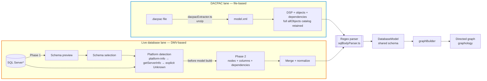
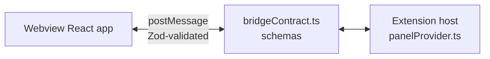

# Developer Guide

How to build, run, and change this extension after a fork. Engine concepts:
[`ARCHITECTURE.md`](ARCHITECTURE.md). YAML knobs: [`AI_PROMPTS.md`](AI_PROMPTS.md)
and [`PARSE_RULES.md`](PARSE_RULES.md). Coding standards:
[`../CONTRIBUTING.md`](../CONTRIBUTING.md).

## Toolchain

| Tool | Requirement | Declared in |
|------|-------------|-------------|
| Node.js | `>=20` | `engines.node` in [`package.json`](../package.json) |
| npm | `>=10` | `engines.npm` in [`package.json`](../package.json) |
| VS Code | `^1.101.0` | `engines.vscode` in [`package.json`](../package.json) |

Install with `npm ci` after cloning and after any pull that touches
`package.json` or `package-lock.json`. A `node_modules` tree carried over from
another machine or lockfile resolves stale packages — delete it and run
`npm ci` again.

The repo replaces LangChain's transitive `langsmith` dependency with an inert
local stub via npm `overrides`. Some npm 10.x releases leave
`node_modules/langsmith` as a dangling symlink; the `postinstall` script
[`scripts/repair-langsmith-stub.mjs`](../scripts/repair-langsmith-stub.mjs)
copies the stub into place. Run it by hand if `node_modules` was copied
instead of installed, or if the bundle fails with `Could not resolve "langsmith"`.

## Repository layout

| Path | Owns |
|------|------|
| [`src/ai/`](../src/ai/) | `@lineage` chat participant, navigation engine (`smBase.ts`), tool provider, memory manager, prompt builders. |
| [`src/engine/`](../src/engine/) | DACPAC + DMV ingestion, regex SQL parser, profiling engine, connection manager, graph builder, display-mode policy, node decoration, column-trace projection. Engine-owned node-data types (`CustomNodeData`, `ColumnTraceNodeData`) live here; the webview imports them. |
| [`src/components/`](../src/components/) | React webview — graph canvas (React Flow), filters, detail panel, AI report column, column-trace nodes/edges. |
| [`src/engine/shared/bridgeContract.ts`](../src/engine/shared/bridgeContract.ts) | Zod-validated message contract between extension host and webview. |
| [`src/utils/`](../src/utils/) | Logger, sanitizers, theming helpers. |
| [`assets/`](../assets/) | YAML knobs: `defaultParseRules.yaml`, `dmvQueries.yaml`, `aiOutputTemplates.yaml`, plus the demo `.dacpac`. |
| [`tests/`](../tests/) | `unit/` Vitest suites, `integration/` Electron smoke lanes, plus `fixtures/`, `stubs/`, and `tools/`. |

## Build and run

```bash
git clone https://github.com/ChrisDevRepo/vscode_data_lineage.git
cd vscode_data_lineage
npm ci
```

Press <kbd>F5</kbd> to build the extension host and webview bundles and launch
the Extension Development Host. **Run Extension (Watch)** starts the
extension-bundle watcher only; rebuild the webview with `npm run build:webview`
after React/CSS changes.

```bash
npm run typecheck             # type-check only
npm run build                 # esbuild extension + Vite webview
npm run package               # package with the pinned local @vscode/vsce
```

`@vscode/vsce` is an exact-version development dependency. Packaging uses
`--no-dependencies`: every production dependency is bundled into `out/` and
`dist/` before packaging, and `vsce`'s `npm ls` pass misreports npm
`overrides` as `invalid`. Pass `--no-dependencies` to a direct `vsce package`
or `vsce publish` as well.

**Excluding a file from the VSIX takes three edits.** `vsce` never reads
`.gitignore`. A new pattern needs an entry in [`.gitignore`](../.gitignore),
[`.vscodeignore`](../.vscodeignore), and the forbidden list in
[`tests/tools/assert-package-contents.mjs`](../tests/tools/assert-package-contents.mjs).

## Two ingestion paths, one model

Both paths produce the same `DatabaseModel` consumed by `graphBuilder.ts`.


```mermaid
flowchart LR
    subgraph DACPAC[DACPAC lane — file-based]
        DP[.dacpac file] -->|dacpacExtractor.ts<br/>unzip| MX[model.xml]
        MX --> DX["DSP + objects + dependencies<br/>full allObjects catalog retained"]
    end
    subgraph LIVE[Live database lane — DMV-based]
        SRV[(SQL Server*)] -->|Phase 1| CAT[Schema preview]
        CAT --> SELECT[Schema selection]
        SELECT --> PI["Platform detection<br/>platform-info → getServerInfo → explicit Unknown"]
        SRV --> PI
        PI -->|before model build| DDL["Phase 2<br/>nodes + columns + dependencies"]
        DDL --> MERGE[Merge + normalize]
    end
    DX --> PARSE[[Regex parser<br/>sqlBodyParser.ts]]
    MERGE --> PARSE
    PARSE --> DM[DatabaseModel<br/>shared schema]
    DM --> GB[graphBuilder] --> G[Directed graph<br/>graphology]

    style DACPAC stroke:#0288d1,stroke-width:2px
    style LIVE stroke:#ef6c00,stroke-width:2px
```

*`SQL Server` covers SQL Server, Azure SQL, Fabric, and Synapse — same DMVs,
same catalog shape.

The parser has no awareness of the source. Both lanes use the same
preprocessing, YAML extraction rules, normalization, and edge-direction logic.

Each extractor stamps `DatabaseModel.source` (`'dacpac'` or `'database'`) on
the model it returns; `buildModel` itself stays lane-agnostic. Read that field
rather than inferring provenance from other metadata — `dbPlatform` is not a
proxy, because a DACPAC derives a platform label from its DSP exactly as a
live import derives one from the server.

- **DACPAC** — [`src/engine/dacpacExtractor.ts`](../src/engine/dacpacExtractor.ts).
  Streams `model.xml` from the unzipped `.dacpac`, derives `dbPlatform` from
  its DSP, and retains the full lightweight `allObjects` catalog. Known DSPs
  map to platform labels; unrecognized DSP text is preserved raw. Test
  fixtures must be AdventureWorks only.
- **DMV** — [`src/engine/dmvExtractor.ts`](../src/engine/dmvExtractor.ts) +
  [`src/engine/connectionManager.ts`](../src/engine/connectionManager.ts).
  After schema selection, platform detection completes before the
  selected-schema model is built: `platform-info` is preferred, MSSQL
  `getServerInfo` is the non-failing fallback, and failure of both records
  `Unknown database platform`. Query definitions live in
  [`assets/dmvQueries.yaml`](../assets/dmvQueries.yaml) and
  [`DMV_QUERIES.md`](DMV_QUERIES.md).
- **Persistence** — [`src/engine/projectStore.ts`](../src/engine/projectStore.ts).
  On read, unrecognized fields are dropped; a project is discarded only when a
  required field is missing or of the wrong type. On write,
  `StoredConnectionInfoSchema` stays `.strict()` so undeclared connection
  fields (including credentials) never enter the store. Any change to
  `Project` or `FilterProfile` needs a migration in `migrateProjectStore()`.
- **AI run records** — [`src/ai/session/runStore.ts`](../src/ai/session/runStore.ts).
  One record per AI-authored bookmark, held in `globalState` under
  `dataLineageViz.aiRun.<bookmarkId>`. `lineage_get_screen_state` is the only
  reader.

## SQL parsing pipeline


```mermaid
flowchart LR
    IN[Raw SQL body] --> C1[Pass 0 — strip block comments]
    C1 --> C2[Pass 1 — leftmost regex<br/>brackets / strings / line comments]
    C2 --> C3[Pass 1.5 — ANSI-92 comma-join normalisation]
    C3 --> C4[Pass 1.6 — CTE alias substitution]
    C4 --> PRE[Optional YAML preprocessing rules]
    PRE --> RE[YAML rule extraction]
    RE --> SUP[Metadata suppression<br/>CLR methods, system schemas]
    SUP --> CAP[Normalised captures<br/>object refs + edge direction]
```

Extraction regexes live in
[`assets/defaultParseRules.yaml`](../assets/defaultParseRules.yaml).
`src/engine/sqlBodyParser.ts` owns the built-in preprocessing passes,
normalization, rule execution, and dependency resolution. The full reference
is [`PARSE_RULES.md`](PARSE_RULES.md). Metadata suppression lives in
[`src/engine/shared/sqlMetadata.ts`](../src/engine/shared/sqlMetadata.ts).

## Host/webview boundary


```mermaid
flowchart LR
    WV[Webview React app] <-->|postMessage<br/>Zod-validated| BC[bridgeContract.ts<br/>schemas]
    BC <--> EXT[Extension host<br/>panelProvider.ts]
```

Messages crossing the host/webview boundary are parsed with the Zod schemas in
[`src/engine/shared/bridgeContract.ts`](../src/engine/shared/bridgeContract.ts)
before handlers consume them. Main-panel routing starts in
[`src/panelProvider.ts`](../src/panelProvider.ts); detail-panel handlers live
under [`src/bridge/`](../src/bridge/).

Use the helpers in [`src/utils/log.ts`](../src/utils/log.ts) for extension
logging. User-facing errors and warnings must go through the notification
helpers rather than raw output-channel calls.

`src/engine/` code never names `window` directly: a layout or build diagnostic
raised in `graphBuilder.ts` goes through a `setGraphLogSink` callback the
webview entry point installs at startup. The layer-direction gate step
enforces the other half: `src/engine/**` must never import from
`src/components/**`.

## AI runtime boundary

`@lineage` always uses the exact `ChatRequest.model` selected by VS Code. The
extension has no provider, endpoint, credential, fallback-model, or
model-picker configuration. AI dependencies receive the loaded lineage
snapshot only; they cannot connect to a database, execute SQL, refresh
ingestion, or start profiling.

The participant in
[`src/ai/participant/lineageParticipant.ts`](../src/ai/participant/lineageParticipant.ts)
adapts native requests, history, cancellation, progress, and buttons. The
outer graph in [`src/ai/agent/graph.ts`](../src/ai/agent/graph.ts) owns
phases, semantic retries, interrupts, and synthesis; `NavigationEngine` in
[`src/ai/sm/smBase.ts`](../src/ai/sm/smBase.ts) owns agenda, topology, gates,
validation, and termination.

Prompt builders live under [`src/ai/prompting/`](../src/ai/prompting/), with
stage assembly in
[`src/ai/agent/stagePrompts.ts`](../src/ai/agent/stagePrompts.ts) and one-call
planning in
[`src/ai/agent/instructionPlan.ts`](../src/ai/agent/instructionPlan.ts). Tool
calls go through the canonical registry, phase policy, and strict Zod
dispatcher under [`src/ai/tools/`](../src/ai/tools/).

The AI authors semantic findings and structured presentation fields. The
engine validates all mutations, keeps the final graph connected to its
origin, and assembles the rendered description from structured result parts.
See [`ARCHITECTURE.md`](ARCHITECTURE.md) and [`AI_PROMPTS.md`](AI_PROMPTS.md).

## Testing

SQL parsing and graph traversal remain protected Core subsets and must not
shrink. GitHub does not run this test framework.

| Tier | Command | Scope |
|------|---------|-------|
| **Full local gate** | `npm run gate` | Type-checking, tool-manifest drift, output-template schema version, prompt golden sync, honest test labels, core case completeness, unit-project coverage, layer-direction, core coverage floors, unit tests, builds, and package checks. Run before push. |
| **Unit suite** | `npm test` | Every maintained unit test. |
| **Protected core** | `npm run test:core` | Parser, engine, and webview unit projects. |
| **Core coverage floors** | `npm run coverage:core` | Per-file thresholds on `sqlBodyParser.ts`, `graphAnalysis.ts`, `graphBuilder.ts`, `shared/sqlRegex.ts`, `shared/nodeIdResolution.ts`. |
| **Agent runtime** | `npm run test:runtime` | Deterministic agent-runtime and state-machine logic with a stubbed VS Code API. Zero model calls. |
| **Core subsets** | `npm run test:parser`, `npm run test:bfs` | Focused parser or graph traversal/analysis. |
| **Test type-checking** | `npm run typecheck:tests` | Type-checks `tests/unit/**` against production source. |
| **Optional Electron lanes** | `npm run test:edh` | Four smoke labels in a real VS Code host. See [`EDH_TESTING.md`](EDH_TESTING.md). |

Assert with vitest `expect`, and give each case its own `it` (or an `it.each`
table).

What earns a test outside the protected core (`sm/`, `ai-core/`):
one decisive assertion per behaviour, placed in the file that owns the module,
not a new file per fix. These do not earn one: a duplicate of a path another
test already asserts, a value-only variant (use `it.each`), a pin on prompt,
hint or log wording (internal suite only), a regex over `src/` text (unless it
guards a security or layering boundary), a legacy or removed path, and an
assertion that only exercises a test double. A trim keeps each red→green
proof's decisive assertion and must lose no `src/**` statement or branch
coverage, measured before and after. A new SQL parser case is cheapest as an `-- EXPECT` fixture under
`tests/fixtures/sql/targeted/` rather than as TypeScript.

Layout tests with ≥1500 nodes need the enlarged stack in
[`vitest.config.ts`](../vitest.config.ts)
(`test.execArgv: ['--stack-size=8000']`). Keep that entry top-level: Vitest 4
ignores `poolOptions.*.execArgv`.

## Diagnostics

**Data Lineage: Enable AI Trace Logging for This Session** writes NDJSON under
the workspace `tmp/lm-trace/` until the extension host restarts. An open
workspace folder is required. The files contain prompts, model responses,
tool payloads, and SQL — enable only while gathering evidence, never commit
them, and review before sharing.

**Data Lineage: Dump AI State Machine** writes the current exploration state
to `tmp/sm-dumps/` (an open workspace and an active hop-by-hop exploration
are required; a bounded graph preview has no state machine to dump).

## Where to look first

| Changing… | Read these |
|-----------|------------|
| SQL parsing rules | [`PARSE_RULES.md`](PARSE_RULES.md), [`assets/defaultParseRules.yaml`](../assets/defaultParseRules.yaml), [`src/engine/sqlBodyParser.ts`](../src/engine/sqlBodyParser.ts). Run `npm run test:parser`. |
| AI behaviour or prompts | [`AI_PROMPTS.md`](AI_PROMPTS.md), [`ARCHITECTURE.md`](ARCHITECTURE.md), [`src/ai/prompting/`](../src/ai/prompting/), [`assets/aiOutputTemplates.yaml`](../assets/aiOutputTemplates.yaml). |
| Tool surface, phase routing, or process guards | [`src/ai/tools/toolProvider.ts`](../src/ai/tools/toolProvider.ts), [`src/ai/tools/toolPolicy.ts`](../src/ai/tools/toolPolicy.ts), [`src/ai/session/sessionPhase.ts`](../src/ai/session/sessionPhase.ts), [`src/ai/interaction/rules/`](../src/ai/interaction/rules/). |
| Webview (React Flow, filters, themes) | [`src/panelProvider.ts`](../src/panelProvider.ts), [`src/engine/shared/bridgeContract.ts`](../src/engine/shared/bridgeContract.ts), [`src/engine/graphDisplayMode.ts`](../src/engine/graphDisplayMode.ts), [`src/engine/nodeDecoration.ts`](../src/engine/nodeDecoration.ts), [`src/engine/columnTraceView.ts`](../src/engine/columnTraceView.ts), [`src/components/`](../src/components/). |
| DMV ingestion / DBA contract | [`DMV_QUERIES.md`](DMV_QUERIES.md), [`assets/dmvQueries.yaml`](../assets/dmvQueries.yaml), [`src/engine/dmvExtractor.ts`](../src/engine/dmvExtractor.ts). |
| Profiling SQL | [`PROFILING_PATTERNS.md`](PROFILING_PATTERNS.md), [`src/engine/profilingEngine.ts`](../src/engine/profilingEngine.ts). |
