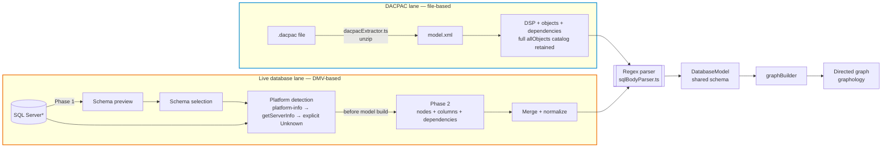
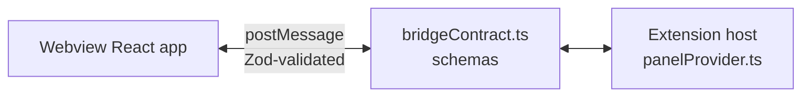

# Developer Guide

How to build, run, and change this extension after a fork. Engine concepts:
[`ARCHITECTURE.md`](ARCHITECTURE.md). YAML knobs: [`AI_PROMPTS.md`](AI_PROMPTS.md)
and [`PARSE_RULES.md`](PARSE_RULES.md). Coding standards:
[`../CONTRIBUTING.md`](../CONTRIBUTING.md).

## Toolchain

| Tool | Requirement | Declared in |
|------|-------------|-------------|
| Node.js | `>=20` | `engines.node` in [`package.json`](../package.json) |
| npm | `>=10` | `engines.npm` in [`package.json`](../package.json) |
| VS Code | `^1.101.0` | `engines.vscode` in [`package.json`](../package.json) |

Install with `npm ci` after cloning and after any pull that touches
`package.json` or `package-lock.json`. Use `npm ci` to replace a stale or copied `node_modules` tree.

The repo replaces LangChain's transitive `langsmith` dependency with an inert
local stub via npm `overrides`. Some npm 10.x releases leave
`node_modules/langsmith` as a dangling symlink; the `postinstall` script
[`scripts/repair-langsmith-stub.mjs`](../scripts/repair-langsmith-stub.mjs)
copies the stub into place. Run it by hand if `node_modules` was copied
instead of installed, or if the bundle fails with `Could not resolve "langsmith"`.

LangChain's core dependency is pinned. Runtime tracing guards reject enabled
LangSmith/LangChain tracing, and the bundle gate checks that the real LangSmith
client is absent. See [`ARCHITECTURE.md`](ARCHITECTURE.md#history-privacy-and-no-egress-boundary).

## Repository layout

| Path | Owns |
|------|------|
| [`src/ai/`](../src/ai/) | `@lineage` chat participant, navigation engine (`smBase.ts`), tool provider, memory manager, prompt builders. |
| [`src/engine/`](../src/engine/) | DACPAC + DMV ingestion, regex SQL parser, profiling engine, connection manager, graph builder, display-mode policy, node decoration, column-trace projection. Engine-owned node-data types (`CustomNodeData`, `ColumnTraceNodeData`) live here; the webview imports them. |
| [`src/components/`](../src/components/) | React webview — graph canvas (React Flow), filters, detail panel, AI report column, column-trace nodes/edges. |
| [`src/engine/shared/bridgeContract.ts`](../src/engine/shared/bridgeContract.ts) | Zod-validated message contract between extension host and webview. |
| [`src/utils/`](../src/utils/) | Logger, sanitizers, theming helpers. |
| [`assets/`](../assets/) | YAML knobs: `defaultParseRules.yaml`, `dmvQueries.yaml`, `aiOutputTemplates.yaml`, plus the demo `.dacpac`. |
| [`tests/`](../tests/) | `unit/` Vitest suites, `integration/` Electron smoke lanes, plus `fixtures/`, `stubs/`, and `tools/`. |

## Build and run

```bash
git clone https://github.com/ChrisDevRepo/vscode_data_lineage.git
cd vscode_data_lineage
npm ci
```

Press <kbd>F5</kbd> to build the extension host and webview bundles and launch
the Extension Development Host. **Run Extension (Watch)** builds the webview
once, then starts the extension-bundle watcher; rebuild the webview with
`npm run build:webview` after React/CSS changes.

Machine requirements for each test tier, including headless Linux, are in
[`testing/ENVIRONMENTS.md`](testing/ENVIRONMENTS.md).

```bash
npm run typecheck             # type-check only
npm run build                 # esbuild extension + Vite webview
npm run package               # package with the pinned local @vscode/vsce
```

`@vscode/vsce` is an exact-version development dependency. Packaging uses
`--no-dependencies`: every production dependency is bundled into `out/` and
`dist/` before packaging, and `vsce`'s `npm ls` pass misreports npm
`overrides` as `invalid`. Pass `--no-dependencies` to a direct `vsce package`
or `vsce publish` as well.

**Excluding a file from the VSIX takes three edits.** `vsce` never reads
`.gitignore`. A new pattern needs an entry in [`.gitignore`](../.gitignore),
[`.vscodeignore`](../.vscodeignore), and the forbidden list in
[`tests/tools/assert-package-contents.mjs`](../tests/tools/assert-package-contents.mjs).

## Two ingestion paths, one model

Both paths produce the same `DatabaseModel` consumed by `graphBuilder.ts`.


```mermaid
flowchart LR
    subgraph DACPAC[DACPAC lane — file-based]
        DP[.dacpac file] -->|dacpacExtractor.ts<br/>unzip| MX[model.xml]
        MX --> DX["DSP + objects + dependencies<br/>full allObjects catalog retained"]
    end
    subgraph LIVE[Live database lane — DMV-based]
        SRV[(SQL Server*)] -->|Phase 1| CAT[Schema preview]
        CAT --> SELECT[Schema selection]
        SELECT --> PI["Platform detection<br/>platform-info → getServerInfo → explicit Unknown"]
        SRV --> PI
        PI -->|before model build| DDL["Phase 2<br/>nodes + columns + dependencies"]
        DDL --> MERGE[Merge + normalize]
    end
    DX --> PARSE[[Regex parser<br/>sqlBodyParser.ts]]
    MERGE --> PARSE
    PARSE --> DM[DatabaseModel<br/>shared schema]
    DM --> GB[graphBuilder] --> G[Directed graph<br/>graphology]

    style DACPAC stroke:#0288d1,stroke-width:2px
    style LIVE stroke:#ef6c00,stroke-width:2px
```

*The live lane supports SQL Server, Azure SQL, Fabric Data Warehouse, and
Synapse Dedicated SQL Pool. Platform-specific query availability is covered in
[`DMV_QUERIES.md`](DMV_QUERIES.md).

The parser has no awareness of the source. Both lanes use the same
preprocessing, YAML extraction rules, normalization, and edge-direction logic.

Each extractor stamps `DatabaseModel.source` (`'dacpac'` or `'database'`) on
the model it returns; `buildModel` itself stays lane-agnostic. Read that field
rather than inferring provenance from other metadata — `dbPlatform` is not a
proxy, because a DACPAC derives a platform label from its DSP exactly as a
live import derives one from the server.

- **DACPAC** — [`src/engine/dacpacExtractor.ts`](../src/engine/dacpacExtractor.ts).
  Reads `model.xml` from the `.dacpac` ZIP archive, derives `dbPlatform` from
  its DSP, and retains the full lightweight `allObjects` catalog. Known DSPs
  map to platform labels; unrecognized DSP text is preserved raw.
- **DMV** — [`src/engine/dmvExtractor.ts`](../src/engine/dmvExtractor.ts) +
  [`src/engine/connectionManager.ts`](../src/engine/connectionManager.ts).
  After schema selection, platform detection completes before the
  selected-schema model is built: `platform-info` is preferred, the session's
  `getServerInfo` is the non-failing fallback, and failure of both records
  `Unknown database platform`. A built-in session skips the fallback, because its
  `getServerInfo` sends the same `platform-info` query. Query definitions live in
  [`assets/dmvQueries.yaml`](../assets/dmvQueries.yaml) and
  [`DMV_QUERIES.md`](DMV_QUERIES.md). A change to the SQL sent to a live
  database ships the matching `DMV_QUERIES.md` update in the same commit.
  Each import reads the YAML again; the panel keeps the last load for the
  built-in provider's server-info lookup (table statistics) and drops it when
  `dataLineageViz.dmvQueriesFile` names another file.
- **Connection providers** — [`src/engine/db/`](../src/engine/db/). `connectDatabase`
  returns a `DbSession` through `dataLineageViz.database.connectionProvider`:
  `mssqlExtension` (default) or `builtIn`. Saved built-in connections live in
  `dataLineageViz.database.connections` with passwords in `SecretStorage`.
  Connection errors are presented by `connectionErrors.ts`. Tests:
  [`tests/unit/engine/db/`](../tests/unit/engine/db/); the `builtIn` tests assert
  the mssql extension is never touched. Contract: [Database connection providers](#database-connection-providers).
- **Persistence** — [`src/engine/projectStore.ts`](../src/engine/projectStore.ts).
  On read, unrecognized fields are dropped; a project is discarded only when a
  required field is missing or of the wrong type. Invalid optional saved views
  are skipped individually, preserving their project and other views. A saved
  scope with an empty object list stays empty; an absent list is unrestricted.
  Legacy workspace connection keys are removed only after a valid connection
  has been saved to the project store. On write,
  `StoredConnectionInfoSchema` ([`bridgeContract.ts`](../src/engine/shared/bridgeContract.ts)) stays `.strict()` so undeclared connection
  fields (including credentials) never enter the store. Any change to
  `Project` or `FilterProfile` needs a reviewed compatibility path. Optional
  `nodeIdEncodingVersion: 2` marks explicit current saves; legacy views reconcile
  in memory when opened and their archived records remain unchanged.
- **AI run records** — [`src/ai/session/runStore.ts`](../src/ai/session/runStore.ts).
  One record per AI-authored bookmark, held in `globalState` under
  `dataLineageViz.aiRun.<bookmarkId>`. `present_result` stamps the run ID onto
  the view metadata and, once the presentation commits, captures the engine
  checkpoint onto the session's presentation artifact; a failed capture is
  logged at debug and never fails the answer. A bookmark save writes the record
  only when the profile is AI-authored and its run ID matches the captured
  presentation; a failed write logs a warning and the bookmark still saves.
  `delete-view` and `delete-project` clear the record, and a new route that
  removes a saved view must clear it too. Reads tolerate top-level keys from a
  newer build; a record of another `schemaVersion` or with an invalid snapshot
  reads as absent. A recall with `ids` or `filter` then uses the session's
  completed run, and `lineage_get_screen_state` answers `no_run_memory` only when
  neither exists. The record is never truncated for size.
  `lineage_get_screen_state` is the only reader.

## Database connection providers

Live ingestion opens one `DbSession` ([`src/engine/db/dbSession.ts`](../src/engine/db/dbSession.ts)) per
operation through `connectDatabase` in [`src/engine/connectionManager.ts`](../src/engine/connectionManager.ts).
`dataLineageViz.database.connectionProvider` selects `mssqlExtension` (default) or `builtIn`. The DMV and profiling code sees
only the `DbSession` contract (`executeSimpleQuery`, `getServerInfo`, `isOpen`, `dispose`).

- **`builtIn`** — [`builtInProvider.ts`](../src/engine/db/builtInProvider.ts) opens a `tedious` connection loaded by
  dynamic import and bundled by esbuild. It serializes requests, cancels on the wire when `dataLineageViz.dmvQueryTimeout`
  elapses, returns the first result set, and is closed after the operation. Its `getServerInfo` runs the YAML
  `platform-info` query from the panel's DMV query cache (reloaded by each import and when
  `dataLineageViz.dmvQueriesFile` names another file), so platform detection does not retry it as a fallback. With this provider nothing looks up,
  activates or calls the mssql extension, and `extensionDependencies` stays empty.
- **`mssqlExtension`** — [`mssqlExtensionProvider.ts`](../src/engine/db/mssqlExtensionProvider.ts)
  opens or reconnects a connection through the SQL Server extension's public API.
  Legacy `connect` and modern saved profiles with connection sharing are supported.
  Import sessions remain owned by that extension (`releaseSession` is a no-op).
  Table-statistics requests reuse the panel's adapter; a kept adapter that reports
  `isOpen() === false` is released and negotiated again. Built-in statistics
  requests own and release their socket for each request.

- **Connection store** — [`connectionSettings.ts`](../src/engine/db/connectionSettings.ts) reads the application-scoped
  array `dataLineageViz.database.connections` tolerantly and validates every write; the item schema has no password
  property. Upserts and deletes rewrite the list one at a time through a module-level queue, so concurrent saves
  never drop an entry. Passwords live in `SecretStorage` under `dataLineageViz.database.password.<id>`. Entra connections sign in through
  `@microsoft/vscode-azext-azureauth` ([`entraSignIn.ts`](../src/engine/db/entraSignIn.ts)) for the Azure SQL resource of the
  cloud VS Code is configured for (`sqlResource()`: public, US Government, China, or a custom cloud's SQL suffix) and pass the
  token to the driver.
- **Commands and wizard** — [`connectionCommands.ts`](../src/engine/db/connectionCommands.ts) registers add, edit,
  remove and update-password; `addDatabaseConnection` also accepts a Zod-validated `{connection, password?}` argument
  and then runs without prompts, except the certificate-trust confirmation when the argument turns trust on.
  Update-password accepts only SQL login connections, whether picked or named by id; an Entra ID id is refused with a
  warning and nothing is stored.
- **Errors** — [`connectionErrors.ts`](../src/engine/db/connectionErrors.ts) is the one owner of connection failure
  presentation for both providers. The message is `<connection name>: <original driver text>` with secrets redacted;
  actions are chosen by error number, code or text pattern and are never retried automatically.
- **Connection persistence** — `StoredConnectionInfoSchema` carries optional `provider` and `connectionId`; a record without
  `provider` reads as `mssqlExtension`. A legacy record that matches a saved built-in connection (same server and
  port, sign-in type and user) opens that connection silently; the project then stores the built-in record.
- **Identifier comparison** — `DatabaseModel.identifierCaseSensitive` is enabled
  only by checked source catalog metadata. Live imports probe the effective
  collation of `sys.schemas.name` (the DMV platform query returns the catalog
  column's collation and `ComparisonStyle`; extraction validates that single
  record); data/column or server collation never decides. DACPAC imports read
  `model.xml`: `DataSchemaModel/@CollationCaseSensitive` and the
  `SqlDatabaseOptions` properties `CatalogCollation` and `Containment`; repeated
  or conflicting options cannot enable CS. Missing or ambiguous metadata keeps
  the CI normalization and IDs. Canonical IDs are comparison keys: CI folds
  casing, CS preserves it, both compare exactly; display names come from source
  metadata. Verified CS imports keep exact identities through catalog,
  dependencies, AI routing, checkpoints and the webview. Snapshots record their
  policy (legacy snapshots without the flag are CI), historical recall uses the
  saved policy, ordinary CI bookmarks keep their IDs, and an old checkpoint
  cannot reinterpret a collapsed object as a new CS identity.
  Literal delimiters now quote correctly. Legacy saved references recover only
  a unique current owner; ambiguous references are reported and omitted from the
  restored view. Historical checkpoint IDs/text stay unchanged, while current
  presence and DDL-hash checks use that same ownership decision. File IDs use
  SHA-256 of the exact URL's UTF-16 code units and remain stable when other files
  are added or removed. Old short and URL-encoded file IDs resolve only to a
  unique owner, including saves marked with encoding version 2; ambiguous IDs
  are reported rather than guessed. An ID already owned by a catalog object
  causes import rejection rather than changing the file ID or merging objects.
- **Dependency scanning** — `maxNodes` governs model admission. SQL extraction has
  no per-rule match-count cutoff; validated rules must be global and the shared
  collector advances past zero-width matches (including Unicode input).
- **Webview** — the wizard's connect button is always enabled; a saved project that still uses an mssql extension
  connection shows an **! Old connection** badge on the start screen.

## SQL parsing pipeline


```mermaid
flowchart LR
    IN[Raw SQL body] --> C1[Pass 0 — strip block comments]
    C1 --> C2[Pass 1 — leftmost regex<br/>brackets / strings / line comments]
    C2 --> C3[Pass 1.5 — ANSI-92 comma-join normalisation]
    C3 --> C4[Pass 1.6 — CTE alias substitution]
    C4 --> PRE[Optional YAML preprocessing rules]
    PRE --> RE[YAML rule extraction]
    RE --> SUP[Metadata suppression<br/>CLR methods, system schemas]
    SUP --> CAP[Normalised captures<br/>object refs + edge direction]
```

Extraction regexes live in
[`assets/defaultParseRules.yaml`](../assets/defaultParseRules.yaml).
`src/engine/sqlBodyParser.ts` owns the built-in preprocessing passes,
normalization, rule execution, and dependency resolution. The full reference
is [`PARSE_RULES.md`](PARSE_RULES.md). Metadata suppression lives in
[`src/engine/shared/sqlMetadata.ts`](../src/engine/shared/sqlMetadata.ts).

## Host/webview boundary


```mermaid
flowchart LR
    WV[Webview React app] <-->|postMessage<br/>Zod-validated| BC[bridgeContract.ts<br/>schemas]
    BC <--> EXT[Extension host<br/>panelProvider.ts]
```

Messages crossing the host/webview boundary are parsed with the Zod schemas in
[`src/engine/shared/bridgeContract.ts`](../src/engine/shared/bridgeContract.ts)
before handlers consume them. Main-panel routing starts in
[`src/panelProvider.ts`](../src/panelProvider.ts); detail-panel handlers live
under [`src/bridge/`](../src/bridge/).

Each panel owns its active import cancellation token. Starting another import or
closing the panel cancels it; the host checks it after reads, extraction and queries
before installing a model or refreshing saved-project fields. Cancel closes this
extension's built-in query session; Microsoft-owned sessions remain with Microsoft.
The payload-free `cancel-load` request receives a distinct `load-cancelled` reply;
the loader waits for all outstanding UI cancellation replies before accepting a
fresh `load-started` acknowledgement. Native progress cancellation keeps its
`db-cancelled` notification. This discards queued cancelled replies while preserving
fresh UI and command loads.

**Result rendering.** The webview renders the result through engine-owned node types
(`CustomNodeData`, `ColumnTraceNodeData` in
[`src/engine/types.ts`](../src/engine/types.ts)); components import them, never
the reverse. Display mode is derived once in
[`src/engine/graphDisplayMode.ts`](../src/engine/graphDisplayMode.ts): a scoped
surface (trace, path, or AI result) outranks Schema View, which outranks
Object View. Expanded Schema View is schema-membership only
([`src/engine/schemaProjection.ts`](../src/engine/schemaProjection.ts)) — it
never becomes a lineage cone. Column Detail is a second rendering of the same
approved scope ([`src/engine/columnTraceView.ts`](../src/engine/columnTraceView.ts)),
not a parallel BFS.

Use the helpers in [`src/utils/log.ts`](../src/utils/log.ts) for extension
logging. User-facing errors and warnings must go through the notification
helpers (`notifyError`, `notifyWarning`, `notifyInfo` in
[`src/utils/notifications.ts`](../src/utils/notifications.ts)) rather than raw
output-channel calls; each logs the full detail at the matching level before it
shows the toast, with credential-shaped text removed from the toast and context by `redactSecrets`
([`src/utils/redact.ts`](../src/utils/redact.ts)). Database, schema and object
identifiers belong in debug lines; info lines carry counts, modes and timing. The
logger redacts every message and caught error stack before output, and serialized
diagnostic previews redact credentials before applying their length limits.
Webview errors funnel through the bridge `'error'` message.

`src/engine/` code never names `window` directly: a layout or build diagnostic
raised in `graphBuilder.ts` goes through a `setGraphLogSink` callback the
webview entry point installs at startup. The layer-direction gate step
enforces the other half: `src/engine/**` must never import from
`src/components/**`.

`src/ai/**` reaches `src/engine/**` only through `src/engine/shared/*`. Imports
that predate the rule are listed in `tests/unit/ai-core/rule-gates.test.ts`; the
list may only shrink, and a new import of an engine module outside `shared/`
fails that suite.

## AI runtime boundary

`@lineage` always uses the exact `ChatRequest.model` selected by VS Code. The
extension has no provider, endpoint, credential, fallback-model, or
model-picker configuration. AI dependencies receive the loaded lineage
snapshot only; they cannot connect to a database, execute SQL, refresh
ingestion, or start profiling.

The participant in
[`src/ai/participant/lineageParticipant.ts`](../src/ai/participant/lineageParticipant.ts)
adapts native requests, history, cancellation, progress, and buttons. The
outer graph in [`src/ai/agent/graph.ts`](../src/ai/agent/graph.ts) owns
phases, semantic retries, interrupts, and synthesis; `NavigationEngine` in
[`src/ai/sm/smBase.ts`](../src/ai/sm/smBase.ts) owns agenda, topology, gates,
validation, and termination.

Prompt builders live under [`src/ai/prompting/`](../src/ai/prompting/), with
stage assembly in
[`src/ai/agent/stagePrompts.ts`](../src/ai/agent/stagePrompts.ts) and one-call
planning in
[`src/ai/agent/instructionPlan.ts`](../src/ai/agent/instructionPlan.ts). Tool
calls go through the canonical registry, phase policy, and strict Zod
dispatcher under [`src/ai/tools/`](../src/ai/tools/).

Callers without a chat turn — other VS Code agents through `vscode.lm` and MCP
clients through the localhost server in [`src/ai/mcp/`](../src/ai/mcp/) — use
the same registry as `external` callers (`createExternalToolSource`). Add a
tool to them by allowing it in the `external` stage of `toolPolicy.ts`, then
run `npm run generate:tool-manifest`; the MCP server needs no change. A rejection
reaches MCP clients as an `isError` result whose text is the reason and the hint and
whose `structuredContent` is the envelope. The
MCP server is its own deferred bundle (`out/mcpRuntime.js`, entry
[`src/mcpRuntime.ts`](../src/mcpRuntime.ts)), which `extensionRuntime.ts`
imports at activation only while `dataLineageViz.mcp.enabled` is on — the same
deferral `extension.ts` uses for `extensionRuntime.js` — so a disabled server
loads none of its code or SDK. The stdio proxy (`out/mcpStdioProxy.js`, copied
to the session's private global-storage directory as `mcp-stdio-proxy.js`) relays stdio-only clients to the HTTP endpoint through the SDK client transports.

The AI authors semantic findings and structured presentation fields. The
engine validates all mutations, keeps the final graph connected to its
origin, and assembles the rendered description from structured result parts.
See [`ARCHITECTURE.md`](ARCHITECTURE.md) and [`AI_PROMPTS.md`](AI_PROMPTS.md).

## Testing

See [`testing/README.md`](testing/README.md) for test tiers and optional
configuration, and [`EDH_TESTING.md`](EDH_TESTING.md) for VS Code host lanes.

| Command | Scope |
|---------|-------|
| `npm run gate` | Deterministic checks, coverage floors, builds, and package checks. Run before push. |
| `npm test` | Maintained unit suite. |
| `npm run test:core` | Parser, engine, and webview tests. |
| `npm run coverage:core` | Protected core coverage floors. |
| `npm run test:runtime` | Agent-runtime and state-machine tests with a stubbed VS Code API. |
| `npm run typecheck:tests` | Unit-test TypeScript checking. |
| `npm run test:edh` | Smoke lanes in a real VS Code host. |
| `npm run test:mcp:live` | MCP server and stdio proxy against a real VS Code host. |

For AI changes, review answers against the loaded SQL and graph as well as
running the deterministic checks. See [Testing](testing/README.md) for the
optional real-model smoke lane.

## Diagnostics

**Data Lineage: Enable AI Trace Logging for This Session** writes NDJSON under
the workspace `tmp/lm-trace/` until the extension host restarts. An open
workspace folder is required. The files contain prompts, model responses,
tool payloads, and SQL — enable only while gathering evidence, never commit
them, and review before sharing.

**Data Lineage: Dump AI State Machine** writes the current exploration state
to `tmp/sm-dumps/` (an open workspace and an active hop-by-hop exploration
are required; a bounded graph preview has no state machine to dump).

## Where to look first

| Changing… | Read these |
|-----------|------------|
| SQL parsing rules | [`PARSE_RULES.md`](PARSE_RULES.md), [`assets/defaultParseRules.yaml`](../assets/defaultParseRules.yaml), [`src/engine/sqlBodyParser.ts`](../src/engine/sqlBodyParser.ts). Run `npm run test:parser`. |
| AI behaviour or prompts | [`AI_PROMPTS.md`](AI_PROMPTS.md), [`ARCHITECTURE.md`](ARCHITECTURE.md), [`src/ai/prompting/`](../src/ai/prompting/), [`assets/aiOutputTemplates.yaml`](../assets/aiOutputTemplates.yaml). |
| Tool surface, phase routing, or process guards | [`src/ai/tools/toolProvider.ts`](../src/ai/tools/toolProvider.ts), [`src/ai/tools/toolPolicy.ts`](../src/ai/tools/toolPolicy.ts), [`src/ai/session/sessionPhase.ts`](../src/ai/session/sessionPhase.ts), [`src/ai/interaction/rules/`](../src/ai/interaction/rules/). |
| Webview (React Flow, filters, themes) | [`src/panelProvider.ts`](../src/panelProvider.ts), [`src/engine/shared/bridgeContract.ts`](../src/engine/shared/bridgeContract.ts), [`src/engine/graphDisplayMode.ts`](../src/engine/graphDisplayMode.ts), [`src/engine/nodeDecoration.ts`](../src/engine/nodeDecoration.ts), [`src/engine/columnTraceView.ts`](../src/engine/columnTraceView.ts), [`src/engine/traceTree.ts`](../src/engine/traceTree.ts) (trace navigator levels), [`src/components/`](../src/components/). |
| DMV ingestion / DBA contract | [`DMV_QUERIES.md`](DMV_QUERIES.md), [`assets/dmvQueries.yaml`](../assets/dmvQueries.yaml), [`src/engine/dmvExtractor.ts`](../src/engine/dmvExtractor.ts). |
| Profiling SQL | [`PROFILING_PATTERNS.md`](PROFILING_PATTERNS.md), [`src/engine/profilingEngine.ts`](../src/engine/profilingEngine.ts). |
