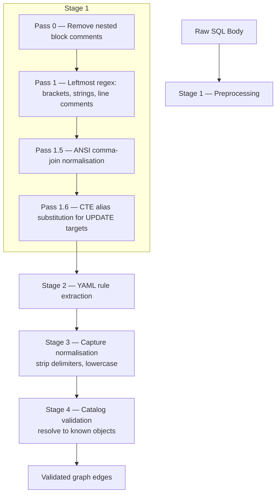

# Custom Parse Rules

Stored procedure dependencies are extracted by a multi-pass regex engine driven by metadata in [`assets/defaultParseRules.yaml`](../assets/defaultParseRules.yaml). Tables, views, and functions use native `.dacpac` XML or DMV dependencies; these rules apply only to procedure-body parsing where the dependency lives inside arbitrary T-SQL. This document is the reference for editing or extending that YAML.

## Setup

1. Command Palette → **Data Lineage: Create Parse Rules** copies the built-in YAML into your workspace.
2. Set `dataLineageViz.parseRulesFile` to the path of the copy (search "dataLineageViz" in VS Code Settings).
3. Edit, add, or disable rules. Each rule is validated on load — invalid regex or empty matches surface as warnings.
4. Reload the model. The parser snapshot (`npm run test:snapshot`) is the regression net for changes you intend to merge.

## Parsing pipeline

The parser runs five passes before the extraction rules ever see the SQL. The cleansing passes neutralise comments and strings so quoted identifiers cannot be confused with object references.



- **Pass 0** — stack-based removal of nested `/* ... */` block comments.
- **Pass 1** — a single leftmost-match regex that protects `[bracket]` identifiers, neutralises `'string literals'` to `''`, and erases `-- line comments`. One regex sees all four constructs at once, so quote / bracket interaction bugs are impossible by construction.
- **Pass 1.5** — rewrites ANSI-92 comma-join FROM clauses (`FROM A, B WHERE A.id = B.id`) to modern JOIN syntax so the source-extraction rules can stay generic.
- **Pass 1.6** — when an UPDATE targets a CTE alias, the alias is substituted with the CTE's base table so the target-extraction rule resolves correctly.
- **Pass 2** — the YAML-defined rules run against the cleansed SQL in priority order.
- **Pass 3 / 4** — captures are normalised (delimiters stripped, identifiers lower-cased) and validated against the loaded catalog. Unresolved references become `external_ref` virtual nodes when enabled, or are dropped.

## Rule schema

Each entry in `rules:` carries:

| Field | Required | Purpose |
|-------|----------|---------|
| `name` | ✓ | Stable identifier for logs and tests. |
| `enabled` | ✓ | `true` / `false`. Disable a rule without deleting it. |
| `priority` |  ✓ | Lower runs first. Built-ins use 1–25. |
| `category` | ✓ | One of `preprocessing` \| `source` \| `target` \| `exec` \| `external_ref`. Drives edge direction. |
| `pattern` | ✓ | JavaScript regex. **Capture group 1** must be the object reference (or, for `external_ref`, the URL / path inside quotes). |
| `flags` | ✓ | Regex flags (typically `gi`). |
| `description` |  | Human-readable hint shown in logs and errors. |
| `replacement` | preprocessing only | Replacement string when the rule is a custom preprocessing pass. |
| `kind` | external_ref only | Free-text label (e.g. `openrowset`, `copy_from`, `bulk_from`). |

Categories drive edge direction:

- `source` — adds an inbound edge (referenced object → focus SP).
- `target` — adds an outbound edge (focus SP → referenced object).
- `exec` — adds an outbound execution edge (`EXEC SomeProc`).
- `external_ref` — captures non-catalog references (file paths, URLs); rendered as virtual external-ref nodes when `dataLineageViz.externalRefs.enabled = true`.
- `preprocessing` — applied during Pass 1.x as additional cleansing; not an extractor.

## Built-in rules inventory

The shipped 17 rules. Read [`assets/defaultParseRules.yaml`](../assets/defaultParseRules.yaml) for the actual regex bodies — they are commented and easier to read than a duplicated table here.

| Rule | Category | Captures |
|------|----------|----------|
| `clean_sql` | preprocessing | Reference-only — documents the built-in Pass 1 regex. Pattern changes have no effect. |
| `extract_sources_ansi` | source | `FROM` and `JOIN` source tables. |
| `extract_sources_tsql_apply` | source | `CROSS APPLY` / `OUTER APPLY` sources. |
| `extract_merge_using` | source | `MERGE … USING` source table. |
| `extract_udf_calls` | source | Scalar UDF calls (`schema.func()`). |
| `extract_targets_dml` | target | `INSERT`, `UPDATE`, `DELETE` targets. |
| `extract_ctas` | target | `CREATE TABLE AS SELECT` targets. |
| `extract_select_into` | target | `SELECT … INTO` targets. |
| `extract_copy_into` | target | `COPY INTO` targets (Synapse / Fabric). |
| `extract_bulk_insert` | target | `BULK INSERT` targets. |
| `extract_update_alias_target` | target | `UPDATE <alias>` resolved via CTE alias map. |
| `extract_output_into` | target | `OUTPUT … INTO` audit-target tables. |
| `extract_cetas` | target | `CREATE EXTERNAL TABLE AS SELECT` targets. |
| `extract_sp_calls` | exec | `EXEC` / `EXECUTE` of stored procedures. |
| `extract_openrowset` | external_ref | `OPENROWSET(BULK '…')` file references. |
| `extract_copy_from` | external_ref | `COPY INTO … FROM '…'` source URLs. |
| `extract_bulk_from` | external_ref | `BULK INSERT … FROM '…'` source paths. |

## XML fallback direction

When the regex set misses a dependency that the dacpac XML or DMV catalog *does* report, the extension still emits the edge — direction inferred from the referenced object's type:

| Referenced type | Inferred edge | Rationale |
|-----------------|---------------|-----------|
| `procedure` | exec | An SP referencing another SP via metadata almost always `EXEC`s it. |
| `function` | source | An SP referencing a function via metadata almost always reads from it. |
| `table` / `view` | source | Safe default — writes are normally caught by the regex DML rules; metadata-only references are most often reads. |

This fallback is why the YAML doesn't need an exhaustive `INSERT`/`UPDATE`/`DELETE` permutation — anything the regex misses surfaces with a sensible default direction. `dropped_refs` (entries that match neither regex nor catalog) are logged at DEBUG.

## How to verify a rule change

The snapshot test catches regressions across all 31 stored procedures in the two committed dacpacs (`AdventureWorks.dacpac` and `AdventureWorks_sdk-style.dacpac`). Use it as the regression net before merging.

```bash
npm run test:snapshot          # exits 1 on any diff vs tests/fixtures/aw-baseline.tsv
npm run test:snapshot:update   # ONLY after you have verified the diff is intentional
```

For ad-hoc verification:

1. Open the VS Code Output panel → select **Data Lineage Viz**.
2. Set the channel log level to **Debug** (gear icon → Set Log Level → Debug).
3. Reload your model.
4. Look for `[Parse]` lines emitted at the end of import — they include the per-load summary (`N objects parsed, K refs resolved`) and per-SP detail when DEBUG is on.
5. Compare against the previous run. A drop in `refs resolved` is a regression; a gain on a corner case is the intended outcome of your edit.

When working on a single SP, point the wizard at one schema, narrow the model, and read the parsed output for that SP only — fewer log lines, faster feedback.

## Customisation guidance

- Add new patterns rather than modifying built-ins. Rule precedence is by `priority` — start your custom rules at 100+ to leave room for built-in growth.
- The capture group 1 contract is non-negotiable. If your regex needs more than one group, use non-capturing groups (`(?:...)`) for everything except the object reference.
- For dialect-specific syntax (Synapse `LABEL`, Fabric quirks) prefer adding a sibling rule guarded by the dialect's keyword rather than editing a generic rule's regex.
- If a captured identifier doesn't resolve against the catalog, the parser drops it silently (or emits an external_ref if the category is `external_ref`). Run with DEBUG logging to see drops.

## Reference

- Built-in YAML: [`assets/defaultParseRules.yaml`](../assets/defaultParseRules.yaml)
- Engine: [`src/engine/sqlBodyParser.ts`](../src/engine/sqlBodyParser.ts)
- Snapshot baseline: [`tests/fixtures/aw-baseline.tsv`](../tests/fixtures/aw-baseline.tsv)
- Microsoft T-SQL reference: <https://learn.microsoft.com/sql/t-sql/language-reference>
