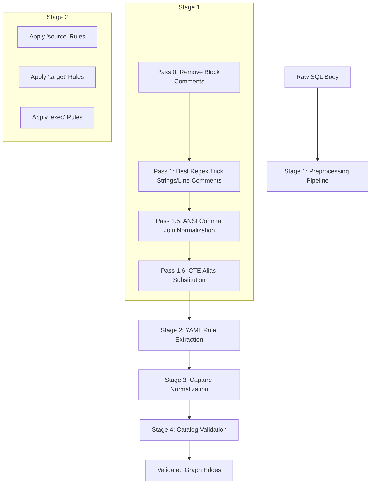

# Custom Parse Rules

## Overview
The extension extracts stored procedure dependencies using high-performance regex rules. Tables, views, and functions use dacpac XML dependencies directly — these rules only apply to SP body parsing. This guide explains how to customize and understand the parsing engine.

## Key Concepts
- **Multi-Pass Cleansing**: Raw SQL is pre-processed to neutralize comments and strings before extraction.
- **Rule Categories**: Rules are categorized to define edge directions (e.g., `source`, `target`, `exec`, `external_ref`).
- **Catalog Validation**: Regex matches are validated against known database objects to prevent false positives.

## Architecture/Workflow

### Parsing Pipeline Flow

### The Best Regex Trick
The `clean_sql` rule uses a single-pass combined regex where brackets, strings, and comments are matched together. The regex engine processes left-to-right — the **leftmost match wins**. This protects quoted identifiers, neutralizes strings to `''`, and replaces comments with spaces, averting complex delimiter interaction bugs.

## Detailed Specs

### Setup Custom Rules
1. Run **Data Lineage: Create Parse Rules** to copy `defaultParseRules.yaml` to your workspace as `parseRules.yaml`.
2. Set `dataLineageViz.parseRulesFile` to `parseRules.yaml` in VS Code settings.
3. Edit the YAML to add or modify rules. Each rule is validated on load (regex compile + empty-match check).

### Built-in Rules Summary
There are 17 built-in rules covering scenarios like:
- **Sources**: `extract_sources_ansi`, `extract_sources_tsql_apply`, `extract_merge_using`
- **Targets**: `extract_targets_dml`, `extract_update_alias_target`, `extract_select_into`
- **Execution**: `extract_sp_calls`
- **External Refs**: `extract_openrowset`, `extract_bulk_from`

### XML Fallback Direction
When regex misses a dependency but XML `BodyDependencies` has it, the extension infers edge direction from the object type:
- `procedure` -> SP called (EXEC)
- `function` -> SP reads
- `table` / `view` -> SP reads (Safest default; writes typically caught by regex DML rules)

## References
- [Microsoft SQL Server Documentation](https://learn.microsoft.com/en-us/sql/t-sql/language-reference)
- Implementation: [`src/engine/sqlBodyParser.ts`](../src/engine/sqlBodyParser.ts) — regex rule runner + edge-direction XML fallback.
- Architecture overview: [`TECHNICAL_ARCHITECTURE.md`](TECHNICAL_ARCHITECTURE.md).
