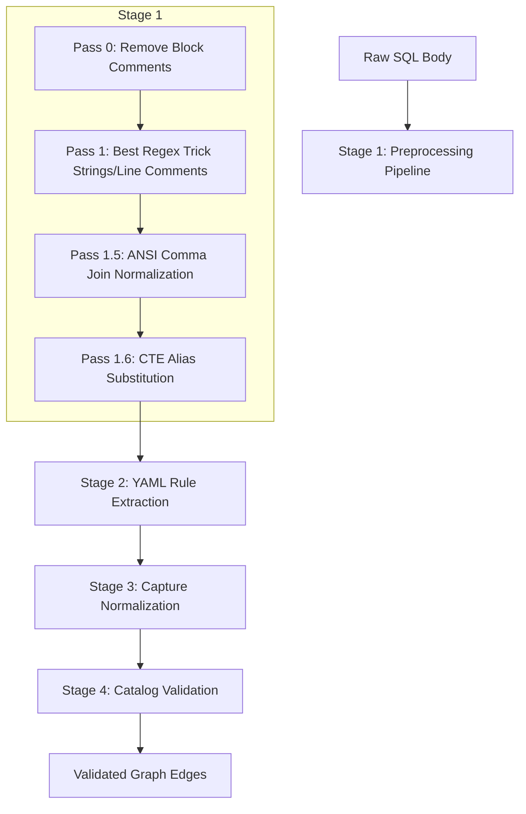

# Interface Spec: Custom Parse Rules

The extension extracts stored procedure dependencies using a multi-pass regex engine. Tables, views, and functions use native `.dacpac` XML dependencies; these rules apply only to procedure body parsing.

## 1. The Parsing Pipeline
The parser pre-processes raw SQL to neutralize noise (comments/strings) before executing extraction rules.

### 1.1 Preprocessing (The Cleansing Interface)
- **Pass 0 (Block Comments)**: Stack-based removal of nested `/* ... */` comments.
- **Pass 1 (The Best Regex Trick)**: A single leftmost-match pass that neutralizes strings (`'...'`) to `''` and line comments (`--`) to spaces. This protects quoted identifiers from false positive regex hits.
- **Pass 1.5/1.6**: Normalizes ANSI join patterns and CTE aliases so extraction rules can remain generic.

## 2. Rule Schema (YAML Interface)
Extraction is driven by metadata rules in `assets/defaultParseRules.yaml`.
- **`category`**: Defines the edge direction: `source`, `target`, `exec`, or `external_ref`.
- **`pattern`**: A valid JavaScript-flavored regex.
- **`flags`**: Case-sensitivity and global flags (e.g., `gi`).

## 3. Metadata Hand-off
- **Normalization**: Delimiters (`[` `]` `"`) are stripped and identifiers are lowercased for consistent hashing.
- **Catalog Validation**: Matches are validated against the known database catalog. Unresolved IDs are flagged as external references.
- **XML Fallback**: If regex misses a dependency found in `.dacpac` XML, the direction is inferred: `procedure` → `exec`; others → `source`.

## 4. Customization
1. Run **Data Lineage: Create Parse Rules** to copy the built-in rules to your workspace.
2. Update the `dataLineageViz.parseRulesFile` setting.
3. Rules are validated on load via regex compilation and empty-match checks.

## 5. Implementation Reference
- `src/engine/sqlBodyParser.ts`: The rule-runner and cleansing engine.
- `assets/defaultParseRules.yaml`: The default extraction rule set.
- [Microsoft T-SQL Language Reference](https://learn.microsoft.com/sql/t-sql/language-reference)
